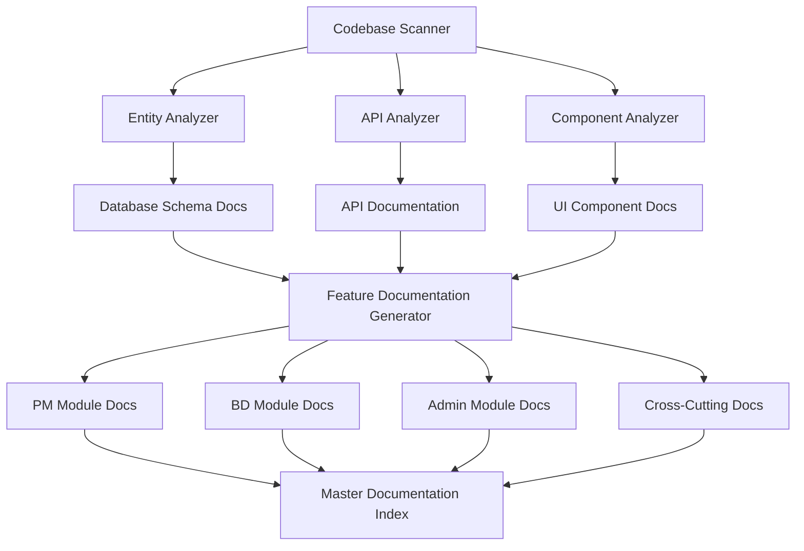
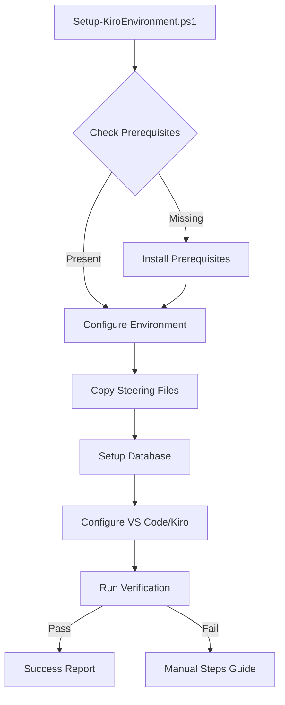

# Design Document: Application Documentation & Environment Replication

## Overview

This design document outlines the systematic approach to reverse engineer and document the existing EDR (KarmaTech AI) application, plus create a 1-click installer package for replicating the Kiro AI-DLC development environment.

Based on codebase analysis, the application contains:
- **28 CQRS feature modules** (backend)
- **87 database entities**
- **35+ frontend services/APIs**
- **100+ React components**
- **20+ pages across PM, BD, and Admin modules**

## Architecture

### Documentation Generation Architecture



### Environment Installer Architecture



## Components and Interfaces

### 1. Documentation Output Structure

```
Documentation/
├── FEATURE_INVENTORY.md              # Master catalog of all features
├── PM_MODULE/
│   ├── README.md                     # PM Module overview
│   ├── PROJECT_MANAGEMENT.md         # Project CRUD, workflows
│   ├── WORK_BREAKDOWN_STRUCTURE.md   # WBS features
│   ├── MONTHLY_PROGRESS.md           # Monthly reporting
│   ├── PROJECT_CLOSURE.md            # Closure workflow
│   ├── CASHFLOW.md                   # Cashflow management
│   ├── PROJECT_SCHEDULE.md           # Scheduling features
│   └── CHANGE_CONTROL.md             # Change control workflow
├── BD_MODULE/
│   ├── README.md                     # BD Module overview
│   ├── OPPORTUNITY_TRACKING.md       # Opportunity management
│   ├── BID_PREPARATION.md            # Bid preparation forms
│   ├── GO_NO_GO_DECISION.md          # Go/No-Go workflow
│   ├── JOB_START_FORM.md             # Job start process
│   └── CHECK_REVIEW.md               # Check review workflow
├── ADMIN_MODULE/
│   ├── README.md                     # Admin Module overview
│   ├── USER_MANAGEMENT.md            # User CRUD, profiles
│   ├── ROLE_PERMISSION.md            # RBAC system
│   ├── TENANT_MANAGEMENT.md          # Multi-tenancy
│   └── SYSTEM_SETTINGS.md            # Configuration
├── CORRESPONDENCE_MODULE/
│   ├── README.md                     # Correspondence overview
│   ├── INWARD_CORRESPONDENCE.md      # Inward tracking
│   ├── OUTWARD_CORRESPONDENCE.md     # Outward tracking
│   └── INPUT_REGISTER.md             # Input register
├── CROSS_CUTTING/
│   ├── AUTHENTICATION.md             # Auth flow, JWT
│   ├── AUDIT_LOGGING.md              # Audit system
│   ├── EMAIL_SERVICE.md              # Email integration
│   └── FILE_MANAGEMENT.md            # Upload/download
└── SPRINT_MODULE/
    ├── README.md                     # Sprint planning overview
    ├── SPRINT_PLANS.md               # Sprint management
    └── SPRINT_TASKS.md               # Task/subtask management
```

### 2. Feature Documentation Template

Each feature document will follow this structure:

```markdown
# Feature Name

## Overview
- Purpose and business value
- User roles involved
- Integration points

## Database Schema
- Entity diagram (Mermaid ERD)
- Table definitions
- Relationships and constraints
- Indexes

## API Endpoints
- Endpoint list with methods
- Request/response examples
- Authentication requirements
- Error responses

## Frontend Components
- Component hierarchy
- Props and state
- User interactions
- Form validations

## Business Logic
- Validation rules
- Workflow states
- Calculations/formulas
- Event triggers

## Testing Coverage
- Existing tests
- Test gaps identified
```

### 3. Environment Installer Package Structure

```
kiro-environment-installer/
├── Setup-KiroEnvironment.ps1         # Main installer script
├── Verify-Installation.ps1           # Verification script
├── README.md                         # Manual setup guide
├── prerequisites/
│   ├── Install-DotNet.ps1
│   ├── Install-NodeJS.ps1
│   ├── Install-SQLServer.ps1
│   └── Install-VSCodeExtensions.ps1
├── kiro-config/
│   ├── steering/                     # All steering files
│   │   ├── ai-dlc-workflow.md
│   │   ├── architecture-patterns.md
│   │   ├── coding-standards.md
│   │   ├── database-schema-patterns.md
│   │   ├── api-documentation-patterns.md
│   │   ├── comprehensive-testing-framework.md
│   │   ├── testing-resilience-rules.md
│   │   └── workflow-enforcement-rules.md
│   ├── hooks/                        # Agent hooks
│   └── specs/                        # Spec templates
├── database/
│   ├── create-database.sql
│   ├── seed-data.sql
│   └── migrations/
├── environment/
│   ├── .env.template
│   ├── appsettings.template.json
│   └── connection-strings.template
└── vscode/
    ├── extensions.json
    └── settings.json
```

## Data Models

### Feature Inventory Model

```typescript
interface FeatureInventory {
  modules: Module[];
  totalFeatures: number;
  totalEntities: number;
  totalEndpoints: number;
  totalComponents: number;
}

interface Module {
  name: string;
  description: string;
  features: Feature[];
}

interface Feature {
  id: string;
  name: string;
  description: string;
  entities: string[];
  endpoints: Endpoint[];
  components: string[];
  status: 'documented' | 'pending';
}

interface Endpoint {
  method: 'GET' | 'POST' | 'PUT' | 'DELETE' | 'PATCH';
  path: string;
  description: string;
  authentication: boolean;
}
```

### Discovered Application Structure

Based on codebase analysis:

| Module | CQRS Folders | Entities | Frontend Pages | Services |
|--------|--------------|----------|----------------|----------|
| Projects | 1 | 5+ | 6 | 2 |
| WBS | 1 | 10+ | 3 | 3 |
| Monthly Progress | 1 | 8+ | 2 | 2 |
| Project Closure | 1 | 3 | 1 | 1 |
| Cashflow | 1 | 1 | 1 | 1 |
| Change Control | 1 | 3 | 2 | 1 |
| Opportunity Tracking | 1 | 3 | 5 | 1 |
| Bid Preparation | 1 | 1 | 1 | 1 |
| Go/No-Go | 1 | 5 | 2 | 2 |
| Job Start Form | 1 | 5 | 1 | 2 |
| Check Review | 1 | 1 | 1 | 1 |
| Correspondence | 1 | 3 | 2 | 1 |
| Input Register | 1 | 1 | 1 | 1 |
| Users | 1 | 3 | 2 | 2 |
| Roles/Permissions | 2 | 3 | 1 | 1 |
| Tenants | 1 | 3 | 1 | 2 |
| Sprint Planning | 3 | 5 | 2 | 1 |
| Email | 1 | 1 | 0 | 0 |
| Subscriptions | 1 | 2 | 1 | 1 |

## Correctness Properties

*A property is a characteristic or behavior that should hold true across all valid executions of a system-essentially, a formal statement about what the system should do. Properties serve as the bridge between human-readable specifications and machine-verifiable correctness guarantees.*

### Property 1: Documentation Completeness
*For any* entity in the Entities folder, there SHALL exist a corresponding documentation entry in the feature documentation that references that entity.
**Validates: Requirements 1.2, 2.7, 3.7**

### Property 2: API Documentation Coverage
*For any* controller endpoint in the backend, there SHALL exist a corresponding API documentation entry with method, path, and description.
**Validates: Requirements 1.1, 2.7, 3.7**

### Property 3: Installer Idempotency
*For any* execution of the installer script on a machine (whether first run or subsequent), the final environment state SHALL be identical and functional.
**Validates: Requirements 7.1, 7.5**

### Property 4: Verification Script Consistency
*For any* properly configured environment, the verification script SHALL return success. *For any* improperly configured environment, the verification script SHALL return failure with specific error details.
**Validates: Requirements 7.5**

### Property 5: Documentation Format Consistency
*For any* generated feature documentation file, the file SHALL contain all required sections (Overview, Database Schema, API Endpoints, Frontend Components, Business Logic).
**Validates: Requirements 8.1, 8.2, 8.3**

## Error Handling

### Documentation Generation Errors

| Error Type | Handling Strategy |
|------------|-------------------|
| Missing entity file | Log warning, mark as "needs investigation" |
| Unparseable code | Skip with warning, document manually |
| Missing relationships | Document as "relationship TBD" |
| Circular dependencies | Document with warning note |

### Installer Errors

| Error Type | Handling Strategy |
|------------|-------------------|
| Missing admin rights | Prompt for elevation, provide manual steps |
| Network unavailable | Use offline installers if available |
| Port conflicts | Detect and suggest alternatives |
| Disk space | Check before install, warn if low |

## Testing Strategy

### Dual Testing Approach

This project uses both unit testing and property-based testing:
- **Unit tests** verify specific documentation outputs exist and have correct structure
- **Property tests** verify universal properties hold across all generated documentation

### Property-Based Testing Library
- **Framework**: FsCheck for .NET (if validation scripts are C#) or fast-check for TypeScript
- **Minimum iterations**: 100 per property test

### Unit Tests

1. **Documentation Structure Tests**
   - Verify each module folder exists
   - Verify each feature doc has required sections
   - Verify Mermaid diagrams render correctly

2. **Installer Tests**
   - Test on clean Windows VM
   - Test idempotency (run twice)
   - Test partial failure recovery

3. **Verification Script Tests**
   - Test with correct configuration
   - Test with missing components
   - Test with incorrect versions

### Property-Based Tests

Each property-based test will be tagged with:
`**Feature: application-documentation, Property {number}: {property_text}**`

1. **Property 1 Test**: Generate random subset of entities, verify all appear in docs
2. **Property 2 Test**: Generate random API paths, verify all documented
3. **Property 3 Test**: Run installer multiple times, verify consistent state
4. **Property 4 Test**: Generate various environment states, verify correct detection
5. **Property 5 Test**: Generate docs, verify all sections present

## Implementation Phases

### Phase 1: Feature Discovery (Week 1)
- Scan all CQRS folders
- Catalog all entities
- Map frontend components
- Create FEATURE_INVENTORY.md

### Phase 2: PM Module Documentation (Week 2)
- Document Projects feature
- Document WBS feature
- Document Monthly Progress
- Document Project Closure
- Document Cashflow
- Document Change Control

### Phase 3: BD Module Documentation (Week 3)
- Document Opportunity Tracking
- Document Bid Preparation
- Document Go/No-Go Decision
- Document Job Start Form
- Document Check Review

### Phase 4: Admin & Cross-Cutting (Week 4)
- Document User Management
- Document Roles/Permissions
- Document Tenant Management
- Document Authentication
- Document Audit Logging
- Document Email Service

### Phase 5: Environment Installer (Week 5)
- Create prerequisite scripts
- Package steering files
- Create database scripts
- Create verification script
- Test on clean machines
- Write manual fallback guide

## Deliverables Summary

1. **FEATURE_INVENTORY.md** - Complete catalog of all features
2. **PM Module Documentation** - 7 feature documents
3. **BD Module Documentation** - 5 feature documents
4. **Admin Module Documentation** - 4 feature documents
5. **Correspondence Module Documentation** - 3 feature documents
6. **Cross-Cutting Documentation** - 4 documents
7. **Sprint Module Documentation** - 2 feature documents
8. **Environment Installer Package** - Complete 1-click setup
9. **Updated DATABASE_SCHEMA.md** - Comprehensive schema docs
10. **Updated API_DOCUMENTATION.md** - Complete API reference
