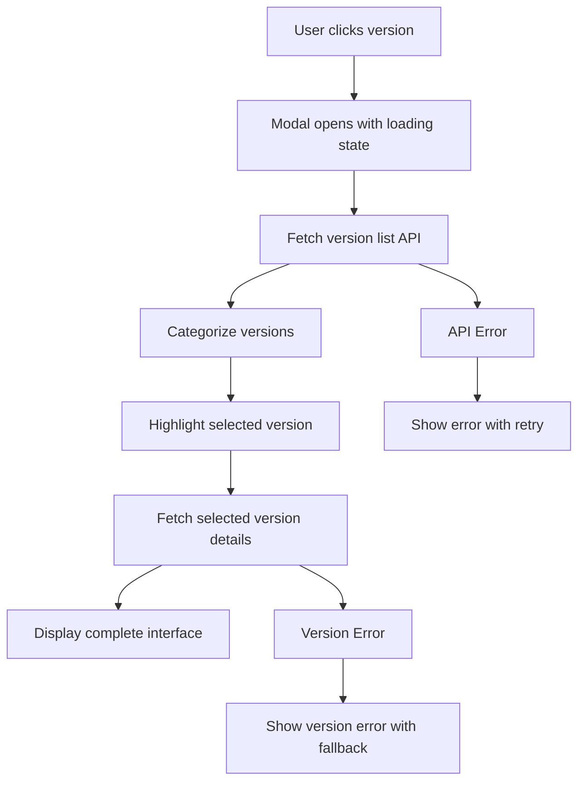
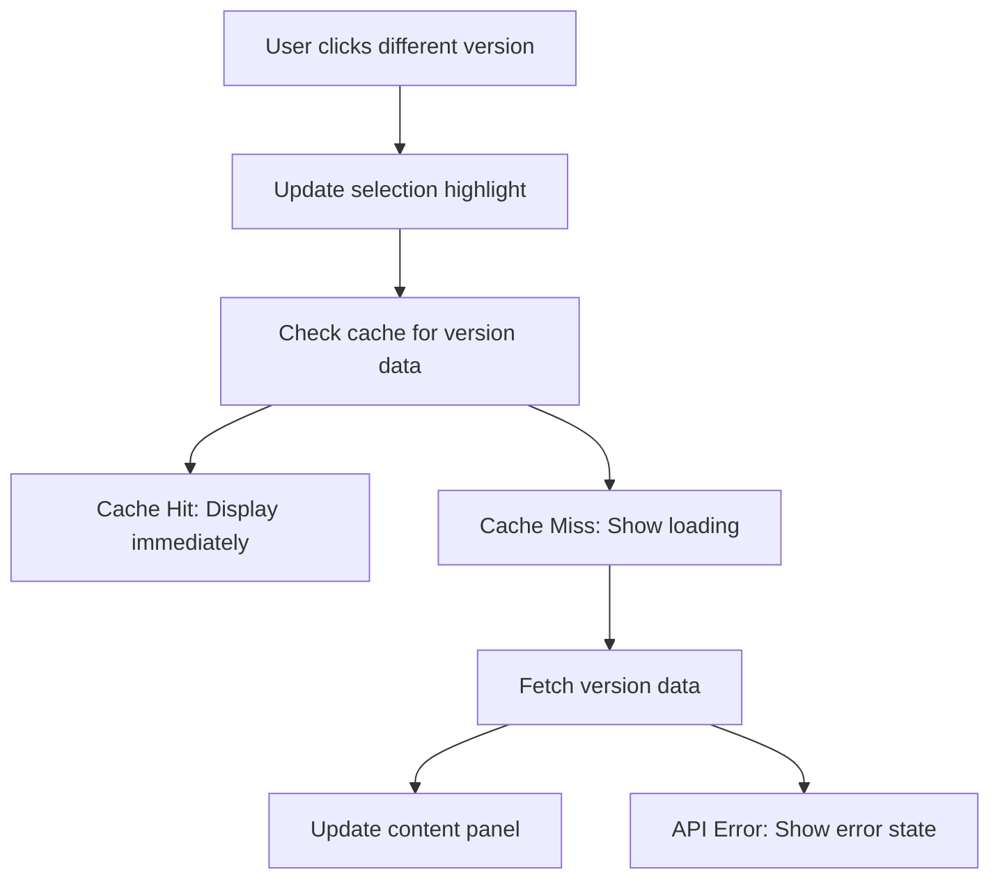
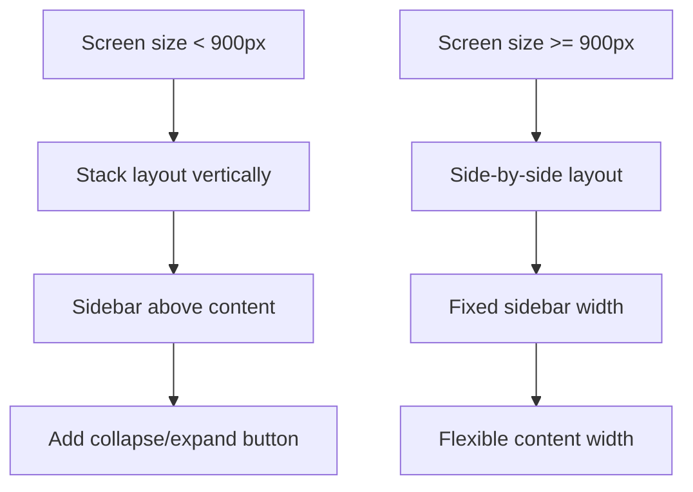

# Design Document

## Overview

The Enhanced Release Notes Modal transforms the existing single-version modal into a comprehensive, Slack-inspired interface that provides multi-version browsing capabilities. The design follows a two-panel layout with a categorized version sidebar and a detailed content panel, enabling users to efficiently navigate through release history while maintaining excellent performance and accessibility.

## Architecture

### Component Hierarchy

```
EnhancedReleaseNotesModal
├── VersionSidebar
│   ├── SearchInput
│   ├── CategorySection (Release notes)
│   │   └── VersionListItem[]
│   └── CategorySection (Beta release notes)
│       └── VersionListItem[]
└── ReleaseContentPanel
    ├── VersionHeader
    ├── LoadingState | ErrorState | EmptyState
    └── ChangeItemSections
        ├── FeaturesSection
        ├── BugFixesSection
        ├── ImprovementsSection
        └── BreakingChangesSection
```

### State Management Architecture

```typescript
interface EnhancedReleaseNotesState {
  // Modal state
  isOpen: boolean;
  selectedVersion: string | null;
  
  // Data state
  versionList: VersionSummary[];
  versionCategories: VersionCategories;
  currentReleaseNotes: ProcessedReleaseNotes | null;
  
  // UI state
  loading: {
    versionList: boolean;
    releaseNotes: boolean;
  };
  error: {
    versionList: string | null;
    releaseNotes: string | null;
  };
  
  // Search and filter state
  searchTerm: string;
  selectedCategory: 'all' | 'stable' | 'beta' | 'dev';
  
  // Mobile responsive state
  sidebarCollapsed: boolean;
}
```

## Components and Interfaces

### Core Interfaces

```typescript
interface VersionSummary {
  version: string;
  releaseDate: string;
  environment: string;
  changeCount: {
    features: number;
    bugFixes: number;
    improvements: number;
    breaking: number;
  };
  commitSha?: string;
  branch?: string;
}

interface VersionCategories {
  stable: VersionSummary[];
  beta: VersionSummary[];
  dev: VersionSummary[];
  alpha: VersionSummary[];
}

interface EnhancedReleaseNotesModalProps {
  isOpen: boolean;
  onClose: () => void;
  initialVersion?: string;
  environment?: string;
}
```

### VersionSidebar Component

```typescript
interface VersionSidebarProps {
  versions: VersionCategories;
  selectedVersion: string | null;
  onVersionSelect: (version: string) => void;
  searchTerm: string;
  onSearchChange: (term: string) => void;
  loading: boolean;
  error: string | null;
  collapsed: boolean;
  onToggleCollapse: () => void;
}

// Features:
// - Categorized version lists with collapsible sections
// - Search/filter functionality with real-time results
// - Keyboard navigation (arrow keys, enter, escape)
// - Loading skeletons and error states
// - Mobile-responsive collapse/expand behavior
// - Accessibility support with ARIA labels
```

### ReleaseContentPanel Component

```typescript
interface ReleaseContentPanelProps {
  releaseNotes: ProcessedReleaseNotes | null;
  loading: boolean;
  error: string | null;
  onRetry: () => void;
  selectedVersion: string | null;
}

// Features:
// - Version header with metadata display
// - Expandable change sections with counts
// - Rich change item display with chips
// - Loading states with skeleton loaders
// - Error states with retry functionality
// - Empty states for versions without changes
```

### Enhanced API Service

```typescript
interface EnhancedReleaseNotesApi {
  // Existing methods (enhanced)
  getReleaseNotes(version: string): Promise<ProcessedReleaseNotes>;
  getCurrentReleaseNotes(environment?: string): Promise<ProcessedReleaseNotes>;
  
  // New methods for enhanced functionality
  getVersionList(environment?: string, limit?: number): Promise<VersionSummary[]>;
  getVersionCategories(environment?: string): Promise<VersionCategories>;
  searchVersions(searchTerm: string, environment?: string): Promise<VersionSummary[]>;
  
  // Enhanced caching methods
  preloadVersion(version: string): Promise<void>;
  clearVersionCache(version?: string): void;
  getCacheStats(): CacheStats;
}
```

## Data Models

### Version Categorization Logic

```typescript
function categorizeVersion(version: string): 'stable' | 'beta' | 'dev' | 'alpha' {
  // Remove 'v' prefix if present
  const cleanVersion = version.replace(/^v/, '');
  
  // Check for pre-release identifiers
  if (cleanVersion.includes('-dev')) return 'dev';
  if (cleanVersion.includes('-beta')) return 'beta';
  if (cleanVersion.includes('-alpha')) return 'alpha';
  if (cleanVersion.includes('-rc')) return 'beta';
  
  // Stable versions (no pre-release identifier)
  return 'stable';
}
```

### Caching Strategy

```typescript
interface CacheConfig {
  versionList: {
    key: 'enhanced_version_list';
    expiry: 15 * 60 * 1000; // 15 minutes
  };
  stableVersions: {
    expiry: 24 * 60 * 60 * 1000; // 24 hours
  };
  devVersions: {
    expiry: 5 * 60 * 1000; // 5 minutes
  };
  searchResults: {
    expiry: 10 * 60 * 1000; // 10 minutes
  };
}
```

### Responsive Breakpoints

```typescript
const breakpoints = {
  mobile: '(max-width: 767px)',
  tablet: '(min-width: 768px) and (max-width: 1023px)',
  desktop: '(min-width: 1024px)',
  
  // Component-specific breakpoints
  sidebarCollapse: '(max-width: 899px)',
  fullLayout: '(min-width: 900px)'
};
```

## Backend API Enhancements

### New Endpoint: Version Categories

```csharp
[HttpGet("categories")]
public async Task<ActionResult<VersionCategoriesResponse>> GetVersionCategories(
    [FromQuery] string? environment = null,
    [FromQuery] int limit = 50)
{
    var versions = await _releaseNotesRepository.GetVersionSummariesAsync(environment, limit);
    
    var categories = new VersionCategoriesResponse
    {
        Stable = versions.Where(v => IsStableVersion(v.Version)).ToList(),
        Beta = versions.Where(v => IsBetaVersion(v.Version)).ToList(),
        Dev = versions.Where(v => IsDevVersion(v.Version)).ToList(),
        Alpha = versions.Where(v => IsAlphaVersion(v.Version)).ToList()
    };
    
    return Ok(categories);
}
```

### Enhanced Repository Methods

```csharp
public interface IReleaseNotesRepository
{
    // Existing methods...
    
    // New methods for enhanced functionality
    Task<IEnumerable<VersionSummary>> GetVersionSummariesAsync(
        string? environment = null, 
        int limit = 50);
    
    Task<IEnumerable<VersionSummary>> SearchVersionsAsync(
        string searchTerm, 
        string? environment = null);
    
    Task<Dictionary<string, int>> GetChangeCountsAsync(string version);
}
```

## User Experience Flow

### Modal Opening Flow



### Version Navigation Flow



### Mobile Responsive Flow



## Performance Optimizations

### Lazy Loading Strategy

```typescript
// Implement virtual scrolling for large version lists
const VirtualizedVersionList = React.memo(({ versions, onSelect }) => {
  const [visibleRange, setVisibleRange] = useState({ start: 0, end: 20 });
  
  // Only render visible items + buffer
  const visibleVersions = versions.slice(
    visibleRange.start, 
    visibleRange.end
  );
  
  return (
    <FixedSizeList
      height={400}
      itemCount={versions.length}
      itemSize={60}
      onItemsRendered={updateVisibleRange}
    >
      {VersionListItem}
    </FixedSizeList>
  );
});
```

### Preloading Strategy

```typescript
// Preload adjacent versions for faster navigation
const useVersionPreloading = (selectedVersion: string, versionList: string[]) => {
  useEffect(() => {
    const currentIndex = versionList.indexOf(selectedVersion);
    
    // Preload next and previous versions
    const preloadVersions = [
      versionList[currentIndex - 1], // Previous
      versionList[currentIndex + 1]  // Next
    ].filter(Boolean);
    
    preloadVersions.forEach(version => {
      releaseNotesApi.preloadVersion(version);
    });
  }, [selectedVersion, versionList]);
};
```

## Error Handling Strategy

### Graceful Degradation

```typescript
const ErrorBoundary = ({ children, fallback }) => {
  return (
    <ErrorBoundaryComponent
      fallback={({ error, retry }) => (
        <Alert severity="error" action={
          <Button onClick={retry}>Retry</Button>
        }>
          {error.message || 'Something went wrong'}
        </Alert>
      )}
    >
      {children}
    </ErrorBoundaryComponent>
  );
};
```

### Network Error Handling

```typescript
const useNetworkAwareApi = () => {
  const [isOnline, setIsOnline] = useState(navigator.onLine);
  
  useEffect(() => {
    const handleOnline = () => setIsOnline(true);
    const handleOffline = () => setIsOnline(false);
    
    window.addEventListener('online', handleOnline);
    window.addEventListener('offline', handleOffline);
    
    return () => {
      window.removeEventListener('online', handleOnline);
      window.removeEventListener('offline', handleOffline);
    };
  }, []);
  
  return { isOnline };
};
```

## Testing Strategy

### Component Testing Approach

```typescript
// Unit tests for individual components
describe('VersionSidebar', () => {
  it('should categorize versions correctly');
  it('should filter versions by search term');
  it('should handle keyboard navigation');
  it('should display loading states');
});

// Integration tests for modal behavior
describe('EnhancedReleaseNotesModal', () => {
  it('should open with specified version selected');
  it('should navigate between versions smoothly');
  it('should handle API errors gracefully');
  it('should work on mobile devices');
});

// E2E tests for user workflows
describe('Release Notes User Journey', () => {
  it('should allow browsing multiple versions');
  it('should search and filter versions');
  it('should work offline with cached data');
});
```

### Performance Testing

```typescript
// Performance benchmarks
const performanceTests = {
  modalOpenTime: '< 2 seconds',
  versionSwitchTime: '< 500ms (cached), < 2 seconds (uncached)',
  searchResponseTime: '< 300ms',
  mobileScrollPerformance: '60fps',
  memoryUsage: '< 50MB for 100 versions'
};
```

## Accessibility Compliance

### WCAG 2.1 AA Requirements

```typescript
// Keyboard navigation support
const useKeyboardNavigation = (versions: string[], onSelect: (version: string) => void) => {
  const [focusedIndex, setFocusedIndex] = useState(0);
  
  const handleKeyDown = useCallback((event: KeyboardEvent) => {
    switch (event.key) {
      case 'ArrowDown':
        setFocusedIndex(prev => Math.min(prev + 1, versions.length - 1));
        break;
      case 'ArrowUp':
        setFocusedIndex(prev => Math.max(prev - 1, 0));
        break;
      case 'Enter':
        onSelect(versions[focusedIndex]);
        break;
      case 'Escape':
        // Close modal
        break;
    }
  }, [versions, focusedIndex, onSelect]);
  
  return { focusedIndex, handleKeyDown };
};
```

### Screen Reader Support

```typescript
// ARIA labels and announcements
const VersionListItem = ({ version, isSelected, onClick }) => (
  <ListItem
    button
    selected={isSelected}
    onClick={onClick}
    role="option"
    aria-selected={isSelected}
    aria-label={`Version ${version.version}, released ${version.releaseDate}`}
  >
    <ListItemText
      primary={version.version}
      secondary={version.releaseDate}
    />
  </ListItem>
);
```

## Migration Strategy

### Backward Compatibility

```typescript
// Maintain existing ReleaseNotesModal interface
export const ReleaseNotesModal = (props: ReleaseNotesModalProps) => {
  // If enhanced features are disabled, use legacy modal
  if (!useFeatureFlag('enhanced-release-notes')) {
    return <LegacyReleaseNotesModal {...props} />;
  }
  
  // Otherwise use enhanced modal with backward-compatible props
  return <EnhancedReleaseNotesModal {...props} />;
};
```

### Gradual Rollout Plan

1. **Phase 1**: Deploy enhanced modal behind feature flag
2. **Phase 2**: Enable for internal users and testing
3. **Phase 3**: Gradual rollout to user segments
4. **Phase 4**: Full deployment and legacy cleanup

## Correctness Properties

*A property is a characteristic or behavior that should hold true across all valid executions of a system-essentially, a formal statement about what the system should do. Properties serve as the bridge between human-readable specifications and machine-verifiable correctness guarantees.*

### Property 1: Version Categorization Consistency
*For any* collection of version strings, the categorization logic should consistently classify versions as stable, beta, dev, or alpha based on their naming patterns
**Validates: Requirements 1.2, 3.3**

### Property 2: Version Selection Updates Content
*For any* version selected in the sidebar, the content panel should update to display that version's release notes
**Validates: Requirements 1.3, 3.2**

### Property 3: Chronological Version Ordering
*For any* list of versions with release dates, they should be displayed in descending chronological order (newest first)
**Validates: Requirements 1.4**

### Property 4: Initial Version Highlighting
*For any* valid version specified when opening the modal, that version should be highlighted as selected in the sidebar
**Validates: Requirements 1.5, 9.1, 9.2**

### Property 5: Version Metadata Display
*For any* version entry in the sidebar, both version number and release date should be displayed
**Validates: Requirements 1.6**

### Property 6: Selected Version Information Display
*For any* selected version, the content panel should prominently display the version number and release date
**Validates: Requirements 2.1, 9.3**

### Property 7: Change Organization Structure
*For any* release notes data, changes should be organized into the standard sections (Features, Bug Fixes, Improvements, Breaking Changes)
**Validates: Requirements 2.2**

### Property 8: Change Count Accuracy
*For any* release notes with change items, the displayed counts for each category should match the actual number of items in that category
**Validates: Requirements 2.3**

### Property 9: Metadata Chip Display
*For any* change item that includes metadata (author, commit SHA, impact level), that metadata should be displayed as chips
**Validates: Requirements 2.4**

### Property 10: Screen Size Responsiveness
*For any* screen width between 320px and 1920px, the modal should maintain usability and proper layout
**Validates: Requirements 4.3**

### Property 11: Touch Target Accessibility
*For any* interactive element in the modal, it should meet the minimum touch target size of 44px for accessibility
**Validates: Requirements 4.5**

### Property 12: Keyboard Navigation for Version Selection
*For any* version focused via keyboard navigation, pressing Enter should display that version's details in the content panel
**Validates: Requirements 5.2**

### Property 13: ARIA Label Presence
*For any* interactive element in the modal, appropriate ARIA labels and roles should be present for screen reader accessibility
**Validates: Requirements 5.5**

### Property 14: Cache Duration by Version Type
*For any* version data, stable versions should be cached for 24 hours while dev versions should be cached for 5 minutes
**Validates: Requirements 6.2**

### Property 15: Cached Data Immediate Display
*For any* previously viewed version that is cached, switching to it should display the data immediately without loading delays
**Validates: Requirements 6.3**

### Property 16: Adjacent Version Preloading
*For any* selected version in a version list, the next and previous versions should be preloaded in the background
**Validates: Requirements 6.4**

### Property 17: Performance Load Time
*For any* modal opening, the version list should load within 2 seconds
**Validates: Requirements 6.5**

### Property 18: Virtual Scrolling Activation
*For any* version list exceeding 50 items, virtual scrolling should be implemented to maintain performance
**Validates: Requirements 6.6**

### Property 19: Search Filtering Functionality
*For any* search term entered, the version list should be filtered to show only versions matching the term in version number or release date
**Validates: Requirements 7.2**

### Property 20: Category Filtering
*For any* category filter applied (stable, beta, dev), only versions of that category should be displayed
**Validates: Requirements 7.3**

### Property 21: Search Match Highlighting
*For any* search term that produces results, matching text in the version list should be visually highlighted
**Validates: Requirements 7.6**

### Property 22: Error Logging
*For any* error that occurs in the modal, it should be logged to the console for debugging purposes
**Validates: Requirements 8.6**

### Property 23: Integration Version Consistency
*For any* version clicked in the VersionDisplay component, the modal should open with that exact version pre-selected
**Validates: Requirements 9.1, 9.2, 9.3**

### Property 24: API Pagination Support
*For any* pagination parameters provided to the API, the response should respect those parameters and return the appropriate subset of data
**Validates: Requirements 10.2**

### Property 25: API Response Metadata Completeness
*For any* version returned by the API, it should include all required metadata fields (release date, environment, commit SHA)
**Validates: Requirements 10.3**

### Property 26: API Filtering Functionality
*For any* filter parameters (environment, date range) provided to the API, the response should contain only versions matching those criteria
**Validates: Requirements 10.4**

### Property 27: API Response Format Consistency
*For any* API endpoint in the release notes system, responses should follow the same consistent format structure
**Validates: Requirements 10.5**

### Property 28: HTTP Cache Header Presence
*For any* API response from the release notes endpoints, proper HTTP caching headers should be included
**Validates: Requirements 10.6**

## Error Handling

The enhanced release notes modal implements comprehensive error handling at multiple levels:

### Network Error Recovery
- Automatic retry with exponential backoff for failed API calls
- Offline detection with graceful fallback to cached data
- Clear error messages with user-actionable retry options

### Data Validation
- Version string format validation before API calls
- Response data structure validation to prevent runtime errors
- Graceful handling of malformed or incomplete API responses

### User Experience Errors
- Empty state handling for versions without release notes
- Search result empty states with helpful messaging
- Loading state management to prevent UI blocking

## Testing Strategy

### Unit Testing
- Component rendering with various props and states
- Version categorization logic with edge cases
- Search and filter functionality with diverse inputs
- Caching behavior with different expiration scenarios

### Integration Testing
- API integration with mock responses and error conditions
- Keyboard navigation across the entire modal interface
- Responsive behavior across different screen sizes
- Performance testing with large datasets

### Property-Based Testing
- Version categorization with randomly generated version strings
- Search functionality with random search terms and version lists
- Caching behavior with various timing scenarios
- API filtering with random parameter combinations

Each property will be implemented as a property-based test with minimum 100 iterations to ensure comprehensive coverage across all possible inputs and scenarios.

This design provides a comprehensive, performant, and accessible solution that transforms the release notes experience while maintaining compatibility with existing systems.