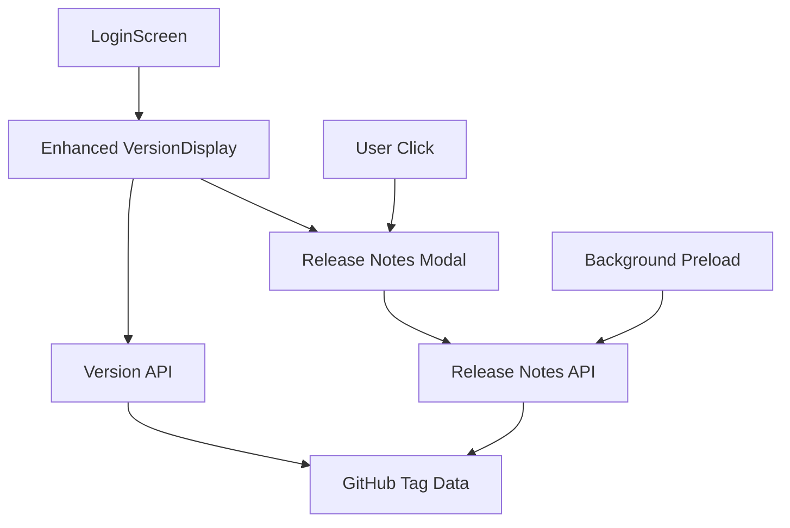
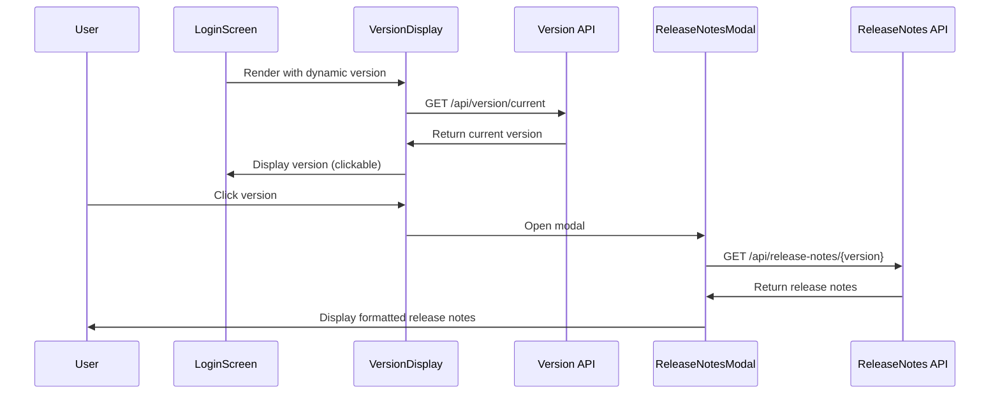

# Design Document

## Overview

The Interactive Version Display system enhances the existing VersionDisplay component on the LoginScreen to be clickable and show release notes. It integrates with the existing release notes API to fetch and display version-specific information in a modal dialog.

## Architecture

### High-Level Architecture



### Component Interaction Flow



## Components and Interfaces

### 1. Enhanced VersionDisplay Component

**Location:** `frontend/src/components/VersionDisplay.tsx`

**New Props:**
```typescript
interface VersionDisplayProps extends Omit<TypographyProps, 'children'> {
  showBuildDate?: boolean;
  prefix?: string;
  showDevIndicator?: boolean;
  // New props for interactivity
  clickable?: boolean;
  onVersionClick?: (version: string) => void;
  fetchVersionFromAPI?: boolean;
}
```

**Key Enhancements:**
- Add click handler and hover effects
- Integrate with version API
- Show loading state while fetching version
- Maintain backward compatibility with existing usage

### 2. Version API Service

**Location:** `frontend/src/services/versionApi.ts`

```typescript
export interface CurrentVersionResponse {
  version: string;
  environment: string;
  buildDate: string;
  commitSha?: string;
}

export const versionApi = {
  async getCurrentVersion(): Promise<CurrentVersionResponse> {
    // Fetch from /api/version/current
  },
  
  async getVersionHealth(): Promise<VersionHealthResponse> {
    // Fetch from /api/version/health
  }
};
```

### 3. Release Notes Modal Component

**Location:** `frontend/src/components/ReleaseNotesModal.tsx`

```typescript
interface ReleaseNotesModalProps {
  version: string;
  isOpen: boolean;
  onClose: () => void;
}

interface ReleaseNotesData {
  version: string;
  releaseDate: string;
  features: ChangeItem[];
  bugFixes: ChangeItem[];
  improvements: ChangeItem[];
  breakingChanges: ChangeItem[];
}

export const ReleaseNotesModal: React.FC<ReleaseNotesModalProps> = ({
  version,
  isOpen,
  onClose
}) => {
  // Modal implementation with Material-UI Dialog
  // Fetch release notes on open
  // Display organized sections
  // Handle loading and error states
}
```

### 4. Release Notes API Service

**Location:** `frontend/src/services/releaseNotesApi.ts`

```typescript
export interface ChangeItem {
  description: string;
  commitSha?: string;
  jiraTicket?: string;
  impact?: 'Low' | 'Medium' | 'High';
  author?: string;
}

export const releaseNotesApi = {
  async getReleaseNotes(version: string): Promise<ReleaseNotesData> {
    // Fetch from /api/release-notes/{version}
  },
  
  async getCurrentReleaseNotes(): Promise<ReleaseNotesData> {
    // Fetch from /api/release-notes/current
  }
};
```

## Data Models

### Version Information

```typescript
interface VersionInfo {
  version: string;           // e.g., "1.0.38" (semantic version only)
  fullVersion: string;       // e.g., "v1.0.38-dev.20251223.1" (complete GitHub tag)
  environment: string;       // e.g., "dev", "staging", "prod"
  buildDate: string;         // ISO date string
  commitSha?: string;        // Git commit hash
  displayVersion: string;    // e.g., "v1.0.38" (formatted for UI display)
}
```

### Release Notes Structure

```typescript
interface ReleaseNotesData {
  version: string;
  releaseDate: string;
  features: ChangeItem[];
  bugFixes: ChangeItem[];
  improvements: ChangeItem[];
  breakingChanges: ChangeItem[];
  knownIssues?: string[];
}

interface ChangeItem {
  description: string;
  commitSha?: string;
  jiraTicket?: string;
  impact?: 'Low' | 'Medium' | 'High';
  author?: string;
}
```

## UI Design Specifications

### Enhanced VersionDisplay

**Visual States:**
- **Default**: Normal text appearance
- **Hover**: Underline + pointer cursor + slight color change
- **Loading**: Skeleton loader or spinner
- **Error**: Fallback version with warning icon

**Styling:**
```typescript
const styles = {
  clickable: {
    cursor: 'pointer',
    '&:hover': {
      textDecoration: 'underline',
      color: 'primary.main',
    },
    transition: 'color 0.2s ease-in-out'
  },
  loading: {
    opacity: 0.7
  }
};
```

### Release Notes Modal

**Layout:**
- **Header**: Version number + close button
- **Body**: Tabbed or sectioned content (Features, Bug Fixes, Improvements)
- **Footer**: Optional actions (View on GitHub, etc.)

**Responsive Design:**
- **Desktop**: 600px width, centered
- **Mobile**: Full width with padding, scrollable content

**Material-UI Components:**
- `Dialog` for modal container
- `DialogTitle` for header
- `DialogContent` for scrollable body
- `Accordion` or `Tabs` for organizing sections
- `List` and `ListItem` for change items

## Integration Points

### 1. LoginScreen Integration

**Current Code Location:** `frontend/src/pages/LoginScreen.tsx` (line with VersionDisplay)

**Changes Required:**
```typescript
// Replace current VersionDisplay usage
<VersionDisplay
  variant="h6"
  color="text.secondary"
  sx={{ mb: 1 }}
  showBuildDate={true}
  showDevIndicator={true}
  // New props
  clickable={true}
  fetchVersionFromAPI={true}
  onVersionClick={handleVersionClick}
/>
```

### 2. API Backend Integration

**Existing Endpoints to Use:**
- `GET /api/version/current` - Already exists based on VersionController.cs
- `GET /api/release-notes/{version}` - Already exists based on ReleaseNotesController.cs
- `GET /api/release-notes/current` - Already exists

**Version Consistency Requirement:**
The version returned by `/api/version/current` must be:
- The semantic version part extracted from the GitHub tag (e.g., "v1.0.38" from "v1.0.38-dev.20251223.1")
- Identical to the version displayed in Swagger documentation
- Clean semantic version format without environment or build suffixes

### 3. Version Synchronization

**GitHub Actions Integration:**
The version displayed should be derived from the tag created by `.github/workflows/deploy-dev-with-tags.yml`:

**Version Formatting Rules:**
- **GitHub Tag**: `v1.0.38-dev.20251223.1` (full tag for deployment tracking)
- **Frontend Display**: `v1.0.38` (semantic version only)
- **Backend Swagger**: `v1.0.38` (semantic version only)
- **Backend API Response**: `v1.0.38` (semantic version only)

**Extraction Logic:**
- Extract semantic version from GitHub tag by removing environment and build suffixes
- Pattern: `v{MAJOR}.{MINOR}.{PATCH}` from `v{MAJOR}.{MINOR}.{PATCH}-{ENV}.{DATE}.{BUILD}`

## Error Handling

### API Failures

**Version API Failure:**
- Show fallback version from build-time injection
- Display warning icon with tooltip
- Log error for monitoring

**Release Notes API Failure:**
- Show modal with error message
- Provide retry button
- Offer link to GitHub releases page as fallback

### Network Issues

**Offline/Slow Connection:**
- Cache last known version for 1 hour
- Show cached release notes if available
- Display appropriate loading states

## Performance Considerations

### Caching Strategy

**Version Caching:**
- Cache current version for 30 minutes
- Invalidate cache on page refresh
- Store in sessionStorage

**Release Notes Caching:**
- Cache release notes per version indefinitely (they don't change)
- Store in localStorage with version key
- Preload current version release notes after login screen loads

### Lazy Loading

**Modal Content:**
- Only fetch release notes when modal is opened
- Show skeleton loader while fetching
- Implement background preloading for better UX

## Testing Strategy

### Unit Tests

**VersionDisplay Component:**
- Test clickable behavior
- Test API integration
- Test error handling
- Test loading states

**ReleaseNotesModal Component:**
- Test modal open/close
- Test data fetching
- Test error states
- Test responsive behavior

### Integration Tests

**LoginScreen Integration:**
- Test version display on login screen
- Test modal opening from version click
- Test API error scenarios

### E2E Tests

**User Workflow:**
- Load login screen → see dynamic version
- Click version → modal opens with release notes
- Close modal → return to login screen

## Security Considerations

### API Security

**Version Endpoint:**
- No authentication required (public information)
- Rate limiting to prevent abuse

**Release Notes Endpoint:**
- No authentication required (public information)
- Sanitize any user-generated content in release notes

### XSS Prevention

**Release Notes Content:**
- Sanitize commit messages and descriptions
- Use React's built-in XSS protection
- Validate API responses before rendering