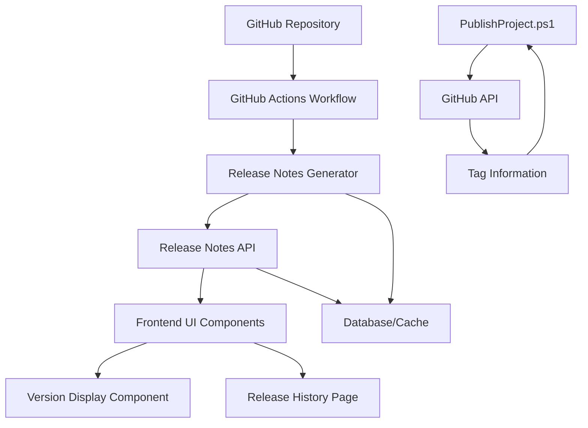
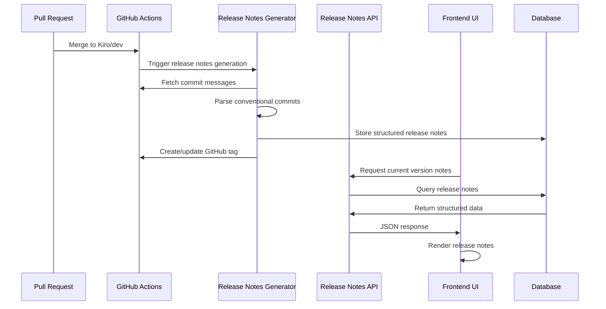

# Design Document

## Overview

The Release Notes UI system provides automated generation and display of release notes based on GitHub tags and conventional commits. The system integrates with the existing version tagging workflow to deliver contextual release information to users and stakeholders through a modern, responsive interface.

## Architecture

### High-Level Architecture



### Component Interaction Flow



## Components and Interfaces

### 1. Release Notes Generator Service

**Location:** `.github/scripts/release-notes-generator.js`

**Responsibilities:**
- Parse conventional commit messages
- Categorize changes by type (feat, fix, docs, etc.)
- Extract JIRA ticket references
- Generate structured release notes
- Store notes in database/cache

**Key Functions:**
```javascript
class ReleaseNotesGenerator {
  async generateFromCommits(commits, version)
  async categorizeCommits(commits)
  async extractJiraReferences(commitMessage)
  async storeReleaseNotes(version, notes)
}
```

### 2. Release Notes API Controller

**Location:** `backend/src/NJSAPI/Controllers/ReleaseNotesController.cs`

**Endpoints:**
- `GET /api/release-notes/current` - Get notes for deployed version
- `GET /api/release-notes/{version}` - Get notes for specific version
- `GET /api/release-notes/history` - Get paginated release history
- `GET /api/release-notes/search` - Search releases by criteria

**Response Format:**
```json
{
  "version": "v1.0.38-dev.20251223.1",
  "releaseDate": "2025-12-23T14:30:22Z",
  "features": [
    {
      "description": "Add project status history tracking",
      "commitSha": "abc123",
      "jiraTicket": "EDR-424",
      "impact": "Medium"
    }
  ],
  "bugFixes": [...],
  "improvements": [...],
  "breakingChanges": [...],
  "knownIssues": [...]
}
```

### 3. Frontend UI Components

#### Version Display Component
**Location:** `frontend/src/components/VersionDisplay.tsx`

```typescript
interface VersionDisplayProps {
  version: string;
  showReleaseNotes?: boolean;
  expandable?: boolean;
}

export const VersionDisplay: React.FC<VersionDisplayProps> = ({
  version,
  showReleaseNotes = true,
  expandable = true
}) => {
  // Component implementation
}
```

#### Release Notes Modal
**Location:** `frontend/src/components/ReleaseNotesModal.tsx`

```typescript
interface ReleaseNotesModalProps {
  version: string;
  isOpen: boolean;
  onClose: () => void;
}

export const ReleaseNotesModal: React.FC<ReleaseNotesModalProps> = ({
  version,
  isOpen,
  onClose
}) => {
  // Modal implementation with structured release notes display
}
```

#### Release History Page
**Location:** `frontend/src/pages/ReleaseHistoryPage.tsx`

Features:
- Paginated list of all releases
- Filter by date range and change type
- Search functionality
- Expandable release details

### 4. Enhanced PublishProject.ps1 Script

**Key Enhancements:**
```powershell
# Fetch latest GitHub tag
function Get-LatestGitHubTag {
    param([string]$Branch = "Kiro/dev")
    
    $tags = git tag --list "v*-dev.*" --sort=-v:refname
    if ($tags) {
        return $tags[0]
    }
    return $null
}

# Generate versioned ZIP filename
function Get-VersionedZipName {
    param([string]$Tag)
    
    $timestamp = Get-Date -Format "yyyyMMdd-HHmmss"
    if ($Tag) {
        return "EDR-$Tag-$timestamp.zip"
    } else {
        $defaultVersion = "v1.0.0-dev.$(Get-Date -Format 'yyyyMMdd').1"
        return "EDR-$defaultVersion-$timestamp.zip"
    }
}
```

## Data Models

### Release Notes Entity

```csharp
public class ReleaseNotes
{
    public int Id { get; set; }
    public string Version { get; set; }
    public DateTime ReleaseDate { get; set; }
    public string Environment { get; set; }
    public List<ChangeItem> Features { get; set; }
    public List<ChangeItem> BugFixes { get; set; }
    public List<ChangeItem> Improvements { get; set; }
    public List<ChangeItem> BreakingChanges { get; set; }
    public List<string> KnownIssues { get; set; }
    public string CommitSha { get; set; }
    public string Branch { get; set; }
}

public class ChangeItem
{
    public string Description { get; set; }
    public string CommitSha { get; set; }
    public string JiraTicket { get; set; }
    public string Impact { get; set; } // Low, Medium, High
    public string Author { get; set; }
}
```

### Database Schema

```sql
CREATE TABLE ReleaseNotes (
    Id INT PRIMARY KEY IDENTITY(1,1),
    Version NVARCHAR(50) NOT NULL UNIQUE,
    ReleaseDate DATETIME2 NOT NULL,
    Environment NVARCHAR(20) NOT NULL,
    CommitSha NVARCHAR(40),
    Branch NVARCHAR(100),
    CreatedDate DATETIME2 DEFAULT GETUTCDATE(),
    
    INDEX IX_ReleaseNotes_Version (Version),
    INDEX IX_ReleaseNotes_ReleaseDate (ReleaseDate DESC),
    INDEX IX_ReleaseNotes_Environment (Environment)
);

CREATE TABLE ChangeItems (
    Id INT PRIMARY KEY IDENTITY(1,1),
    ReleaseNotesId INT NOT NULL,
    ChangeType NVARCHAR(20) NOT NULL, -- Feature, BugFix, Improvement, Breaking
    Description NVARCHAR(500) NOT NULL,
    CommitSha NVARCHAR(40),
    JiraTicket NVARCHAR(20),
    Impact NVARCHAR(10), -- Low, Medium, High
    Author NVARCHAR(100),
    
    FOREIGN KEY (ReleaseNotesId) REFERENCES ReleaseNotes(Id) ON DELETE CASCADE,
    INDEX IX_ChangeItems_ReleaseNotesId (ReleaseNotesId),
    INDEX IX_ChangeItems_ChangeType (ChangeType)
);
```

## Correctness Properties

*A property is a characteristic or behavior that should hold true across all valid executions of a system-essentially, a formal statement about what the system should do. Properties serve as the bridge between human-readable specifications and machine-verifiable correctness guarantees.*

### Property 1: Version-Release Notes Consistency
*For any* deployed version, the displayed release notes should correspond exactly to the changes included in that specific GitHub tag.
**Validates: Requirements 2.2, 4.3**

### Property 2: Commit Categorization Accuracy
*For any* conventional commit message, the release notes generator should categorize it according to the commit prefix (feat: → Features, fix: → Bug Fixes, etc.).
**Validates: Requirements 1.2, 6.1**

### Property 3: GitHub Tag Integration Completeness
*For any* GitHub tag created in the repository, the system should automatically generate and store corresponding release notes within 5 minutes.
**Validates: Requirements 4.1, 4.5**

### Property 4: Release History Chronological Ordering
*For any* release history query, the results should be returned in reverse chronological order (newest first) with consistent pagination.
**Validates: Requirements 3.2, 7.4**

### Property 5: PublishProject Script Version Consistency
*For any* execution of PublishProject.ps1, the generated ZIP filename should include the correct GitHub tag version or a valid default version with timestamp.
**Validates: Requirements 5.2, 5.4**

### Property 6: API Response Structure Validation
*For any* API request for release notes, the response should contain all required sections (features, bugFixes, improvements, breakingChanges) even if some sections are empty.
**Validates: Requirements 7.3, 6.1**

### Property 7: UI Performance Requirements
*For any* request to display current version release notes, the UI should render the information within 2 seconds of the request.
**Validates: Requirements 8.2, 8.5**

### Property 8: Cache Consistency
*For any* cached release notes data, it should remain consistent with the source GitHub repository data and refresh automatically every 30 minutes.
**Validates: Requirements 8.1, 8.3**

## Error Handling

### GitHub API Failures
- Implement exponential backoff for rate limiting
- Cache last known good state
- Provide fallback to manual version entry
- Log all API failures for monitoring

### Commit Parsing Errors
- Handle non-conventional commit formats gracefully
- Categorize unparseable commits as "Other Changes"
- Log parsing failures for review
- Provide manual override capability

### Database Connection Issues
- Implement connection retry logic
- Cache release notes in memory as fallback
- Graceful degradation to basic version display
- Queue updates for retry when connection restored

### UI Error States
- Display user-friendly error messages
- Provide retry mechanisms for failed loads
- Show cached data when available
- Maintain application functionality without release notes

## Testing Strategy

### Unit Testing
- Test commit message parsing logic
- Validate release notes generation algorithms
- Test API endpoint responses and error handling
- Verify UI component rendering with various data states

### Integration Testing
- Test GitHub API integration with real repository data
- Validate database operations and caching behavior
- Test PublishProject.ps1 script with various tag scenarios
- Verify end-to-end release notes workflow

### Property-Based Testing
- Generate random commit messages and verify categorization
- Test version parsing with various tag formats
- Validate API pagination with different data sets
- Test UI performance with large release history datasets

### Performance Testing
- Load test API endpoints with concurrent requests
- Measure UI rendering time with large release notes
- Test cache performance under high load
- Validate GitHub API rate limit handling

### Security Testing
- Validate input sanitization for commit messages
- Test API authentication and authorization
- Verify no sensitive information in release notes
- Test for XSS vulnerabilities in UI components