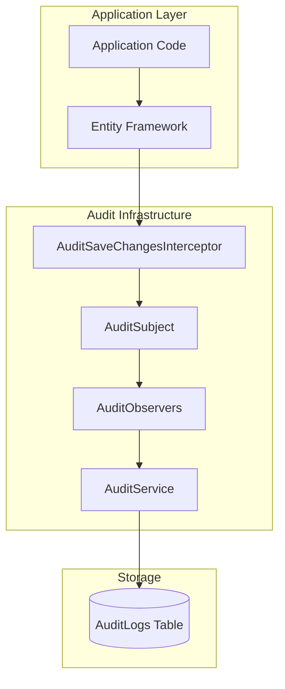
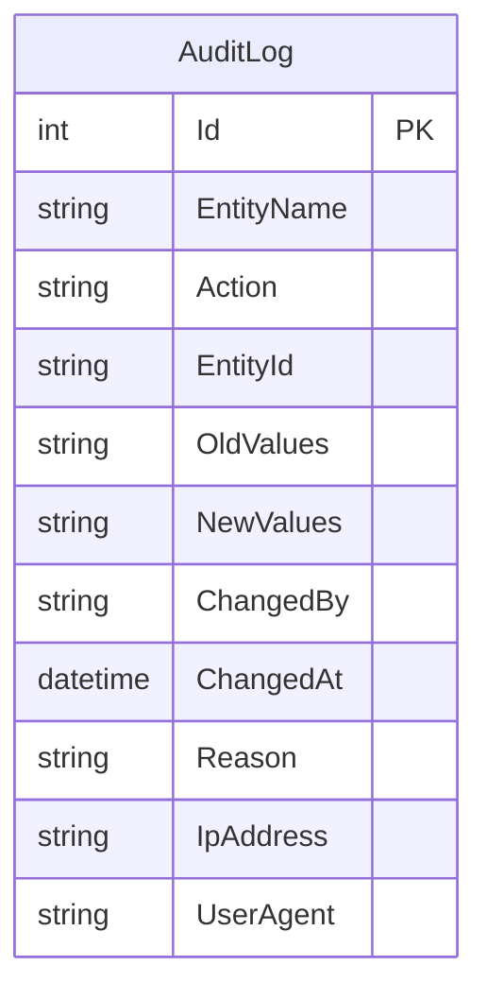
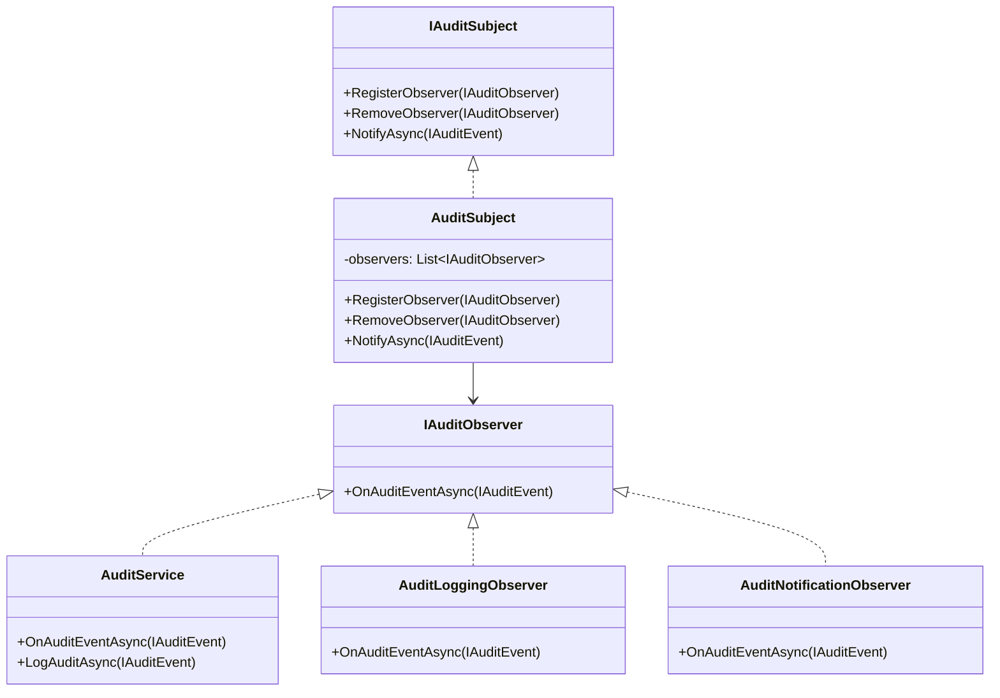
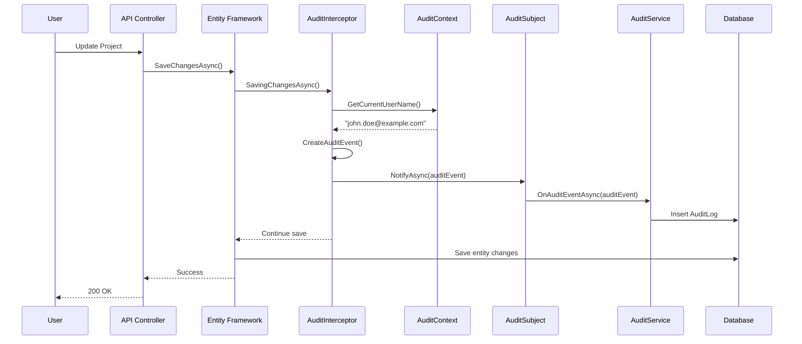

# Audit Logging Feature

## Overview

The Audit Logging feature provides comprehensive tracking of all data changes within the EDR application. It automatically captures who made changes, when they were made, what was changed, and the before/after values for compliance and debugging purposes.

## Business Value

- Compliance with regulatory requirements
- Security incident investigation
- Change tracking and accountability
- Data recovery assistance
- User activity monitoring

## Architecture



## Database Schema

### AuditLog Entity



### Table Definition

```sql
CREATE TABLE AuditLogs (
    Id INT PRIMARY KEY IDENTITY(1,1),
    EntityName NVARCHAR(100) NOT NULL,
    Action NVARCHAR(50) NOT NULL,
    EntityId NVARCHAR(MAX) NOT NULL,
    OldValues NVARCHAR(MAX) NOT NULL,
    NewValues NVARCHAR(MAX) NOT NULL,
    ChangedBy NVARCHAR(100) NOT NULL,
    ChangedAt DATETIME NOT NULL,
    Reason NVARCHAR(500),
    IpAddress NVARCHAR(50),
    UserAgent NVARCHAR(500)
);

-- Indexes for common queries
CREATE INDEX IX_AuditLogs_EntityName_EntityId 
    ON AuditLogs(EntityName, EntityId);
CREATE INDEX IX_AuditLogs_ChangedAt 
    ON AuditLogs(ChangedAt DESC);
CREATE INDEX IX_AuditLogs_ChangedBy 
    ON AuditLogs(ChangedBy);
CREATE INDEX IX_AuditLogs_Action 
    ON AuditLogs(Action);
```

### Entity Class

```csharp
// AuditLog.cs
public class AuditLog
{
    [Key]
    public int Id { get; set; }

    [Required]
    [MaxLength(100)]
    public string EntityName { get; set; }

    [Required]
    [MaxLength(50)]
    public string Action { get; set; }

    [Required]
    public string EntityId { get; set; }

    [Required]
    public string OldValues { get; set; }

    [Required]
    public string NewValues { get; set; }

    [Required]
    [MaxLength(100)]
    public string ChangedBy { get; set; }

    [Required]
    public DateTime ChangedAt { get; set; }

    [MaxLength(500)]
    public string? Reason { get; set; }

    [MaxLength(50)]
    public string? IpAddress { get; set; }

    [MaxLength(500)]
    public string? UserAgent { get; set; }
}
```

## Audit Interceptor Implementation

### AuditSaveChangesInterceptor

**Location**: `backend/src/NJS.Domain/Interceptors/AuditSaveChangesInterceptor.cs`

```csharp
public class AuditSaveChangesInterceptor : SaveChangesInterceptor
{
    private readonly IAuditSubject _auditSubject;
    private readonly IAuditContext _auditContext;

    public override async ValueTask<InterceptionResult<int>> SavingChangesAsync(
        DbContextEventData eventData, 
        InterceptionResult<int> result, 
        CancellationToken cancellationToken = default)
    {
        var context = eventData.Context;
        if (context is null) return result;

        var auditEvents = new List<IAuditEvent>();

        foreach (var entry in context.ChangeTracker.Entries())
        {
            // Skip AuditLog entity to prevent infinite loop
            if (entry.Entity is AuditLog) continue;
            
            var auditEvent = CreateAuditEvent(entry);
            if (auditEvent != null)
            {
                auditEvents.Add(auditEvent);
            }
        }

        // Fire and forget - don't block the save operation
        if (auditEvents.Any())
        {
            _ = Task.Run(async () =>
            {
                foreach (var auditEvent in auditEvents)
                {
                    await _auditSubject.NotifyAsync(auditEvent);
                }
            });
        }

        return result;
    }

    private IAuditEvent CreateAuditEvent(EntityEntry entry)
    {
        var entityName = entry.Entity.GetType().Name;
        var entityId = GetEntityId(entry);
        var action = GetAction(entry);
        var oldValues = GetOldValues(entry);
        var newValues = GetNewValues(entry);
        var changedBy = _auditContext.GetCurrentUserName() ?? "Unknown User";
        var changedAt = DateTime.Now;
        var reason = _auditContext.GetReason() ?? "No reason provided";
        var ipAddress = _auditContext.GetIpAddress() ?? "Unknown IP";
        var userAgent = _auditContext.GetUserAgent() ?? "Unknown User Agent";

        if (string.IsNullOrEmpty(entityId)) return null;

        return new AuditEvent(
            entityName, action, entityId, oldValues, newValues,
            changedBy, changedAt, reason, ipAddress, userAgent
        );
    }

    private string GetAction(EntityEntry entry) => entry.State switch
    {
        EntityState.Added => "Created",
        EntityState.Modified => "Updated",
        EntityState.Deleted => "Deleted",
        _ => "Unchanged"
    };

    private string GetOldValues(EntityEntry entry)
    {
        if (entry.State == EntityState.Added) return string.Empty;

        var oldValues = new Dictionary<string, object>();
        foreach (var property in entry.Properties)
        {
            if (property.IsModified || entry.State == EntityState.Deleted)
            {
                oldValues[property.Metadata.Name] = property.OriginalValue ?? DBNull.Value;
            }
        }
        return JsonSerializer.Serialize(oldValues);
    }

    private string GetNewValues(EntityEntry entry)
    {
        if (entry.State == EntityState.Deleted) return string.Empty;

        var newValues = new Dictionary<string, object>();
        foreach (var property in entry.Properties)
        {
            if (property.IsModified || entry.State == EntityState.Added)
            {
                newValues[property.Metadata.Name] = property.CurrentValue ?? DBNull.Value;
            }
        }
        return JsonSerializer.Serialize(newValues);
    }
}
```

## Audit Service

### IAuditService Interface

```csharp
public interface IAuditService
{
    Task LogAuditAsync(IAuditEvent auditEvent);
    Task<IEnumerable<AuditLog>> GetAuditLogsAsync(string entityName, string entityId);
    Task<IEnumerable<AuditLog>> GetAuditLogsByUserAsync(string changedBy);
    Task<IEnumerable<AuditLog>> GetAuditLogsByDateRangeAsync(DateTime startDate, DateTime endDate);
}
```

### AuditService Implementation

**Location**: `backend/src/NJS.Domain/Services/AuditService.cs`

```csharp
public class AuditService : IAuditService, IAuditObserver
{
    private readonly IServiceProvider _serviceProvider;
    private readonly ILogger<AuditService> _logger;

    public async Task LogAuditAsync(IAuditEvent auditEvent)
    {
        try
        {
            using var scope = _serviceProvider.CreateScope();
            var context = scope.ServiceProvider
                .GetRequiredService<ProjectManagementContext>();

            var auditLog = new AuditLog
            {
                EntityName = auditEvent.EntityName,
                Action = auditEvent.Action,
                EntityId = auditEvent.EntityId,
                OldValues = auditEvent.OldValues,
                NewValues = auditEvent.NewValues,
                ChangedBy = auditEvent.ChangedBy,
                ChangedAt = auditEvent.ChangedAt,
                Reason = auditEvent.Reason,
                IpAddress = auditEvent.IpAddress,
                UserAgent = auditEvent.UserAgent
            };

            context.AuditLogs.Add(auditLog);
            await context.SaveChangesAsync();
        }
        catch (Exception ex)
        {
            _logger.LogError(ex, "Failed to save audit log");
        }
    }

    public async Task<IEnumerable<AuditLog>> GetAuditLogsAsync(
        string entityName, string entityId)
    {
        using var scope = _serviceProvider.CreateScope();
        var context = scope.ServiceProvider
            .GetRequiredService<ProjectManagementContext>();

        return await context.AuditLogs
            .Where(a => a.EntityName == entityName && a.EntityId == entityId)
            .OrderByDescending(a => a.ChangedAt)
            .ToListAsync();
    }

    public async Task<IEnumerable<AuditLog>> GetAuditLogsByUserAsync(string changedBy)
    {
        using var scope = _serviceProvider.CreateScope();
        var context = scope.ServiceProvider
            .GetRequiredService<ProjectManagementContext>();

        return await context.AuditLogs
            .Where(a => a.ChangedBy == changedBy)
            .OrderByDescending(a => a.ChangedAt)
            .ToListAsync();
    }

    public async Task<IEnumerable<AuditLog>> GetAuditLogsByDateRangeAsync(
        DateTime startDate, DateTime endDate)
    {
        using var scope = _serviceProvider.CreateScope();
        var context = scope.ServiceProvider
            .GetRequiredService<ProjectManagementContext>();

        return await context.AuditLogs
            .Where(a => a.ChangedAt >= startDate && a.ChangedAt <= endDate)
            .OrderByDescending(a => a.ChangedAt)
            .ToListAsync();
    }
}
```

## Observer Pattern Implementation



## API Endpoints

### Audit Query Endpoints

```http
# Get audit logs for entity
GET /api/audit/{entityName}/{entityId}
Authorization: Bearer {token}

Response: 200 OK
[
    {
        "id": 1,
        "entityName": "Project",
        "action": "Updated",
        "entityId": "123",
        "oldValues": "{\"Status\":\"Planning\"}",
        "newValues": "{\"Status\":\"Active\"}",
        "changedBy": "john.doe@example.com",
        "changedAt": "2024-11-28T10:30:00Z",
        "reason": "Project kickoff",
        "ipAddress": "192.168.1.100",
        "userAgent": "Mozilla/5.0..."
    }
]

# Get audit logs by user
GET /api/audit/user/{userId}
Authorization: Bearer {token}

Response: 200 OK
[...]

# Get audit logs by date range
GET /api/audit/range?startDate=2024-11-01&endDate=2024-11-30
Authorization: Bearer {token}

Response: 200 OK
[...]

# Get recent audit logs
GET /api/audit/recent?count=100
Authorization: Bearer {token}

Response: 200 OK
[...]
```

## Audit Event Flow



## Audit Context

### IAuditContext Interface

```csharp
public interface IAuditContext
{
    string GetCurrentUserName();
    string GetReason();
    string GetIpAddress();
    string GetUserAgent();
    void SetReason(string reason);
}
```

### AuditContext Implementation

```csharp
public class AuditContext : IAuditContext
{
    private readonly IHttpContextAccessor _httpContextAccessor;
    private string _reason;

    public string GetCurrentUserName()
    {
        return _httpContextAccessor.HttpContext?.User?.Identity?.Name 
            ?? "System";
    }

    public string GetIpAddress()
    {
        return _httpContextAccessor.HttpContext?.Connection?.RemoteIpAddress?.ToString();
    }

    public string GetUserAgent()
    {
        return _httpContextAccessor.HttpContext?.Request?.Headers["User-Agent"].ToString();
    }

    public string GetReason() => _reason;
    public void SetReason(string reason) => _reason = reason;
}
```

## Tracked Entities

All entities implementing `IAuditableEntity` are automatically tracked:

| Entity | Actions Tracked |
|--------|-----------------|
| Project | Create, Update, Delete |
| OpportunityTracking | Create, Update, Delete |
| WorkBreakdownStructure | Create, Update, Delete |
| MonthlyProgress | Create, Update, Delete |
| User | Create, Update, Delete |
| Role | Create, Update, Delete |
| Settings | Update |

## Sample Audit Log Entry

```json
{
    "id": 1234,
    "entityName": "Project",
    "action": "Updated",
    "entityId": "42",
    "oldValues": {
        "Status": "Planning",
        "EstimatedProjectCost": 1000000.00,
        "UpdatedAt": "2024-11-27T15:00:00Z"
    },
    "newValues": {
        "Status": "Active",
        "EstimatedProjectCost": 1200000.00,
        "UpdatedAt": "2024-11-28T10:30:00Z"
    },
    "changedBy": "john.doe@example.com",
    "changedAt": "2024-11-28T10:30:00Z",
    "reason": "Budget revision approved",
    "ipAddress": "192.168.1.100",
    "userAgent": "Mozilla/5.0 (Windows NT 10.0; Win64; x64)"
}
```

## Performance Considerations

- Audit logging is asynchronous (fire-and-forget)
- Does not block the main save operation
- Indexes on common query columns
- Consider archiving old audit logs

## Testing Coverage

### Existing Tests

- `backend/NJS.API.Tests/Services/AuditServiceTests.cs`
- Interceptor unit tests
- Service integration tests

### Test Scenarios

| Scenario | Type | Status |
|----------|------|--------|
| Create audit log | Unit | ✓ |
| Query by entity | Integration | ✓ |
| Query by user | Integration | ✓ |
| Query by date range | Integration | ✓ |
| Async logging | Integration | ✓ |

## Related Features

- [User Management](./USER_MANAGEMENT.md)
- [System Settings](./SYSTEM_SETTINGS.md)
- [Role & Permission](./ROLE_PERMISSION.md)
