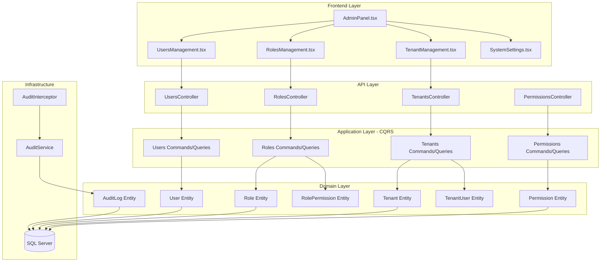
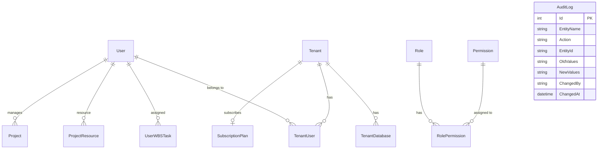

# Admin Module Documentation

## Overview

The Admin Module provides comprehensive administrative functionality for the EDR (KarmaTech AI) application. It enables system administrators and tenant administrators to manage users, roles, permissions, tenants, and system settings.

## Module Purpose and Scope

The Admin Module serves as the central hub for:
- **User Management**: Create, update, delete, and manage user accounts
- **Role Management**: Define roles with specific permissions
- **Permission Management**: Granular permission control for features
- **Tenant Management**: Multi-tenant organization management
- **System Settings**: Application-wide configuration
- **Audit Logging**: Track all system changes for compliance

## Features in Module

| Feature | Description | Requirements |
|---------|-------------|--------------|
| [User Management](./USER_MANAGEMENT.md) | User CRUD, profile management, password reset | 4.1 |
| [Role & Permission](./ROLE_PERMISSION.md) | RBAC system, permission assignment | 4.2 |
| [Tenant Management](./TENANT_MANAGEMENT.md) | Multi-tenancy, subscription management | 4.3 |
| [System Settings](./SYSTEM_SETTINGS.md) | Application configuration | 4.4 |
| [Audit Logging](./AUDIT_LOGGING.md) | Change tracking, compliance | 4.5 |

## Module Architecture



## Entity Relationships



## Access Control

### Permission Levels

| Level | Description | Access |
|-------|-------------|--------|
| Super Admin | System-wide access | All features |
| System Admin | Tenant management | Tenants, Users, Roles, Settings |
| Tenant Admin | Organization admin | Users, Roles within tenant |
| User | Standard access | Profile only |

### Permission Categories

- **Project**: VIEW, CREATE, EDIT, DELETE, REVIEW, APPROVE
- **Business Development**: VIEW, CREATE, EDIT, DELETE, REVIEW, APPROVE
- **System**: SYSTEM_ADMIN, Tenant_ADMIN

## Technology Stack

### Backend
- **Framework**: ASP.NET Core 8.0
- **Authentication**: ASP.NET Core Identity + JWT
- **ORM**: Entity Framework Core 8.0
- **Pattern**: CQRS with MediatR

### Frontend
- **Framework**: React 18.3 + TypeScript
- **UI Library**: Material-UI (MUI)
- **State**: React Context API

## Key Files

### Backend
```
backend/src/NJS.Domain/Entities/
├── User.cs
├── TenantUser.cs
├── Role.cs
├── Permission.cs
├── RolePermission.cs
├── Tenant.cs
├── TenantDatabase.cs
├── Settings.cs
└── AuditLog.cs

backend/src/NJS.Application/CQRS/
├── Users/
├── Roles/
├── Permissions/
└── Tenants/
```

### Frontend
```
frontend/src/
├── pages/
│   ├── AdminPanel.tsx
│   ├── Users.tsx
│   ├── Roles.tsx
│   └── GeneralSettings.tsx
└── components/adminpanel/
    ├── UsersManagement.tsx
    ├── RolesManagement.tsx
    ├── TenantManagement.tsx
    ├── TenantUsersManagement.tsx
    ├── SystemSettings.tsx
    ├── SubscriptionManagement.tsx
    └── BillingManagement.tsx
```

## Related Documentation

- [Database Schema](../DATABASE_SCHEMA.md)
- [API Documentation](../API_DOCUMENTATION.md)
- [Architecture](../ARCHITECTURE.md)
