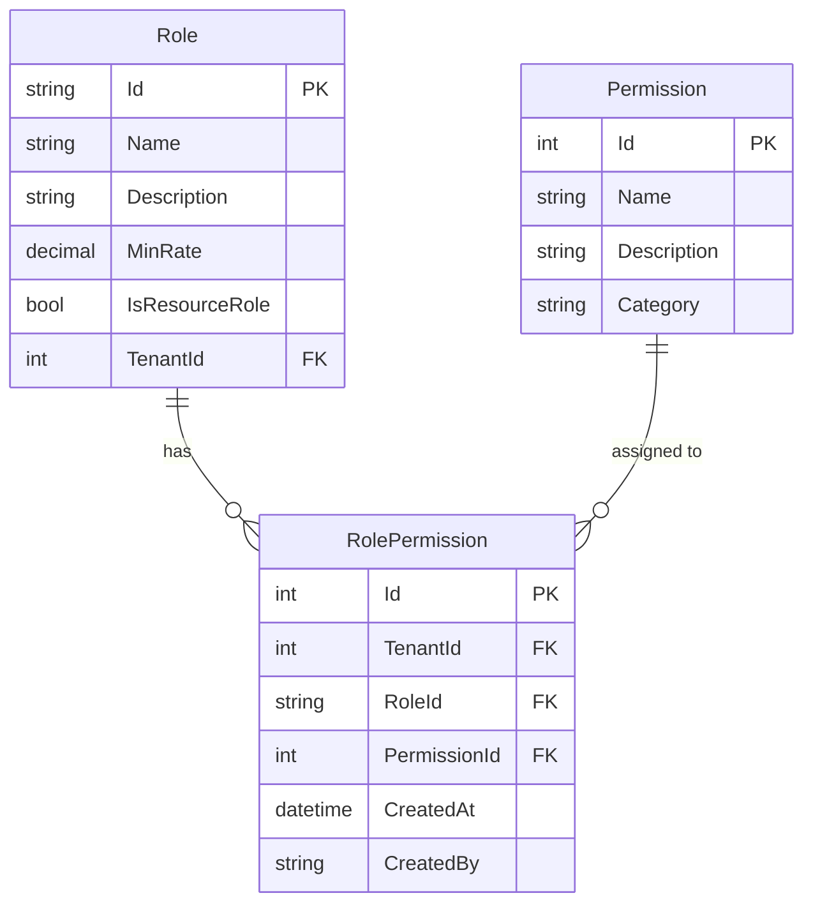
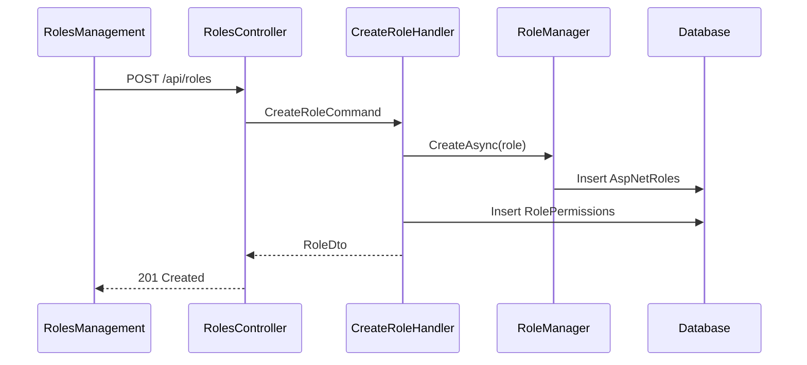
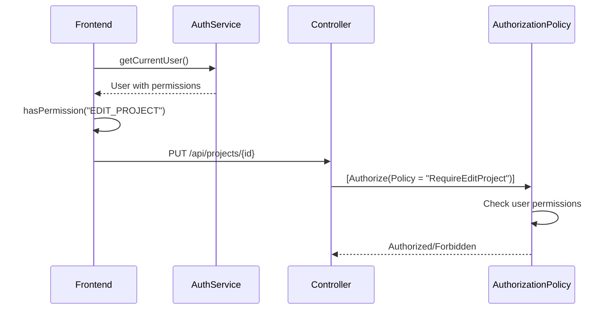

# Role and Permission Management Feature

## Overview

The Role and Permission Management feature implements a comprehensive Role-Based Access Control (RBAC) system. It allows administrators to define roles with specific permissions, enabling fine-grained access control across the application.

## Business Value

- Granular access control for all features
- Flexible role definitions
- Permission inheritance through roles
- Multi-tenant permission isolation
- Audit trail for permission changes

## Database Schema

### Entity Relationships



### Table Definitions

```sql
-- AspNetRoles (Extended from ASP.NET Identity)
CREATE TABLE AspNetRoles (
    Id NVARCHAR(450) PRIMARY KEY,
    Name NVARCHAR(256),
    NormalizedName NVARCHAR(256),
    ConcurrencyStamp NVARCHAR(MAX),
    -- Extended fields
    Description NVARCHAR(500) NOT NULL,
    MinRate DECIMAL(18,2),
    IsResourceRole BIT DEFAULT 0,
    TenantId INT NOT NULL
);

-- Permissions
CREATE TABLE Permissions (
    Id INT PRIMARY KEY IDENTITY(1,1),
    Name NVARCHAR(100) NOT NULL,
    Description NVARCHAR(500) NOT NULL,
    Category NVARCHAR(100) NOT NULL
);

-- RolePermissions (Junction table)
CREATE TABLE RolePermissions (
    Id INT PRIMARY KEY IDENTITY(1,1),
    TenantId INT NOT NULL,
    RoleId NVARCHAR(450) NOT NULL,
    PermissionId INT NOT NULL,
    CreatedAt DATETIME NOT NULL DEFAULT GETUTCDATE(),
    CreatedBy NVARCHAR(450),
    
    CONSTRAINT FK_RolePermissions_Role FOREIGN KEY (RoleId) REFERENCES AspNetRoles(Id),
    CONSTRAINT FK_RolePermissions_Permission FOREIGN KEY (PermissionId) REFERENCES Permissions(Id),
    CONSTRAINT UQ_RolePermissions UNIQUE (TenantId, RoleId, PermissionId)
);
```

### Entity Classes

```csharp
// Role.cs
[Table("AspNetRoles")]
public class Role : IdentityRole, ITenantEntity
{
    [Required]
    [MaxLength(500)]
    public string Description { get; set; }

    [Column(TypeName = "decimal(18,2)")]
    public decimal? MinRate { get; set; }

    public bool? IsResourceRole { get; set; } = false;

    public virtual ICollection<RolePermission> RolePermissions { get; set; }
    public int TenantId { get; set; }
}

// Permission.cs
[Table("Permissions")]
public class Permission
{
    [Key]
    public int Id { get; set; }

    [Required]
    [StringLength(100)]
    public string Name { get; set; }

    [Required]
    [StringLength(500)]
    public string Description { get; set; }

    [Required]
    [StringLength(100)]
    public string Category { get; set; }

    public virtual ICollection<RolePermission> RolePermissions { get; set; }
}

// RolePermission.cs
public class RolePermission : ITenantEntity
{
    [Key]
    public int Id { get; set; }
    public int TenantId { get; set; }
    public string RoleId { get; set; }
    public int PermissionId { get; set; }
    public DateTime CreatedAt { get; set; }
    public string CreatedBy { get; set; }

    public virtual Role Role { get; set; }
    public virtual Permission Permission { get; set; }
}
```

## Permission Categories

### Project Permissions

| Permission | Description |
|------------|-------------|
| VIEW_PROJECT | View project details |
| CREATE_PROJECT | Create new projects |
| EDIT_PROJECT | Edit project information |
| DELETE_PROJECT | Delete projects |
| REVIEW_PROJECT | Review project submissions |
| APPROVE_PROJECT | Approve project changes |
| SUBMIT_PROJECT_FOR_REVIEW | Submit project for review |
| SUBMIT_PROJECT_FOR_APPROVAL | Submit project for approval |

### Business Development Permissions

| Permission | Description |
|------------|-------------|
| VIEW_BUSINESS_DEVELOPMENT | View BD records |
| CREATE_BUSINESS_DEVELOPMENT | Create BD records |
| EDIT_BUSINESS_DEVELOPMENT | Edit BD records |
| DELETE_BUSINESS_DEVELOPMENT | Delete BD records |
| REVIEW_BUSINESS_DEVELOPMENT | Review BD submissions |
| APPROVE_BUSINESS_DEVELOPMENT | Approve BD records |
| SUBMIT_FOR_REVIEW | Submit BD for review |
| SUBMIT_FOR_APPROVAL | Submit BD for approval |

### System Permissions

| Permission | Description |
|------------|-------------|
| SYSTEM_ADMIN | Full system access |
| Tenant_ADMIN | Tenant administration |

## API Endpoints

### Roles CQRS Operations

| Operation | Type | Description |
|-----------|------|-------------|
| CreateRoleCommand | Command | Create new role |
| DeleteRoleCommand | Command | Delete role |
| GetAllRolesQuery | Query | Get all roles |
| GetRoleByNameQuery | Query | Get role by name |
| GetAllRolesWithPermissionsQuery | Query | Get roles with permissions |
| GetRolePermissionsQuery | Query | Get permissions for role |

### Permissions CQRS Operations

| Operation | Type | Description |
|-----------|------|-------------|
| CreatePermissionCommand | Command | Create permission |
| UpdatePermissionCommand | Command | Update permission |
| DeletePermissionCommand | Command | Delete permission |
| GetAllPermissionsQuery | Query | Get all permissions |
| GetPermissionByIdQuery | Query | Get permission by ID |
| GetPermissionsByGroupedByCategoryQuery | Query | Get permissions grouped |

### API Endpoints

```http
# Get all roles with permissions
GET /api/roles/with-permissions
Authorization: Bearer {token}

Response: 200 OK
[
    {
        "id": "role-guid",
        "name": "Project Manager",
        "description": "Manages project lifecycle",
        "minRate": 100.00,
        "isResourceRole": true,
        "permissions": [
            {
                "category": "Project",
                "permissions": [
                    { "id": 1, "name": "VIEW_PROJECT", "description": "View projects" },
                    { "id": 2, "name": "EDIT_PROJECT", "description": "Edit projects" }
                ]
            }
        ]
    }
]

# Create role
POST /api/roles
Authorization: Bearer {token}
Content-Type: application/json

Request:
[
    {
        "name": "Senior Engineer",
        "description": "Senior engineering role",
        "minRate": 150.00,
        "isResourceRole": true,
        "permissions": [
            {
                "category": "Project",
                "permissions": [
                    { "id": 1, "name": "VIEW_PROJECT" },
                    { "id": 2, "name": "EDIT_PROJECT" }
                ]
            }
        ]
    }
]

Response: 201 Created

# Update role
PUT /api/roles/{id}
Authorization: Bearer {token}
Content-Type: application/json

Request:
{
    "name": "Senior Engineer",
    "description": "Updated description",
    "minRate": 175.00,
    "isResourceRole": true,
    "permissions": [...]
}

Response: 200 OK

# Delete role
DELETE /api/roles/{id}
Authorization: Bearer {token}

Response: 204 No Content

# Get all permissions
GET /api/permissions
Authorization: Bearer {token}

Response: 200 OK
[
    {
        "id": 1,
        "name": "VIEW_PROJECT",
        "description": "View project details",
        "category": "Project"
    }
]

# Get permissions grouped by category
GET /api/permissions/grouped
Authorization: Bearer {token}

Response: 200 OK
[
    {
        "category": "Project",
        "permissions": [
            { "id": 1, "name": "VIEW_PROJECT", "description": "View projects" },
            { "id": 2, "name": "CREATE_PROJECT", "description": "Create projects" }
        ]
    },
    {
        "category": "Business Development",
        "permissions": [...]
    }
]

# Update role permissions
PUT /api/users/role-permissions
Authorization: Bearer {token}
Content-Type: application/json

Request:
{
    "roleId": "role-guid",
    "permissionIds": [1, 2, 3, 4, 5]
}

Response: 200 OK
```

## Frontend Components

### RolesManagement Component

**Location**: `frontend/src/components/adminpanel/RolesManagement.tsx`

**Features**:
- Role list with permission summary
- Create/Edit role dialog
- Permission assignment by category
- Visual permission chips
- Role deletion with confirmation

**Component Structure**:
```typescript
interface RolesManagementState {
    roles: RoleWithPermissionsDto[];
    open: boolean;
    editingRole: RoleWithPermissionsDto | null;
    formData: RoleFormData;
}

interface RoleFormData {
    id: string;
    name: string;
    minRate: number;
    isResourceRole: boolean;
    permissions: PermissionCategoryGroup[];
}

interface PermissionCategoryGroup {
    category: string;
    permissions: PermissionDto[];
}
```

**Key Functions**:
- `loadRoles()`: Fetch all roles with permissions
- `handleSubmit()`: Create or update role
- `handleDelete()`: Delete role with confirmation
- `renderPermissionChips()`: Display permission summary

### RoleDialog Component

**Location**: `frontend/src/components/dialogbox/adminpage/RoleDialog.tsx`

**Features**:
- Role name and description input
- Min rate configuration
- Resource role toggle
- Permission selection by category
- Checkbox-based permission assignment

## Business Logic

### Role Creation Flow



### Permission Check Flow



### RBAC Implementation

```csharp
// Permission-based authorization
[Authorize(Policy = "RequireAdminRole")]
[HttpDelete("{id}")]
public async Task<IActionResult> DeleteProject(int id)
{
    // Only users with admin role can delete
}

// Frontend permission check
{hasPermission("EDIT_BUSINESS_DEVELOPMENT") && (
    <Button onClick={handleEdit}>Edit Opportunity</Button>
)}
```

## Validation Rules

| Field | Rule |
|-------|------|
| Role Name | Required, unique per tenant, 2-50 characters |
| Description | Required, max 500 characters |
| MinRate | Optional, >= 0 |
| Permissions | At least one permission required |

## Default Roles

| Role | Description | Key Permissions |
|------|-------------|-----------------|
| Super Admin | System-wide access | All permissions |
| Tenant Admin | Tenant management | User, Role management |
| Project Manager | Project oversight | All project permissions |
| Engineer | Project work | View, Edit project |
| Viewer | Read-only access | View permissions only |

## Multi-Tenant Considerations

- Roles are tenant-specific (TenantId)
- RolePermissions are tenant-isolated
- Permission definitions are global
- Role names can be duplicated across tenants

## Testing Coverage

### Existing Tests

- `backend/src/NJS.Application/CQRS/Roles/` - Role CQRS tests
- `backend/src/NJS.Application/CQRS/Permissions/` - Permission tests
- Role creation/deletion tests
- Permission assignment tests

### Test Scenarios

| Scenario | Type | Status |
|----------|------|--------|
| Create role with permissions | Unit | ✓ |
| Update role permissions | Integration | ✓ |
| Delete role with users | Integration | ✓ |
| Permission check authorization | Integration | ✓ |

## Related Features

- [User Management](./USER_MANAGEMENT.md)
- [Tenant Management](./TENANT_MANAGEMENT.md)
- [Audit Logging](./AUDIT_LOGGING.md)
