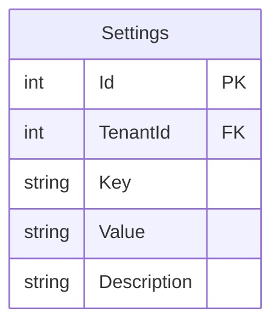
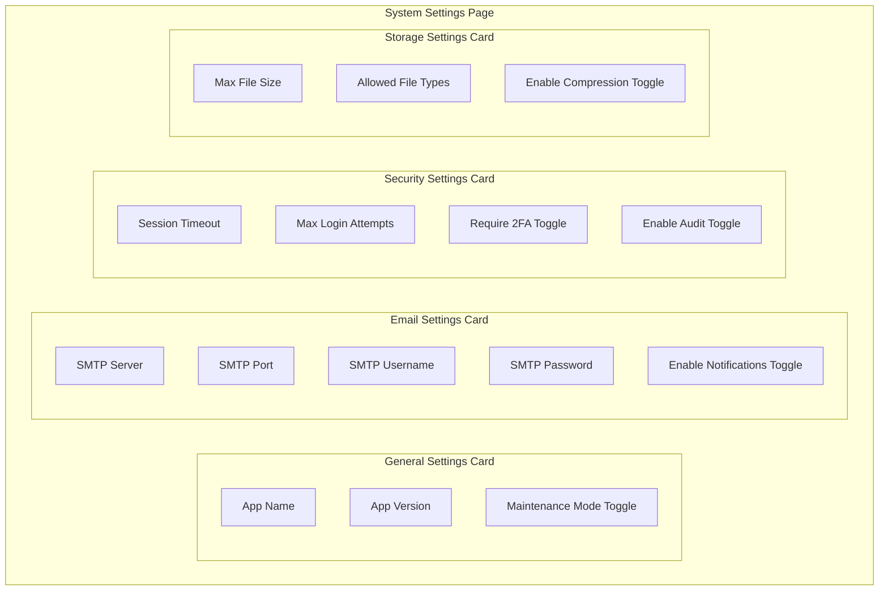
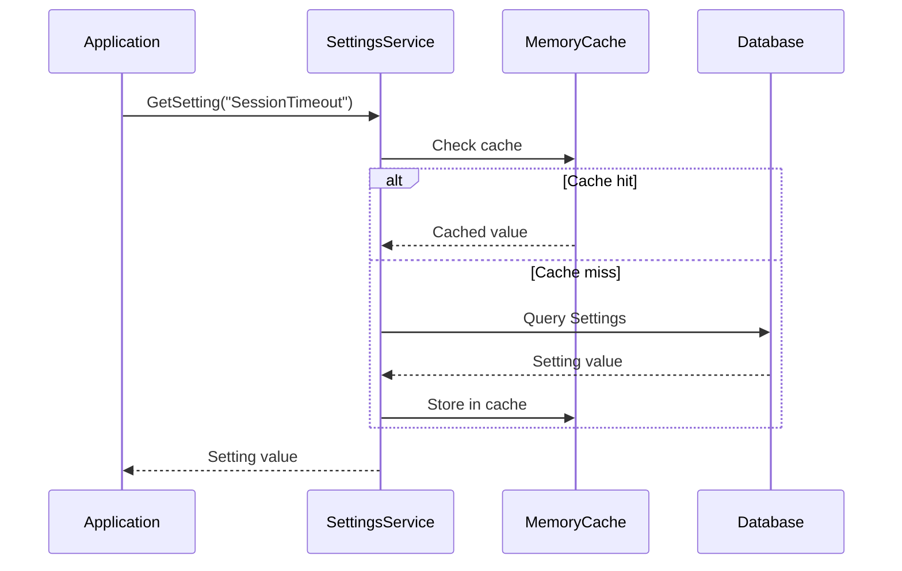
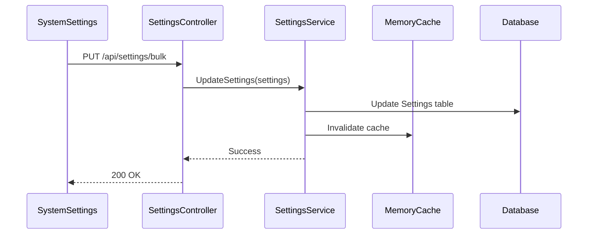

# System Settings Feature

## Overview

The System Settings feature provides centralized configuration management for the EDR application. It allows administrators to configure application behavior, email settings, security policies, and storage options.

## Business Value

- Centralized configuration management
- Runtime configuration changes
- Tenant-specific settings
- Security policy enforcement
- Email notification configuration

## Database Schema

### Settings Entity



### Table Definition

```sql
CREATE TABLE Settings (
    Id INT PRIMARY KEY IDENTITY(1,1),
    TenantId INT NOT NULL,
    [Key] NVARCHAR(255) NOT NULL,
    Value NVARCHAR(MAX) NOT NULL,
    Description NVARCHAR(500),
    
    CONSTRAINT UQ_Settings_TenantKey UNIQUE (TenantId, [Key])
);

-- Sample settings data
INSERT INTO Settings (TenantId, [Key], Value, Description) VALUES
(1, 'AppName', 'Project Management', 'Application display name'),
(1, 'SessionTimeout', '30', 'Session timeout in minutes'),
(1, 'MaxLoginAttempts', '5', 'Maximum failed login attempts'),
(1, 'EnableTwoFactor', 'false', 'Require two-factor authentication'),
(1, 'SmtpServer', 'smtp.gmail.com', 'SMTP server address'),
(1, 'SmtpPort', '587', 'SMTP server port'),
(1, 'MaxFileSize', '10', 'Maximum file upload size in MB');
```

### Entity Class

```csharp
// Settings.cs
public class Settings : ITenantEntity
{
    [Key]
    public int Id { get; set; }

    public int TenantId { get; set; }
    
    [Required]
    public string Key { get; set; }
    
    [Required]
    public string Value { get; set; }
    
    public string Description { get; set; }
}
```

## Settings Categories

### General Settings

| Key | Type | Default | Description |
|-----|------|---------|-------------|
| AppName | string | "Project Management" | Application display name |
| AppVersion | string | "1.0.0" | Application version |
| MaintenanceMode | bool | false | Enable maintenance mode |

### Email Settings

| Key | Type | Default | Description |
|-----|------|---------|-------------|
| SmtpServer | string | "smtp.gmail.com" | SMTP server address |
| SmtpPort | int | 587 | SMTP server port |
| SmtpUsername | string | "" | SMTP authentication username |
| SmtpPassword | string | "" | SMTP authentication password |
| EnableEmailNotifications | bool | true | Enable email notifications |
| FromEmail | string | "" | Default sender email |
| FromName | string | "" | Default sender name |

### Security Settings

| Key | Type | Default | Description |
|-----|------|---------|-------------|
| SessionTimeout | int | 30 | Session timeout (minutes) |
| MaxLoginAttempts | int | 5 | Max failed login attempts |
| RequireTwoFactor | bool | false | Require 2FA for all users |
| EnableAuditLogging | bool | true | Enable audit logging |
| PasswordMinLength | int | 8 | Minimum password length |
| PasswordRequireUppercase | bool | true | Require uppercase in password |
| PasswordRequireNumber | bool | true | Require number in password |
| PasswordRequireSpecial | bool | true | Require special char in password |

### Storage Settings

| Key | Type | Default | Description |
|-----|------|---------|-------------|
| MaxFileSize | int | 10 | Max file upload size (MB) |
| AllowedFileTypes | string | "pdf,doc,docx,xls,xlsx,jpg,png" | Allowed file extensions |
| EnableFileCompression | bool | true | Compress uploaded files |
| StoragePath | string | "/uploads" | File storage path |

## API Endpoints

### Settings Operations

```http
# Get all settings
GET /api/settings
Authorization: Bearer {token}

Response: 200 OK
[
    {
        "id": 1,
        "key": "AppName",
        "value": "Project Management",
        "description": "Application display name"
    },
    {
        "id": 2,
        "key": "SessionTimeout",
        "value": "30",
        "description": "Session timeout in minutes"
    }
]

# Get setting by key
GET /api/settings/{key}
Authorization: Bearer {token}

Response: 200 OK
{
    "id": 1,
    "key": "AppName",
    "value": "Project Management",
    "description": "Application display name"
}

# Update setting
PUT /api/settings/{key}
Authorization: Bearer {token}
Content-Type: application/json

Request:
{
    "value": "New App Name"
}

Response: 200 OK

# Bulk update settings
PUT /api/settings/bulk
Authorization: Bearer {token}
Content-Type: application/json

Request:
[
    { "key": "AppName", "value": "Updated Name" },
    { "key": "SessionTimeout", "value": "60" }
]

Response: 200 OK
```

## Frontend Components

### SystemSettings Component

**Location**: `frontend/src/components/adminpanel/SystemSettings.tsx`

**Features**:
- Categorized settings display
- Real-time validation
- Save/Reset functionality
- Success/Error notifications

**Component Structure**:
```typescript
interface SystemSettingsState {
    settings: {
        // General Settings
        appName: string;
        appVersion: string;
        maintenanceMode: boolean;
        
        // Email Settings
        smtpServer: string;
        smtpPort: number;
        smtpUsername: string;
        smtpPassword: string;
        enableEmailNotifications: boolean;
        
        // Security Settings
        sessionTimeout: number;
        maxLoginAttempts: number;
        requireTwoFactor: boolean;
        enableAuditLogging: boolean;
        
        // Storage Settings
        maxFileSize: number;
        allowedFileTypes: string;
        enableFileCompression: boolean;
    };
    error: string | null;
    success: string | null;
}
```

**Key Functions**:
- `loadSettings()`: Fetch settings from API
- `handleSave()`: Save all settings
- `handleReset()`: Reset to default values

### GeneralSettings Component

**Location**: `frontend/src/pages/GeneralSettings.tsx`

**Features**:
- WBS Options configuration
- Application-specific settings

## Settings UI Layout



## Business Logic

### Settings Resolution Flow



### Settings Update Flow



### Settings Service Implementation

```csharp
public interface ISettingsService
{
    Task<string> GetSettingAsync(string key);
    Task<T> GetSettingAsync<T>(string key);
    Task SetSettingAsync(string key, string value);
    Task<IEnumerable<Settings>> GetAllSettingsAsync();
}

public class SettingsService : ISettingsService
{
    private readonly IRepository<Settings> _repository;
    private readonly IMemoryCache _cache;
    private readonly ICurrentTenantService _tenantService;
    
    public async Task<string> GetSettingAsync(string key)
    {
        var cacheKey = $"setting_{_tenantService.TenantId}_{key}";
        
        if (!_cache.TryGetValue(cacheKey, out string value))
        {
            var setting = await _repository
                .GetAll()
                .FirstOrDefaultAsync(s => s.Key == key);
                
            value = setting?.Value;
            _cache.Set(cacheKey, value, TimeSpan.FromMinutes(30));
        }
        
        return value;
    }
}
```

## Validation Rules

| Setting | Validation |
|---------|------------|
| SessionTimeout | 1-1440 minutes |
| MaxLoginAttempts | 1-10 attempts |
| SmtpPort | 1-65535 |
| MaxFileSize | 1-100 MB |
| AllowedFileTypes | Comma-separated extensions |

## Default Settings

Settings are initialized with defaults when a new tenant is created:

```csharp
public static class DefaultSettings
{
    public static readonly Dictionary<string, string> Values = new()
    {
        { "AppName", "Project Management" },
        { "AppVersion", "1.0.0" },
        { "MaintenanceMode", "false" },
        { "SessionTimeout", "30" },
        { "MaxLoginAttempts", "5" },
        { "RequireTwoFactor", "false" },
        { "EnableAuditLogging", "true" },
        { "SmtpServer", "smtp.gmail.com" },
        { "SmtpPort", "587" },
        { "EnableEmailNotifications", "true" },
        { "MaxFileSize", "10" },
        { "AllowedFileTypes", "pdf,doc,docx,xls,xlsx,ppt,pptx,jpg,jpeg,png" },
        { "EnableFileCompression", "true" }
    };
}
```

## Multi-Tenant Considerations

- Settings are tenant-specific (TenantId)
- Each tenant can customize their settings
- System-wide settings use TenantId = 0
- Settings are cached per tenant

## Testing Coverage

### Test Scenarios

| Scenario | Type | Status |
|----------|------|--------|
| Get setting by key | Unit | ✓ |
| Update setting | Unit | ✓ |
| Settings caching | Integration | ✓ |
| Default settings initialization | Integration | ✓ |

## Related Features

- [User Management](./USER_MANAGEMENT.md)
- [Tenant Management](./TENANT_MANAGEMENT.md)
- [Audit Logging](./AUDIT_LOGGING.md)
