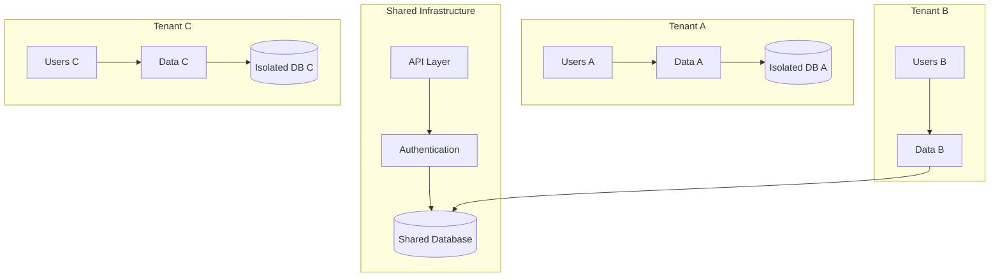
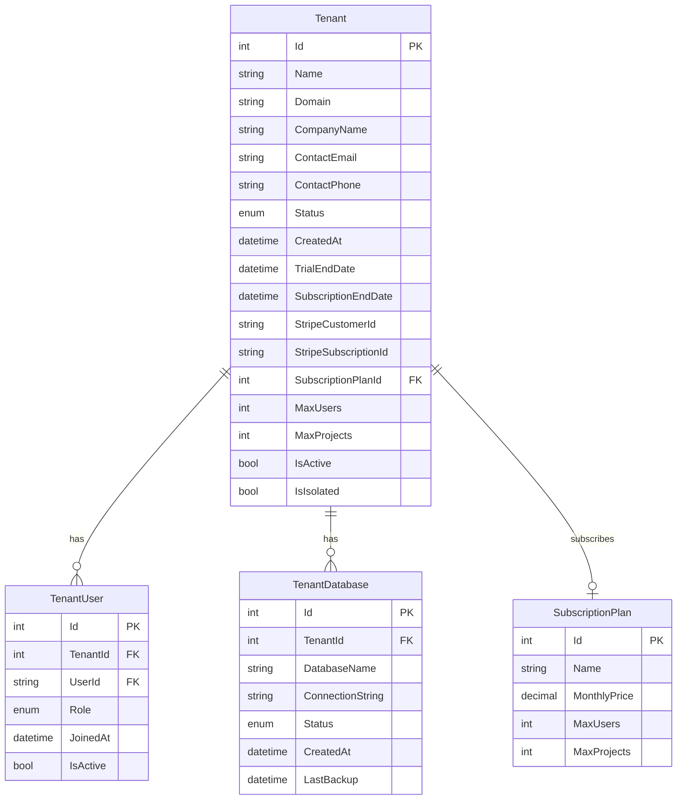
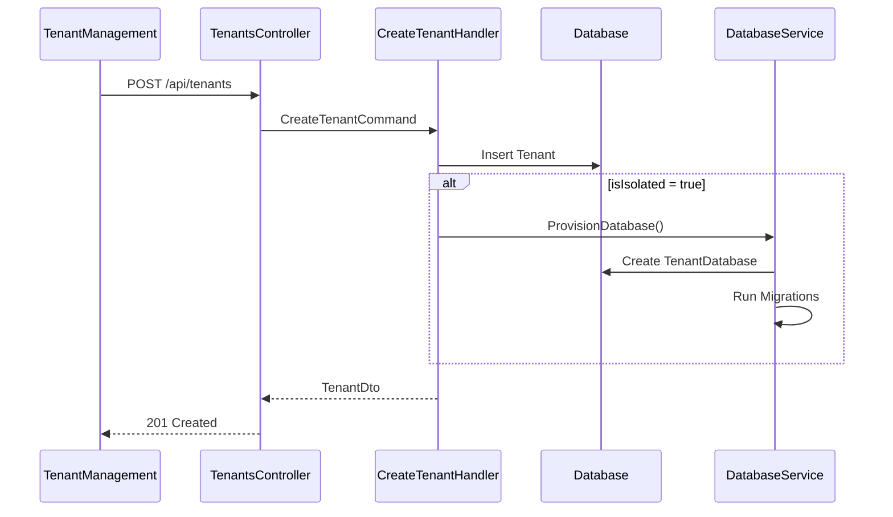
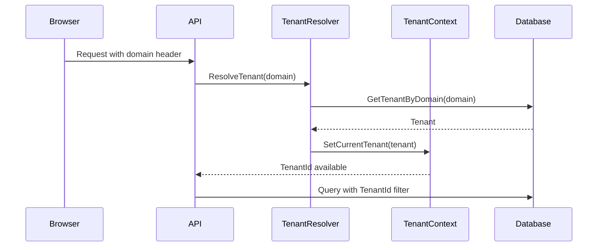
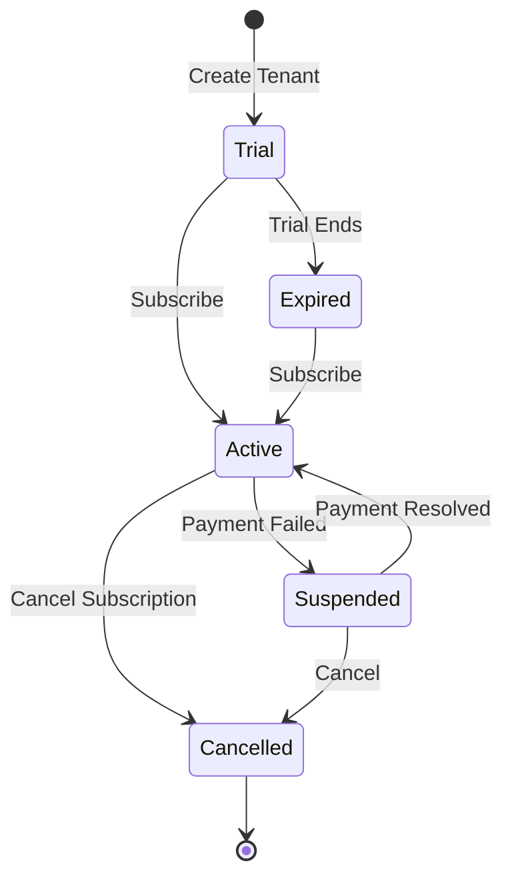

# Tenant Management Feature

## Overview

The Tenant Management feature provides comprehensive multi-tenancy support for the EDR application. It enables system administrators to create and manage organizations (tenants), each with isolated data, users, and configurations.

## Business Value

- Multi-organization support (SaaS model)
- Data isolation between tenants
- Subscription and billing management
- Resource limits per tenant
- Isolated or shared database options

## Multi-Tenancy Architecture



## Database Schema

### Entity Relationships



### Table Definitions

```sql
-- Tenants
CREATE TABLE Tenants (
    Id INT PRIMARY KEY IDENTITY(1,1),
    Name NVARCHAR(255) NOT NULL,
    Domain NVARCHAR(255) NOT NULL,
    CompanyName NVARCHAR(255),
    ContactEmail NVARCHAR(255),
    ContactPhone NVARCHAR(255),
    Status INT NOT NULL DEFAULT 0, -- TenantStatus enum
    CreatedAt DATETIME NOT NULL DEFAULT GETUTCDATE(),
    TrialEndDate DATETIME,
    SubscriptionEndDate DATETIME,
    StripeCustomerId NVARCHAR(255),
    StripeSubscriptionId NVARCHAR(255),
    SubscriptionPlanId INT,
    MaxUsers INT NOT NULL DEFAULT 10,
    MaxProjects INT NOT NULL DEFAULT 50,
    IsActive BIT NOT NULL DEFAULT 1,
    IsIsolated BIT NOT NULL DEFAULT 0,
    
    CONSTRAINT FK_Tenants_SubscriptionPlan 
        FOREIGN KEY (SubscriptionPlanId) REFERENCES SubscriptionPlans(Id)
);

-- TenantDatabases
CREATE TABLE TenantDatabases (
    Id INT PRIMARY KEY IDENTITY(1,1),
    TenantId INT NOT NULL,
    DatabaseName NVARCHAR(255) NOT NULL,
    ConnectionString NVARCHAR(500),
    Status INT NOT NULL DEFAULT 0, -- DatabaseStatus enum
    CreatedAt DATETIME NOT NULL DEFAULT GETUTCDATE(),
    LastBackup DATETIME,
    
    CONSTRAINT FK_TenantDatabases_Tenant 
        FOREIGN KEY (TenantId) REFERENCES Tenants(Id)
);
```

### Entity Classes

```csharp
// Tenant.cs
public class Tenant
{
    public int Id { get; set; }
    public string Name { get; set; }
    public string Domain { get; set; }
    public string CompanyName { get; set; }
    public string ContactEmail { get; set; }
    public string ContactPhone { get; set; }
    public TenantStatus Status { get; set; } = TenantStatus.Active;
    public DateTime CreatedAt { get; set; } = DateTime.UtcNow;
    public DateTime? TrialEndDate { get; set; }
    public DateTime? SubscriptionEndDate { get; set; }
    public string StripeCustomerId { get; set; }
    public string StripeSubscriptionId { get; set; }
    public int? SubscriptionPlanId { get; set; }
    public int MaxUsers { get; set; } = 10;
    public int MaxProjects { get; set; } = 50;
    public bool IsActive { get; set; } = true;
    public bool IsIsolated { get; set; } = false;

    public virtual SubscriptionPlan SubscriptionPlan { get; set; }
    public virtual ICollection<TenantUser> TenantUsers { get; set; }
    public virtual ICollection<TenantDatabase> TenantDatabases { get; set; }
}

public enum TenantStatus
{
    Active,
    Suspended,
    Cancelled,
    Trial,
    Expired
}

// TenantDatabase.cs
[Table("TenantDatabases")]
public class TenantDatabase
{
    public int Id { get; set; }
    public int TenantId { get; set; }
    public string DatabaseName { get; set; }
    public string ConnectionString { get; set; }
    public DatabaseStatus Status { get; set; } = DatabaseStatus.Active;
    public DateTime CreatedAt { get; set; } = DateTime.UtcNow;
    public DateTime? LastBackup { get; set; }

    public virtual Tenant Tenant { get; set; }
}

public enum DatabaseStatus
{
    Active,
    Provisioning,
    Suspended,
    Deleted
}
```

## API Endpoints

### Tenants CQRS Operations

| Operation | Type | Description |
|-----------|------|-------------|
| CreateTenantCommand | Command | Create new tenant |
| UpdateTenantCommand | Command | Update tenant details |
| DeleteTenantCommand | Command | Delete tenant |
| GetAllTenantsQuery | Query | Get all tenants |
| GetTenantByIdQuery | Query | Get tenant by ID |

### API Endpoints

```http
# Get all tenants
GET /api/tenants
Authorization: Bearer {token}

Response: 200 OK
[
    {
        "id": 1,
        "name": "Acme Corp",
        "domain": "acme",
        "companyName": "Acme Corporation",
        "contactEmail": "admin@acme.com",
        "contactPhone": "+1-555-0100",
        "status": "Active",
        "createdAt": "2024-01-15T10:00:00Z",
        "subscriptionPlan": {
            "id": 2,
            "name": "Professional",
            "monthlyPrice": 99.00
        },
        "maxUsers": 25,
        "maxProjects": 100,
        "isActive": true,
        "isIsolated": false,
        "tenantUsers": [...]
    }
]

# Get tenant by ID
GET /api/tenants/{id}
Authorization: Bearer {token}

Response: 200 OK
{
    "id": 1,
    "name": "Acme Corp",
    ...
}

# Create tenant
POST /api/tenants
Authorization: Bearer {token}
Content-Type: application/json

Request:
{
    "name": "New Company",
    "domain": "newcompany",
    "companyName": "New Company Inc.",
    "contactEmail": "admin@newcompany.com",
    "contactPhone": "+1-555-0200",
    "subscriptionPlanId": 1,
    "maxUsers": 10,
    "maxProjects": 50,
    "status": "Trial",
    "isIsolated": false
}

Response: 201 Created
{
    "id": 5,
    "name": "New Company",
    ...
}

# Update tenant
PUT /api/tenants/{id}
Authorization: Bearer {token}
Content-Type: application/json

Request:
{
    "name": "Updated Company Name",
    "maxUsers": 50,
    "maxProjects": 200,
    "status": "Active",
    "subscriptionPlanId": 2
}

Response: 200 OK

# Delete tenant
DELETE /api/tenants/{id}
Authorization: Bearer {token}

Response: 204 No Content
```

## Frontend Components

### TenantManagement Component

**Location**: `frontend/src/components/adminpanel/TenantManagement.tsx`

**Features**:
- Tenant list with status indicators
- Dashboard cards (total, active, trial, suspended)
- Create/Edit tenant dialog
- Subscription plan assignment
- User/Project limit configuration
- Isolated database toggle

**Component Structure**:
```typescript
interface TenantManagementState {
    tenants: Tenant[];
    subscriptionPlans: SubscriptionPlan[];
    open: boolean;
    editingTenant: Tenant | null;
    formData: TenantFormData;
    error: string | null;
}

interface TenantFormData {
    id: number;
    name: string;
    domain: string;
    companyName: string;
    contactEmail: string;
    contactPhone: string;
    subscriptionPlanId: string;
    maxUsers: number;
    maxProjects: number;
    status: TenantStatus;
    isIsolated: boolean;
}
```

**Key Functions**:
- `loadTenants()`: Fetch all tenants
- `loadSubscriptionPlans()`: Fetch available plans
- `handleSubmit()`: Create or update tenant
- `handleDelete()`: Delete tenant with confirmation
- `getStatusColor()`: Get status chip color
- `getStatusIcon()`: Get status indicator icon

### TenantUsersManagement Component

**Location**: `frontend/src/components/adminpanel/TenantUsersManagement.tsx`

**Features**:
- Manage users within a tenant
- Assign tenant-specific roles
- Activate/deactivate tenant users

## Business Logic

### Tenant Creation Flow



### Tenant Resolution Flow



### Multi-Tenant Data Isolation

```csharp
// ITenantEntity interface
public interface ITenantEntity
{
    int TenantId { get; set; }
}

// Global query filter in DbContext
protected override void OnModelCreating(ModelBuilder modelBuilder)
{
    // Apply tenant filter to all tenant entities
    modelBuilder.Entity<Project>()
        .HasQueryFilter(p => p.TenantId == _currentTenantService.TenantId);
}

// Tenant resolution service
public class CurrentTenantService : ICurrentTenantService
{
    public int TenantId { get; private set; }
    
    public void SetTenant(int tenantId)
    {
        TenantId = tenantId;
    }
}
```

## Tenant Status Workflow



## Validation Rules

| Field | Rule |
|-------|------|
| Name | Required, 2-255 characters |
| Domain | Required, unique, alphanumeric + hyphen |
| ContactEmail | Valid email format |
| MaxUsers | >= 1 |
| MaxProjects | >= 1 |

## Subscription Integration

### Stripe Integration

- `StripeCustomerId`: Links to Stripe customer
- `StripeSubscriptionId`: Links to Stripe subscription
- Webhook handlers for subscription events

### Subscription Plans

| Plan | Price | Max Users | Max Projects |
|------|-------|-----------|--------------|
| Free | $0 | 3 | 5 |
| Starter | $29 | 10 | 25 |
| Professional | $99 | 50 | 100 |
| Enterprise | Custom | Unlimited | Unlimited |

## Database Isolation Options

### Shared Database (Default)
- All tenants share one database
- Data isolated by TenantId column
- Cost-effective for small tenants

### Isolated Database
- Dedicated database per tenant
- Complete data isolation
- Better for enterprise/compliance needs
- Higher infrastructure cost

## Testing Coverage

### Existing Tests

- `backend/src/NJS.Application/CQRS/Tenants/` - Tenant CQRS tests
- Tenant creation tests
- Multi-tenant isolation tests

### Test Scenarios

| Scenario | Type | Status |
|----------|------|--------|
| Create tenant | Unit | ✓ |
| Update tenant status | Integration | ✓ |
| Tenant data isolation | Integration | ✓ |
| Subscription assignment | Integration | ✓ |

## Related Features

- [User Management](./USER_MANAGEMENT.md)
- [Role & Permission](./ROLE_PERMISSION.md)
- [System Settings](./SYSTEM_SETTINGS.md)
