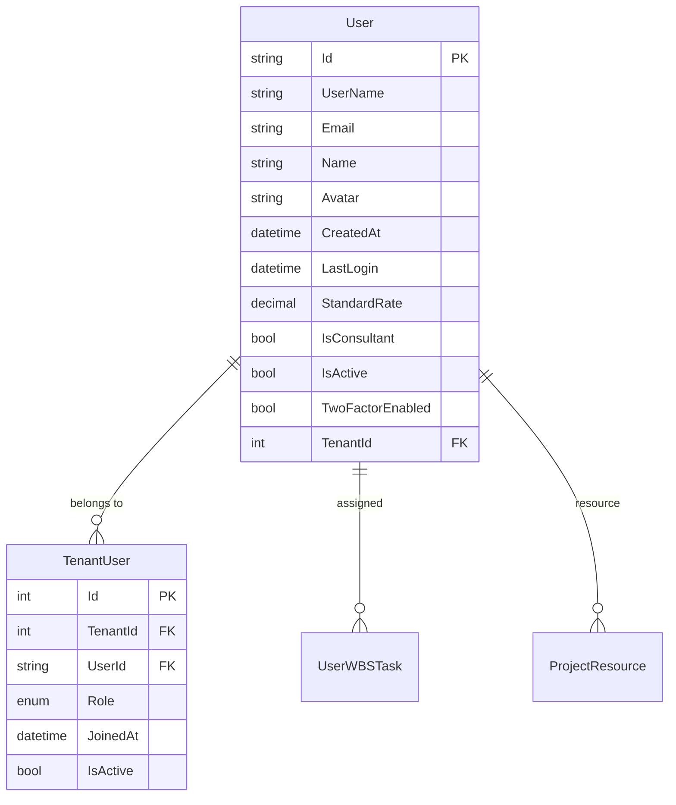
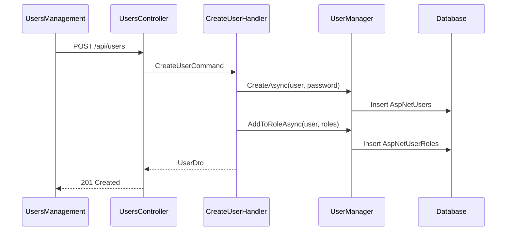

# User Management Feature

## Overview

The User Management feature provides comprehensive functionality for managing user accounts within the EDR application. It supports user creation, profile management, role assignment, and password management with multi-tenant isolation.

## Business Value

- Centralized user account management
- Role-based access control integration
- Multi-tenant user isolation
- Audit trail for user changes
- Self-service profile management

## Database Schema

### User Entity (AspNetUsers)



### Table Definition

```sql
-- AspNetUsers (Extended from ASP.NET Identity)
CREATE TABLE AspNetUsers (
    Id NVARCHAR(450) PRIMARY KEY,
    UserName NVARCHAR(256),
    NormalizedUserName NVARCHAR(256),
    Email NVARCHAR(256),
    NormalizedEmail NVARCHAR(256),
    EmailConfirmed BIT NOT NULL,
    PasswordHash NVARCHAR(MAX),
    SecurityStamp NVARCHAR(MAX),
    ConcurrencyStamp NVARCHAR(MAX),
    PhoneNumber NVARCHAR(MAX),
    PhoneNumberConfirmed BIT NOT NULL,
    TwoFactorEnabled BIT NOT NULL DEFAULT 0,
    LockoutEnd DATETIMEOFFSET,
    LockoutEnabled BIT NOT NULL,
    AccessFailedCount INT NOT NULL,
    -- Extended fields
    Name NVARCHAR(MAX),
    Avatar NVARCHAR(500),
    CreatedAt DATETIME NOT NULL,
    LastLogin DATETIME,
    StandardRate DECIMAL(18,2),
    IsConsultant BIT NOT NULL DEFAULT 0,
    IsActive BIT NOT NULL DEFAULT 1,
    TenantId INT NOT NULL
);

-- TenantUsers
CREATE TABLE TenantUsers (
    Id INT PRIMARY KEY IDENTITY(1,1),
    TenantId INT NOT NULL,
    UserId NVARCHAR(450) NOT NULL,
    Role INT NOT NULL DEFAULT 3, -- TenantUserRole enum
    JoinedAt DATETIME NOT NULL DEFAULT GETUTCDATE(),
    IsActive BIT NOT NULL DEFAULT 1,
    
    CONSTRAINT FK_TenantUsers_Tenant FOREIGN KEY (TenantId) REFERENCES Tenants(Id),
    CONSTRAINT FK_TenantUsers_User FOREIGN KEY (UserId) REFERENCES AspNetUsers(Id)
);
```

### Entity Classes

```csharp
// User.cs
[Table("AspNetUsers")]
public class User : IdentityUser, ITenantEntity
{
    public string Name { get; set; }
    public string? Avatar { get; set; }
    public DateTime CreatedAt { get; set; }
    public DateTime? LastLogin { get; set; }
    public decimal? StandardRate { get; set; }
    public bool IsConsultant { get; set; }
    public bool IsActive { get; set; } = true;
    public new bool TwoFactorEnabled { get; set; } = false;
    public int TenantId { get; set; }
    
    // Navigation properties
    public ICollection<UserWBSTask> UserWBSTasks { get; set; }
    public ICollection<ProjectResource> ProjectResources { get; set; }
    public virtual ICollection<Project> ManagedProjects { get; set; }
}

// TenantUser.cs
[Table("TenantUsers")]
public class TenantUser
{
    public int Id { get; set; }
    public int TenantId { get; set; }
    public string UserId { get; set; }
    public TenantUserRole Role { get; set; } = TenantUserRole.User;
    public DateTime JoinedAt { get; set; } = DateTime.UtcNow;
    public bool IsActive { get; set; } = true;
    
    public virtual Tenant Tenant { get; set; }
    public virtual User User { get; set; }
}

public enum TenantUserRole
{
    Owner,
    Admin,
    Manager,
    User
}
```

## API Endpoints

### Users CQRS Operations

| Operation | Type | Description |
|-----------|------|-------------|
| CreateUserCommand | Command | Create new user |
| UpdateUserCommand | Command | Update user details |
| DeleteUserCommand | Command | Delete/deactivate user |
| UpdateRolePermissionsCommand | Command | Update user role permissions |
| GetAllUsersQuery | Query | Get all users (tenant-filtered) |
| GetUserByIdQuery | Query | Get user by ID |
| GetUsersByRoleNameQuery | Query | Get users by role |
| GetRolesByUserIdQuery | Query | Get roles for user |

### API Endpoints

```http
# Get all users
GET /api/users
Authorization: Bearer {token}

Response: 200 OK
[
    {
        "id": "user-guid",
        "userName": "john.doe",
        "name": "John Doe",
        "email": "john.doe@example.com",
        "standardRate": 150.00,
        "isConsultant": false,
        "isActive": true,
        "roles": [
            { "id": "role-guid", "name": "Project Manager" }
        ],
        "createdAt": "2024-01-15T10:00:00Z"
    }
]

# Get user by ID
GET /api/users/{id}
Authorization: Bearer {token}

Response: 200 OK
{
    "id": "user-guid",
    "userName": "john.doe",
    "name": "John Doe",
    "email": "john.doe@example.com",
    "standardRate": 150.00,
    "isConsultant": false,
    "isActive": true,
    "twoFactorEnabled": false,
    "roles": [...],
    "createdAt": "2024-01-15T10:00:00Z",
    "lastLogin": "2024-11-28T08:30:00Z"
}

# Create user
POST /api/users
Authorization: Bearer {token}
Content-Type: application/json

Request:
{
    "userName": "jane.smith",
    "name": "Jane Smith",
    "email": "jane.smith@example.com",
    "password": "SecurePassword123!",
    "roles": ["Project Manager"],
    "standardRate": 175.00,
    "isConsultant": true
}

Response: 201 Created
{
    "id": "new-user-guid",
    "userName": "jane.smith",
    ...
}

# Update user
PUT /api/users/{id}
Authorization: Bearer {token}
Content-Type: application/json

Request:
{
    "name": "Jane Smith-Johnson",
    "email": "jane.johnson@example.com",
    "standardRate": 200.00,
    "isConsultant": true,
    "roles": ["Senior Project Manager"]
}

Response: 200 OK

# Delete user
DELETE /api/users/{id}
Authorization: Bearer {token}

Response: 204 No Content

# Reset password
POST /api/users/{id}/reset-password
Authorization: Bearer {token}
Content-Type: application/json

Request:
{
    "newPassword": "NewSecurePassword123!"
}

Response: 200 OK
```

## Frontend Components

### UsersManagement Component

**Location**: `frontend/src/components/adminpanel/UsersManagement.tsx`

**Features**:
- User list with pagination
- Create/Edit user dialog
- Password reset functionality
- Role assignment
- User activation/deactivation

**Component Structure**:
```typescript
interface UsersManagementState {
    users: AuthUser[];
    open: boolean;
    editingUser: AuthUser | null;
    passwordDialogOpen: boolean;
    selectedUser: AuthUser | null;
    formData: UserFormData;
}

interface UserFormData {
    userName: string;
    name: string;
    email: string;
    password: string;
    roles: Role[];
    standardRate: number;
    isConsultant: boolean;
    createdAt: string;
}
```

**Key Functions**:
- `loadUsers()`: Fetch all users from API
- `handleSubmit()`: Create or update user
- `handleDelete()`: Delete user with confirmation
- `handleResetPassword()`: Open password reset dialog
- `handleRoleChange()`: Update user roles

### UserDialog Component

**Location**: `frontend/src/components/dialogbox/adminpage/UserDialog.tsx`

**Props**:
```typescript
interface UserDialogProps {
    open: boolean;
    onClose: () => void;
    onSubmit: () => void;
    editingUser: AuthUser | null;
    formData: UserFormData;
    handleInputChange: (e: ChangeEvent<HTMLInputElement>) => void;
    handleRoleChange: (event: SelectChangeEvent<string[]>) => void;
    handleCheckboxChange: (e: ChangeEvent<HTMLInputElement>) => void;
}
```

### PasswordDialog Component

**Location**: `frontend/src/components/dialogbox/adminpage/PasswordDialog.tsx`

**Features**:
- Password strength validation
- Confirmation field
- Success/error notifications

## Business Logic

### User Creation Flow



### Validation Rules

| Field | Rule |
|-------|------|
| UserName | Required, unique, 3-50 characters |
| Email | Required, valid email format, unique |
| Password | Min 8 chars, uppercase, lowercase, number, special char |
| Name | Required, 2-100 characters |
| StandardRate | Optional, >= 0 |

### Multi-Tenant Isolation

- Users are filtered by TenantId
- TenantUser junction table manages tenant membership
- Users can belong to multiple tenants with different roles

## Profile Management

### User Profile Features

- View/edit personal information
- Change password
- Upload avatar
- View assigned projects
- View activity history

### Profile API

```http
# Get current user profile
GET /api/users/profile
Authorization: Bearer {token}

# Update profile
PUT /api/users/profile
Authorization: Bearer {token}
Content-Type: application/json

Request:
{
    "name": "Updated Name",
    "avatar": "base64-encoded-image"
}
```

## Testing Coverage

### Existing Tests

- `backend/NJS.API.Tests/CQRS/Users/` - CQRS handler tests
- User creation validation tests
- Role assignment tests
- Password reset tests

### Test Scenarios

| Scenario | Type | Status |
|----------|------|--------|
| Create user with valid data | Unit | ✓ |
| Create user with duplicate email | Unit | ✓ |
| Update user roles | Integration | ✓ |
| Delete user | Integration | ✓ |
| Password reset | Integration | ✓ |

## Related Features

- [Role & Permission Management](./ROLE_PERMISSION.md)
- [Tenant Management](./TENANT_MANAGEMENT.md)
- [Audit Logging](./AUDIT_LOGGING.md)
