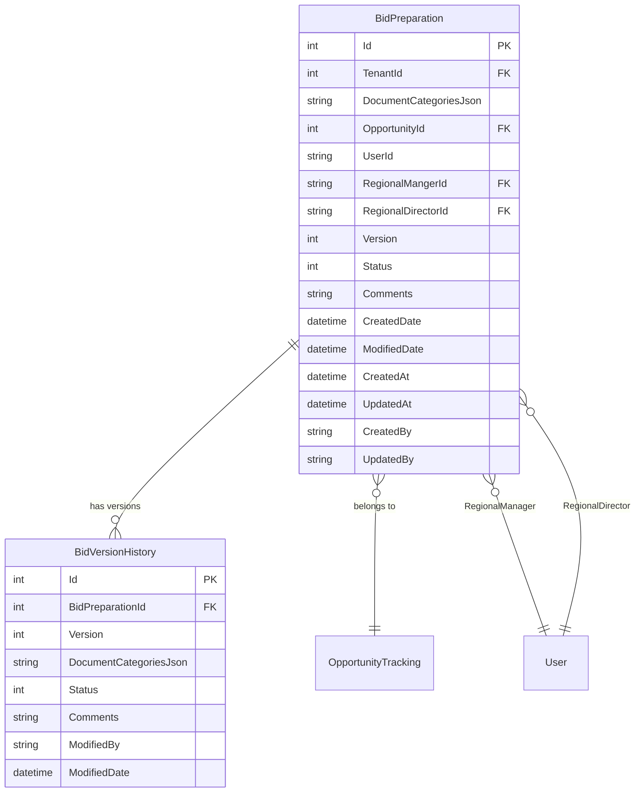
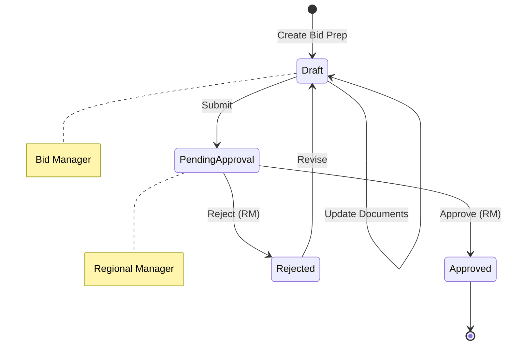

# Bid Preparation

## Overview

The Bid Preparation feature manages bid documentation and preparation workflows for business opportunities. It provides version control for bid documents, approval workflows, and integration with the opportunity tracking system.

## Purpose and Business Value

- Manage bid documentation with version control
- Track document categories and completion status
- Enable approval workflow for bid submissions
- Maintain audit trail of document changes
- Support regional manager and director approval process

## Database Schema

### Entity Relationship Diagram



### Table Definitions

#### BidPreparation
| Column | Type | Constraints | Description |
|--------|------|-------------|-------------|
| Id | INT | PK, IDENTITY | Primary key |
| TenantId | INT | FK | Multi-tenant identifier |
| DocumentCategoriesJson | NVARCHAR(MAX) | NOT NULL | JSON document categories |
| OpportunityId | INT | FK | Related opportunity |
| UserId | NVARCHAR(450) | NOT NULL | Creator user ID |
| RegionalMangerId | NVARCHAR(450) | FK | Regional manager for approval |
| RegionalDirectorId | NVARCHAR(450) | FK | Regional director for approval |
| Version | INT | NOT NULL | Current version number |
| Status | INT | NOT NULL | Workflow status |
| Comments | NVARCHAR(MAX) | NULL | Comments/notes |
| CreatedDate | DATETIME | NOT NULL | Creation date |
| ModifiedDate | DATETIME | NOT NULL | Last modification date |
| CreatedAt | DATETIME | NOT NULL | Audit creation timestamp |
| UpdatedAt | DATETIME | NOT NULL | Audit update timestamp |
| CreatedBy | NVARCHAR(450) | NULL | Created by user ID |
| UpdatedBy | NVARCHAR(450) | NULL | Updated by user ID |

#### BidVersionHistory
| Column | Type | Constraints | Description |
|--------|------|-------------|-------------|
| Id | INT | PK, IDENTITY | Primary key |
| BidPreparationId | INT | FK | Parent bid preparation |
| Version | INT | NOT NULL | Version number |
| DocumentCategoriesJson | NVARCHAR(MAX) | NOT NULL | JSON snapshot |
| Status | INT | NOT NULL | Status at version |
| Comments | NVARCHAR(MAX) | NULL | Version comments |
| ModifiedBy | NVARCHAR(450) | NOT NULL | Modified by user |
| ModifiedDate | DATETIME | NOT NULL | Modification timestamp |

## API Endpoints

### Get Bid Preparation by Opportunity
```http
GET /api/BidPreparation/opportunity/{opportunityId}

Response: 200 OK
{
    "id": 1,
    "opportunityId": 5,
    "documentCategoriesJson": "{...}",
    "version": 2,
    "status": 0,
    "comments": "Initial draft",
    "regionalMangerId": "user-rm-1",
    "regionalDirectorId": "user-rd-1",
    "createdDate": "2024-11-01T10:00:00Z",
    "modifiedDate": "2024-11-05T14:30:00Z",
    "versionHistory": [
        {
            "id": 1,
            "version": 1,
            "status": 0,
            "modifiedBy": "user-1",
            "modifiedDate": "2024-11-01T10:00:00Z"
        },
        {
            "id": 2,
            "version": 2,
            "status": 0,
            "modifiedBy": "user-1",
            "modifiedDate": "2024-11-05T14:30:00Z"
        }
    ]
}
```

### Create/Update Bid Preparation
```http
POST /api/BidPreparation
Content-Type: application/json

Request:
{
    "opportunityId": 5,
    "documentCategoriesJson": "{\"technical\": true, \"financial\": false, \"legal\": true}",
    "userId": "user-1",
    "comments": "Updated technical documents",
    "createdBy": "user-1"
}

Response: 200 OK
true
```

### Submit Bid Preparation for Approval
```http
POST /api/BidPreparation/submit
Content-Type: application/json

Request:
{
    "opportunityId": 5,
    "userId": "user-1",
    "regionalMangerId": "user-rm-1",
    "createdBy": "user-1"
}

Response: 200 OK
true
```

### Approve/Reject Bid Preparation
```http
POST /api/BidPreparation/approve
Content-Type: application/json

Request:
{
    "opportunityId": 5,
    "userId": "user-rm-1",
    "isApproved": true,
    "comments": "Approved - all documents complete",
    "createdBy": "user-rm-1"
}

Response: 200 OK
true
```

## CQRS Operations

### Commands
| Command | Description | Handler |
|---------|-------------|---------|
| UpdateBidPreparationCommand | Create/update bid preparation | UpdateBidPreparationCommandHandler |
| SubmitBidPreparationCommand | Submit for approval | SubmitBidPreparationCommandHandler |
| ApproveBidPreparationCommand | Approve or reject | ApproveBidPreparationCommandHandler |

### Queries
| Query | Description | Handler |
|-------|-------------|---------|
| GetBidPreparationByOpportunityQuery | Get by opportunity ID | GetBidPreparationByOpportunityQueryHandler |

## Frontend Components

### Forms
- `BidPreparationForm.tsx` - Main bid preparation form with document checklist

### Document Categories Structure
```typescript
interface DocumentCategories {
    technical: {
        specifications: boolean;
        drawings: boolean;
        methodology: boolean;
    };
    financial: {
        costEstimate: boolean;
        pricing: boolean;
        bankGuarantee: boolean;
    };
    legal: {
        companyRegistration: boolean;
        taxClearance: boolean;
        insurance: boolean;
    };
    experience: {
        projectReferences: boolean;
        teamCVs: boolean;
        certificates: boolean;
    };
}
```

## Workflow States

### Bid Preparation Status
| Status | Code | Description |
|--------|------|-------------|
| Draft | 0 | Initial draft state |
| PendingApproval | 1 | Submitted for approval |
| Approved | 2 | Approved by manager |
| Rejected | 3 | Rejected, needs revision |

## Workflow Diagram



## Business Logic

### Validation Rules
- Opportunity ID is required
- User ID is required
- Document categories JSON must be valid JSON
- Regional Manager ID required for submission

### Version Control
- Each update creates a new version
- Version history preserves document state at each point
- Comments track changes between versions

### Approval Rules
- Only Regional Manager can approve/reject
- Rejection returns to Draft status
- Approval enables next steps in opportunity workflow

## Integration Points

- **Opportunity Tracking**: Links to parent opportunity
- **User Management**: Regional Manager and Director assignments
- **Audit System**: All changes tracked in audit logs
- **Document Storage**: Document files stored separately

## Testing Coverage

### Unit Tests
- Repository operations for CRUD
- Command handler tests for workflow transitions
- Validation tests for required fields
