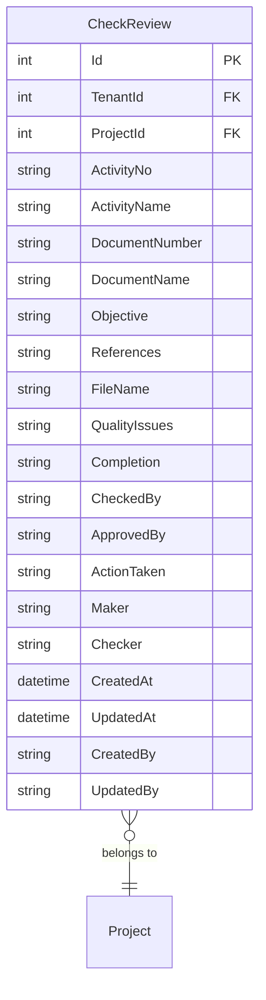
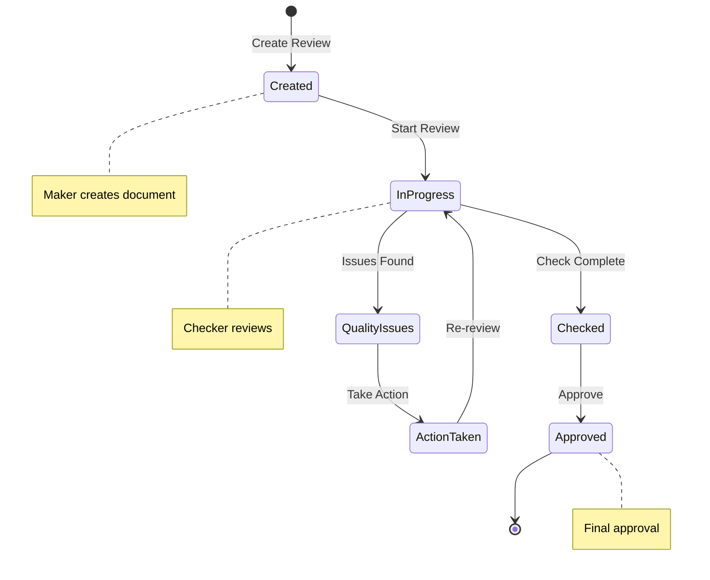

# Check Review

## Overview

The Check Review feature provides a quality assurance review process for project activities and deliverables. It enables teams to track document reviews, quality issues, and approval workflows to ensure project deliverables meet quality standards.

## Purpose and Business Value

- Track quality reviews for project activities and documents
- Document quality issues and corrective actions
- Enable maker-checker workflow for quality assurance
- Maintain audit trail of review activities
- Support document-based quality control processes
- Track completion status of review activities

## Database Schema

### Entity Relationship Diagram



### Table Definition

#### CheckReview
| Column | Type | Constraints | Description |
|--------|------|-------------|-------------|
| Id | INT | PK, IDENTITY | Primary key |
| TenantId | INT | FK | Multi-tenant identifier |
| ProjectId | INT | FK, NOT NULL | Related project |
| ActivityNo | NVARCHAR(50) | NOT NULL | Activity reference number |
| ActivityName | NVARCHAR(255) | NOT NULL | Activity name/title |
| DocumentNumber | NVARCHAR(255) | NULL | Document reference number |
| DocumentName | NVARCHAR(255) | NULL | Document name |
| Objective | NVARCHAR(500) | NOT NULL | Review objective |
| References | NVARCHAR(500) | NULL | Reference documents |
| FileName | NVARCHAR(255) | NULL | Attached file name |
| QualityIssues | NVARCHAR(500) | NULL | Identified quality issues |
| Completion | NVARCHAR(1) | NOT NULL | Completion status (Y/N) |
| CheckedBy | NVARCHAR(255) | NULL | Checked by user |
| ApprovedBy | NVARCHAR(255) | NULL | Approved by user |
| ActionTaken | NVARCHAR(500) | NULL | Corrective actions taken |
| Maker | NVARCHAR(255) | NULL | Document maker |
| Checker | NVARCHAR(255) | NULL | Document checker |
| CreatedAt | DATETIME | NULL | Creation timestamp |
| UpdatedAt | DATETIME | NULL | Last update timestamp |
| CreatedBy | NVARCHAR(450) | NULL | Created by user ID |
| UpdatedBy | NVARCHAR(450) | NULL | Updated by user ID |

## API Endpoints

### Get All Check Reviews
```http
GET /api/checkreview

Response: 200 OK
[
    {
        "id": 1,
        "projectId": 5,
        "activityNo": "ACT-001",
        "activityName": "Foundation Design Review",
        "documentNumber": "DOC-2024-001",
        "documentName": "Foundation Design Calculations",
        "objective": "Verify structural calculations",
        "references": "IS 456:2000, IS 1893:2016",
        "fileName": "foundation_calc.pdf",
        "qualityIssues": null,
        "completion": "Y",
        "checkedBy": "john.doe@company.com",
        "approvedBy": "jane.smith@company.com",
        "actionTaken": null,
        "maker": "engineer@company.com",
        "checker": "senior.engineer@company.com",
        "createdAt": "2024-11-01T10:00:00Z",
        "updatedAt": "2024-11-05T14:30:00Z",
        "createdBy": "john.doe@company.com",
        "updatedBy": "jane.smith@company.com"
    }
]
```

### Get Check Review by ID
```http
GET /api/checkreview/{id}

Response: 200 OK
{
    "id": 1,
    "projectId": 5,
    "activityNo": "ACT-001",
    "activityName": "Foundation Design Review",
    "documentNumber": "DOC-2024-001",
    "documentName": "Foundation Design Calculations",
    "objective": "Verify structural calculations and load bearing capacity",
    "references": "IS 456:2000, IS 1893:2016",
    "fileName": "foundation_calc.pdf",
    "qualityIssues": null,
    "completion": "Y",
    "checkedBy": "john.doe@company.com",
    "approvedBy": "jane.smith@company.com",
    "actionTaken": null,
    "maker": "engineer@company.com",
    "checker": "senior.engineer@company.com",
    "createdAt": "2024-11-01T10:00:00Z",
    "updatedAt": "2024-11-05T14:30:00Z",
    "createdBy": "john.doe@company.com",
    "updatedBy": "jane.smith@company.com"
}
```

### Get Check Reviews by Project
```http
GET /api/checkreview/project/{projectId}

Response: 200 OK
[
    {
        "id": 1,
        "projectId": 5,
        "activityNo": "ACT-001",
        "activityName": "Foundation Design Review",
        ...
    },
    {
        "id": 2,
        "projectId": 5,
        "activityNo": "ACT-002",
        "activityName": "Structural Steel Review",
        ...
    }
]
```

### Create Check Review
```http
POST /api/checkreview
Content-Type: application/json

Request:
{
    "projectId": 5,
    "activityNo": "ACT-003",
    "activityName": "Electrical Design Review",
    "documentNumber": "DOC-2024-003",
    "documentName": "Electrical Layout Drawings",
    "objective": "Verify electrical load calculations and safety compliance",
    "references": "IS 732:2019, NEC 2020",
    "fileName": "electrical_layout.pdf",
    "qualityIssues": null,
    "completion": "N",
    "maker": "electrical.engineer@company.com",
    "checker": "senior.electrical@company.com"
}

Response: 201 Created
{
    "id": 3,
    "projectId": 5,
    "activityNo": "ACT-003",
    "activityName": "Electrical Design Review",
    ...
    "createdAt": "2024-11-10T10:00:00Z",
    "createdBy": "john.doe@company.com"
}
```

### Update Check Review
```http
PUT /api/checkreview/{id}
Content-Type: application/json

Request:
{
    "id": 3,
    "projectId": 5,
    "activityNo": "ACT-003",
    "activityName": "Electrical Design Review",
    "documentNumber": "DOC-2024-003",
    "documentName": "Electrical Layout Drawings",
    "objective": "Verify electrical load calculations and safety compliance",
    "references": "IS 732:2019, NEC 2020",
    "fileName": "electrical_layout_v2.pdf",
    "qualityIssues": "Minor labeling issues identified",
    "completion": "Y",
    "checkedBy": "john.doe@company.com",
    "approvedBy": "jane.smith@company.com",
    "actionTaken": "Labels corrected and verified",
    "maker": "electrical.engineer@company.com",
    "checker": "senior.electrical@company.com"
}

Response: 200 OK
{
    "id": 3,
    ...updated fields...
    "updatedAt": "2024-11-12T14:30:00Z",
    "updatedBy": "jane.smith@company.com"
}
```

### Delete Check Review
```http
DELETE /api/checkreview/{id}

Response: 204 No Content
```

## CQRS Operations

### Commands
| Command | Description | Handler |
|---------|-------------|---------|
| CreateCheckReviewCommand | Create new check review | CreateCheckReviewCommandHandler |
| UpdateCheckReviewCommand | Update existing review | UpdateCheckReviewCommandHandler |
| DeleteCheckReviewCommand | Delete review | DeleteCheckReviewCommandHandler |

### Queries
| Query | Description | Handler |
|-------|-------------|---------|
| GetCheckReviewByIdQuery | Get review by ID | GetCheckReviewByIdQueryHandler |
| GetCheckReviewsByProjectQuery | Get reviews by project | GetCheckReviewsByProjectQueryHandler |

### Notifications
| Notification | Description | Handler |
|--------------|-------------|---------|
| CheckReviewStatusEmailNotification | Email notification on status change | CheckReviewStatusEmailNotificationHandler |

## Frontend Components

### Pages
- `BusinessDevelopmentDetails.tsx` - Contains Check Review tab
- `BForms.tsx` - BD forms container

### Form Components
- `CheckReviewForm.tsx` - Main check review form component

## Completion Status

### Status Values
| Status | Code | Description |
|--------|------|-------------|
| Not Complete | N | Review not yet completed |
| Complete | Y | Review completed |

## Workflow Diagram



## Business Logic

### Validation Rules
- Project ID is required
- Activity Number is required
- Activity Name is required
- Objective is required
- Completion must be 'Y' or 'N'

### Maker-Checker Workflow
1. **Maker** creates the document/deliverable
2. **Checker** reviews the document for quality
3. **CheckedBy** records who performed the check
4. **ApprovedBy** records final approval
5. **ActionTaken** documents any corrective actions

### Quality Issue Tracking
- Quality issues are documented in the QualityIssues field
- Corrective actions are recorded in ActionTaken field
- Completion status tracks overall review status

## Integration Points

- **Project Management**: Links to parent project
- **Document Management**: File attachments for reviewed documents
- **Email Service**: Notifications on status changes
- **Audit System**: All changes tracked with timestamps and users

## Email Notifications

The system sends email notifications when:
- Check review status changes
- Quality issues are identified
- Review is approved

## Testing Coverage

### Unit Tests
- Repository operations for CRUD
- Command handler tests
- Query handler tests
- Validation tests

### Test Scenarios
- Create check review with all fields
- Update review with quality issues
- Complete review workflow
- Delete review
- Get reviews by project
