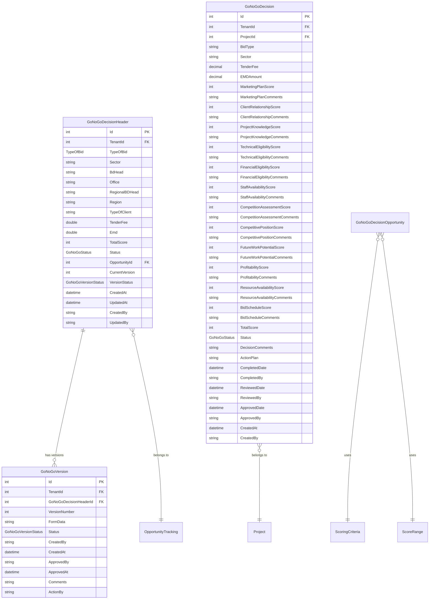
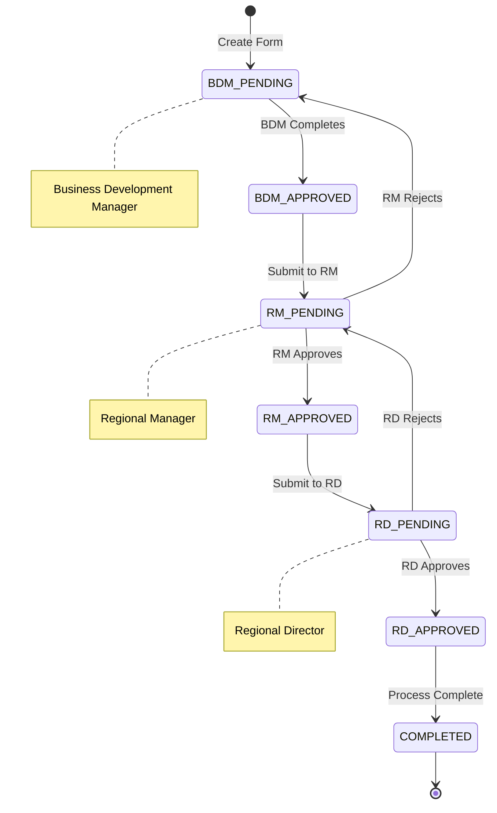

# Go/No-Go Decision

## Overview

The Go/No-Go Decision feature provides a structured scoring-based assessment framework for evaluating business opportunities. It enables teams to make informed decisions about whether to pursue an opportunity based on 12 scoring criteria, with multi-level approval workflow from Business Development Manager through Regional Director.

## Purpose and Business Value

- Provide structured evaluation framework for opportunity assessment
- Enable data-driven go/no-go decisions using scoring criteria
- Support multi-level approval workflow (BDM → RM → RD)
- Maintain version history of decision assessments
- Track scoring rationale with comments for each criterion
- Generate action plans for amber (conditional go) decisions

## Database Schema

### Entity Relationship Diagram



### Table Definitions

#### GoNoGoDecisionHeader
| Column | Type | Constraints | Description |
|--------|------|-------------|-------------|
| Id | INT | PK, IDENTITY | Primary key |
| TenantId | INT | FK | Multi-tenant identifier |
| TypeOfBid | INT | NOT NULL | Bid type enum (Lumpsum/Item Rate) |
| Sector | NVARCHAR(100) | NOT NULL | Business sector |
| BdHead | NVARCHAR(450) | NOT NULL | BD Head user ID |
| Office | NVARCHAR(100) | NOT NULL | Office location |
| RegionalBDHead | NVARCHAR(450) | NULL | Regional BD Head user ID |
| Region | NVARCHAR(100) | NULL | Region name |
| TypeOfClient | NVARCHAR(100) | NULL | Client type |
| TenderFee | FLOAT | NOT NULL | Tender fee amount |
| Emd | FLOAT | NOT NULL | EMD amount |
| TotalScore | INT | NOT NULL | Calculated total score |
| Status | INT | NOT NULL | Go/No-Go status (Green/Amber/Red) |
| OpportunityId | INT | FK | Related opportunity |
| CurrentVersion | INT | NULL | Current version number |
| VersionStatus | INT | NULL | Current version workflow status |
| CreatedAt | DATETIME | NOT NULL | Creation timestamp |
| UpdatedAt | DATETIME | NOT NULL | Last update timestamp |
| CreatedBy | NVARCHAR(450) | NOT NULL | Created by user ID |
| UpdatedBy | NVARCHAR(450) | NOT NULL | Updated by user ID |

#### GoNoGoVersion
| Column | Type | Constraints | Description |
|--------|------|-------------|-------------|
| Id | INT | PK, IDENTITY | Primary key |
| TenantId | INT | FK | Multi-tenant identifier |
| GoNoGoDecisionHeaderId | INT | FK | Parent header ID |
| VersionNumber | INT | NOT NULL | Version sequence number |
| FormData | NVARCHAR(MAX) | NULL | JSON form data snapshot |
| Status | INT | NOT NULL | Version workflow status |
| CreatedBy | NVARCHAR(450) | NOT NULL | Created by user ID |
| CreatedAt | DATETIME | NOT NULL | Creation timestamp |
| ApprovedBy | NVARCHAR(450) | NULL | Approved by user ID |
| ApprovedAt | DATETIME | NULL | Approval timestamp |
| Comments | NVARCHAR(MAX) | NULL | Version comments |
| ActionBy | NVARCHAR(450) | NULL | Action performed by |

#### GoNoGoDecision (Legacy/Project-based)
| Column | Type | Constraints | Description |
|--------|------|-------------|-------------|
| Id | INT | PK, IDENTITY | Primary key |
| TenantId | INT | FK | Multi-tenant identifier |
| ProjectId | INT | FK | Related project |
| BidType | NVARCHAR(50) | NOT NULL | Lumpsum/Item Rate |
| Sector | NVARCHAR(50) | NOT NULL | Business sector |
| TenderFee | DECIMAL(18,2) | NOT NULL | Tender fee |
| EMDAmount | DECIMAL(18,2) | NOT NULL | EMD amount |
| [12 Scoring Criteria] | INT/NVARCHAR | NOT NULL | Score (0-10) and comments |
| TotalScore | INT | NOT NULL | Sum of all scores |
| Status | INT | NOT NULL | Go/No-Go status |
| DecisionComments | NVARCHAR(2000) | NULL | Decision rationale |
| ActionPlan | NVARCHAR(2000) | NULL | Action plan for Amber |
| CompletedDate | DATETIME | NOT NULL | Completion date |
| CompletedBy | NVARCHAR(100) | NOT NULL | Completed by user |
| ReviewedDate | DATETIME | NULL | Review date |
| ReviewedBy | NVARCHAR(100) | NULL | Reviewed by user |
| ApprovedDate | DATETIME | NULL | Approval date |
| ApprovedBy | NVARCHAR(100) | NULL | Approved by user |

## Scoring Criteria

The Go/No-Go assessment uses 12 scoring criteria, each rated 0-10:

| Criterion | Description | Weight |
|-----------|-------------|--------|
| Marketing Plan | Quality of marketing strategy | Equal |
| Client Relationship | Existing relationship with client | Equal |
| Project Knowledge | Understanding of project requirements | Equal |
| Technical Eligibility | Technical capability to deliver | Equal |
| Financial Eligibility | Financial capacity and stability | Equal |
| Staff Availability | Availability of required personnel | Equal |
| Competition Assessment | Analysis of competitive landscape | Equal |
| Competitive Position | Our position vs competitors | Equal |
| Future Work Potential | Potential for follow-on work | Equal |
| Profitability | Expected profit margin | Equal |
| Resource Availability | Equipment and resource availability | Equal |
| Bid Schedule | Ability to meet bid timeline | Equal |

### Score Interpretation
- **Total Score 0-40**: Red (NO GO)
- **Total Score 41-80**: Amber (GO with Action Plan)
- **Total Score 81-120**: Green (GO)

## API Endpoints

### Get All Go/No-Go Decisions
```http
GET /api/GoNoGoDecision

Response: 200 OK
[
    {
        "id": 1,
        "projectId": 5,
        "bidType": "Lumpsum",
        "sector": "Infrastructure",
        "totalScore": 85,
        "status": "Green",
        "completedDate": "2024-11-01T10:00:00Z",
        "completedBy": "john.doe@company.com"
    }
]
```

### Get Go/No-Go by ID
```http
GET /api/GoNoGoDecision/{id}

Response: 200 OK
{
    "id": 1,
    "projectId": 5,
    "bidType": "Lumpsum",
    "sector": "Infrastructure",
    "tenderFee": 25000.00,
    "emdAmount": 100000.00,
    "marketingPlanScore": 8,
    "marketingPlanComments": "Strong marketing strategy",
    "clientRelationshipScore": 7,
    "clientRelationshipComments": "Good existing relationship",
    ...
    "totalScore": 85,
    "status": "Green",
    "decisionComments": "Proceed with bid preparation",
    "completedDate": "2024-11-01T10:00:00Z",
    "completedBy": "john.doe@company.com"
}
```

### Get Go/No-Go by Project ID
```http
GET /api/GoNoGoDecision/project/{projectId}

Response: 200 OK
{...Go/No-Go decision for project...}
```

### Get Go/No-Go by Opportunity ID
```http
GET /api/GoNoGoDecision/opportunity/{opportunityId}

Response: 200 OK
{
    "id": 1,
    "typeOfBid": 0,
    "sector": "Infrastructure",
    "bdHead": "user-bdm-1",
    "office": "Head Office",
    "tenderFee": 25000,
    "emd": 100000,
    "totalScore": 85,
    "status": "Green",
    "opportunityId": 5,
    "currentVersion": 2,
    "versionStatus": "RD_APPROVED",
    "versions": [...]
}
```

### Create Go/No-Go Form
```http
POST /api/GoNoGoDecision/createForm
Content-Type: application/json

Request:
{
    "headerInfo": {
        "typeOfBid": 0,
        "sector": "Infrastructure",
        "bdHead": "user-bdm-1",
        "office": "Head Office",
        "tenderFee": 25000,
        "emd": 100000
    },
    "metaData": {
        "opprotunityId": 5,
        "completedDate": "2024-11-01",
        "completedBy": "john.doe@company.com"
    },
    "scoringCriteria": {
        "marketingPlan": { "score": 8, "comments": "Strong strategy", "scoringDescriptionId": 1 },
        "profitability": { "score": 7, "comments": "Good margins", "scoringDescriptionId": 2 },
        "projectKnowledge": { "score": 9, "comments": "Excellent understanding", "scoringDescriptionId": 3 },
        ...
    },
    "summary": {
        "totalScore": 85,
        "status": "Green",
        "decisionComments": "Proceed with bid",
        "actionPlan": null
    }
}

Response: 200 OK
{
    "headerId": 1,
    "versionId": 1,
    "versionNumber": 1,
    "message": "Go/No-Go decision created successfully with initial version"
}
```

### Update Go/No-Go Decision
```http
PUT /api/GoNoGoDecision/{id}
Content-Type: application/json

Request:
{
    "id": 1,
    ...updated fields...
}

Response: 204 No Content
```

### Delete Go/No-Go Decision
```http
DELETE /api/GoNoGoDecision/{id}

Response: 204 No Content
```

### Get Versions
```http
GET /api/GoNoGoDecision/{headerId}/versions

Response: 200 OK
[
    {
        "id": 1,
        "goNoGoDecisionHeaderId": 1,
        "versionNumber": 1,
        "formData": "{...JSON form data...}",
        "status": "BDM_APPROVED",
        "createdBy": "john.doe@company.com",
        "createdAt": "2024-11-01T10:00:00Z",
        "approvedBy": "jane.smith@company.com",
        "approvedAt": "2024-11-02T14:30:00Z",
        "comments": "Initial assessment"
    },
    {
        "id": 2,
        "goNoGoDecisionHeaderId": 1,
        "versionNumber": 2,
        "formData": "{...JSON form data...}",
        "status": "RM_APPROVED",
        "createdBy": "jane.smith@company.com",
        "createdAt": "2024-11-02T14:30:00Z"
    }
]
```

### Get Specific Version
```http
GET /api/GoNoGoDecision/{headerId}/versions/{versionNumber}

Response: 200 OK
{
    "id": 2,
    "goNoGoDecisionHeaderId": 1,
    "versionNumber": 2,
    "formData": "{...JSON form data...}",
    "status": "RM_APPROVED",
    ...
}
```

### Create New Version
```http
POST /api/GoNoGoDecision/{headerId}/versions
Content-Type: application/json

Request:
{
    "formData": "{...JSON form data...}",
    "comments": "Updated scoring after review",
    "createdBy": "jane.smith@company.com"
}

Response: 200 OK
{
    "id": 3,
    "goNoGoDecisionHeaderId": 1,
    "versionNumber": 3,
    "status": "RM_PENDING",
    ...
}
```

### Update Version
```http
POST /api/GoNoGoDecision/{headerId}/versions/update
Content-Type: application/json

Request:
{
    "formData": "{...JSON form data...}",
    "comments": "Revised assessment",
    "createdBy": "user@company.com",
    "versionNumber": 2
}

Response: 200 OK
{...updated version...}
```

### Approve Version
```http
POST /api/GoNoGoDecision/{headerId}/versions/{versionNumber}/approve
Content-Type: application/json

Request:
{
    "approvedBy": "regional.director@company.com",
    "comments": "Approved - proceed with bid"
}

Response: 200 OK
{
    "id": 2,
    "versionNumber": 2,
    "status": "RD_APPROVED",
    "approvedBy": "regional.director@company.com",
    "approvedAt": "2024-11-05T16:00:00Z",
    ...
}
```

## CQRS Operations

### Commands
| Command | Description | Handler |
|---------|-------------|---------|
| CreateGoNoGoDecisionHeaderCommand | Create new Go/No-Go header | CreateGoNoGoDecisionHeaderCommandHandler |
| UpdateGoNoGoDecisionCommand | Update existing decision | UpdateGoNoGoDecisionCommandHandler |
| DeleteGoNoGoDecisionCommand | Delete decision | DeleteGoNoGoDecisionCommandHandler |
| ApproveGoNoGoVersionCommand | Approve version | ApproveGoNoGoVersionCommandHandler |

### Queries
| Query | Description | Handler |
|-------|-------------|---------|
| GetAllGoNoGoDecisionsQuery | Get all decisions | GetAllGoNoGoDecisionsQueryHandler |
| GetGoNoGoDecisionByIdQuery | Get by ID | GetGoNoGoDecisionByIdQueryHandler |
| GetGoNoGoDecisionByProjectQuery | Get by project | GetGoNoGoDecisionByProjectQueryHandler |
| GetGoNoGoDecisionByOpportunityQuery | Get by opportunity | GetGoNoGoDecisionByOpportunityQueryHandler |
| GetGoNoGoVersionsQuery | Get versions | GetGoNoGoVersionsQueryHandler |

## Frontend Components

### Pages
- `BusinessDevelopmentDetails.tsx` - Contains Go/No-Go tab
- `BForms.tsx` - BD forms container including Go/No-Go

### Form Components
- `GoNoGoForm.tsx` - Main Go/No-Go decision form with scoring
- `BFormRenderer.tsx` - Dynamic form renderer

### API Services
- `goNoGoApi.tsx` - Go/No-Go API service
- `goNoGoOpportunityApi.tsx` - Opportunity-based Go/No-Go API
- `scoringDescriptionApi.tsx` - Scoring criteria descriptions

## Workflow States

### Go/No-Go Decision Status
| Status | Code | Description | Color |
|--------|------|-------------|-------|
| Green | 0 | GO - Proceed with proposal | Green |
| Amber | 1 | GO with action plan required | Amber/Yellow |
| Red | 2 | NO GO - Do not proceed | Red |

### Version Workflow Status
| Status | Code | Description |
|--------|------|-------------|
| BDM_PENDING | 0 | Pending BDM completion |
| BDM_APPROVED | 1 | BDM approved, awaiting RM |
| RM_PENDING | 2 | Pending Regional Manager review |
| RM_APPROVED | 3 | RM approved, awaiting RD |
| RD_PENDING | 4 | Pending Regional Director approval |
| RD_APPROVED | 5 | Final approval granted |
| COMPLETED | 6 | Process completed |

## Workflow Diagram



## Business Logic

### Validation Rules
- All 12 scoring criteria must have scores (0-10)
- All scoring criteria must have comments
- Sector is required
- Bid Type is required
- Tender Fee must be >= 0
- EMD Amount must be >= 0
- Opportunity ID is required for header

### Score Calculation
```
Total Score = Sum of all 12 criteria scores
Maximum Score = 120 (12 criteria × 10 max score)

Status Determination:
- Total Score >= 81: Green (GO)
- Total Score 41-80: Amber (GO with Action Plan)
- Total Score <= 40: Red (NO GO)
```

### Approval Rules
- BDM must complete initial assessment
- Regional Manager reviews and can approve or reject
- Regional Director gives final approval
- Rejection returns to previous level for revision
- Each approval creates a new version snapshot

### Action Plan Requirements
- Required when status is Amber
- Must document mitigation strategies
- Reviewed at each approval level

## Integration Points

- **Opportunity Tracking**: Links to parent opportunity
- **Project Management**: Approved decisions enable project creation
- **Bid Preparation**: Go decision enables bid preparation
- **User Management**: Role-based approval workflow
- **Audit System**: All changes tracked in audit logs
- **Scoring Descriptions**: Configurable scoring criteria descriptions

## Testing Coverage

### Unit Tests
- `GoNoGoDecisionRepositoryTests.cs` - Repository operations
- `GoNoGoDecisionServiceTests.cs` - Service layer tests
- `GoNoGoDecisionControllerTests.cs` - Controller tests
- `GoNoGoDecisionValidationTests.cs` - Validation tests

### Test Scenarios
- Create Go/No-Go decision with all criteria
- Version creation and approval workflow
- Score calculation and status determination
- Multi-level approval process
- Rejection and revision workflow
