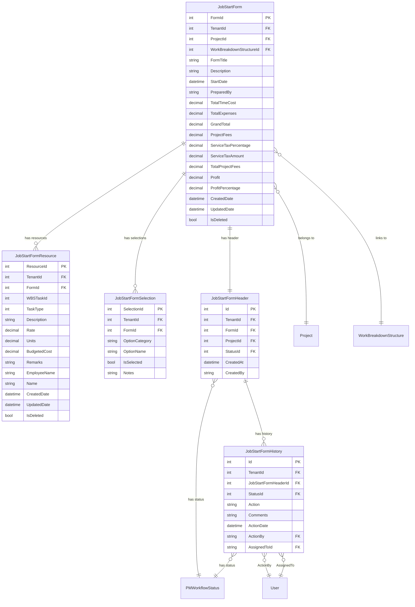
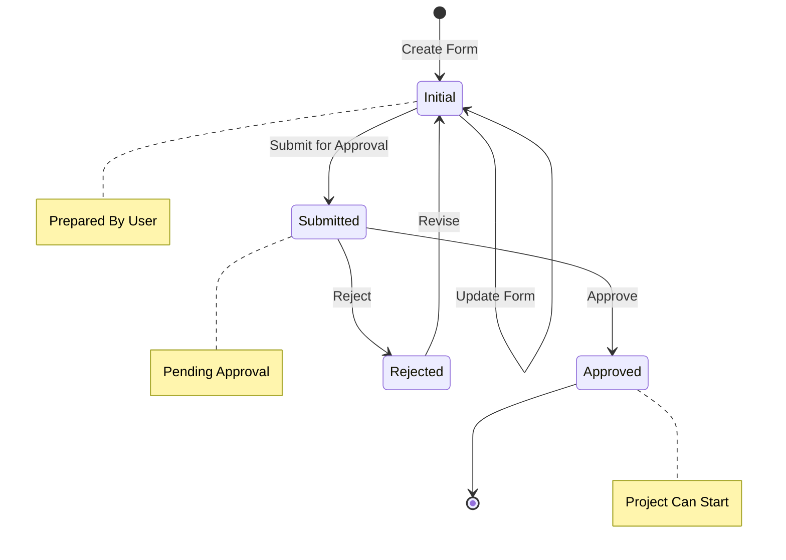

# Job Start Form

## Overview

The Job Start Form feature manages project initiation documentation with resource allocation, financial planning, and workflow approval. It enables teams to formally start projects by defining resource requirements, budgets, and obtaining necessary approvals through a structured workflow.

## Purpose and Business Value

- Formalize project initiation with structured documentation
- Define resource allocation from Work Breakdown Structure (WBS)
- Calculate project costs including time, expenses, and service tax
- Track profit margins and project fees
- Enable multi-level approval workflow for project start
- Maintain audit trail of form changes and approvals

## Database Schema

### Entity Relationship Diagram



### Table Definitions

#### JobStartForm
| Column | Type | Constraints | Description |
|--------|------|-------------|-------------|
| FormId | INT | PK, IDENTITY | Primary key |
| TenantId | INT | FK | Multi-tenant identifier |
| ProjectId | INT | FK, NOT NULL | Related project |
| WorkBreakdownStructureId | INT | FK, NULL | Linked WBS |
| FormTitle | NVARCHAR(255) | NULL | Form title |
| Description | NVARCHAR(MAX) | NULL | Form description |
| StartDate | DATETIME | NOT NULL | Project start date |
| PreparedBy | NVARCHAR(450) | NULL | Prepared by user |
| TotalTimeCost | DECIMAL(18,2) | NOT NULL | Total manpower cost |
| TotalExpenses | DECIMAL(18,2) | NOT NULL | Total ODC expenses |
| GrandTotal | DECIMAL(18,2) | NOT NULL | Total cost |
| ProjectFees | DECIMAL(18,2) | NOT NULL | Project fees |
| ServiceTaxPercentage | DECIMAL(18,2) | NOT NULL | Service tax % |
| ServiceTaxAmount | DECIMAL(18,2) | NOT NULL | Service tax amount |
| TotalProjectFees | DECIMAL(18,2) | NOT NULL | Total fees with tax |
| Profit | DECIMAL(18,2) | NOT NULL | Calculated profit |
| ProfitPercentage | DECIMAL(18,2) | NOT NULL | Profit percentage |
| CreatedDate | DATETIME | NOT NULL | Creation timestamp |
| UpdatedDate | DATETIME | NULL | Last update timestamp |
| IsDeleted | BIT | NOT NULL | Soft delete flag |

#### JobStartFormHeader
| Column | Type | Constraints | Description |
|--------|------|-------------|-------------|
| Id | INT | PK, IDENTITY | Primary key |
| TenantId | INT | FK | Multi-tenant identifier |
| FormId | INT | FK, NOT NULL | Related form |
| ProjectId | INT | FK, NOT NULL | Related project |
| StatusId | INT | FK, NOT NULL | Workflow status |
| CreatedAt | DATETIME | NOT NULL | Creation timestamp |
| CreatedBy | NVARCHAR(450) | NOT NULL | Created by user |

#### JobStartFormResource
| Column | Type | Constraints | Description |
|--------|------|-------------|-------------|
| ResourceId | INT | PK, IDENTITY | Primary key |
| TenantId | INT | FK | Multi-tenant identifier |
| FormId | INT | FK, NOT NULL | Parent form |
| WBSTaskId | INT | NULL | Source WBS task |
| TaskType | INT | NOT NULL | 0=Manpower, 1=ODC |
| Description | NVARCHAR(500) | NULL | Resource description |
| Rate | DECIMAL(18,2) | NOT NULL | Rate per unit |
| Units | DECIMAL(18,2) | NOT NULL | Number of units |
| BudgetedCost | DECIMAL(18,2) | NOT NULL | Total budgeted cost |
| Remarks | NVARCHAR(MAX) | NULL | Additional remarks |
| EmployeeName | NVARCHAR(255) | NULL | Employee name (Manpower) |
| Name | NVARCHAR(255) | NULL | Resource name (ODC) |
| CreatedDate | DATETIME | NOT NULL | Creation timestamp |
| UpdatedDate | DATETIME | NULL | Last update timestamp |
| IsDeleted | BIT | NOT NULL | Soft delete flag |

#### JobStartFormSelection
| Column | Type | Constraints | Description |
|--------|------|-------------|-------------|
| SelectionId | INT | PK, IDENTITY | Primary key |
| TenantId | INT | FK | Multi-tenant identifier |
| FormId | INT | FK, NOT NULL | Parent form |
| OptionCategory | NVARCHAR(100) | NOT NULL | Option category |
| OptionName | NVARCHAR(255) | NOT NULL | Option name |
| IsSelected | BIT | NOT NULL | Selection status |
| Notes | NVARCHAR(MAX) | NULL | Selection notes |

#### JobStartFormHistory
| Column | Type | Constraints | Description |
|--------|------|-------------|-------------|
| Id | INT | PK, IDENTITY | Primary key |
| TenantId | INT | FK | Multi-tenant identifier |
| JobStartFormHeaderId | INT | FK, NOT NULL | Parent header |
| StatusId | INT | FK, NOT NULL | Status at action |
| Action | NVARCHAR(100) | NULL | Action performed |
| Comments | NVARCHAR(MAX) | NULL | Action comments |
| ActionDate | DATETIME | NOT NULL | Action timestamp |
| ActionBy | NVARCHAR(450) | FK | User who performed action |
| AssignedToId | NVARCHAR(450) | FK | User assigned to |

## API Endpoints

### Get All Job Start Forms by Project
```http
GET /api/projects/{projectId}/jobstartforms

Response: 200 OK
[
    {
        "formId": 1,
        "projectId": 5,
        "workBreakdownStructureId": 3,
        "formTitle": "Project Initiation Form",
        "description": "Initial resource allocation",
        "startDate": "2024-12-01T00:00:00Z",
        "preparedBy": "john.doe@company.com",
        "totalTimeCost": 500000.00,
        "totalExpenses": 150000.00,
        "grandTotal": 650000.00,
        "projectFees": 800000.00,
        "serviceTaxPercentage": 18.00,
        "serviceTaxAmount": 144000.00,
        "totalProjectFees": 944000.00,
        "profit": 294000.00,
        "profitPercentage": 31.14,
        "createdDate": "2024-11-15T10:00:00Z",
        "resources": [...],
        "selections": [...]
    }
]
```

### Get Job Start Form by ID
```http
GET /api/projects/{projectId}/jobstartforms/{id}

Response: 200 OK
{
    "formId": 1,
    "projectId": 5,
    "workBreakdownStructureId": 3,
    "formTitle": "Project Initiation Form",
    "description": "Initial resource allocation for highway project",
    "startDate": "2024-12-01T00:00:00Z",
    "preparedBy": "john.doe@company.com",
    "totalTimeCost": 500000.00,
    "totalExpenses": 150000.00,
    "grandTotal": 650000.00,
    "projectFees": 800000.00,
    "serviceTaxPercentage": 18.00,
    "serviceTaxAmount": 144000.00,
    "totalProjectFees": 944000.00,
    "profit": 294000.00,
    "profitPercentage": 31.14,
    "createdDate": "2024-11-15T10:00:00Z",
    "updatedDate": "2024-11-20T14:30:00Z",
    "resources": [
        {
            "resourceId": 1,
            "formId": 1,
            "wbsTaskId": 10,
            "taskType": 0,
            "description": "Project Manager",
            "rate": 5000.00,
            "units": 24,
            "budgetedCost": 120000.00,
            "employeeName": "John Smith"
        },
        {
            "resourceId": 2,
            "formId": 1,
            "wbsTaskId": null,
            "taskType": 1,
            "description": "Equipment Rental",
            "rate": 50000.00,
            "units": 3,
            "budgetedCost": 150000.00,
            "name": "Heavy Equipment"
        }
    ],
    "selections": [
        {
            "selectionId": 1,
            "formId": 1,
            "optionCategory": "Deliverables",
            "optionName": "Technical Report",
            "isSelected": true,
            "notes": "Monthly progress reports"
        }
    ]
}
```

### Create Job Start Form
```http
POST /api/projects/{projectId}/jobstartforms
Content-Type: application/json

Request:
{
    "projectId": 5,
    "workBreakdownStructureId": 3,
    "formTitle": "Project Initiation Form",
    "description": "Initial resource allocation",
    "startDate": "2024-12-01T00:00:00Z",
    "preparedBy": "john.doe@company.com",
    "totalTimeCost": 500000.00,
    "totalExpenses": 150000.00,
    "grandTotal": 650000.00,
    "projectFees": 800000.00,
    "serviceTaxPercentage": 18.00,
    "serviceTaxAmount": 144000.00,
    "totalProjectFees": 944000.00,
    "profit": 294000.00,
    "profitPercentage": 31.14,
    "resources": [
        {
            "taskType": 0,
            "description": "Project Manager",
            "rate": 5000.00,
            "units": 24,
            "budgetedCost": 120000.00,
            "employeeName": "John Smith"
        }
    ],
    "selections": [
        {
            "optionCategory": "Deliverables",
            "optionName": "Technical Report",
            "isSelected": true,
            "notes": "Monthly progress reports"
        }
    ]
}

Response: 201 Created
{
    "formId": 1,
    ...created form data...
}
```

### Update Job Start Form
```http
PUT /api/projects/{projectId}/jobstartforms/{id}
Content-Type: application/json

Request:
{
    "formId": 1,
    "projectId": 5,
    ...updated fields...
}

Response: 204 No Content
```

### Delete Job Start Form
```http
DELETE /api/projects/{projectId}/jobstartforms/{id}

Response: 204 No Content
```

### Get WBS Resource Data
```http
GET /api/projects/{projectId}/jobstartforms/wbsresources

Response: 200 OK
{
    "manpowerResources": [
        {
            "wbsTaskId": 10,
            "taskName": "Project Management",
            "rate": 5000.00,
            "units": 24,
            "budgetedCost": 120000.00
        }
    ],
    "odcResources": [
        {
            "wbsTaskId": 15,
            "taskName": "Equipment",
            "rate": 50000.00,
            "units": 3,
            "budgetedCost": 150000.00
        }
    ]
}
```

### Get Job Start Form Header
```http
GET /api/projects/{projectId}/jobstartforms/header/{formId}

Response: 200 OK
{
    "id": 1,
    "formId": 1,
    "projectId": 5,
    "statusId": 3,
    "status": "Approved",
    "createdAt": "2024-11-15T10:00:00Z",
    "createdBy": "john.doe@company.com",
    "jobStartFormHistories": [...]
}
```

### Get Job Start Form Header Status
```http
GET /api/projects/{projectId}/jobstartforms/header/{formId}/status

Response: 200 OK
{
    "id": 1,
    "statusId": 3,
    "status": "Approved"
}
```

### Get Job Start Form Header History
```http
GET /api/projects/{projectId}/jobstartforms/header/{formId}/history

Response: 200 OK
[
    {
        "id": 1,
        "jobStartFormHeaderId": 1,
        "statusId": 1,
        "action": "Created",
        "comments": "Initial form creation",
        "actionDate": "2024-11-15T10:00:00Z",
        "actionBy": "john.doe@company.com",
        "assignedToId": "jane.smith@company.com"
    },
    {
        "id": 2,
        "jobStartFormHeaderId": 1,
        "statusId": 2,
        "action": "Submitted",
        "comments": "Submitted for approval",
        "actionDate": "2024-11-16T14:30:00Z",
        "actionBy": "john.doe@company.com",
        "assignedToId": "manager@company.com"
    }
]
```

## CQRS Operations

### Commands
| Command | Description | Handler |
|---------|-------------|---------|
| CreateJobStartFormCommand | Create new job start form | CreateJobStartFormCommandHandler |
| UpdateJobStartFormCommand | Update existing form | UpdateJobStartFormCommandHandler |
| DeleteJobStartFormCommand | Delete form (soft delete) | DeleteJobStartFormCommandHandler |

### Queries
| Query | Description | Handler |
|-------|-------------|---------|
| GetAllJobStartFormByProjectIdQuery | Get all forms by project | GetAllJobStartFormByProjectIdQueryHandler |
| GetJobStartFormByIdQuery | Get form by ID | GetJobStartFormByIdQueryHandler |
| GetWBSResourceDataQuery | Get WBS resources for form | GetWBSResourceDataQueryHandler |

## Frontend Components

### Pages
- `BusinessDevelopmentDetails.tsx` - Contains Job Start Form tab
- `BForms.tsx` - BD forms container including Job Start Form

### Form Components
- `JobStartForm.tsx` - Main job start form component
- `BFormRenderer.tsx` - Dynamic form renderer

### API Services
- `jobStartFormApi.ts` - Job Start Form API service
- `jobStartFormHeaderApi.tsx` - Header and workflow API service

## Resource Types

### Manpower Resources (TaskType = 0)
| Field | Description |
|-------|-------------|
| EmployeeName | Name of assigned employee |
| Description | Role/position description |
| Rate | Daily/hourly rate |
| Units | Number of days/hours |
| BudgetedCost | Rate × Units |

### ODC Resources (TaskType = 1)
| Field | Description |
|-------|-------------|
| Name | Resource/expense name |
| Description | Expense description |
| Rate | Unit cost |
| Units | Quantity |
| BudgetedCost | Rate × Units |

## Workflow States

### PM Workflow Status
| Status | Code | Description |
|--------|------|-------------|
| Initial | 1 | Initial draft state |
| Submitted | 2 | Submitted for approval |
| Approved | 3 | Approved by manager |
| Rejected | 4 | Rejected, needs revision |

## Workflow Diagram



## Business Logic

### Validation Rules
- Project ID is required
- Start Date is required
- At least one resource must be defined
- All financial calculations must be valid

### Financial Calculations
```
Total Time Cost = Sum of all Manpower resource budgeted costs
Total Expenses = Sum of all ODC resource budgeted costs
Grand Total = Total Time Cost + Total Expenses
Service Tax Amount = Grand Total × (Service Tax Percentage / 100)
Total Project Fees = Project Fees + Service Tax Amount
Profit = Total Project Fees - Grand Total
Profit Percentage = (Profit / Grand Total) × 100
```

### Resource Allocation Rules
- Resources can be linked to WBS tasks
- Manpower resources require employee assignment
- ODC resources require expense categorization
- All resources must have valid rates and units

## Integration Points

- **Project Management**: Links to parent project
- **Work Breakdown Structure**: Resource allocation from WBS tasks
- **User Management**: Workflow assignments and approvals
- **Audit System**: All changes tracked in history
- **PM Workflow**: Uses shared workflow status system

## Testing Coverage

### Unit Tests
- `JobStartFormRepositoryTests.cs` - Repository operations
- `JobStartFormControllerTests.cs` - Controller tests
- `JobStartFormValidationTests.cs` - Validation tests

### Test Scenarios
- Create job start form with resources
- Update form and recalculate financials
- Workflow submission and approval
- Resource allocation from WBS
- Financial calculation accuracy
