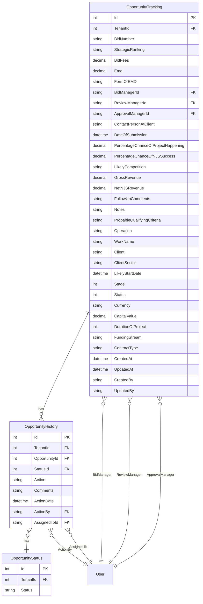
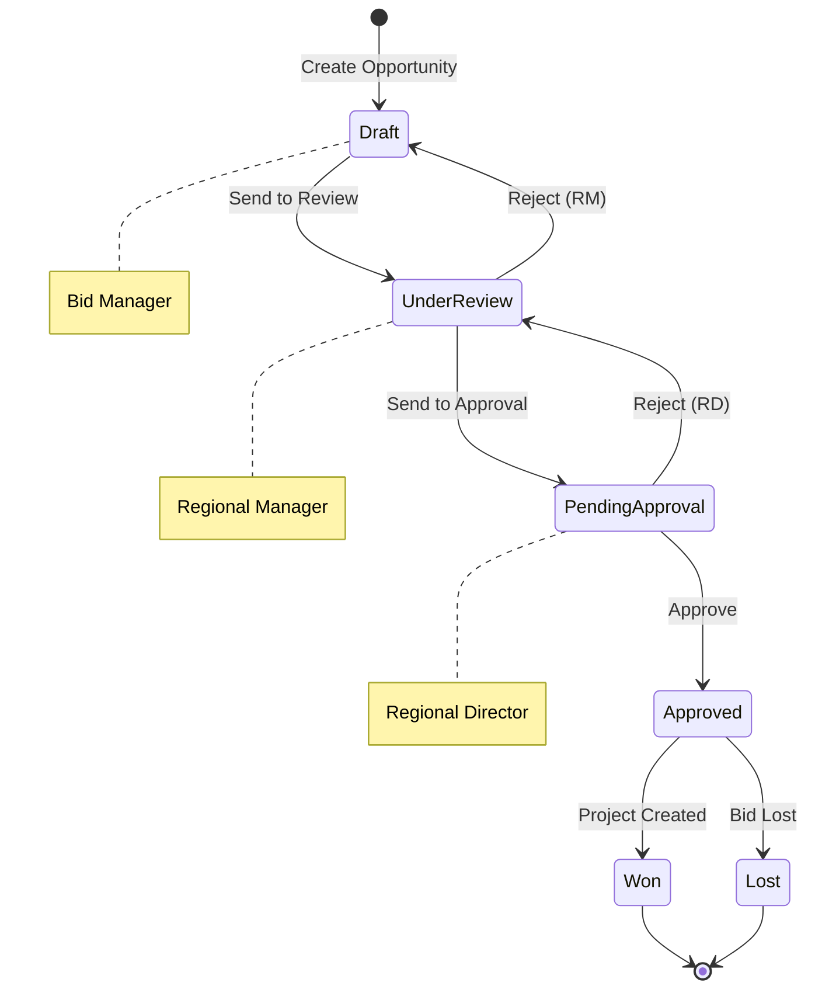

# Opportunity Tracking

## Overview

The Opportunity Tracking feature is the core sales pipeline management component of the Business Development Module. It enables tracking of business opportunities from initial identification through to project creation, with comprehensive workflow management, status tracking, and history logging.

## Purpose and Business Value

- Track potential business opportunities through the sales pipeline
- Manage bid preparation and submission processes
- Enable multi-level approval workflows (Bid Manager → Regional Manager → Regional Director)
- Maintain complete audit trail of opportunity status changes
- Calculate and track revenue projections and success probabilities
- Support strategic ranking and prioritization of opportunities

## Database Schema

### Entity Relationship Diagram



### Table Definitions

#### OpportunityTracking
| Column | Type | Constraints | Description |
|--------|------|-------------|-------------|
| Id | INT | PK, IDENTITY | Primary key |
| TenantId | INT | FK | Multi-tenant identifier |
| BidNumber | NVARCHAR(50) | NULL | Unique bid reference number |
| StrategicRanking | NVARCHAR(10) | NOT NULL | Strategic priority (H/M/L) |
| BidFees | DECIMAL(18,2) | NULL | Bid preparation fees |
| Emd | DECIMAL(18,2) | NULL | Earnest Money Deposit |
| FormOfEMD | NVARCHAR(100) | NULL | Form of EMD (BG/DD/etc.) |
| BidManagerId | NVARCHAR(450) | FK | Bid manager user ID |
| ReviewManagerId | NVARCHAR(450) | FK | Regional manager user ID |
| ApprovalManagerId | NVARCHAR(450) | FK | Regional director user ID |
| ContactPersonAtClient | NVARCHAR(255) | NULL | Client contact person |
| DateOfSubmission | DATETIME | NULL | Bid submission date |
| PercentageChanceOfProjectHappening | DECIMAL(18,2) | NULL | Project probability % |
| PercentageChanceOfNJSSuccess | DECIMAL(18,2) | NULL | Win probability % |
| LikelyCompetition | NVARCHAR(500) | NULL | Known competitors |
| GrossRevenue | DECIMAL(18,2) | NULL | Expected gross revenue |
| NetNJSRevenue | DECIMAL(18,2) | NULL | Expected net revenue |
| FollowUpComments | NVARCHAR(MAX) | NULL | Follow-up notes |
| Notes | NVARCHAR(MAX) | NULL | General notes |
| ProbableQualifyingCriteria | NVARCHAR(MAX) | NULL | Qualification criteria |
| Operation | NVARCHAR(255) | NOT NULL | Operation/region |
| WorkName | NVARCHAR(500) | NOT NULL | Project/work name |
| Client | NVARCHAR(255) | NOT NULL | Client name |
| ClientSector | NVARCHAR(100) | NOT NULL | Client sector |
| LikelyStartDate | DATETIME | NOT NULL | Expected start date |
| Stage | INT | NOT NULL | Opportunity stage (A-E) |
| Status | INT | NOT NULL | Workflow status |
| Currency | NVARCHAR(10) | NOT NULL | Currency code |
| CapitalValue | DECIMAL(18,2) | NOT NULL | Project capital value |
| DurationOfProject | INT | NOT NULL | Duration in months |
| FundingStream | NVARCHAR(100) | NOT NULL | Funding source |
| ContractType | NVARCHAR(100) | NOT NULL | Contract type |
| CreatedAt | DATETIME | NOT NULL | Creation timestamp |
| UpdatedAt | DATETIME | NOT NULL | Last update timestamp |
| CreatedBy | NVARCHAR(450) | NULL | Created by user ID |
| UpdatedBy | NVARCHAR(450) | NULL | Updated by user ID |

#### OpportunityStatus
| Column | Type | Constraints | Description |
|--------|------|-------------|-------------|
| Id | INT | PK, IDENTITY | Primary key |
| TenantId | INT | FK | Multi-tenant identifier |
| Status | NVARCHAR(100) | NOT NULL | Status name |

#### OpportunityHistory
| Column | Type | Constraints | Description |
|--------|------|-------------|-------------|
| Id | INT | PK, IDENTITY | Primary key |
| TenantId | INT | FK | Multi-tenant identifier |
| OpportunityId | INT | FK | Related opportunity |
| StatusId | INT | FK | Status at action time |
| Action | NVARCHAR(100) | NOT NULL | Action performed |
| Comments | NVARCHAR(MAX) | NULL | Action comments |
| ActionDate | DATETIME | NOT NULL | Action timestamp |
| ActionBy | NVARCHAR(450) | FK | User who performed action |
| AssignedToId | NVARCHAR(450) | FK | User assigned to |

## API Endpoints

### Get All Opportunities
```http
GET /api/OpportunityTracking
Query Parameters:
- status (optional): Filter by status (0-3)
- stage (optional): Filter by stage (1-5)
- bidManagerId (optional): Filter by bid manager
- clientSector (optional): Filter by client sector
- pageNumber (optional): Page number for pagination
- pageSize (optional): Items per page
- sortBy (optional): Sort field
- isAscending (optional): Sort direction

Response: 200 OK
[
    {
        "id": 1,
        "bidNumber": "BID-2024-001",
        "workName": "Highway Construction Project",
        "client": "Department of Transportation",
        "clientSector": "Government",
        "stage": 2,
        "status": 0,
        "capitalValue": 15000000.00,
        "grossRevenue": 1500000.00,
        "netNJSRevenue": 1200000.00,
        "bidManager": { "id": "user-1", "firstName": "John", "lastName": "Doe" },
        "createdAt": "2024-11-01T10:00:00Z"
    }
]
```

### Get Opportunity by ID
```http
GET /api/OpportunityTracking/{id}

Response: 200 OK
{
    "id": 1,
    "bidNumber": "BID-2024-001",
    "strategicRanking": "H",
    "bidFees": 25000.00,
    "emd": 100000.00,
    "formOfEMD": "Bank Guarantee",
    "bidManagerId": "user-1",
    "reviewManagerId": "user-2",
    "approvalManagerId": "user-3",
    "contactPersonAtClient": "Jane Smith",
    "dateOfSubmission": "2024-12-15T00:00:00Z",
    "percentageChanceOfProjectHappening": 75.00,
    "percentageChanceOfNJSSuccess": 60.00,
    "likelyCompetition": "Company A, Company B",
    "grossRevenue": 1500000.00,
    "netNJSRevenue": 1200000.00,
    "operation": "North Region",
    "workName": "Highway Construction Project",
    "client": "Department of Transportation",
    "clientSector": "Government",
    "likelyStartDate": "2025-01-15T00:00:00Z",
    "stage": 2,
    "status": 0,
    "currency": "INR",
    "capitalValue": 15000000.00,
    "durationOfProject": 24,
    "fundingStream": "Government Budget",
    "contractType": "Lump Sum",
    "opportunityHistories": [...]
}
```

### Get Opportunities by Bid Manager
```http
GET /api/OpportunityTracking/bid-manager/{userId}

Response: 200 OK
[...opportunities assigned to bid manager...]
```

### Get Opportunities by Regional Manager
```http
GET /api/OpportunityTracking/regional-manager/{userId}

Response: 200 OK
[...opportunities pending regional manager review...]
```

### Get Opportunities by Regional Director
```http
GET /api/OpportunityTracking/regional-director/{userId}

Response: 200 OK
[...opportunities pending regional director approval...]
```

### Create Opportunity
```http
POST /api/OpportunityTracking
Content-Type: application/json

Request:
{
    "stage": 1,
    "strategicRanking": "H",
    "bidManagerId": "user-1",
    "operation": "North Region",
    "workName": "New Bridge Construction",
    "client": "City Municipality",
    "clientSector": "Government",
    "likelyStartDate": "2025-03-01T00:00:00Z",
    "status": 0,
    "currency": "INR",
    "capitalValue": 8000000.00,
    "durationOfProject": 18,
    "fundingStream": "Municipal Budget",
    "contractType": "Item Rate",
    "bidFees": 15000.00,
    "emd": 50000.00,
    "grossRevenue": 800000.00,
    "netNJSRevenue": 640000.00
}

Response: 201 Created
{
    "id": 2,
    "bidNumber": "BID-2024-002",
    ...
}
```

### Update Opportunity
```http
PUT /api/OpportunityTracking/{id}
Content-Type: application/json

Request:
{
    "id": 1,
    ...updated fields...
}

Response: 200 OK
{...updated opportunity...}
```

### Delete Opportunity
```http
DELETE /api/OpportunityTracking/{id}

Response: 204 No Content
```

### Send to Review (Bid Manager → Regional Manager)
```http
POST /api/OpportunityTracking/SendToReview
Content-Type: application/json

Request:
{
    "opportunityId": 1,
    "assignedToId": "regional-manager-id",
    "comments": "Ready for review",
    "action": "SendToReview"
}

Response: 200 OK
{...updated opportunity with new status...}
```

### Send to Approval (Regional Manager → Regional Director)
```http
POST /api/OpportunityTracking/SendToApproval
Content-Type: application/json

Request:
{
    "opportunityId": 1,
    "assignedToId": "regional-director-id",
    "comments": "Reviewed and recommended",
    "action": "SendToApproval"
}

Response: 200 OK
{...updated opportunity with new status...}
```

### Approve Opportunity
```http
POST /api/OpportunityTracking/SendToApprove
Content-Type: application/json

Request:
{
    "opportunityId": 1,
    "assignedToId": "regional-director-id",
    "comments": "Approved for bidding",
    "action": "Approve"
}

Response: 200 OK
{...approved opportunity...}
```

### Reject Opportunity
```http
POST /api/OpportunityTracking/Reject
Content-Type: application/json

Request:
{
    "opportunityId": 1,
    "assignedToId": "bid-manager-id",
    "comments": "Needs more information",
    "action": "Reject"
}

Response: 200 OK
{...rejected opportunity...}
```

## CQRS Operations

### Commands
| Command | Description | Handler |
|---------|-------------|---------|
| CreateOpportunityTrackingCommand | Create new opportunity | CreateOpportunityTrackingCommandHandler |
| UpdateOpportunityTrackingCommand | Update existing opportunity | UpdateOpportunityTrackingCommandHandler |
| DeleteOpportunityTrackingCommand | Delete opportunity | DeleteOpportunityTrackingCommandHandler |
| OppertunityWorkflowCommand | Workflow transition | OpportunitySentToReviewHandler, OpportunitySentToApprovalHandler |
| RejectOpportunityCommand | Reject opportunity | RejectOpportunityCommandHandler |

### Queries
| Query | Description | Handler |
|-------|-------------|---------|
| GetAllOpportunityTrackingsQuery | Get all opportunities with filters | GetAllOpportunityTrackingsQueryHandler |
| GetOpportunityTrackingByIdQuery | Get single opportunity | GetOpportunityTrackingByIdQueryHandler |
| GetOpportunityTrackingsByBidManagerQuery | Get by bid manager | GetOpportunityTrackingsByBidManagerQueryHandler |
| GetOpportunityTrackingsByRegionalManagerQuery | Get by regional manager | GetOpportunityTrackingsByRegionalManagerQueryHandler |
| GetOpportunityTrackingsByRegionalDirectorQuery | Get by regional director | GetOpportunityTrackingsByRegionalDirectorQueryHandler |

## Frontend Components

### Pages
- `BusinessDevelopment.tsx` - Main opportunity list with filtering and sorting
- `BusinessDevelopmentDetails.tsx` - Opportunity detail view with tabs
- `BusinessDevelopmentDashboard.tsx` - Dashboard with metrics and charts

### Tab Components
- `BOverview.tsx` - Opportunity overview with key metrics
- `BTimeline.tsx` - Workflow history timeline
- `BForms.tsx` - Related forms (Go/No-Go, Job Start Form)
- `BDocuments.tsx` - Bid documents management

### API Service
- `opportunityApi.tsx` - API service with all CRUD and workflow operations

## Workflow States

### Opportunity Stage (Pipeline Position)
| Stage | Code | Description |
|-------|------|-------------|
| A | 1 | Initial identification |
| B | 2 | Qualification |
| C | 3 | Proposal development |
| D | 4 | Negotiation |
| E | 5 | Closing |

### Opportunity Status (Workflow State)
| Status | Code | Description |
|--------|------|-------------|
| Bid Under Preparation | 0 | Draft/preparation phase |
| Bid Submitted | 1 | Submitted for review/approval |
| Bid Rejected | 2 | Rejected in workflow |
| Bid Accepted | 3 | Approved and active |

## Workflow Diagram



## Business Logic

### Validation Rules
- Work Name is required
- Client is required
- Client Sector is required
- Bid Manager is required
- Currency is required
- Capital Value must be >= 0
- Duration must be > 0
- Strategic Ranking must be H, M, or L
- Percentage values must be between 0 and 100

### Calculated Fields
- Net NJS Revenue = Gross Revenue × (1 - overhead percentage)
- Weighted Revenue = Net Revenue × Success Probability

### Workflow Rules
- Only Bid Manager can create opportunities
- Only Bid Manager can send to review
- Only Regional Manager can approve/reject at review stage
- Only Regional Director can give final approval
- Rejected opportunities return to previous assignee
- Approved opportunities can trigger project creation

## Integration Points

- **Project Management**: Approved opportunities create projects
- **Go/No-Go Decision**: Links to Go/No-Go assessment
- **Bid Preparation**: Links to bid documentation
- **Job Start Form**: Links to project initiation
- **Audit System**: All changes tracked in audit logs
- **Email Service**: Notifications on workflow transitions

## Testing Coverage

### Unit Tests
- `OpportunityTrackingRepositoryTests.cs` - Repository operations
- `CreateOpportunityTrackingCommandHandlerTests.cs` - Create handler
- `UpdateOpportunityTrackingCommandHandlerTests.cs` - Update handler

### Integration Tests
- API endpoint tests for all CRUD operations
- Workflow transition tests
- Authorization tests for role-based access
