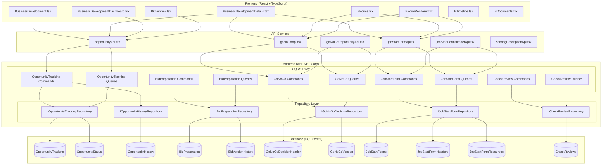

# Business Development (BD) Module

## Overview

The Business Development Module is the sales pipeline and bid management component of the EDR (KarmaTech AI) application. It provides comprehensive opportunity tracking, bid preparation, go/no-go decision making, job start form management, and check review capabilities to support the business development lifecycle from opportunity identification through project initiation.

## Module Purpose and Scope

The BD Module enables business development teams to:
- Track and manage business opportunities through the sales pipeline
- Prepare and manage bid documentation with version control
- Make informed go/no-go decisions using scoring criteria
- Create job start forms for approved projects with resource allocation
- Conduct check reviews for quality assurance

## Module Architecture

## Features in Module

| Feature | Description | Documentation |
|---------|-------------|---------------|
| Opportunity Tracking | Sales pipeline management with status workflow and history tracking | [OPPORTUNITY_TRACKING.md](./OPPORTUNITY_TRACKING.md) |
| Bid Preparation | Bid documentation management with version control and approval workflow | [BID_PREPARATION.md](./BID_PREPARATION.md) |
| Go/No-Go Decision | Scoring-based decision making with multi-level approval workflow | [GO_NO_GO_DECISION.md](./GO_NO_GO_DECISION.md) |
| Job Start Form | Project initiation forms with resource allocation and workflow | [JOB_START_FORM.md](./JOB_START_FORM.md) |
| Check Review | Quality assurance review process for project activities | [CHECK_REVIEW.md](./CHECK_REVIEW.md) |

## Entity Summary

| Entity | Description | Key Relationships |
|--------|-------------|-------------------|
| OpportunityTracking | Core opportunity entity with pipeline data | User (BidManager, ReviewManager, ApprovalManager), OpportunityHistory |
| OpportunityStatus | Status lookup for opportunity workflow | OpportunityHistory |
| OpportunityHistory | Workflow history tracking | OpportunityTracking, OpportunityStatus, User |
| BidPreparation | Bid documentation with versioning | OpportunityTracking, User, BidVersionHistory |
| BidVersionHistory | Version history for bid documents | BidPreparation |
| GoNoGoDecisionHeader | Go/No-Go decision header with scoring | OpportunityTracking, GoNoGoVersion |
| GoNoGoVersion | Version tracking for Go/No-Go decisions | GoNoGoDecisionHeader |
| JobStartForm | Job start form with financial data | Project, WorkBreakdownStructure, JobStartFormResource, JobStartFormHeader |
| JobStartFormHeader | Workflow header for job start forms | JobStartForm, Project, PMWorkflowStatus |
| JobStartFormResource | Resource allocation for job start | JobStartForm |
| CheckReview | Quality review records | Project |

## API Endpoints Summary

### Opportunity Tracking
- `GET /api/opportunitytracking` - Get all opportunities
- `GET /api/opportunitytracking/{id}` - Get opportunity by ID
- `GET /api/opportunitytracking/bidmanager/{userId}` - Get opportunities by bid manager
- `GET /api/opportunitytracking/regionalmanager/{userId}` - Get opportunities by regional manager
- `GET /api/opportunitytracking/regionaldirector/{userId}` - Get opportunities by regional director
- `POST /api/opportunitytracking` - Create opportunity
- `PUT /api/opportunitytracking/{id}` - Update opportunity
- `DELETE /api/opportunitytracking/{id}` - Delete opportunity
- `POST /api/opportunitytracking/{id}/sendtoreview` - Send to review
- `POST /api/opportunitytracking/{id}/sendtoapproval` - Send to approval
- `POST /api/opportunitytracking/{id}/approve` - Approve opportunity
- `POST /api/opportunitytracking/{id}/reject` - Reject opportunity

### Bid Preparation
- `GET /api/bidpreparation/opportunity/{opportunityId}` - Get bid preparation by opportunity
- `POST /api/bidpreparation` - Create/Update bid preparation
- `POST /api/bidpreparation/{id}/submit` - Submit for approval
- `POST /api/bidpreparation/{id}/approve` - Approve bid preparation

### Go/No-Go Decision
- `GET /api/gonogo/opportunity/{opportunityId}` - Get Go/No-Go by opportunity
- `GET /api/gonogo/{id}` - Get Go/No-Go by ID
- `GET /api/gonogo/{id}/versions` - Get Go/No-Go versions
- `POST /api/gonogo` - Create Go/No-Go decision header
- `POST /api/gonogo/{id}/version` - Create new version
- `PUT /api/gonogo/{id}` - Update Go/No-Go decision
- `POST /api/gonogo/{id}/approve` - Approve Go/No-Go decision

### Job Start Form
- `GET /api/jobstartform/project/{projectId}` - Get job start forms by project
- `GET /api/jobstartform/{id}` - Get job start form by ID
- `GET /api/jobstartform/all/{projectId}` - Get all job start forms by project
- `POST /api/jobstartform` - Create job start form
- `PUT /api/jobstartform/{id}` - Update job start form
- `DELETE /api/jobstartform/{id}` - Delete job start form

### Check Review
- `GET /api/checkreview/project/{projectId}` - Get check reviews by project
- `GET /api/checkreview/{id}` - Get check review by ID
- `POST /api/checkreview` - Create check review
- `PUT /api/checkreview/{id}` - Update check review
- `DELETE /api/checkreview/{id}` - Delete check review

## Frontend Components Summary

### Pages
- `BusinessDevelopment.tsx` - Main opportunity list and management page
- `BusinessDevelopmentDetails.tsx` - Opportunity detail view with tabs
- `BusinessDevelopmentDashboard.tsx` - BD dashboard with metrics
- `BOverview.tsx` - Opportunity overview tab
- `BForms.tsx` - BD forms container (Go/No-Go, Job Start Form)
- `BFormRenderer.tsx` - Dynamic form renderer for BD forms
- `BTimeline.tsx` - Opportunity timeline/history view
- `BDocuments.tsx` - Bid documents management

### Forms
- `OpportunityForm.tsx` - Opportunity creation/edit form
- `GoNoGoForm.tsx` - Go/No-Go decision form with scoring
- `BidPreparationForm.tsx` - Bid preparation documentation form
- `JobStartForm.tsx` - Job start form with resource allocation
- `CheckReviewForm.tsx` - Check review form

## Workflow States

### Opportunity Tracking Status
| Status | Description |
|--------|-------------|
| Draft | Initial draft state |
| Submitted for Review | Awaiting regional manager review |
| Under Review | Being reviewed by regional manager |
| Submitted for Approval | Awaiting regional director approval |
| Approved | Approved opportunity |
| Rejected | Rejected opportunity |
| Won | Opportunity won, project created |
| Lost | Opportunity lost |

### Go/No-Go Version Status
| Status | Description |
|--------|-------------|
| BDM_PENDING | Pending BDM completion |
| BDM_APPROVED | BDM approved, awaiting RM |
| RM_PENDING | Pending Regional Manager review |
| RM_APPROVED | RM approved, awaiting RD |
| RD_PENDING | Pending Regional Director approval |
| RD_APPROVED | Final approval granted |

### Bid Preparation Status
| Status | Description |
|--------|-------------|
| Draft | Initial draft state |
| PendingApproval | Submitted for approval |
| Approved | Approved bid preparation |
| Rejected | Rejected, needs revision |

## Integration Points

- **Project Management Module**: Approved opportunities create projects
- **Admin Module**: User management for bid managers and approvers
- **Audit System**: All changes are tracked in audit logs
- **Email Service**: Notifications for workflow transitions
- **WBS Module**: Job Start Forms link to Work Breakdown Structures

## Technology Stack

- **Backend**: ASP.NET Core 8.0, Entity Framework Core, MediatR (CQRS)
- **Frontend**: React 18.3, TypeScript, Material-UI
- **Database**: Microsoft SQL Server
- **State Management**: React Context API
- **Charts**: Recharts (for dashboard metrics)
