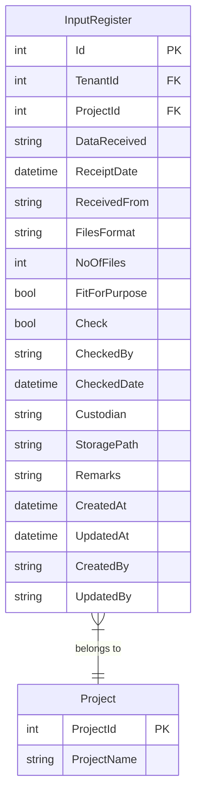
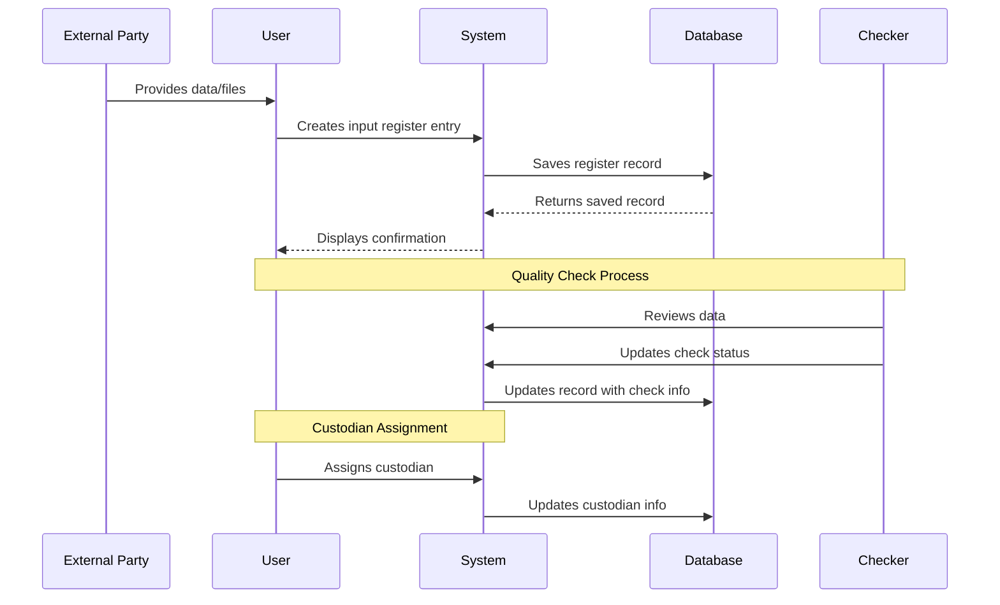

# Input Register

## Overview

The Input Register feature tracks all data and files received from external sources for a project. It provides a comprehensive register of input data with tracking of receipt dates, file formats, quality checks, and custodian information.

## Business Purpose

- Track all data and files received from external parties
- Maintain a register of input data for project documentation
- Record quality checks (fit for purpose) for received data
- Track custodian and storage information
- Ensure data traceability and audit compliance

## Database Schema

### InputRegister Entity



### Table Definition

| Column | Type | Constraints | Description |
|--------|------|-------------|-------------|
| Id | INT | PK, Identity | Unique identifier |
| TenantId | INT | FK, Required | Tenant identifier for multi-tenancy |
| ProjectId | INT | FK, Required | Associated project |
| DataReceived | NVARCHAR(255) | Required | Description of data/files received |
| ReceiptDate | DATETIME | Required | Date data was received |
| ReceivedFrom | NVARCHAR(255) | Required | Source/sender of data |
| FilesFormat | NVARCHAR(100) | Required | Format of files (PDF, DWG, etc.) |
| NoOfFiles | INT | Required | Number of files received |
| FitForPurpose | BIT | Required | Whether data is fit for intended purpose |
| Check | BIT | Required | Whether data has been checked |
| CheckedBy | NVARCHAR(255) | Optional | Person who checked the data |
| CheckedDate | DATETIME | Optional | Date data was checked |
| Custodian | NVARCHAR(255) | Optional | Person responsible for data custody |
| StoragePath | NVARCHAR(500) | Optional | File storage location |
| Remarks | NVARCHAR(1000) | Optional | Additional remarks |
| CreatedAt | DATETIME | Required | Record creation timestamp |
| UpdatedAt | DATETIME | Optional | Last update timestamp |
| CreatedBy | NVARCHAR(450) | Optional | User who created record |
| UpdatedBy | NVARCHAR(450) | Optional | User who last updated |

## API Endpoints

### Get All Input Registers

```http
GET /api/inputregister
Authorization: Bearer {token}

Response: 200 OK
[
    {
        "id": 1,
        "projectId": 5,
        "dataReceived": "Site Survey Data",
        "receiptDate": "2024-11-01T00:00:00Z",
        "receivedFrom": "ABC Surveyors Ltd",
        "filesFormat": "DWG, PDF",
        "noOfFiles": 15,
        "fitForPurpose": true,
        "check": true,
        "checkedBy": "John Smith",
        "checkedDate": "2024-11-02T00:00:00Z",
        "custodian": "Design Team Lead",
        "storagePath": "/projects/5/input/survey",
        "remarks": "Complete site survey package",
        "createdAt": "2024-11-01T10:30:00Z",
        "createdBy": "john.doe"
    }
]
```

### Get Input Register by ID

```http
GET /api/inputregister/{id}
Authorization: Bearer {token}

Response: 200 OK
{
    "id": 1,
    "projectId": 5,
    "dataReceived": "Site Survey Data",
    "receiptDate": "2024-11-01T00:00:00Z",
    "receivedFrom": "ABC Surveyors Ltd",
    "filesFormat": "DWG, PDF",
    "noOfFiles": 15,
    "fitForPurpose": true,
    "check": true,
    "checkedBy": "John Smith",
    "checkedDate": "2024-11-02T00:00:00Z",
    "custodian": "Design Team Lead",
    "storagePath": "/projects/5/input/survey",
    "remarks": "Complete site survey package",
    "createdAt": "2024-11-01T10:30:00Z",
    "createdBy": "john.doe"
}

Response: 404 Not Found
{
    "message": "Input register with ID {id} not found"
}
```

### Get Input Registers by Project

```http
GET /api/inputregister/project/{projectId}
Authorization: Bearer {token}

Response: 200 OK
[
    {
        "id": 1,
        "projectId": 5,
        "dataReceived": "Site Survey Data",
        ...
    },
    {
        "id": 2,
        "projectId": 5,
        "dataReceived": "Geotechnical Report",
        ...
    }
]
```

### Create Input Register

```http
POST /api/inputregister
Authorization: Bearer {token}
Content-Type: application/json

Request:
{
    "projectId": 5,
    "dataReceived": "Structural Drawings",
    "receiptDate": "2024-11-10T00:00:00Z",
    "receivedFrom": "XYZ Structural Engineers",
    "filesFormat": "DWG",
    "noOfFiles": 25,
    "fitForPurpose": true,
    "check": false,
    "checkedBy": null,
    "checkedDate": null,
    "custodian": "Structural Team",
    "storagePath": "/projects/5/input/structural",
    "remarks": "Preliminary structural drawings"
}

Response: 201 Created
{
    "id": 3,
    "projectId": 5,
    "dataReceived": "Structural Drawings",
    ...
    "createdAt": "2024-11-10T09:00:00Z",
    "createdBy": "current.user"
}
```

### Update Input Register

```http
PUT /api/inputregister/{id}
Authorization: Bearer {token}
Content-Type: application/json

Request:
{
    "id": 3,
    "projectId": 5,
    "dataReceived": "Structural Drawings",
    "receiptDate": "2024-11-10T00:00:00Z",
    "receivedFrom": "XYZ Structural Engineers",
    "filesFormat": "DWG",
    "noOfFiles": 25,
    "fitForPurpose": true,
    "check": true,
    "checkedBy": "Jane Doe",
    "checkedDate": "2024-11-11T00:00:00Z",
    "custodian": "Structural Team",
    "storagePath": "/projects/5/input/structural",
    "remarks": "Checked and approved for use"
}

Response: 200 OK
{
    "id": 3,
    ...
    "updatedAt": "2024-11-11T14:30:00Z",
    "updatedBy": "current.user"
}

Response: 400 Bad Request
{
    "message": "ID mismatch"
}
```

### Delete Input Register

```http
DELETE /api/inputregister/{id}
Authorization: Bearer {token}

Response: 204 No Content

Response: 404 Not Found
{
    "message": "Input register with ID {id} not found"
}
```

## CQRS Operations

### Commands

| Command | Description | Handler |
|---------|-------------|---------|
| CreateInputRegisterCommand | Creates new input register entry | CreateInputRegisterCommandHandler |
| UpdateInputRegisterCommand | Updates existing input register | UpdateInputRegisterCommandHandler |
| DeleteInputRegisterCommand | Deletes input register entry | DeleteInputRegisterCommandHandler |

### Queries

| Query | Description | Handler |
|-------|-------------|---------|
| GetAllInputRegistersQuery | Gets all input registers | GetAllInputRegistersQueryHandler |
| GetInputRegisterByIdQuery | Gets input register by ID | GetInputRegisterByIdQueryHandler |
| GetInputRegistersByProjectQuery | Gets input registers by project | GetInputRegistersByProjectQueryHandler |

### Command Structure

```csharp
public class CreateInputRegisterCommand : IRequest<InputRegisterDto>
{
    public int ProjectId { get; set; }
    public string DataReceived { get; set; }
    public DateTime ReceiptDate { get; set; }
    public string ReceivedFrom { get; set; }
    public string FilesFormat { get; set; }
    public int NoOfFiles { get; set; }
    public bool FitForPurpose { get; set; }
    public bool Check { get; set; }
    public string CheckedBy { get; set; }
    public DateTime? CheckedDate { get; set; }
    public string Custodian { get; set; }
    public string StoragePath { get; set; }
    public string Remarks { get; set; }
    public string CreatedBy { get; set; }
}
```

## Frontend Components

### InputRegisterForm.tsx (Planned)

The Input Register feature currently has backend API support but the frontend component is planned for future implementation.

**Planned Features:**
- List view of input register entries
- Add/Edit/Delete functionality
- Filter by project
- Quality check status indicators
- File format categorization

**Planned Form Fields:**
- Data Received (required) - Description of data/files
- Receipt Date (required) - Date received
- Received From (required) - Source/sender
- Files Format (required) - File format(s)
- No. of Files (required) - Count of files
- Fit for Purpose (required) - Quality indicator
- Check (required) - Verification status
- Checked By (optional) - Verifier name
- Checked Date (optional) - Verification date
- Custodian (optional) - Data custodian
- Storage Path (optional) - File location
- Remarks (optional) - Additional notes

## Validation Rules

| Field | Validation |
|-------|------------|
| ProjectId | Required, must exist |
| DataReceived | Required, max 255 characters |
| ReceiptDate | Required, valid date |
| ReceivedFrom | Required, max 255 characters |
| FilesFormat | Required, max 100 characters |
| NoOfFiles | Required, positive integer |
| FitForPurpose | Required, boolean |
| Check | Required, boolean |
| CheckedBy | Optional, max 255 characters |
| CheckedDate | Optional, valid date |
| Custodian | Optional, max 255 characters |
| StoragePath | Optional, max 500 characters |
| Remarks | Optional, max 1000 characters |

## Business Logic

### Input Register Workflow



### Quality Check Process

1. **Data Receipt**: External party provides data/files
2. **Registration**: User creates input register entry with basic details
3. **Quality Check**: Designated checker reviews data for fitness
4. **Status Update**: Check status and checker details are recorded
5. **Custodian Assignment**: Data custodian is assigned for ongoing management

### Fit for Purpose Criteria

The "Fit for Purpose" field indicates whether the received data meets the project requirements:
- **True**: Data is complete, accurate, and suitable for intended use
- **False**: Data has issues, is incomplete, or requires revision

## Testing Coverage

### Unit Tests
- `InputRegisterEntityTests.cs` - Entity validation tests
- `CreateInputRegisterCommandValidatorTests.cs` - Command validation tests
- `UpdateInputRegisterCommandValidatorTests.cs` - Update validation tests
- `DeleteInputRegisterCommandValidatorTests.cs` - Delete validation tests

### Integration Tests
- `InputRegisterControllerTests.cs` - API endpoint tests
- `InputRegisterRepositoryTests.cs` - Repository tests

## Comparison: Input Register vs Correspondence

| Aspect | Input Register | Correspondence |
|--------|---------------|----------------|
| Purpose | Track data/files received | Track letters/documents |
| Content | Data packages, drawings, reports | Formal correspondence |
| Quality Check | FitForPurpose, Check fields | N/A |
| File Tracking | NoOfFiles, FilesFormat | AttachmentDetails |
| Response | N/A | RepliedDate (Inward), Acknowledgement (Outward) |

## Related Features

- [Inward Correspondence](./INWARD_CORRESPONDENCE.md) - Incoming correspondence tracking
- [Outward Correspondence](./OUTWARD_CORRESPONDENCE.md) - Outgoing correspondence tracking
- [Project Management](../PM_MODULE/PROJECT_MANAGEMENT.md) - Parent project context
- [File Management](../CROSS_CUTTING/FILE_MANAGEMENT.md) - File storage and retrieval
