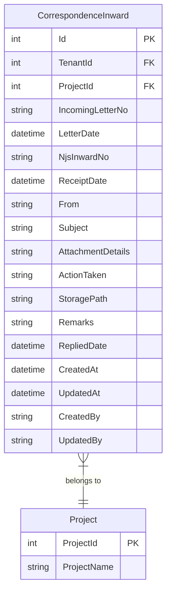
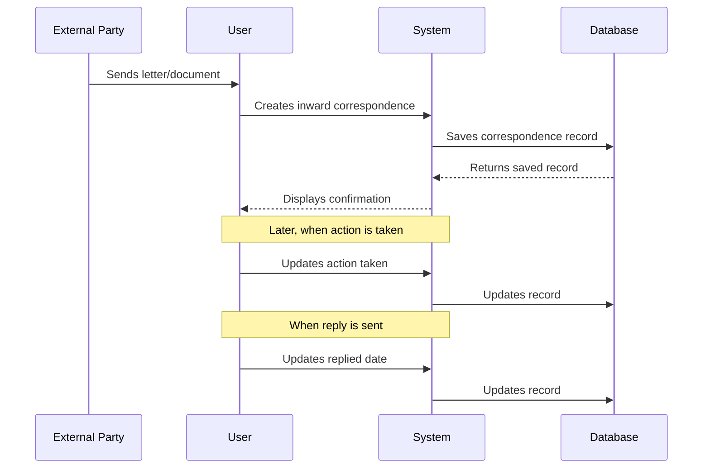

# Inward Correspondence

## Overview

The Inward Correspondence feature tracks all letters, documents, and communications received from external parties for a project. It provides a comprehensive register of incoming correspondence with tracking of receipt dates, reference numbers, and actions taken.

## Business Purpose

- Track all incoming correspondence for audit and compliance
- Maintain a register of letters received from clients, contractors, and stakeholders
- Record actions taken in response to correspondence
- Track reply dates for follow-up management
- Store document references and attachment details

## Database Schema

### CorrespondenceInward Entity



### Table Definition

| Column | Type | Constraints | Description |
|--------|------|-------------|-------------|
| Id | INT | PK, Identity | Unique identifier |
| TenantId | INT | FK, Required | Tenant identifier for multi-tenancy |
| ProjectId | INT | FK, Required | Associated project |
| IncomingLetterNo | NVARCHAR(255) | Required | External letter reference number |
| LetterDate | DATETIME | Required | Date on the incoming letter |
| NjsInwardNo | NVARCHAR(255) | Required | Internal NJS inward reference number |
| ReceiptDate | DATETIME | Required | Date letter was received |
| From | NVARCHAR(255) | Required | Sender name/organization |
| Subject | NVARCHAR(500) | Required | Letter subject |
| AttachmentDetails | NVARCHAR(500) | Optional | Details of attachments |
| ActionTaken | NVARCHAR(500) | Optional | Action taken in response |
| StoragePath | NVARCHAR(500) | Optional | File storage location |
| Remarks | NVARCHAR(1000) | Optional | Additional remarks |
| RepliedDate | DATETIME | Optional | Date reply was sent |
| CreatedAt | DATETIME | Required | Record creation timestamp |
| UpdatedAt | DATETIME | Optional | Last update timestamp |
| CreatedBy | NVARCHAR(450) | Optional | User who created record |
| UpdatedBy | NVARCHAR(450) | Optional | User who last updated |

## API Endpoints

### Get All Inward Correspondence

```http
GET /api/correspondence/inward
Authorization: Bearer {token}

Response: 200 OK
[
    {
        "id": 1,
        "projectId": 5,
        "incomingLetterNo": "EXT/2024/001",
        "letterDate": "2024-11-01T00:00:00Z",
        "njsInwardNo": "NJS/IN/2024/001",
        "receiptDate": "2024-11-02T00:00:00Z",
        "from": "ABC Construction Ltd",
        "subject": "Request for Design Clarification",
        "attachmentDetails": "2 PDF drawings attached",
        "actionTaken": "Forwarded to design team",
        "storagePath": "/documents/inward/2024/001",
        "remarks": "Urgent response required",
        "repliedDate": "2024-11-05T00:00:00Z",
        "createdAt": "2024-11-02T10:30:00Z",
        "createdBy": "john.doe"
    }
]
```

### Get Inward Correspondence by ID

```http
GET /api/correspondence/inward/{id}
Authorization: Bearer {token}

Response: 200 OK
{
    "id": 1,
    "projectId": 5,
    "incomingLetterNo": "EXT/2024/001",
    "letterDate": "2024-11-01T00:00:00Z",
    "njsInwardNo": "NJS/IN/2024/001",
    "receiptDate": "2024-11-02T00:00:00Z",
    "from": "ABC Construction Ltd",
    "subject": "Request for Design Clarification",
    "attachmentDetails": "2 PDF drawings attached",
    "actionTaken": "Forwarded to design team",
    "storagePath": "/documents/inward/2024/001",
    "remarks": "Urgent response required",
    "repliedDate": "2024-11-05T00:00:00Z",
    "createdAt": "2024-11-02T10:30:00Z",
    "createdBy": "john.doe"
}

Response: 404 Not Found
"Inward correspondence with ID {id} not found."
```

### Get Inward Correspondence by Project

```http
GET /api/correspondence/inward/project/{projectId}
Authorization: Bearer {token}

Response: 200 OK
[
    {
        "id": 1,
        "projectId": 5,
        "incomingLetterNo": "EXT/2024/001",
        ...
    }
]
```

### Create Inward Correspondence

```http
POST /api/correspondence/inward
Authorization: Bearer {token}
Content-Type: application/json

Request:
{
    "projectId": 5,
    "incomingLetterNo": "EXT/2024/002",
    "letterDate": "2024-11-10T00:00:00Z",
    "njsInwardNo": "NJS/IN/2024/002",
    "receiptDate": "2024-11-11T00:00:00Z",
    "from": "XYZ Engineering",
    "subject": "Technical Specifications Submission",
    "attachmentDetails": "Technical specs document",
    "actionTaken": null,
    "storagePath": "/documents/inward/2024/002",
    "remarks": "Review required",
    "repliedDate": null
}

Response: 201 Created
{
    "id": 2,
    "projectId": 5,
    "incomingLetterNo": "EXT/2024/002",
    ...
    "createdAt": "2024-11-11T09:00:00Z",
    "createdBy": "current.user"
}

Response: 400 Bad Request
{
    "message": "Inward correspondence with letter number already exists for project ID 5"
}
```

### Update Inward Correspondence

```http
PUT /api/correspondence/inward/{id}
Authorization: Bearer {token}
Content-Type: application/json

Request:
{
    "id": 2,
    "projectId": 5,
    "incomingLetterNo": "EXT/2024/002",
    "letterDate": "2024-11-10T00:00:00Z",
    "njsInwardNo": "NJS/IN/2024/002",
    "receiptDate": "2024-11-11T00:00:00Z",
    "from": "XYZ Engineering",
    "subject": "Technical Specifications Submission",
    "attachmentDetails": "Technical specs document",
    "actionTaken": "Reviewed and approved",
    "storagePath": "/documents/inward/2024/002",
    "remarks": "Approved for implementation",
    "repliedDate": "2024-11-15T00:00:00Z"
}

Response: 200 OK
{
    "id": 2,
    ...
    "updatedAt": "2024-11-15T14:30:00Z",
    "updatedBy": "current.user"
}
```

### Delete Inward Correspondence

```http
DELETE /api/correspondence/inward/{id}
Authorization: Bearer {token}

Response: 204 No Content

Response: 404 Not Found
"Inward correspondence with ID {id} not found."
```

## CQRS Operations

### Commands

| Command | Description | Handler |
|---------|-------------|---------|
| CreateCorrespondenceInwardCommand | Creates new inward correspondence | CreateCorrespondenceInwardCommandHandler |
| UpdateCorrespondenceInwardCommand | Updates existing inward correspondence | UpdateCorrespondenceInwardCommandHandler |
| DeleteCorrespondenceInwardCommand | Deletes inward correspondence | DeleteCorrespondenceInwardCommandHandler |

### Queries

| Query | Description | Handler |
|-------|-------------|---------|
| GetAllCorrespondenceInwardsQuery | Gets all inward correspondence | GetAllCorrespondenceInwardsQueryHandler |
| GetCorrespondenceInwardByIdQuery | Gets inward correspondence by ID | GetCorrespondenceInwardByIdQueryHandler |
| GetCorrespondenceInwardsByProjectQuery | Gets inward correspondence by project | GetCorrespondenceInwardsByProjectQueryHandler |

### Command Structure

```csharp
public class CreateCorrespondenceInwardCommand : IRequest<CorrespondenceInwardDto>
{
    public int ProjectId { get; set; }
    public string IncomingLetterNo { get; set; }
    public DateTime LetterDate { get; set; }
    public string NjsInwardNo { get; set; }
    public DateTime ReceiptDate { get; set; }
    public string From { get; set; }
    public string Subject { get; set; }
    public string AttachmentDetails { get; set; }
    public string ActionTaken { get; set; }
    public string StoragePath { get; set; }
    public string Remarks { get; set; }
    public DateTime? RepliedDate { get; set; }
    public string CreatedBy { get; set; }
}
```

## Frontend Components

### CorrespondenceForm.tsx (Inward Mode)

The CorrespondenceForm component provides a tabbed interface for managing both inward and outward correspondence. When the "Inward" tab is selected:

**Features:**
- Accordion-based list of inward correspondence entries
- Add Entry button to create new correspondence
- Edit and Delete actions for each entry
- Expandable details showing all correspondence fields

**Display Fields:**
- Entry number (sequential)
- Incoming Letter No
- Letter Date
- From (sender)
- Subject
- Expanded details: Inward No, Receipt Date, Attachment Details, Action Taken, Storage Path, Replied Date, Remarks

### CorrespondenceDialog.tsx (Inward Mode)

Dialog component for creating/editing inward correspondence entries.

**Form Fields:**
- Incoming Letter No (required)
- Letter Date (required)
- NJS Inward No (required)
- Receipt Date (required)
- From (required)
- Subject (required)
- Attachment Details (optional)
- Action Taken (optional)
- Storage Path (optional)
- Remarks (optional)
- Replied Date (optional)

## Validation Rules

| Field | Validation |
|-------|------------|
| ProjectId | Required, must exist |
| IncomingLetterNo | Required, max 255 characters |
| LetterDate | Required, valid date |
| NjsInwardNo | Required, max 255 characters |
| ReceiptDate | Required, valid date |
| From | Required, max 255 characters |
| Subject | Required, max 500 characters |
| AttachmentDetails | Optional, max 500 characters |
| ActionTaken | Optional, max 500 characters |
| StoragePath | Optional, max 500 characters |
| Remarks | Optional, max 1000 characters |
| RepliedDate | Optional, valid date |

## Business Logic

### Correspondence Tracking Flow



## Testing Coverage

### Unit Tests
- `CorrespondenceInwardEntityTests.cs` - Entity validation tests
- `CreateCorrespondenceInwardCommandValidatorTests.cs` - Command validation tests
- `UpdateCorrespondenceInwardCommandValidatorTests.cs` - Update validation tests
- `DeleteCorrespondenceInwardCommandValidatorTests.cs` - Delete validation tests

### Integration Tests
- `CorrespondenceControllerTests.cs` - API endpoint tests
- `CorrespondenceInwardRepositoryTests.cs` - Repository tests

## Related Features

- [Outward Correspondence](./OUTWARD_CORRESPONDENCE.md) - Outgoing correspondence tracking
- [Input Register](./INPUT_REGISTER.md) - Data/file input tracking
- [Project Management](../PM_MODULE/PROJECT_MANAGEMENT.md) - Parent project context
