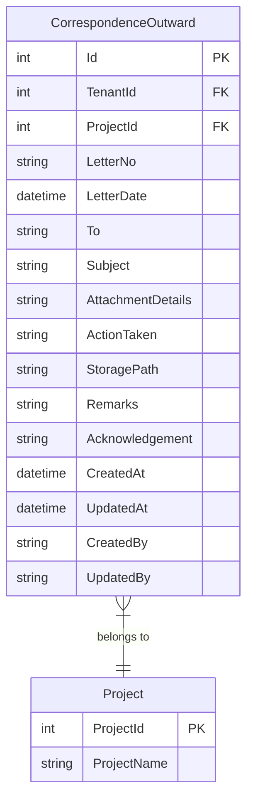
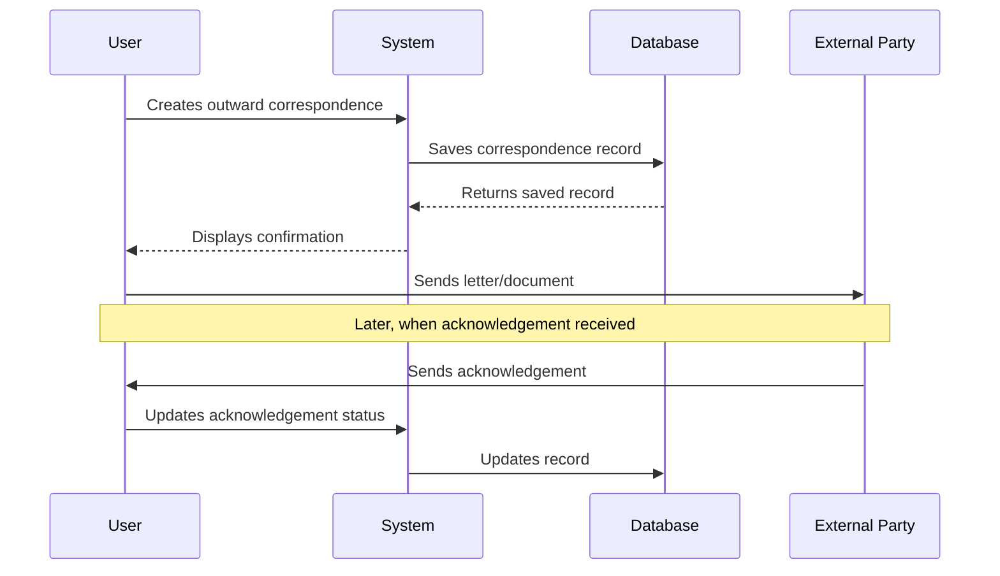

# Outward Correspondence

## Overview

The Outward Correspondence feature tracks all letters, documents, and communications sent to external parties for a project. It provides a comprehensive register of outgoing correspondence with tracking of letter numbers, recipients, and acknowledgement status.

## Business Purpose

- Track all outgoing correspondence for audit and compliance
- Maintain a register of letters sent to clients, contractors, and stakeholders
- Record acknowledgement status for sent correspondence
- Track action taken and document details
- Store document references and attachment details

## Database Schema

### CorrespondenceOutward Entity



### Table Definition

| Column | Type | Constraints | Description |
|--------|------|-------------|-------------|
| Id | INT | PK, Identity | Unique identifier |
| TenantId | INT | FK, Required | Tenant identifier for multi-tenancy |
| ProjectId | INT | FK, Required | Associated project |
| LetterNo | NVARCHAR(255) | Required | Outgoing letter reference number |
| LetterDate | DATETIME | Required | Date on the outgoing letter |
| To | NVARCHAR(255) | Required | Recipient name/organization |
| Subject | NVARCHAR(500) | Required | Letter subject |
| AttachmentDetails | NVARCHAR(500) | Optional | Details of attachments |
| ActionTaken | NVARCHAR(500) | Optional | Action taken/purpose |
| StoragePath | NVARCHAR(500) | Optional | File storage location |
| Remarks | NVARCHAR(1000) | Optional | Additional remarks |
| Acknowledgement | NVARCHAR(255) | Optional | Acknowledgement status/details |
| CreatedAt | DATETIME | Required | Record creation timestamp |
| UpdatedAt | DATETIME | Optional | Last update timestamp |
| CreatedBy | NVARCHAR(450) | Optional | User who created record |
| UpdatedBy | NVARCHAR(450) | Optional | User who last updated |

## API Endpoints

### Get All Outward Correspondence

```http
GET /api/correspondence/outward
Authorization: Bearer {token}

Response: 200 OK
[
    {
        "id": 1,
        "projectId": 5,
        "letterNo": "NJS/OUT/2024/001",
        "letterDate": "2024-11-01T00:00:00Z",
        "to": "ABC Construction Ltd",
        "subject": "Design Clarification Response",
        "attachmentDetails": "3 PDF drawings attached",
        "actionTaken": "Response to design query",
        "storagePath": "/documents/outward/2024/001",
        "remarks": "Sent via courier",
        "acknowledgement": "Received on 2024-11-03",
        "createdAt": "2024-11-01T14:30:00Z",
        "createdBy": "john.doe"
    }
]
```

### Get Outward Correspondence by ID

```http
GET /api/correspondence/outward/{id}
Authorization: Bearer {token}

Response: 200 OK
{
    "id": 1,
    "projectId": 5,
    "letterNo": "NJS/OUT/2024/001",
    "letterDate": "2024-11-01T00:00:00Z",
    "to": "ABC Construction Ltd",
    "subject": "Design Clarification Response",
    "attachmentDetails": "3 PDF drawings attached",
    "actionTaken": "Response to design query",
    "storagePath": "/documents/outward/2024/001",
    "remarks": "Sent via courier",
    "acknowledgement": "Received on 2024-11-03",
    "createdAt": "2024-11-01T14:30:00Z",
    "createdBy": "john.doe"
}

Response: 404 Not Found
"Outward correspondence with ID {id} not found."
```

### Get Outward Correspondence by Project

```http
GET /api/correspondence/outward/project/{projectId}
Authorization: Bearer {token}

Response: 200 OK
[
    {
        "id": 1,
        "projectId": 5,
        "letterNo": "NJS/OUT/2024/001",
        ...
    }
]
```

### Create Outward Correspondence

```http
POST /api/correspondence/outward
Authorization: Bearer {token}
Content-Type: application/json

Request:
{
    "projectId": 5,
    "letterNo": "NJS/OUT/2024/002",
    "letterDate": "2024-11-10T00:00:00Z",
    "to": "XYZ Engineering",
    "subject": "Technical Specifications Approval",
    "attachmentDetails": "Approval letter",
    "actionTaken": "Approval of submitted specs",
    "storagePath": "/documents/outward/2024/002",
    "remarks": "Sent via email",
    "acknowledgement": null
}

Response: 201 Created
{
    "id": 2,
    "projectId": 5,
    "letterNo": "NJS/OUT/2024/002",
    ...
    "createdAt": "2024-11-10T09:00:00Z",
    "createdBy": "current.user"
}

Response: 400 Bad Request
{
    "message": "Outward correspondence with letter number already exists for project ID 5"
}
```

### Update Outward Correspondence

```http
PUT /api/correspondence/outward/{id}
Authorization: Bearer {token}
Content-Type: application/json

Request:
{
    "id": 2,
    "projectId": 5,
    "letterNo": "NJS/OUT/2024/002",
    "letterDate": "2024-11-10T00:00:00Z",
    "to": "XYZ Engineering",
    "subject": "Technical Specifications Approval",
    "attachmentDetails": "Approval letter",
    "actionTaken": "Approval of submitted specs",
    "storagePath": "/documents/outward/2024/002",
    "remarks": "Sent via email",
    "acknowledgement": "Acknowledged via email on 2024-11-11"
}

Response: 200 OK
{
    "id": 2,
    ...
    "updatedAt": "2024-11-11T10:30:00Z",
    "updatedBy": "current.user"
}
```

### Delete Outward Correspondence

```http
DELETE /api/correspondence/outward/{id}
Authorization: Bearer {token}

Response: 204 No Content

Response: 404 Not Found
"Outward correspondence with ID {id} not found."
```

## CQRS Operations

### Commands

| Command | Description | Handler |
|---------|-------------|---------|
| CreateCorrespondenceOutwardCommand | Creates new outward correspondence | CreateCorrespondenceOutwardCommandHandler |
| UpdateCorrespondenceOutwardCommand | Updates existing outward correspondence | UpdateCorrespondenceOutwardCommandHandler |
| DeleteCorrespondenceOutwardCommand | Deletes outward correspondence | DeleteCorrespondenceOutwardCommandHandler |

### Queries

| Query | Description | Handler |
|-------|-------------|---------|
| GetAllCorrespondenceOutwardsQuery | Gets all outward correspondence | GetAllCorrespondenceOutwardsQueryHandler |
| GetCorrespondenceOutwardByIdQuery | Gets outward correspondence by ID | GetCorrespondenceOutwardByIdQueryHandler |
| GetCorrespondenceOutwardsByProjectQuery | Gets outward correspondence by project | GetCorrespondenceOutwardsByProjectQueryHandler |

### Command Structure

```csharp
public class CreateCorrespondenceOutwardCommand : IRequest<CorrespondenceOutwardDto>
{
    public int ProjectId { get; set; }
    public string LetterNo { get; set; }
    public DateTime LetterDate { get; set; }
    public string To { get; set; }
    public string Subject { get; set; }
    public string AttachmentDetails { get; set; }
    public string ActionTaken { get; set; }
    public string StoragePath { get; set; }
    public string Remarks { get; set; }
    public string Acknowledgement { get; set; }
    public string CreatedBy { get; set; }
}
```

## Frontend Components

### CorrespondenceForm.tsx (Outward Mode)

The CorrespondenceForm component provides a tabbed interface for managing both inward and outward correspondence. When the "Outward" tab is selected:

**Features:**
- Accordion-based list of outward correspondence entries
- Add Entry button to create new correspondence
- Edit and Delete actions for each entry
- Expandable details showing all correspondence fields

**Display Fields:**
- Entry number (sequential)
- Letter No
- Letter Date
- To (recipient)
- Subject
- Expanded details: Attachment Details, Storage Path, Action Taken, Acknowledgement, Remarks

### CorrespondenceDialog.tsx (Outward Mode)

Dialog component for creating/editing outward correspondence entries.

**Form Fields:**
- Letter No (required)
- Letter Date (required)
- To (required)
- Subject (required)
- Attachment Details (optional)
- Action Taken (optional)
- Storage Path (optional)
- Remarks (optional)
- Acknowledgement (optional)

## Validation Rules

| Field | Validation |
|-------|------------|
| ProjectId | Required, must exist |
| LetterNo | Required, max 255 characters |
| LetterDate | Required, valid date |
| To | Required, max 255 characters |
| Subject | Required, max 500 characters |
| AttachmentDetails | Optional, max 500 characters |
| ActionTaken | Optional, max 500 characters |
| StoragePath | Optional, max 500 characters |
| Remarks | Optional, max 1000 characters |
| Acknowledgement | Optional, max 255 characters |

## Business Logic

### Correspondence Tracking Flow



## Comparison: Inward vs Outward

| Aspect | Inward | Outward |
|--------|--------|---------|
| Direction | Received from external | Sent to external |
| Reference | IncomingLetterNo + NjsInwardNo | LetterNo |
| Party Field | From (sender) | To (recipient) |
| Date Tracking | LetterDate + ReceiptDate | LetterDate |
| Response Tracking | RepliedDate | Acknowledgement |

## Testing Coverage

### Unit Tests
- `CorrespondenceOutwardEntityTests.cs` - Entity validation tests
- `CreateCorrespondenceOutwardCommandValidatorTests.cs` - Command validation tests
- `UpdateCorrespondenceOutwardCommandValidatorTests.cs` - Update validation tests
- `DeleteCorrespondenceOutwardCommandValidatorTests.cs` - Delete validation tests

### Integration Tests
- `CorrespondenceControllerTests.cs` - API endpoint tests
- `CorrespondenceOutwardRepositoryTests.cs` - Repository tests

## Related Features

- [Inward Correspondence](./INWARD_CORRESPONDENCE.md) - Incoming correspondence tracking
- [Input Register](./INPUT_REGISTER.md) - Data/file input tracking
- [Project Management](../PM_MODULE/PROJECT_MANAGEMENT.md) - Parent project context
