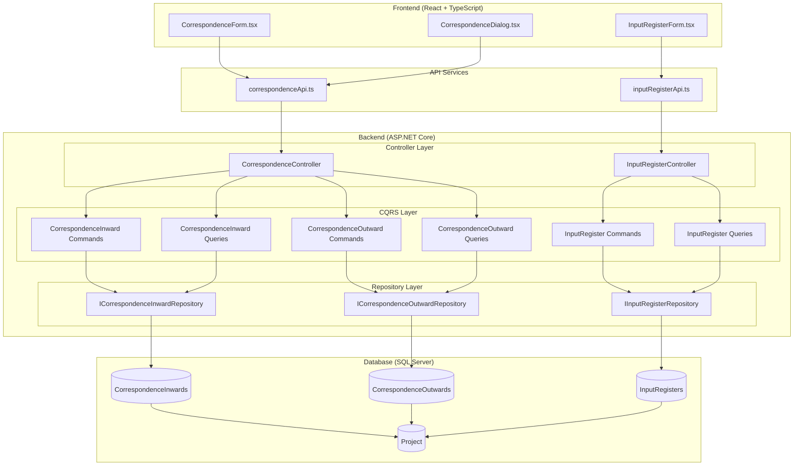

# Correspondence Module

## Overview

The Correspondence Module is a document tracking component of the EDR (KarmaTech AI) application. It provides comprehensive management of project-related correspondence, including inward (received) and outward (sent) communications, as well as an input register for tracking data and documents received from external sources.

## Module Purpose and Scope

The Correspondence Module enables project teams to:
- Track inward correspondence (letters, documents received from external parties)
- Manage outward correspondence (letters, documents sent to external parties)
- Maintain an input register for data and files received
- Link all correspondence to specific projects
- Track action taken and responses
- Store document references and attachments

## Module Architecture

## Features in Module

| Feature | Description | Documentation |
|---------|-------------|---------------|
| Inward Correspondence | Track letters and documents received from external parties | [INWARD_CORRESPONDENCE.md](./INWARD_CORRESPONDENCE.md) |
| Outward Correspondence | Track letters and documents sent to external parties | [OUTWARD_CORRESPONDENCE.md](./OUTWARD_CORRESPONDENCE.md) |
| Input Register | Track data and files received from external sources | [INPUT_REGISTER.md](./INPUT_REGISTER.md) |

## Entity Summary

| Entity | Description | Key Relationships |
|--------|-------------|-------------------|
| CorrespondenceInward | Inward correspondence tracking | Project |
| CorrespondenceOutward | Outward correspondence tracking | Project |
| InputRegister | Input data/file register | Project |

## API Endpoints Summary

### Inward Correspondence
- `GET /api/correspondence/inward` - Get all inward correspondence
- `GET /api/correspondence/inward/{id}` - Get inward correspondence by ID
- `GET /api/correspondence/inward/project/{projectId}` - Get inward correspondence by project
- `POST /api/correspondence/inward` - Create inward correspondence
- `PUT /api/correspondence/inward/{id}` - Update inward correspondence
- `DELETE /api/correspondence/inward/{id}` - Delete inward correspondence

### Outward Correspondence
- `GET /api/correspondence/outward` - Get all outward correspondence
- `GET /api/correspondence/outward/{id}` - Get outward correspondence by ID
- `GET /api/correspondence/outward/project/{projectId}` - Get outward correspondence by project
- `POST /api/correspondence/outward` - Create outward correspondence
- `PUT /api/correspondence/outward/{id}` - Update outward correspondence
- `DELETE /api/correspondence/outward/{id}` - Delete outward correspondence

### Input Register
- `GET /api/inputregister` - Get all input registers
- `GET /api/inputregister/{id}` - Get input register by ID
- `GET /api/inputregister/project/{projectId}` - Get input registers by project
- `POST /api/inputregister` - Create input register
- `PUT /api/inputregister/{id}` - Update input register
- `DELETE /api/inputregister/{id}` - Delete input register

## Frontend Components Summary

### Pages & Forms
- `CorrespondenceForm.tsx` - Main correspondence management form with tabs for inward/outward
- `CorrespondenceDialog.tsx` - Dialog for creating/editing correspondence entries
- `InputRegisterForm.tsx` - Input register management form

### Key Features
- Tabbed interface for switching between inward and outward correspondence
- Accordion-based display for correspondence entries
- CRUD operations for all correspondence types
- Project-scoped correspondence tracking
- Date tracking for letters, receipts, and replies

## Data Flow

### Inward Correspondence Flow
1. External party sends letter/document to organization
2. User creates inward correspondence entry with letter details
3. System tracks receipt date, NJS inward number, and action taken
4. User can record reply date when response is sent

### Outward Correspondence Flow
1. User creates outward correspondence entry for letter being sent
2. System tracks letter number, date, recipient, and subject
3. User can record acknowledgement when received

### Input Register Flow
1. External party provides data/files to organization
2. User creates input register entry with data details
3. System tracks receipt, format, file count, and quality check
4. User records custodian and storage location

## Integration Points

- **Project Management Module**: All correspondence is linked to projects
- **Audit System**: All changes are tracked in audit logs
- **Multi-tenancy**: Correspondence is tenant-scoped

## Technology Stack

- **Backend**: ASP.NET Core 8.0, Entity Framework Core, MediatR (CQRS)
- **Frontend**: React 18.3, TypeScript, Material-UI
- **Database**: Microsoft SQL Server
- **State Management**: React Context API
