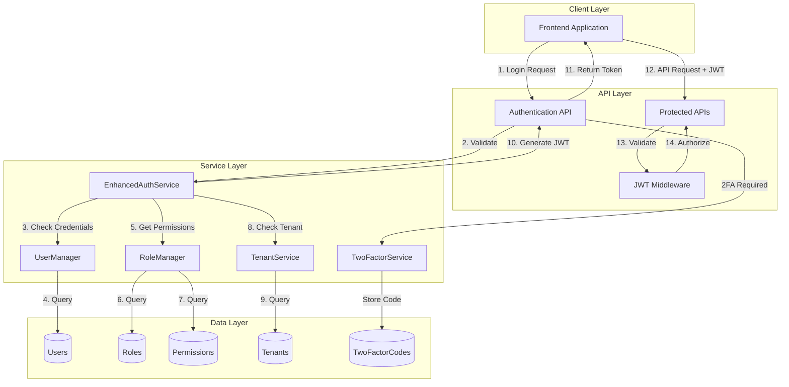
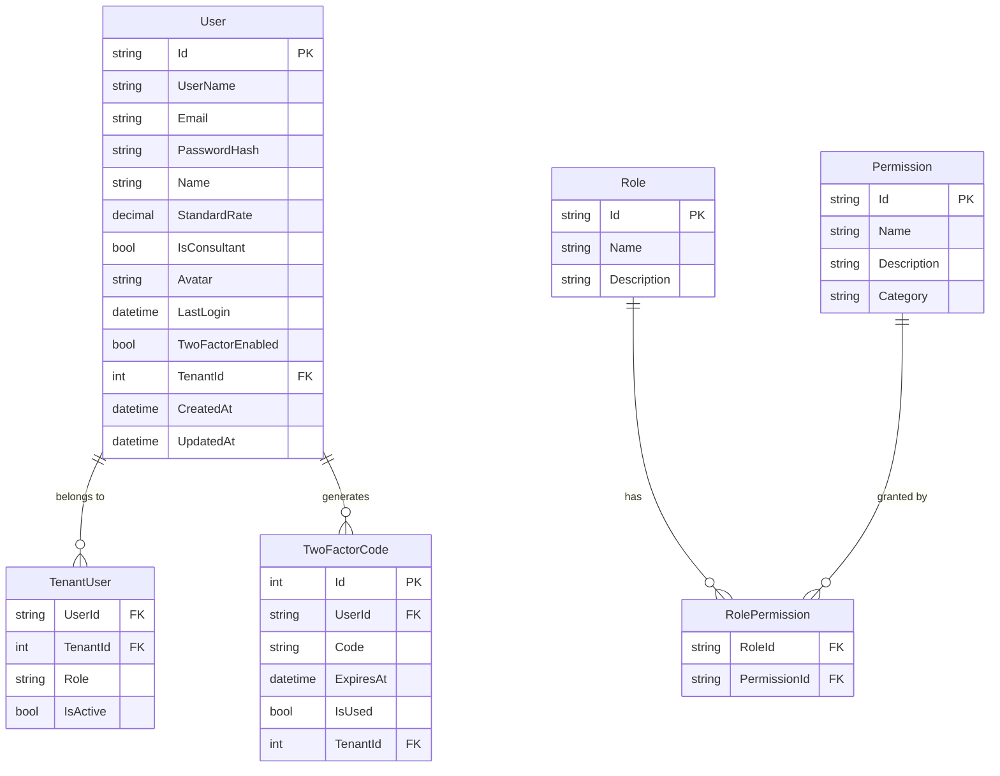
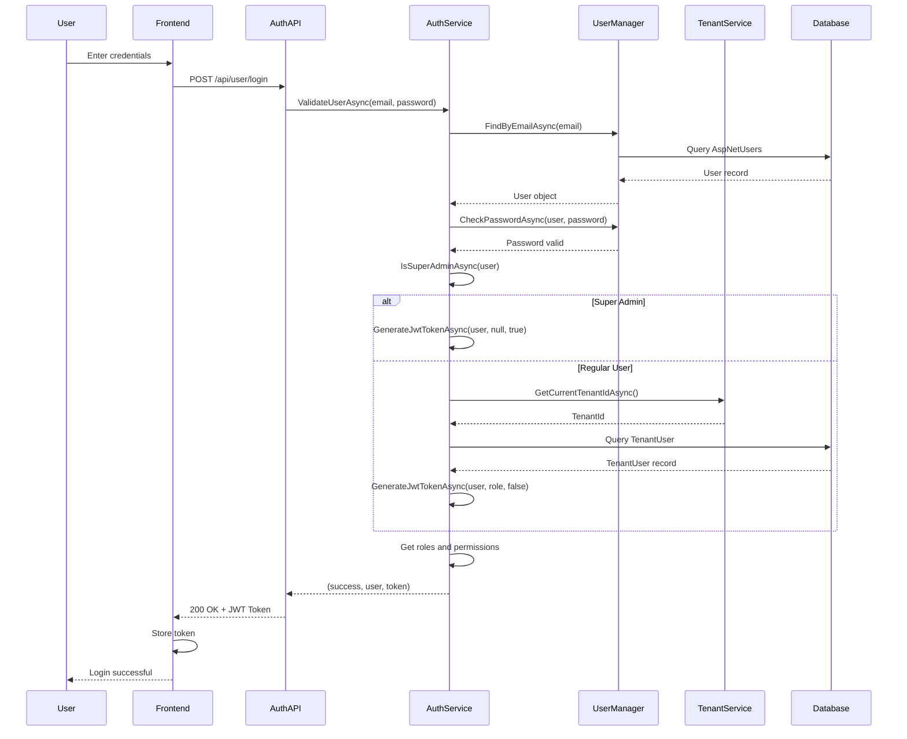
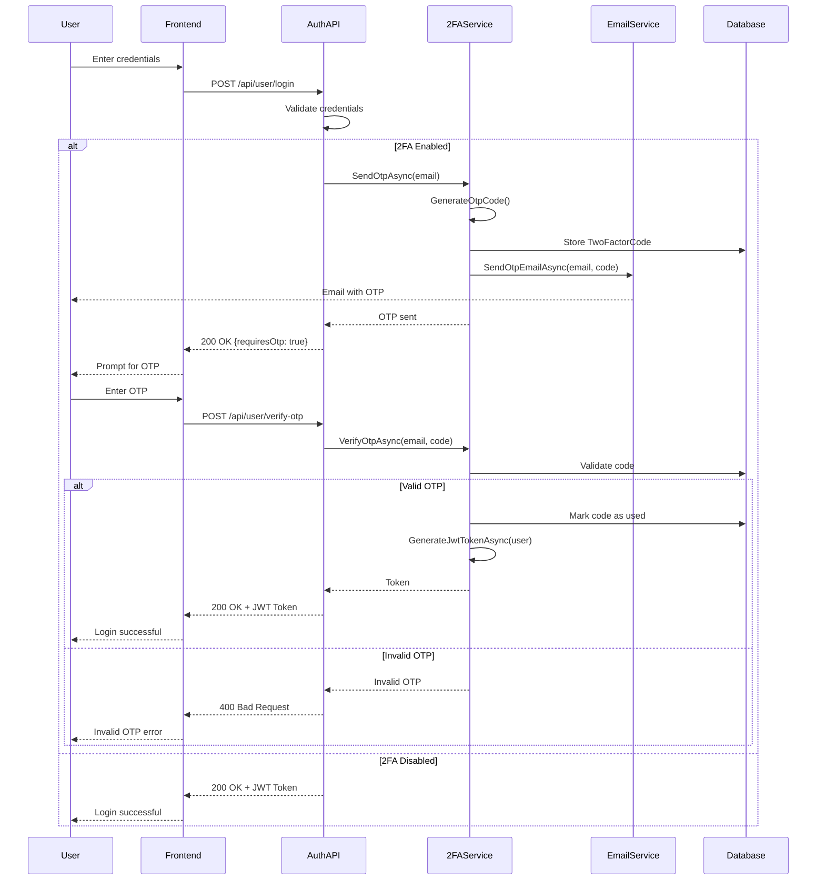

# Authentication and Authorization

## Overview

The EDR application implements a comprehensive authentication and authorization system using JWT (JSON Web Tokens) combined with ASP.NET Core Identity. The system supports multi-tenancy, role-based access control (RBAC), permission-based authorization, and two-factor authentication (2FA).

## Business Value

- **Security**: Protects sensitive data and operations
- **Multi-tenancy**: Isolates data between different organizations
- **Flexibility**: Fine-grained permission control
- **Compliance**: Audit trail and access control
- **User Experience**: Single sign-on with JWT tokens
- **Enhanced Security**: Optional 2FA for sensitive accounts

## Architecture



## Database Schema

### User Entity



### ASP.NET Identity Tables

The system uses ASP.NET Core Identity which creates the following tables:

- `AspNetUsers` - User accounts
- `AspNetRoles` - Role definitions
- `AspNetUserRoles` - User-Role mappings
- `AspNetUserClaims` - User claims
- `AspNetRoleClaims` - Role claims
- `AspNetUserLogins` - External login providers
- `AspNetUserTokens` - Authentication tokens

## Authentication Flow

### Standard Login Flow



### Two-Factor Authentication Flow



## JWT Token Structure

### Token Claims

```json
{
  "sub": "user-guid-123",
  "email": "john.doe@example.com",
  "jti": "unique-token-id",
  "name": "john.doe",
  "TenantId": "5",
  "TenantDomain": "company.example.com",
  "UserType": "TenantUser",
  "role": ["Manager", "ProjectManager"],
  "Permissions": "VIEW_PROJECTS,EDIT_PROJECTS,APPROVE_BUDGETS",
  "iss": "your-app-name",
  "aud": "your-app-name",
  "exp": 1732800000,
  "iat": 1732789200
}
```

### Super Admin Token

```json
{
  "sub": "admin-guid-456",
  "email": "admin@example.com",
  "jti": "unique-token-id",
  "name": "admin",
  "IsSuperAdmin": "true",
  "UserType": "SuperAdmin",
  "TenantId": "0",
  "role": ["SuperAdmin"],
  "Permissions": "SYSTEM_ADMIN,ALL_PERMISSIONS",
  "iss": "your-app-name",
  "aud": "your-app-name",
  "exp": 1732800000
}
```

## Service Implementation

### EnhancedAuthService

**Location**: `backend/src/NJS.Application/Services/EnhancedAuthService.cs`

**Key Methods**:

```csharp
public interface IAuthService
{
    Task<(bool success, User user, string token)> ValidateUserAsync(string email, string password);
    Task<string> GenerateJwtTokenAsync(User user);
    bool VerifyToken(string token);
    Task<bool> CreateRoleAsync(string roleName);
    Task<bool> AssignRoleToUserAsync(User user, string roleName);
    Task<bool> ValidateUserAnsPasswordAsync(string email, string password);
}
```

**Features**:
- Multi-tenant authentication
- Super admin detection
- Role and permission loading
- JWT token generation with claims
- Password validation
- Token verification

### TwoFactorService

**Location**: `backend/src/NJS.Application/Services/TwoFactorService.cs`

**Key Methods**:

```csharp
public interface ITwoFactorService
{
    Task<OtpSentResponse> SendOtpAsync(string email);
    Task<TwoFactorResponse> VerifyOtpAsync(string email, string otpCode);
    Task<bool> ValidateOtpAsync(string email, string otpCode);
    Task<bool> IsOtpRequiredAsync(string email);
    Task<bool> EnableTwoFactorAsync(string userId);
    Task<bool> DisableTwoFactorAsync(string userId);
    Task<bool> IsTwoFactorEnabledAsync(string userId);
}
```

**Features**:
- 6-digit OTP generation
- Email-based OTP delivery
- OTP expiration (5 minutes)
- OTP validation and usage tracking
- Per-user 2FA enable/disable

## API Endpoints

### Authentication Endpoints

```http
# Login
POST /api/user/login
Content-Type: application/json

Request:
{
    "email": "user@example.com",
    "password": "SecurePassword123"
}

Response: 200 OK
{
    "success": true,
    "token": "eyJhbGciOiJIUzI1NiIsInR5cCI6IkpXVCJ9...",
    "user": {
        "id": "user-guid",
        "email": "user@example.com",
        "name": "John Doe",
        "roles": ["Manager"],
        "permissions": ["VIEW_PROJECTS", "EDIT_PROJECTS"],
        "tenantId": 5,
        "tenantDomain": "company.example.com",
        "twoFactorEnabled": false
    },
    "requiresOtp": false
}

# Login with 2FA
Response: 200 OK
{
    "success": true,
    "requiresOtp": true,
    "email": "user@example.com",
    "message": "OTP sent to your email"
}
```

```http
# Verify OTP
POST /api/user/verify-otp
Content-Type: application/json

Request:
{
    "email": "user@example.com",
    "otpCode": "123456"
}

Response: 200 OK
{
    "success": true,
    "token": "eyJhbGciOiJIUzI1NiIsInR5cCI6IkpXVCJ9...",
    "user": { ... },
    "requiresOtp": false
}
```

```http
# Enable 2FA
POST /api/user/{userId}/enable-2fa
Authorization: Bearer {token}

Response: 200 OK
{
    "success": true,
    "message": "Two-factor authentication enabled"
}
```

```http
# Disable 2FA
POST /api/user/{userId}/disable-2fa
Authorization: Bearer {token}

Response: 200 OK
{
    "success": true,
    "message": "Two-factor authentication disabled"
}
```

## Authorization

### Permission-Based Authorization

The system uses a fine-grained permission system:

```csharp
// Controller authorization
[Authorize]
[HttpPost]
public async Task<IActionResult> CreateProject(CreateProjectDto dto)
{
    // Check permission in code
    if (!User.HasPermission("CREATE_PROJECT"))
    {
        return Forbid();
    }
    
    // Process request
}
```

### Frontend Permission Check

```typescript
// Check if user has permission
const hasPermission = (permission: string): boolean => {
    const user = getCurrentUser();
    return user?.permissions?.includes(permission) ?? false;
};

// Conditional rendering
{hasPermission("EDIT_PROJECT") && (
    <Button onClick={handleEdit}>Edit Project</Button>
)}
```

### Common Permissions

| Permission | Description | Typical Roles |
|------------|-------------|---------------|
| SYSTEM_ADMIN | Full system access | Super Admin |
| VIEW_PROJECTS | View project list | All Users |
| CREATE_PROJECT | Create new projects | Manager, Admin |
| EDIT_PROJECT | Edit project details | Manager, Admin |
| DELETE_PROJECT | Delete projects | Admin |
| APPROVE_BUDGET | Approve budget changes | Manager, Admin |
| VIEW_BUSINESS_DEVELOPMENT | View BD module | BD Team, Manager |
| EDIT_BUSINESS_DEVELOPMENT | Edit BD data | BD Team, Manager |
| MANAGE_USERS | User management | Admin |
| MANAGE_ROLES | Role management | Admin |
| VIEW_AUDIT_LOGS | View audit logs | Admin, Auditor |

## Configuration

### JWT Configuration

**File**: `appsettings.json`

```json
{
  "Jwt": {
    "Key": "your-secret-key-min-32-characters-long",
    "Issuer": "your-app-name",
    "Audience": "your-app-name"
  }
}
```

### ASP.NET Core Identity Configuration

**File**: `Program.cs`

```csharp
builder.Services.AddAuthentication(options =>
{
    options.DefaultAuthenticateScheme = JwtBearerDefaults.AuthenticationScheme;
    options.DefaultChallengeScheme = JwtBearerDefaults.AuthenticationScheme;
    options.DefaultScheme = JwtBearerDefaults.AuthenticationScheme;
})
.AddJwtBearer(options =>
{
    options.TokenValidationParameters = new TokenValidationParameters
    {
        ValidateIssuer = true,
        ValidateAudience = true,
        ValidateLifetime = true,
        ValidateIssuerSigningKey = true,
        ValidIssuer = builder.Configuration["Jwt:Issuer"],
        ValidAudience = builder.Configuration["Jwt:Audience"],
        IssuerSigningKey = new SymmetricSecurityKey(
            Encoding.UTF8.GetBytes(builder.Configuration["Jwt:Key"]))
    };
});
```

## Multi-Tenancy Support

### Tenant Resolution

The system resolves tenants using multiple strategies:

1. **Claims Resolution**: From JWT token claims
2. **Header Resolution**: From `X-Tenant-Id` header
3. **Domain Resolution**: From request domain/subdomain

```csharp
public interface ITenantResolutionStrategy
{
    Task<int?> ResolveTenantIdAsync(HttpContext context);
}
```

### Tenant Isolation

- Each user belongs to one or more tenants
- Data is filtered by tenant ID
- Super admins can access all tenants
- Regular users see only their tenant's data

## Security Best Practices

### Password Requirements

- Minimum 8 characters
- At least one uppercase letter
- At least one lowercase letter
- At least one number
- At least one special character

### Token Security

- Tokens expire after 3 hours
- Tokens stored securely (HttpOnly cookies or secure storage)
- HTTPS required for all authentication endpoints
- Token refresh not implemented (re-login required)

### 2FA Security

- OTP codes expire after 5 minutes
- OTP codes are single-use
- Failed OTP attempts are logged
- Email delivery failures are tracked

## Testing

### Unit Tests

**Location**: `backend/NJS.API.Tests/Middleware/AuthenticationMiddlewareTests.cs`

```csharp
[Fact]
public async Task ValidateUser_ValidCredentials_ReturnsSuccess()
{
    // Arrange
    var email = "test@example.com";
    var password = "ValidPassword123!";
    
    // Act
    var (success, user, token) = await _authService.ValidateUserAsync(email, password);
    
    // Assert
    Assert.True(success);
    Assert.NotNull(user);
    Assert.NotNull(token);
}

[Fact]
public async Task ValidateUser_InvalidPassword_ReturnsFalse()
{
    // Arrange
    var email = "test@example.com";
    var password = "WrongPassword";
    
    // Act
    var (success, user, token) = await _authService.ValidateUserAsync(email, password);
    
    // Assert
    Assert.False(success);
    Assert.Null(token);
}
```

### Integration Tests

- Login flow testing
- Token validation testing
- Permission enforcement testing
- 2FA flow testing
- Multi-tenant isolation testing

## Troubleshooting

### Common Issues

| Issue | Cause | Solution |
|-------|-------|----------|
| 401 Unauthorized | Missing or invalid token | Check token in Authorization header |
| 403 Forbidden | Insufficient permissions | Verify user has required permission |
| Token expired | Token older than 3 hours | Re-login to get new token |
| 2FA code invalid | Code expired or already used | Request new OTP code |
| Tenant access denied | User not in tenant | Check TenantUser mapping |

### Debug Tips

- Check JWT token claims using jwt.io
- Review authentication logs in NLog
- Verify user roles and permissions in database
- Test with Postman/curl to isolate frontend issues

## Related Documentation

- [User Management](../ADMIN_MODULE/USER_MANAGEMENT.md)
- [Role & Permission](../ADMIN_MODULE/ROLE_PERMISSION.md)
- [Tenant Management](../ADMIN_MODULE/TENANT_MANAGEMENT.md)
- [Audit Logging](../ADMIN_MODULE/AUDIT_LOGGING.md)
- [Email Service](./EMAIL_SERVICE.md)

---

**Last Updated**: November 28, 2024  
**Version**: 1.0  
**Maintained By**: EDR Development Team
