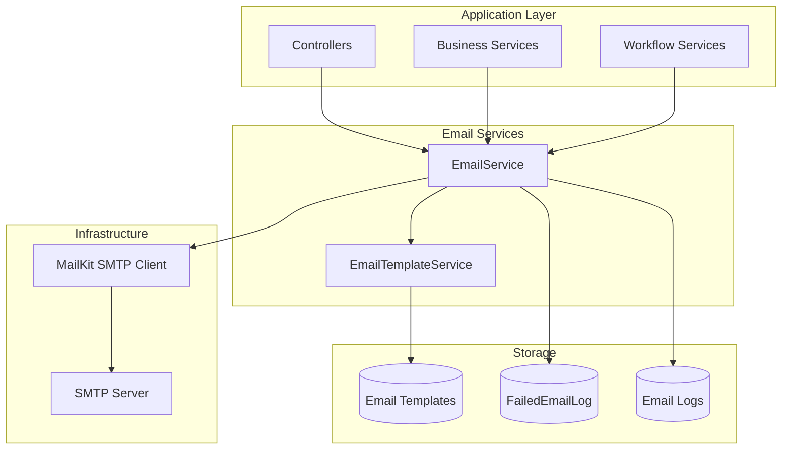
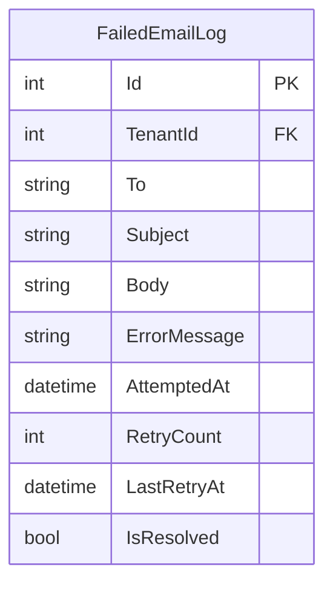
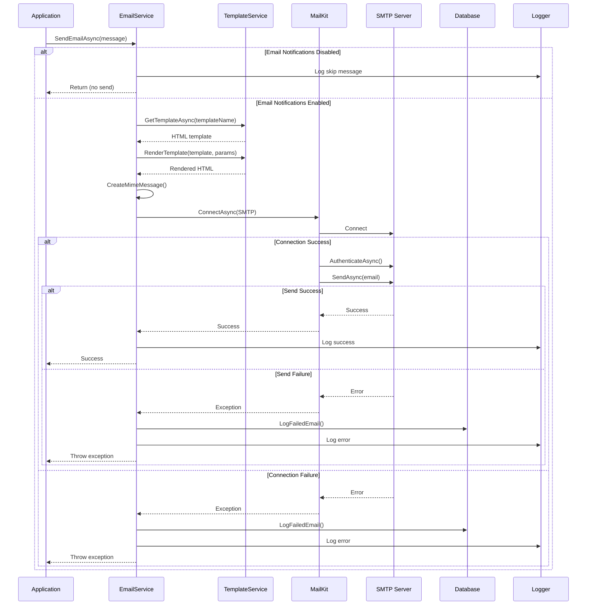

# Email Service

## Overview

The EDR application provides a comprehensive email service using MailKit for SMTP communication. The service supports HTML emails, template-based messaging, failed email tracking with retry capabilities, bulk email sending, and integration with the logging infrastructure.

## Business Value

- **Communication**: Automated notifications and alerts
- **Reliability**: Failed email tracking and retry mechanism
- **Flexibility**: Template-based email composition
- **Monitoring**: Email delivery tracking and logging
- **Scalability**: Bulk email sending capabilities
- **Compliance**: Email audit trail

## Architecture



## Database Schema

### FailedEmailLog Entity



### Table Definition

```sql
CREATE TABLE FailedEmailLog (
    Id INT PRIMARY KEY IDENTITY(1,1),
    TenantId INT NOT NULL,
    To NVARCHAR(500) NOT NULL,
    Subject NVARCHAR(500) NOT NULL,
    Body NVARCHAR(MAX) NOT NULL,
    ErrorMessage NVARCHAR(MAX) NOT NULL,
    AttemptedAt DATETIME NOT NULL,
    RetryCount INT NOT NULL DEFAULT 0,
    LastRetryAt DATETIME NULL,
    IsResolved BIT NOT NULL DEFAULT 0,
    
    CONSTRAINT FK_FailedEmailLog_Tenant 
        FOREIGN KEY (TenantId) REFERENCES Tenant(Id)
);

CREATE INDEX IX_FailedEmailLog_TenantId ON FailedEmailLog(TenantId);
CREATE INDEX IX_FailedEmailLog_IsResolved ON FailedEmailLog(IsResolved);
CREATE INDEX IX_FailedEmailLog_AttemptedAt ON FailedEmailLog(AttemptedAt DESC);
```

## Service Implementation

### EmailService

**Location**: `backend/src/NJS.Application/Services/EmailService.cs`

**Interface**:

```csharp
public interface IEmailService
{
    Task SendEmailAsync(EmailMessage message);
    Task SendBulkEmailAsync(List<EmailMessage> messages);
    Task<List<FailedEmailLog>> GetFailedEmailsAsync();
    Task RetryFailedEmailAsync(int failedEmailId);
}
```

**Key Features**:
- Asynchronous email sending
- Automatic retry with exponential backoff
- Failed email logging
- Bulk email support
- Template integration
- Attachment support

### EmailTemplateService

**Location**: `backend/src/NJS.Application/Services/EmailTemplateService.cs`

**Interface**:

```csharp
public interface IEmailTemplateService
{
    Task<string> GetTemplateAsync(string templateName);
    string RenderTemplate(string template, Dictionary<string, string> parameters);
}
```

**Key Features**:
- HTML template loading
- Parameter substitution
- Template caching
- Error handling for missing templates

## Email Flow



## Configuration

### Email Settings

**File**: `appsettings.json`

```json
{
  "EmailSettings": {
    "SmtpServer": "smtp.gmail.com",
    "Port": 587,
    "Username": "your-email@gmail.com",
    "Password": "your-app-password",
    "FromEmail": "noreply@example.com",
    "FromName": "NJS Project Management",
    "EnableSsl": true,
    "EnableEmailNotifications": true
  }
}
```

### Service Registration

**File**: `Program.cs`

```csharp
builder.Services.Configure<EmailSettings>(
    builder.Configuration.GetSection("EmailSettings"));
builder.Services.AddScoped<IEmailService, EmailService>();
builder.Services.AddScoped<IEmailTemplateService, EmailTemplateService>();
```

## Usage Examples

### Send Simple Email

```csharp
var message = new EmailMessage
{
    To = "user@example.com",
    Subject = "Welcome to EDR",
    Body = "<h1>Welcome!</h1><p>Thank you for joining.</p>",
    IsHtml = true
};

await _emailService.SendEmailAsync(message);
```

### Send Template-Based Email

```csharp
// Get template
var template = await _emailTemplateService.GetTemplateAsync("welcome-email");

// Render with parameters
var renderedBody = _emailTemplateService.RenderTemplate(template, new Dictionary<string, string>
{
    { "USER_NAME", "John Doe" },
    { "LOGIN_URL", "https://app.example.com/login" },
    { "SUPPORT_EMAIL", "support@example.com" }
});

// Send email
var message = new EmailMessage
{
    To = "user@example.com",
    Subject = "Welcome to EDR",
    Body = renderedBody,
    IsHtml = true
};

await _emailService.SendEmailAsync(message);
```

### Send Email with Attachments

```csharp
var message = new EmailMessage
{
    To = "user@example.com",
    Subject = "Monthly Report",
    Body = "<p>Please find attached your monthly report.</p>",
    IsHtml = true,
    Attachments = new List<string>
    {
        "C:\\Reports\\monthly-report.pdf"
    }
};

await _emailService.SendEmailAsync(message);
```

### Send Bulk Emails

```csharp
var messages = new List<EmailMessage>
{
    new EmailMessage { To = "user1@example.com", Subject = "Update", Body = "..." },
    new EmailMessage { To = "user2@example.com", Subject = "Update", Body = "..." },
    new EmailMessage { To = "user3@example.com", Subject = "Update", Body = "..." }
};

await _emailService.SendBulkEmailAsync(messages);
```

### Retry Failed Email

```csharp
// Get failed emails
var failedEmails = await _emailService.GetFailedEmailsAsync();

// Retry specific email
foreach (var failedEmail in failedEmails.Where(e => e.RetryCount < 3))
{
    try
    {
        await _emailService.RetryFailedEmailAsync(failedEmail.Id);
    }
    catch (Exception ex)
    {
        _logger.LogError(ex, "Failed to retry email {EmailId}", failedEmail.Id);
    }
}
```

## Email Templates

### Template Structure

**Location**: `backend/src/NJSAPI/Templates/Email/`

**Template Example**: `welcome-email.html`

```html
<!DOCTYPE html>
<html>
<head>
    <style>
        body { font-family: Arial, sans-serif; }
        .header { background-color: #4CAF50; color: white; padding: 20px; }
        .content { padding: 20px; }
        .footer { background-color: #f1f1f1; padding: 10px; text-align: center; }
    </style>
</head>
<body>
    <div class="header">
        <h1>Welcome to EDR!</h1>
    </div>
    <div class="content">
        <p>Hello {{USER_NAME}},</p>
        <p>Thank you for joining our platform.</p>
        <p>You can login at: <a href="{{LOGIN_URL}}">{{LOGIN_URL}}</a></p>
        <p>If you have any questions, contact us at {{SUPPORT_EMAIL}}</p>
    </div>
    <div class="footer">
        <p>&copy; 2024 EDR Project Management. All rights reserved.</p>
    </div>
</body>
</html>
```

### Available Templates

| Template Name | Purpose | Parameters |
|---------------|---------|------------|
| `welcome-email` | New user welcome | USER_NAME, LOGIN_URL, SUPPORT_EMAIL |
| `otp-login` | 2FA OTP code | OTP_CODE |
| `password-reset` | Password reset link | RESET_URL, EXPIRY_TIME |
| `project-notification` | Project updates | PROJECT_NAME, STATUS, DETAILS |
| `budget-alert` | Budget threshold alerts | PROJECT_NAME, BUDGET_AMOUNT, THRESHOLD |

## Failed Email Management

### Automatic Logging

When an email fails to send, it's automatically logged:

```csharp
private async Task LogFailedEmail(EmailMessage message, string errorMessage)
{
    var failedEmail = new FailedEmailLog
    {
        To = message.To,
        Subject = message.Subject,
        Body = message.Body,
        ErrorMessage = errorMessage,
        AttemptedAt = DateTime.UtcNow,
        RetryCount = 0,
        IsResolved = false
    };

    _dbContext.FailedEmailLogs.Add(failedEmail);
    await _dbContext.SaveChangesAsync();
}
```

### Retry Mechanism

```csharp
private async Task SendEmailWithRetryAsync(
    MimeMessage email, 
    EmailMessage originalMessage, 
    int maxRetries = 1)
{
    var retryCount = 0;
    while (true)
    {
        try
        {
            using var client = new SmtpClient();
            await client.ConnectAsync(_emailSettings.SmtpServer, 
                _emailSettings.Port, SecureSocketOptions.StartTls);
            await client.AuthenticateAsync(_emailSettings.Username, 
                _emailSettings.Password);
            await client.SendAsync(email);
            await client.DisconnectAsync(true);
            return;
        }
        catch (Exception ex)
        {
            retryCount++;
            if (retryCount >= maxRetries)
            {
                await LogFailedEmail(originalMessage, ex.Message);
                throw;
            }
            // Exponential backoff
            await Task.Delay(TimeSpan.FromSeconds(Math.Pow(2, retryCount)));
        }
    }
}
```

## Logging Integration

### Email-Specific Logging

All email operations are logged to a dedicated log file:

**File**: `C:\Logs\email.log`

```json
{
  "@timestamp": "2024-11-28 10:30:00.1234",
  "@level": "INFO",
  "@logger": "EmailService",
  "@correlationId": "abc-123-def",
  "@message": "Email sent to user@example.com",
  "@sentBodyMessage": "<html>...</html>"
}
```

### Custom Logger Extension

```csharp
public static class LoggerExtensions
{
    public static void LogEmailOperation(
        this ILogger logger,
        LogLevel logLevel,
        string message,
        string emailBody,
        Exception exception = null)
    {
        using (logger.BeginScope(new Dictionary<string, object>
        {
            ["@message"] = message,
            ["@sentBodyMessage"] = emailBody
        }))
        {
            if (exception != null)
            {
                logger.Log(logLevel, exception, message);
            }
            else
            {
                logger.Log(logLevel, message);
            }
        }
    }
}
```

## API Endpoints

### Get Failed Emails

```http
GET /api/email/failed
Authorization: Bearer {token}

Response: 200 OK
[
    {
        "id": 1,
        "to": "user@example.com",
        "subject": "Welcome Email",
        "errorMessage": "SMTP connection failed",
        "attemptedAt": "2024-11-28T10:30:00Z",
        "retryCount": 2,
        "lastRetryAt": "2024-11-28T11:00:00Z",
        "isResolved": false
    }
]
```

### Retry Failed Email

```http
POST /api/email/retry/{id}
Authorization: Bearer {token}

Response: 200 OK
{
    "success": true,
    "message": "Email retry successful"
}
```

## Performance Considerations

### Async Operations

- All email operations are asynchronous
- Non-blocking I/O for SMTP communication
- Parallel processing for bulk emails

### Connection Pooling

```csharp
// MailKit automatically manages connection pooling
using var client = new SmtpClient();
// Connection is reused when possible
```

### Bulk Email Optimization

```csharp
public async Task SendBulkEmailAsync(List<EmailMessage> messages)
{
    foreach (var message in messages)
    {
        try
        {
            await SendEmailAsync(message);
        }
        catch (Exception ex)
        {
            _logger.LogError(ex, "Failed to send email to {To}", message.To);
            // Continue with next message
        }
    }
}
```

## Security Considerations

### SMTP Authentication

- Use app-specific passwords for Gmail
- Store credentials securely (environment variables, Azure Key Vault)
- Enable SSL/TLS for SMTP connections

### Email Content

- Sanitize user input in email bodies
- Validate email addresses
- Prevent email injection attacks
- Rate limit email sending

### Sensitive Data

- Don't log email bodies containing sensitive data
- Mask passwords and tokens in logs
- Comply with data protection regulations

## Testing

### Unit Tests

```csharp
[Fact]
public async Task SendEmailAsync_ValidMessage_SendsSuccessfully()
{
    // Arrange
    var message = new EmailMessage
    {
        To = "test@example.com",
        Subject = "Test",
        Body = "Test body",
        IsHtml = false
    };
    
    // Act
    await _emailService.SendEmailAsync(message);
    
    // Assert
    // Verify email was sent (mock SMTP client)
}

[Fact]
public async Task SendEmailAsync_SmtpFailure_LogsFailedEmail()
{
    // Arrange
    var message = new EmailMessage { To = "test@example.com" };
    _mockSmtpClient.Setup(x => x.SendAsync(It.IsAny<MimeMessage>()))
        .ThrowsAsync(new SmtpException("Connection failed"));
    
    // Act & Assert
    await Assert.ThrowsAsync<SmtpException>(
        () => _emailService.SendEmailAsync(message));
    
    // Verify failed email was logged
    var failedEmails = await _dbContext.FailedEmailLogs.ToListAsync();
    Assert.Single(failedEmails);
}
```

### Integration Tests

```csharp
[Fact]
public async Task EmailService_Integration_SendsRealEmail()
{
    // Arrange
    var emailService = new EmailService(
        Options.Create(_emailSettings),
        _dbContext,
        _logger);
    
    var message = new EmailMessage
    {
        To = "test@example.com",
        Subject = "Integration Test",
        Body = "<h1>Test</h1>",
        IsHtml = true
    };
    
    // Act
    await emailService.SendEmailAsync(message);
    
    // Assert
    // Manually verify email received
}
```

## Troubleshooting

### Common Issues

| Issue | Cause | Solution |
|-------|-------|----------|
| SMTP connection failed | Firewall/network issue | Check firewall rules, verify SMTP server |
| Authentication failed | Invalid credentials | Verify username/password, use app password |
| Email not received | Spam filter | Check spam folder, whitelist sender |
| Template not found | Missing template file | Verify template exists in Templates/Email/ |
| Slow email sending | Synchronous operations | Ensure async/await is used |

### Debug Tips

- Enable NLog internal logging
- Check email logs in `C:\Logs\email.log`
- Test SMTP connection with telnet
- Verify email settings in appsettings.json
- Check failed email logs in database

## Best Practices

### Do's ✅

- Use HTML templates for consistent branding
- Log all email operations
- Handle failures gracefully
- Implement retry logic
- Validate email addresses
- Use async operations
- Monitor failed emails

### Don'ts ❌

- Don't send emails synchronously
- Don't expose SMTP credentials
- Don't send emails in tight loops
- Don't ignore failed emails
- Don't log sensitive email content
- Don't use plain text passwords

## Related Documentation

- [Logging Infrastructure](./LOGGING.md)
- [Error Handling](./ERROR_HANDLING.md)
- [Authentication](./AUTHENTICATION.md)
- [Two-Factor Authentication](./AUTHENTICATION.md#two-factor-authentication-flow)

---

**Last Updated**: November 28, 2024  
**Version**: 1.0  
**Maintained By**: EDR Development Team
