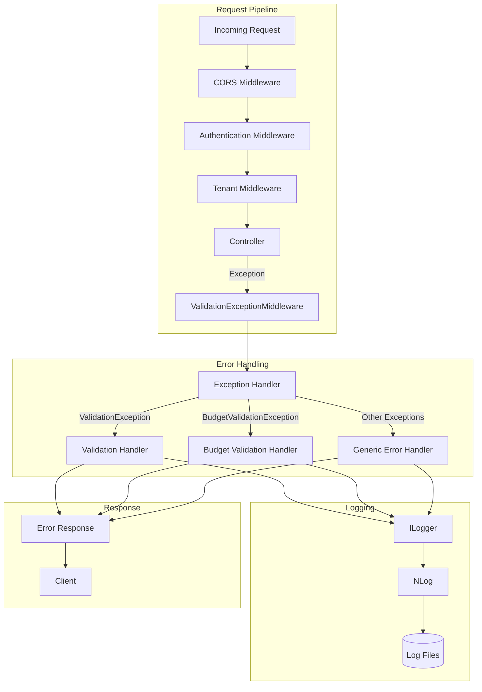
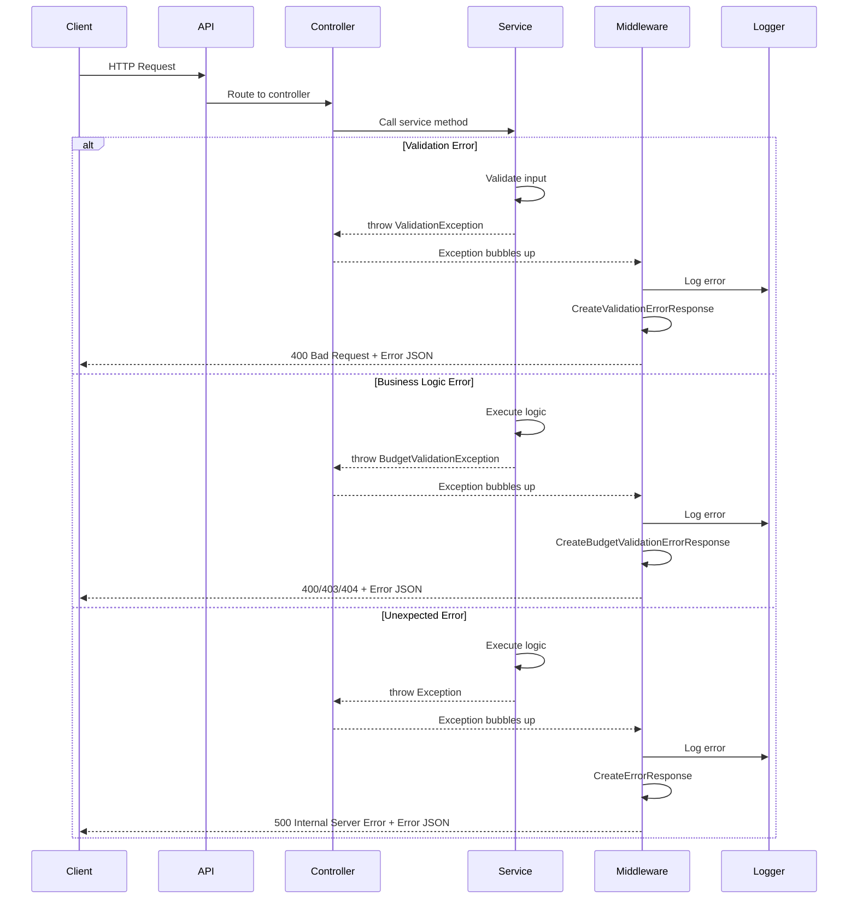

# Error Handling

## Overview

The EDR application implements a comprehensive error handling system using global exception middleware, standardized error response formats, and integration with the logging infrastructure. The system ensures consistent error responses across all API endpoints and provides detailed error information for debugging while protecting sensitive data in production.

## Business Value

- **Consistency**: Uniform error responses across all endpoints
- **Debugging**: Detailed error information for developers
- **User Experience**: Clear, actionable error messages
- **Security**: Prevents sensitive information leakage
- **Monitoring**: Integration with logging for error tracking
- **Compliance**: Audit trail of errors and exceptions

## Architecture



## Exception Types

### Built-in Exception Types

| Exception Type | HTTP Status | Use Case |
|----------------|-------------|----------|
| `ValidationException` | 400 Bad Request | FluentValidation failures |
| `BudgetValidationException` | 400/403/404 | Budget-specific validation |
| `UnauthorizedAccessException` | 403 Forbidden | Permission denied |
| `ArgumentException` | 400 Bad Request | Invalid arguments |
| `NotFoundException` | 404 Not Found | Resource not found |
| `Generic Exception` | 500 Internal Server Error | Unexpected errors |

### Custom Exception Classes

```csharp
// BudgetValidationException.cs
public class BudgetValidationException : Exception
{
    public BudgetValidationErrorCodes ErrorCode { get; }
    public Dictionary<string, string[]> ValidationErrors { get; }
    
    public BudgetValidationException(
        BudgetValidationErrorCodes errorCode,
        string message,
        Dictionary<string, string[]> validationErrors = null)
        : base(message)
    {
        ErrorCode = errorCode;
        ValidationErrors = validationErrors ?? new Dictionary<string, string[]>();
    }
}

public enum BudgetValidationErrorCodes
{
    ProjectNotFound,
    PermissionDenied,
    InvalidBudgetData,
    BudgetExceeded,
    InvalidDateRange
}
```

## Middleware Implementation

### ValidationExceptionMiddleware

**Location**: `backend/src/NJSAPI/Middleware/ValidationExceptionMiddleware.cs`

```csharp
public class ValidationExceptionMiddleware
{
    private readonly RequestDelegate _next;
    private readonly ILogger<ValidationExceptionMiddleware> _logger;

    public ValidationExceptionMiddleware(
        RequestDelegate next, 
        ILogger<ValidationExceptionMiddleware> logger)
    {
        _next = next;
        _logger = logger;
    }

    public async Task InvokeAsync(HttpContext context)
    {
        try
        {
            await _next(context);
        }
        catch (Exception ex)
        {
            await HandleExceptionAsync(context, ex);
        }
    }

    private async Task HandleExceptionAsync(HttpContext context, Exception exception)
    {
        context.Response.ContentType = "application/json";

        var response = exception switch
        {
            ValidationException validationEx => 
                CreateValidationErrorResponse(validationEx),
            BudgetValidationException budgetEx => 
                CreateBudgetValidationErrorResponse(budgetEx),
            UnauthorizedAccessException => 
                CreateErrorResponse(
                    HttpStatusCode.Forbidden, 
                    "Access denied", 
                    "You do not have permission to perform this action"),
            ArgumentException argEx => 
                CreateErrorResponse(
                    HttpStatusCode.BadRequest, 
                    "Invalid argument", 
                    argEx.Message),
            _ => 
                CreateErrorResponse(
                    HttpStatusCode.InternalServerError, 
                    "Internal server error", 
                    "An unexpected error occurred")
        };

        context.Response.StatusCode = (int)response.StatusCode;

        _logger.LogError(exception, 
            "Exception handled by ValidationExceptionMiddleware: {ExceptionType}", 
            exception.GetType().Name);

        var jsonResponse = JsonSerializer.Serialize(response.Body, 
            new JsonSerializerOptions
            {
                PropertyNamingPolicy = JsonNamingPolicy.CamelCase
            });

        await context.Response.WriteAsync(jsonResponse);
    }
}
```

## Error Response Formats

### Standard Error Response

```json
{
    "success": false,
    "message": "Error description",
    "title": "Error title",
    "statusCode": 400,
    "timestamp": "2024-11-28T10:30:00Z"
}
```

### Validation Error Response

```json
{
    "success": false,
    "message": "Validation failed",
    "errors": {
        "projectName": [
            "Project name is required",
            "Project name must be at least 3 characters"
        ],
        "estimatedCost": [
            "Estimated cost must be greater than 0"
        ]
    },
    "statusCode": 400,
    "timestamp": "2024-11-28T10:30:00Z"
}
```

### Budget Validation Error Response

```json
{
    "success": false,
    "message": "Budget validation failed",
    "errorCode": "BudgetExceeded",
    "errors": {
        "totalBudget": [
            "Total budget exceeds project limit"
        ],
        "lineItem": [
            "Line item budget cannot be negative"
        ]
    },
    "statusCode": 400,
    "timestamp": "2024-11-28T10:30:00Z"
}
```

### Unauthorized Error Response

```json
{
    "success": false,
    "message": "You do not have permission to perform this action",
    "title": "Access denied",
    "statusCode": 403,
    "timestamp": "2024-11-28T10:30:00Z"
}
```

### Internal Server Error Response

```json
{
    "success": false,
    "message": "An unexpected error occurred",
    "title": "Internal server error",
    "statusCode": 500,
    "timestamp": "2024-11-28T10:30:00Z"
}
```

## Error Handling Flow



## Logging Integration

### Error Logging

All exceptions are logged with appropriate log levels:

```csharp
_logger.LogError(exception, 
    "Exception handled by ValidationExceptionMiddleware: {ExceptionType}", 
    exception.GetType().Name);
```

### Log Output Example

```json
{
    "@timestamp": "2024-11-28T10:30:00.000Z",
    "@level": "ERROR",
    "@logger": "ValidationExceptionMiddleware",
    "@message": "Exception handled by ValidationExceptionMiddleware: ValidationException",
    "@exception": "FluentValidation.ValidationException: Validation failed\n   at ..."
}
```

## Controller-Level Error Handling

### Try-Catch Pattern

```csharp
[HttpPost]
public async Task<IActionResult> CreateProject(CreateProjectDto dto)
{
    try
    {
        var result = await _projectService.CreateAsync(dto);
        return Ok(new { success = true, data = result });
    }
    catch (ValidationException ex)
    {
        // Middleware will handle this
        throw;
    }
    catch (Exception ex)
    {
        _logger.LogError(ex, "Error creating project");
        // Middleware will handle this
        throw;
    }
}
```

### Model State Validation

```csharp
[HttpPost]
public async Task<IActionResult> CreateProject(CreateProjectDto dto)
{
    if (!ModelState.IsValid)
    {
        return BadRequest(new
        {
            success = false,
            message = "Validation failed",
            errors = ModelState.ToDictionary(
                kvp => kvp.Key,
                kvp => kvp.Value.Errors.Select(e => e.ErrorMessage).ToArray()
            )
        });
    }
    
    // Process request
}
```

## FluentValidation Integration

### Validator Example

```csharp
public class CreateProjectValidator : AbstractValidator<CreateProjectDto>
{
    public CreateProjectValidator()
    {
        RuleFor(x => x.ProjectName)
            .NotEmpty().WithMessage("Project name is required")
            .MinimumLength(3).WithMessage("Project name must be at least 3 characters")
            .MaximumLength(255).WithMessage("Project name cannot exceed 255 characters");
            
        RuleFor(x => x.EstimatedProjectCost)
            .GreaterThan(0).WithMessage("Estimated cost must be greater than 0");
            
        RuleFor(x => x.StartDate)
            .LessThan(x => x.EndDate)
            .When(x => x.EndDate.HasValue)
            .WithMessage("Start date must be before end date");
    }
}
```

### Automatic Validation

```csharp
// Registered in Program.cs
builder.Services.AddFluentValidation(fv => 
    fv.RegisterValidatorsFromAssemblyContaining<CreateProjectValidator>());

// Automatically validates before controller action
[HttpPost]
public async Task<IActionResult> CreateProject(
    [FromBody] CreateProjectDto dto) // Automatically validated
{
    // If validation fails, ValidationException is thrown
    // Middleware catches and returns 400 with error details
}
```

## Frontend Error Handling

### API Service Error Handling

```typescript
// API service with error handling
export const projectApi = {
    create: async (dto: CreateProjectDto): Promise<Project> => {
        try {
            const response = await axios.post<ApiResponse<Project>>(
                '/api/projects',
                dto
            );
            return response.data.data;
        } catch (error) {
            if (axios.isAxiosError(error)) {
                const errorResponse = error.response?.data;
                throw new ApiError(
                    errorResponse?.message || 'Failed to create project',
                    errorResponse?.errors || {},
                    error.response?.status || 500
                );
            }
            throw error;
        }
    }
};
```

### React Component Error Handling

```typescript
const CreateProjectForm: React.FC = () => {
    const [errors, setErrors] = useState<Record<string, string[]>>({});
    const [generalError, setGeneralError] = useState<string>('');

    const handleSubmit = async (data: CreateProjectDto) => {
        try {
            setErrors({});
            setGeneralError('');
            
            await projectApi.create(data);
            
            // Success handling
            showSuccessMessage('Project created successfully');
        } catch (error) {
            if (error instanceof ApiError) {
                if (error.statusCode === 400) {
                    // Validation errors
                    setErrors(error.errors);
                } else if (error.statusCode === 403) {
                    // Permission error
                    setGeneralError('You do not have permission to create projects');
                } else {
                    // Other errors
                    setGeneralError(error.message);
                }
            } else {
                setGeneralError('An unexpected error occurred');
            }
        }
    };

    return (
        <form onSubmit={handleSubmit}>
            {generalError && <Alert severity="error">{generalError}</Alert>}
            
            <TextField
                name="projectName"
                error={!!errors.projectName}
                helperText={errors.projectName?.join(', ')}
            />
            
            {/* Other fields */}
        </form>
    );
};
```

## Configuration

### Middleware Registration

**File**: `Program.cs`

```csharp
var app = builder.Build();

// Middleware order is important
app.UseCors("AllowSpecificOrigin");
app.UseResponseCompression();
app.UseHttpsRedirection();
app.UseMiddleware<TenantResolverMiddleware>();
app.UseAuthentication();
app.UseAuthorization();
app.UseMiddleware<TenantMiddleware>();
app.UseMiddleware<ValidationExceptionMiddleware>(); // Error handling

app.MapControllers();
app.Run();
```

## Testing

### Unit Tests

**Location**: `backend/NJS.API.Tests/Middleware/ExceptionHandlingMiddlewareTests.cs`

```csharp
[Fact]
public async Task HandleException_ValidationException_Returns400()
{
    // Arrange
    var context = new DefaultHttpContext();
    var exception = new ValidationException("Validation failed");
    
    // Act
    await _middleware.HandleExceptionAsync(context, exception);
    
    // Assert
    Assert.Equal(400, context.Response.StatusCode);
    Assert.Equal("application/json", context.Response.ContentType);
}

[Fact]
public async Task HandleException_UnauthorizedException_Returns403()
{
    // Arrange
    var context = new DefaultHttpContext();
    var exception = new UnauthorizedAccessException();
    
    // Act
    await _middleware.HandleExceptionAsync(context, exception);
    
    // Assert
    Assert.Equal(403, context.Response.StatusCode);
}

[Fact]
public async Task HandleException_GenericException_Returns500()
{
    // Arrange
    var context = new DefaultHttpContext();
    var exception = new Exception("Unexpected error");
    
    // Act
    await _middleware.HandleExceptionAsync(context, exception);
    
    // Assert
    Assert.Equal(500, context.Response.StatusCode);
}
```

### Integration Tests

```csharp
[Fact]
public async Task CreateProject_InvalidData_Returns400WithValidationErrors()
{
    // Arrange
    var client = _factory.CreateClient();
    var invalidDto = new CreateProjectDto { ProjectName = "" }; // Invalid
    
    // Act
    var response = await client.PostAsJsonAsync("/api/projects", invalidDto);
    
    // Assert
    Assert.Equal(HttpStatusCode.BadRequest, response.StatusCode);
    
    var content = await response.Content.ReadAsStringAsync();
    var errorResponse = JsonSerializer.Deserialize<ErrorResponse>(content);
    
    Assert.False(errorResponse.Success);
    Assert.Contains("projectName", errorResponse.Errors.Keys);
}
```

## Best Practices

### Do's ✅

- Always use specific exception types
- Include meaningful error messages
- Log all exceptions with context
- Return appropriate HTTP status codes
- Sanitize error messages in production
- Use FluentValidation for input validation
- Handle errors at the appropriate level
- Provide actionable error messages to users

### Don'ts ❌

- Don't expose sensitive information in errors
- Don't return stack traces to clients in production
- Don't swallow exceptions without logging
- Don't use generic error messages
- Don't return 200 OK with error in body
- Don't log sensitive data (passwords, tokens)
- Don't catch exceptions you can't handle

## Troubleshooting

### Common Issues

| Issue | Cause | Solution |
|-------|-------|----------|
| 500 errors not logged | Middleware not registered | Check middleware order in Program.cs |
| Validation errors not caught | FluentValidation not configured | Register validators in DI container |
| Error details exposed | Production mode not set | Set ASPNETCORE_ENVIRONMENT=Production |
| Errors not reaching middleware | Exception caught in controller | Let exceptions bubble up |

### Debug Tips

- Check NLog files for detailed error logs
- Use Postman to test error scenarios
- Review middleware order in Program.cs
- Verify exception types are handled in middleware
- Check HTTP status codes match exception types

## Performance Considerations

- Error handling middleware is lightweight
- Logging is asynchronous
- JSON serialization is optimized
- No database calls in error handling
- Minimal memory allocation

## Security Considerations

- Never expose stack traces in production
- Sanitize error messages
- Don't leak database schema information
- Log security-related errors
- Rate limit error responses to prevent DoS

## Related Documentation

- [Logging Infrastructure](./LOGGING.md)
- [Authentication](./AUTHENTICATION.md)
- [API Documentation](../API_DOCUMENTATION.md)
- [Testing Guide](../NJS_API_Unit_Testing.md)

---

**Last Updated**: November 28, 2024  
**Version**: 1.0  
**Maintained By**: EDR Development Team
