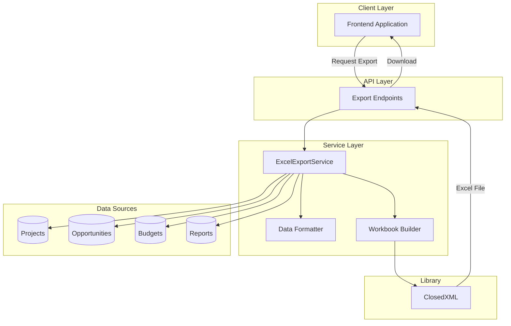
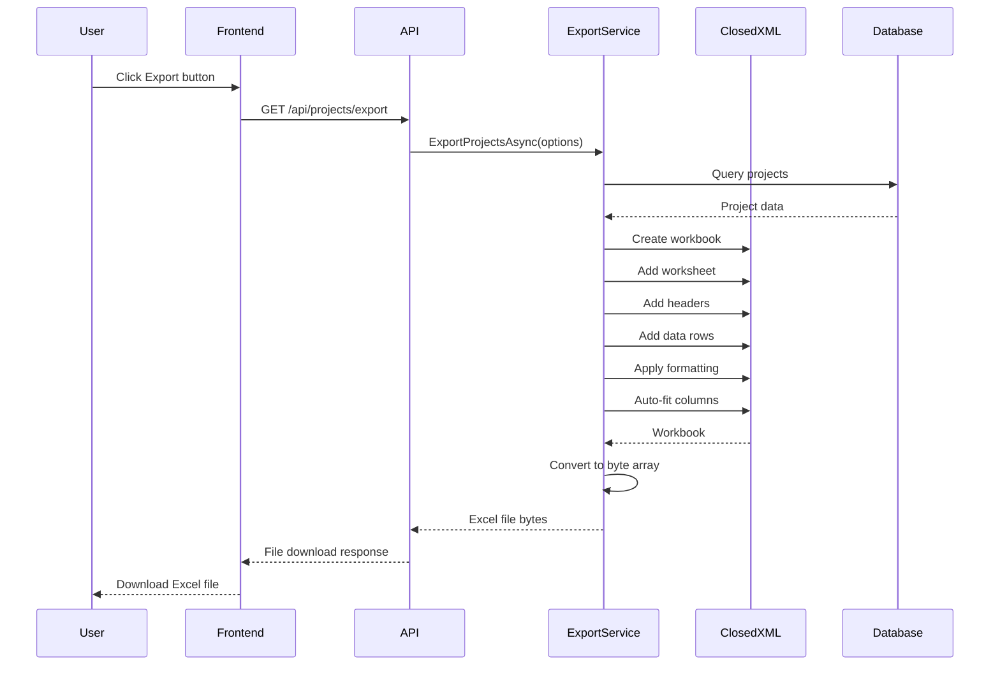

# Excel Export Service

## Overview

The EDR application provides Excel export capabilities using ClosedXML library, enabling users to export data from various modules into formatted Excel spreadsheets. The service supports custom formatting, multiple sheets, charts, and complex data structures.

## Business Value

- **Reporting**: Generate formatted reports for stakeholders
- **Data Analysis**: Export data for offline analysis
- **Compliance**: Provide audit-ready documentation
- **Integration**: Share data with external systems
- **Flexibility**: Customizable export formats
- **User Experience**: Familiar Excel format for users

## Architecture



## Technology Stack

| Component | Technology | Version |
|-----------|-----------|---------|
| Excel Library | ClosedXML | 0.102.1 |
| Compression | System.IO.Compression | .NET 8.0 |
| Serialization | System.Text.Json | .NET 8.0 |

## Service Implementation

### ExcelExportService Interface

```csharp
public interface IExcelExportService
{
    Task<byte[]> ExportProjectsAsync(ProjectExportOptions options);
    Task<byte[]> ExportOpportunitiesAsync(OpportunityExportOptions options);
    Task<byte[]> ExportBudgetReportAsync(int projectId);
    Task<byte[]> ExportMonthlyProgressAsync(int projectId, int year);
    Task<byte[]> ExportCustomDataAsync<T>(
        IEnumerable<T> data, 
        ExcelExportOptions options);
}
```

### Basic Export Implementation

```csharp
public class ExcelExportService : IExcelExportService
{
    private readonly ILogger<ExcelExportService> _logger;
    
    public ExcelExportService(ILogger<ExcelExportService> logger)
    {
        _logger = logger;
    }
    
    public async Task<byte[]> ExportProjectsAsync(ProjectExportOptions options)
    {
        try
        {
            using var workbook = new XLWorkbook();
            var worksheet = workbook.Worksheets.Add("Projects");
            
            // Add headers
            worksheet.Cell(1, 1).Value = "Project ID";
            worksheet.Cell(1, 2).Value = "Project Name";
            worksheet.Cell(1, 3).Value = "Status";
            worksheet.Cell(1, 4).Value = "Estimated Cost";
            worksheet.Cell(1, 5).Value = "Start Date";
            worksheet.Cell(1, 6).Value = "End Date";
            
            // Style headers
            var headerRange = worksheet.Range(1, 1, 1, 6);
            headerRange.Style.Font.Bold = true;
            headerRange.Style.Fill.BackgroundColor = XLColor.LightBlue;
            headerRange.Style.Alignment.Horizontal = XLAlignmentHorizontalValues.Center;
            
            // Add data
            var projects = await GetProjectsAsync(options);
            int row = 2;
            foreach (var project in projects)
            {
                worksheet.Cell(row, 1).Value = project.ProjectId;
                worksheet.Cell(row, 2).Value = project.ProjectName;
                worksheet.Cell(row, 3).Value = project.Status;
                worksheet.Cell(row, 4).Value = project.EstimatedProjectCost;
                worksheet.Cell(row, 5).Value = project.StartDate;
                worksheet.Cell(row, 6).Value = project.EndDate;
                row++;
            }
            
            // Format currency
            worksheet.Column(4).Style.NumberFormat.Format = "$#,##0.00";
            
            // Format dates
            worksheet.Column(5).Style.DateFormat.Format = "yyyy-MM-dd";
            worksheet.Column(6).Style.DateFormat.Format = "yyyy-MM-dd";
            
            // Auto-fit columns
            worksheet.Columns().AdjustToContents();
            
            // Convert to byte array
            using var stream = new MemoryStream();
            workbook.SaveAs(stream);
            return stream.ToArray();
        }
        catch (Exception ex)
        {
            _logger.LogError(ex, "Error exporting projects to Excel");
            throw;
        }
    }
}
```

## Export Flow



## API Endpoints

### Export Projects

```http
GET /api/projects/export
Authorization: Bearer {token}
Query Parameters:
- status: Filter by status (optional)
- regionId: Filter by region (optional)
- startDate: Filter by start date (optional)
- endDate: Filter by end date (optional)
- format: xlsx | csv (default: xlsx)

Response: 200 OK
Content-Type: application/vnd.openxmlformats-officedocument.spreadsheetml.sheet
Content-Disposition: attachment; filename="projects-export-2024-11-28.xlsx"

[Binary Excel file data]
```

### Export Opportunities

```http
GET /api/opportunities/export
Authorization: Bearer {token}
Query Parameters:
- status: Filter by status (optional)
- client: Filter by client (optional)
- dateFrom: Filter by date range (optional)
- dateTo: Filter by date range (optional)

Response: 200 OK
Content-Type: application/vnd.openxmlformats-officedocument.spreadsheetml.sheet
Content-Disposition: attachment; filename="opportunities-export-2024-11-28.xlsx"

[Binary Excel file data]
```

### Export Budget Report

```http
GET /api/projects/{projectId}/budget/export
Authorization: Bearer {token}

Response: 200 OK
Content-Type: application/vnd.openxmlformats-officedocument.spreadsheetml.sheet
Content-Disposition: attachment; filename="project-123-budget-2024-11-28.xlsx"

[Binary Excel file data]
```

## Advanced Features

### Multiple Sheets

```csharp
public async Task<byte[]> ExportProjectWithDetailsAsync(int projectId)
{
    using var workbook = new XLWorkbook();
    
    // Sheet 1: Project Summary
    var summarySheet = workbook.Worksheets.Add("Summary");
    AddProjectSummary(summarySheet, projectId);
    
    // Sheet 2: Budget Details
    var budgetSheet = workbook.Worksheets.Add("Budget");
    AddBudgetDetails(budgetSheet, projectId);
    
    // Sheet 3: Monthly Progress
    var progressSheet = workbook.Worksheets.Add("Progress");
    AddMonthlyProgress(progressSheet, projectId);
    
    // Sheet 4: Resources
    var resourceSheet = workbook.Worksheets.Add("Resources");
    AddResources(resourceSheet, projectId);
    
    using var stream = new MemoryStream();
    workbook.SaveAs(stream);
    return stream.ToArray();
}
```

### Custom Formatting

```csharp
private void ApplyCustomFormatting(IXLWorksheet worksheet)
{
    // Header row
    var headerRow = worksheet.Row(1);
    headerRow.Style.Font.Bold = true;
    headerRow.Style.Font.FontSize = 12;
    headerRow.Style.Fill.BackgroundColor = XLColor.DarkBlue;
    headerRow.Style.Font.FontColor = XLColor.White;
    headerRow.Style.Alignment.Horizontal = XLAlignmentHorizontalValues.Center;
    
    // Alternating row colors
    for (int i = 2; i <= worksheet.LastRowUsed().RowNumber(); i++)
    {
        if (i % 2 == 0)
        {
            worksheet.Row(i).Style.Fill.BackgroundColor = XLColor.LightGray;
        }
    }
    
    // Borders
    var dataRange = worksheet.Range(1, 1, worksheet.LastRowUsed().RowNumber(), worksheet.LastColumnUsed().ColumnNumber());
    dataRange.Style.Border.OutsideBorder = XLBorderStyleValues.Thick;
    dataRange.Style.Border.InsideBorder = XLBorderStyleValues.Thin;
    
    // Freeze header row
    worksheet.SheetView.FreezeRows(1);
}
```

### Formulas and Calculations

```csharp
private void AddSummaryWithFormulas(IXLWorksheet worksheet, int lastRow)
{
    // Add total row
    int totalRow = lastRow + 2;
    worksheet.Cell(totalRow, 1).Value = "TOTAL:";
    worksheet.Cell(totalRow, 1).Style.Font.Bold = true;
    
    // Sum formula for estimated cost
    worksheet.Cell(totalRow, 4).FormulaA1 = $"=SUM(D2:D{lastRow})";
    worksheet.Cell(totalRow, 4).Style.Font.Bold = true;
    worksheet.Cell(totalRow, 4).Style.NumberFormat.Format = "$#,##0.00";
    
    // Average formula
    worksheet.Cell(totalRow + 1, 1).Value = "AVERAGE:";
    worksheet.Cell(totalRow + 1, 4).FormulaA1 = $"=AVERAGE(D2:D{lastRow})";
    worksheet.Cell(totalRow + 1, 4).Style.NumberFormat.Format = "$#,##0.00";
}
```

### Charts

```csharp
private void AddChart(IXLWorksheet worksheet)
{
    // Add chart
    var chart = worksheet.Charts.Add(XLChartType.ColumnClustered, 10, 1, 25, 10);
    chart.SetTitle("Project Budget by Status");
    
    // Set data range
    var dataRange = worksheet.Range("A2:B10");
    chart.SetDataRange(dataRange);
    
    // Customize chart
    chart.Legend.Position = XLLegendPosition.Bottom;
    chart.Style = XLChartStyle.Style15;
}
```

### Conditional Formatting

```csharp
private void ApplyConditionalFormatting(IXLWorksheet worksheet)
{
    // Highlight overbudget projects in red
    var budgetColumn = worksheet.Column(4);
    var rule = budgetColumn.AddConditionalFormat();
    rule.WhenGreaterThan(1000000)
        .Fill.SetBackgroundColor(XLColor.Red)
        .Font.SetFontColor(XLColor.White);
    
    // Highlight on-track projects in green
    var statusColumn = worksheet.Column(3);
    var statusRule = statusColumn.AddConditionalFormat();
    statusRule.WhenEquals("Active")
        .Fill.SetBackgroundColor(XLColor.Green)
        .Font.SetFontColor(XLColor.White);
}
```

## Controller Implementation

```csharp
[ApiController]
[Route("api/[controller]")]
[Authorize]
public class ExportController : ControllerBase
{
    private readonly IExcelExportService _exportService;
    private readonly ILogger<ExportController> _logger;
    
    public ExportController(
        IExcelExportService exportService,
        ILogger<ExportController> logger)
    {
        _exportService = exportService;
        _logger = logger;
    }
    
    [HttpGet("projects")]
    public async Task<IActionResult> ExportProjects([FromQuery] ProjectExportOptions options)
    {
        try
        {
            var fileBytes = await _exportService.ExportProjectsAsync(options);
            var fileName = $"projects-export-{DateTime.Now:yyyy-MM-dd}.xlsx";
            
            return File(
                fileBytes,
                "application/vnd.openxmlformats-officedocument.spreadsheetml.sheet",
                fileName
            );
        }
        catch (Exception ex)
        {
            _logger.LogError(ex, "Error exporting projects");
            return StatusCode(500, new { message = "Error generating export" });
        }
    }
    
    [HttpGet("projects/{projectId}/budget")]
    public async Task<IActionResult> ExportProjectBudget(int projectId)
    {
        try
        {
            var fileBytes = await _exportService.ExportBudgetReportAsync(projectId);
            var fileName = $"project-{projectId}-budget-{DateTime.Now:yyyy-MM-dd}.xlsx";
            
            return File(
                fileBytes,
                "application/vnd.openxmlformats-officedocument.spreadsheetml.sheet",
                fileName
            );
        }
        catch (Exception ex)
        {
            _logger.LogError(ex, "Error exporting budget for project {ProjectId}", projectId);
            return StatusCode(500, new { message = "Error generating export" });
        }
    }
}
```

## Frontend Implementation

### Export Button Component

```typescript
const ExportButton: React.FC<ExportButtonProps> = ({ exportType, filters }) => {
    const [exporting, setExporting] = useState(false);

    const handleExport = async () => {
        setExporting(true);
        try {
            const queryParams = new URLSearchParams(filters).toString();
            const response = await axios.get(
                `/api/export/${exportType}?${queryParams}`,
                {
                    responseType: 'blob'
                }
            );

            // Create download link
            const url = window.URL.createObjectURL(new Blob([response.data]));
            const link = document.createElement('a');
            link.href = url;
            
            // Extract filename from Content-Disposition header
            const contentDisposition = response.headers['content-disposition'];
            const fileName = contentDisposition
                ? contentDisposition.split('filename=')[1].replace(/"/g, '')
                : `export-${Date.now()}.xlsx`;
            
            link.setAttribute('download', fileName);
            document.body.appendChild(link);
            link.click();
            link.remove();
            window.URL.revokeObjectURL(url);
            
            showSuccessMessage('Export completed successfully');
        } catch (error) {
            showErrorMessage('Failed to export data');
        } finally {
            setExporting(false);
        }
    };

    return (
        <Button
            variant="contained"
            startIcon={<DownloadIcon />}
            onClick={handleExport}
            disabled={exporting}
        >
            {exporting ? 'Exporting...' : 'Export to Excel'}
        </Button>
    );
};
```

## Performance Optimization

### Streaming Large Exports

```csharp
[HttpGet("projects/large-export")]
public async Task<IActionResult> ExportLargeDataset()
{
    var stream = new MemoryStream();
    
    using (var workbook = new XLWorkbook())
    {
        var worksheet = workbook.Worksheets.Add("Projects");
        
        // Process data in batches
        int batchSize = 1000;
        int currentRow = 2;
        int skip = 0;
        
        while (true)
        {
            var batch = await GetProjectsBatchAsync(skip, batchSize);
            if (!batch.Any()) break;
            
            foreach (var project in batch)
            {
                // Add row data
                worksheet.Cell(currentRow, 1).Value = project.ProjectId;
                worksheet.Cell(currentRow, 2).Value = project.ProjectName;
                // ... other columns
                currentRow++;
            }
            
            skip += batchSize;
        }
        
        workbook.SaveAs(stream);
    }
    
    stream.Position = 0;
    return File(stream, "application/vnd.openxmlformats-officedocument.spreadsheetml.sheet", "large-export.xlsx");
}
```

### Async Processing

```csharp
public async Task<byte[]> ExportAsync<T>(IEnumerable<T> data)
{
    return await Task.Run(() =>
    {
        using var workbook = new XLWorkbook();
        var worksheet = workbook.Worksheets.Add("Data");
        
        // Add data
        worksheet.Cell(1, 1).InsertTable(data);
        
        using var stream = new MemoryStream();
        workbook.SaveAs(stream);
        return stream.ToArray();
    });
}
```

## Configuration

### Service Registration

```csharp
// Program.cs
builder.Services.AddScoped<IExcelExportService, ExcelExportService>();
```

### Export Options

```csharp
public class ExcelExportOptions
{
    public string SheetName { get; set; } = "Data";
    public bool IncludeHeaders { get; set; } = true;
    public bool AutoFitColumns { get; set; } = true;
    public bool ApplyFormatting { get; set; } = true;
    public string DateFormat { get; set; } = "yyyy-MM-dd";
    public string CurrencyFormat { get; set; } = "$#,##0.00";
}
```

## Best Practices

### Do's ✅

- Use streaming for large datasets
- Apply appropriate formatting
- Include headers and metadata
- Auto-fit columns for readability
- Use formulas for calculations
- Freeze header rows
- Add filters to data ranges
- Provide meaningful sheet names

### Don'ts ❌

- Don't load entire dataset into memory
- Don't export sensitive data without authorization
- Don't skip error handling
- Don't forget to dispose workbook objects
- Don't use hardcoded file paths
- Don't ignore performance for large exports

## Testing

### Unit Tests

```csharp
[Fact]
public async Task ExportProjects_ValidData_ReturnsExcelFile()
{
    // Arrange
    var options = new ProjectExportOptions();
    
    // Act
    var result = await _exportService.ExportProjectsAsync(options);
    
    // Assert
    Assert.NotNull(result);
    Assert.True(result.Length > 0);
    
    // Verify it's a valid Excel file
    using var stream = new MemoryStream(result);
    using var workbook = new XLWorkbook(stream);
    Assert.Single(workbook.Worksheets);
}
```

### Integration Tests

```csharp
[Fact]
public async Task ExportEndpoint_ReturnsExcelFile()
{
    // Arrange
    var client = _factory.CreateClient();
    
    // Act
    var response = await client.GetAsync("/api/export/projects");
    
    // Assert
    Assert.Equal(HttpStatusCode.OK, response.StatusCode);
    Assert.Equal(
        "application/vnd.openxmlformats-officedocument.spreadsheetml.sheet",
        response.Content.Headers.ContentType.MediaType
    );
}
```

## Troubleshooting

### Common Issues

| Issue | Cause | Solution |
|-------|-------|----------|
| Out of memory | Large dataset | Use streaming or batching |
| Slow export | Complex formatting | Simplify formatting or use async |
| Corrupted file | Improper disposal | Ensure workbook is disposed |
| Missing data | Query timeout | Optimize database queries |

## Related Documentation

- [File Management](./FILE_MANAGEMENT.md)
- [API Documentation](../API_DOCUMENTATION.md)
- [Error Handling](./ERROR_HANDLING.md)

---

**Last Updated**: November 28, 2024  
**Version**: 1.0  
**Status**: Partially Implemented  
**Maintained By**: EDR Development Team

**Note**: This documentation describes the planned Excel export system using ClosedXML. Implementation may vary based on actual requirements.
