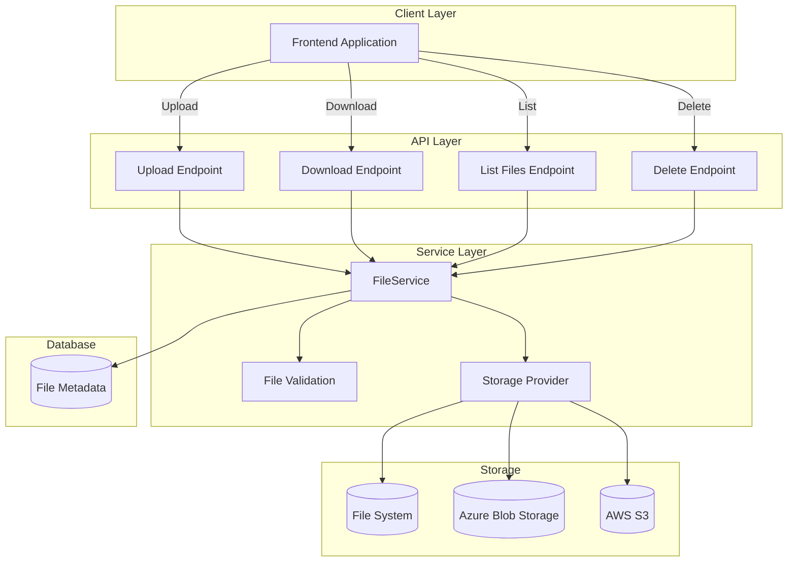
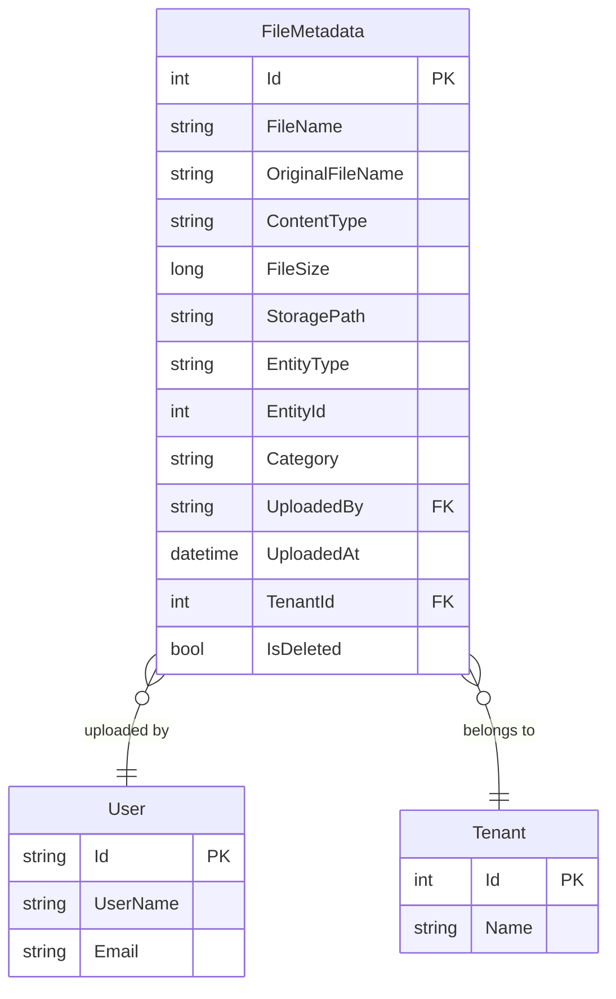
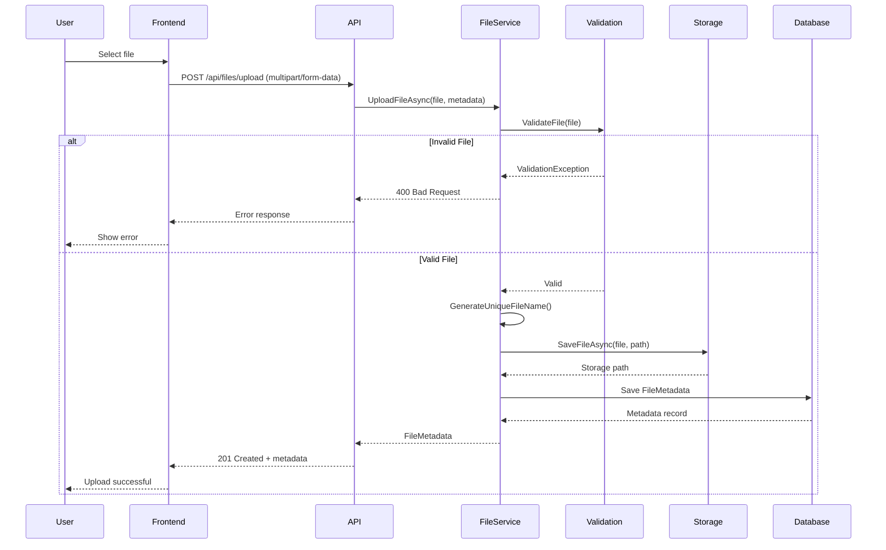

# File Management

## Overview

The EDR application provides file management capabilities for uploading, downloading, and managing documents and attachments across various modules. The system supports multiple file types, implements security controls, and integrates with the storage infrastructure.

## Business Value

- **Document Storage**: Centralized file storage for all modules
- **Collaboration**: Share documents across teams
- **Compliance**: Audit trail of file operations
- **Security**: Access control and validation
- **Organization**: Categorized file management
- **Integration**: Seamless integration with business modules

## Architecture



## Database Schema

### FileMetadata Entity (Proposed)



### Table Definition (Proposed)

```sql
CREATE TABLE FileMetadata (
    Id INT PRIMARY KEY IDENTITY(1,1),
    FileName NVARCHAR(255) NOT NULL,
    OriginalFileName NVARCHAR(255) NOT NULL,
    ContentType NVARCHAR(100) NOT NULL,
    FileSize BIGINT NOT NULL,
    StoragePath NVARCHAR(500) NOT NULL,
    EntityType NVARCHAR(50) NOT NULL,
    EntityId INT NOT NULL,
    Category NVARCHAR(50),
    UploadedBy NVARCHAR(450) NOT NULL,
    UploadedAt DATETIME NOT NULL DEFAULT GETUTCDATE(),
    TenantId INT NOT NULL,
    IsDeleted BIT NOT NULL DEFAULT 0,
    
    CONSTRAINT FK_FileMetadata_User 
        FOREIGN KEY (UploadedBy) REFERENCES AspNetUsers(Id),
    CONSTRAINT FK_FileMetadata_Tenant 
        FOREIGN KEY (TenantId) REFERENCES Tenant(Id)
);

CREATE INDEX IX_FileMetadata_EntityType_EntityId 
    ON FileMetadata(EntityType, EntityId);
CREATE INDEX IX_FileMetadata_TenantId 
    ON FileMetadata(TenantId);
CREATE INDEX IX_FileMetadata_UploadedBy 
    ON FileMetadata(UploadedBy);
CREATE INDEX IX_FileMetadata_UploadedAt 
    ON FileMetadata(UploadedAt DESC);
```

## File Upload Flow



## API Endpoints

### Upload File

```http
POST /api/files/upload
Authorization: Bearer {token}
Content-Type: multipart/form-data

Form Data:
- file: [binary file data]
- entityType: "Project" | "Opportunity" | "BidPreparation" | "Document"
- entityId: 123
- category: "Technical" | "Financial" | "Legal" | "General"
- description: "Optional description"

Response: 201 Created
{
    "success": true,
    "data": {
        "id": 456,
        "fileName": "abc123-document.pdf",
        "originalFileName": "technical-specs.pdf",
        "contentType": "application/pdf",
        "fileSize": 2048576,
        "uploadedAt": "2024-11-28T10:30:00Z",
        "uploadedBy": "john.doe@example.com",
        "downloadUrl": "/api/files/456/download"
    }
}
```

### Download File

```http
GET /api/files/{id}/download
Authorization: Bearer {token}

Response: 200 OK
Content-Type: application/pdf
Content-Disposition: attachment; filename="technical-specs.pdf"

[Binary file data]
```

### List Files

```http
GET /api/files?entityType=Project&entityId=123
Authorization: Bearer {token}

Response: 200 OK
{
    "success": true,
    "data": [
        {
            "id": 456,
            "fileName": "abc123-document.pdf",
            "originalFileName": "technical-specs.pdf",
            "contentType": "application/pdf",
            "fileSize": 2048576,
            "category": "Technical",
            "uploadedAt": "2024-11-28T10:30:00Z",
            "uploadedBy": "john.doe@example.com"
        }
    ]
}
```

### Delete File

```http
DELETE /api/files/{id}
Authorization: Bearer {token}

Response: 204 No Content
```

## File Validation

### Allowed File Types

| Category | Extensions | MIME Types |
|----------|-----------|------------|
| Documents | .pdf, .doc, .docx | application/pdf, application/msword |
| Spreadsheets | .xls, .xlsx, .csv | application/vnd.ms-excel |
| Images | .jpg, .jpeg, .png, .gif | image/jpeg, image/png, image/gif |
| Archives | .zip, .rar, .7z | application/zip |
| Text | .txt, .md | text/plain, text/markdown |

### Validation Rules

```csharp
public class FileValidationService
{
    private const long MaxFileSize = 10 * 1024 * 1024; // 10 MB
    private static readonly string[] AllowedExtensions = 
    {
        ".pdf", ".doc", ".docx", ".xls", ".xlsx", ".csv",
        ".jpg", ".jpeg", ".png", ".gif", ".zip", ".txt"
    };
    
    public void ValidateFile(IFormFile file)
    {
        // Check if file is null or empty
        if (file == null || file.Length == 0)
        {
            throw new ValidationException("File is required");
        }
        
        // Check file size
        if (file.Length > MaxFileSize)
        {
            throw new ValidationException($"File size exceeds maximum allowed size of {MaxFileSize / 1024 / 1024} MB");
        }
        
        // Check file extension
        var extension = Path.GetExtension(file.FileName).ToLowerInvariant();
        if (!AllowedExtensions.Contains(extension))
        {
            throw new ValidationException($"File type {extension} is not allowed");
        }
        
        // Validate content type
        if (!IsValidContentType(file.ContentType, extension))
        {
            throw new ValidationException("File content type does not match extension");
        }
    }
    
    private bool IsValidContentType(string contentType, string extension)
    {
        // Implement content type validation
        return true;
    }
}
```

## Storage Configuration

### File System Storage

```csharp
public class FileSystemStorageProvider : IStorageProvider
{
    private readonly string _basePath;
    
    public FileSystemStorageProvider(IConfiguration configuration)
    {
        _basePath = configuration["FileStorage:BasePath"] ?? "C:\\FileStorage";
    }
    
    public async Task<string> SaveFileAsync(IFormFile file, string relativePath)
    {
        var fullPath = Path.Combine(_basePath, relativePath);
        var directory = Path.GetDirectoryName(fullPath);
        
        if (!Directory.Exists(directory))
        {
            Directory.CreateDirectory(directory);
        }
        
        using var stream = new FileStream(fullPath, FileMode.Create);
        await file.CopyToAsync(stream);
        
        return relativePath;
    }
    
    public async Task<Stream> GetFileAsync(string relativePath)
    {
        var fullPath = Path.Combine(_basePath, relativePath);
        
        if (!File.Exists(fullPath))
        {
            throw new FileNotFoundException("File not found", relativePath);
        }
        
        return File.OpenRead(fullPath);
    }
    
    public async Task DeleteFileAsync(string relativePath)
    {
        var fullPath = Path.Combine(_basePath, relativePath);
        
        if (File.Exists(fullPath))
        {
            File.Delete(fullPath);
        }
    }
}
```

### Configuration

**File**: `appsettings.json`

```json
{
  "FileStorage": {
    "Provider": "FileSystem",
    "BasePath": "C:\\FileStorage",
    "MaxFileSize": 10485760,
    "AllowedExtensions": [".pdf", ".doc", ".docx", ".xls", ".xlsx", ".jpg", ".png"]
  }
}
```

## Frontend Implementation

### File Upload Component

```typescript
const FileUpload: React.FC<FileUploadProps> = ({ entityType, entityId, onUploadComplete }) => {
    const [selectedFile, setSelectedFile] = useState<File | null>(null);
    const [uploading, setUploading] = useState(false);
    const [error, setError] = useState<string>('');

    const handleFileSelect = (event: React.ChangeEvent<HTMLInputElement>) => {
        const file = event.target.files?.[0];
        if (file) {
            // Validate file size
            if (file.size > 10 * 1024 * 1024) {
                setError('File size exceeds 10 MB');
                return;
            }
            setSelectedFile(file);
            setError('');
        }
    };

    const handleUpload = async () => {
        if (!selectedFile) return;

        setUploading(true);
        setError('');

        try {
            const formData = new FormData();
            formData.append('file', selectedFile);
            formData.append('entityType', entityType);
            formData.append('entityId', entityId.toString());
            formData.append('category', 'General');

            const response = await axios.post('/api/files/upload', formData, {
                headers: {
                    'Content-Type': 'multipart/form-data'
                }
            });

            onUploadComplete(response.data.data);
            setSelectedFile(null);
        } catch (err) {
            setError('Failed to upload file');
        } finally {
            setUploading(false);
        }
    };

    return (
        <Box>
            <input
                type="file"
                onChange={handleFileSelect}
                accept=".pdf,.doc,.docx,.xls,.xlsx,.jpg,.png"
            />
            {selectedFile && (
                <Box>
                    <Typography>{selectedFile.name}</Typography>
                    <Button
                        onClick={handleUpload}
                        disabled={uploading}
                    >
                        {uploading ? 'Uploading...' : 'Upload'}
                    </Button>
                </Box>
            )}
            {error && <Alert severity="error">{error}</Alert>}
        </Box>
    );
};
```

### File Download

```typescript
const downloadFile = async (fileId: number, fileName: string) => {
    try {
        const response = await axios.get(`/api/files/${fileId}/download`, {
            responseType: 'blob'
        });

        // Create download link
        const url = window.URL.createObjectURL(new Blob([response.data]));
        const link = document.createElement('a');
        link.href = url;
        link.setAttribute('download', fileName);
        document.body.appendChild(link);
        link.click();
        link.remove();
        window.URL.revokeObjectURL(url);
    } catch (error) {
        console.error('Failed to download file', error);
    }
};
```

## Security Considerations

### Access Control

- Verify user has permission to upload/download files
- Enforce tenant isolation
- Validate entity ownership

### File Validation

- Validate file extensions
- Check MIME types
- Scan for malware (if applicable)
- Limit file sizes

### Storage Security

- Store files outside web root
- Use unique file names to prevent overwrites
- Implement virus scanning
- Encrypt sensitive files

## Performance Optimization

### Streaming

```csharp
[HttpGet("{id}/download")]
public async Task<IActionResult> DownloadFile(int id)
{
    var fileMetadata = await _fileService.GetFileMetadataAsync(id);
    var stream = await _storageProvider.GetFileAsync(fileMetadata.StoragePath);
    
    return File(stream, fileMetadata.ContentType, fileMetadata.OriginalFileName);
}
```

### Chunked Upload (Large Files)

```typescript
const uploadLargeFile = async (file: File) => {
    const chunkSize = 1024 * 1024; // 1 MB chunks
    const chunks = Math.ceil(file.size / chunkSize);
    
    for (let i = 0; i < chunks; i++) {
        const start = i * chunkSize;
        const end = Math.min(start + chunkSize, file.size);
        const chunk = file.slice(start, end);
        
        const formData = new FormData();
        formData.append('chunk', chunk);
        formData.append('chunkIndex', i.toString());
        formData.append('totalChunks', chunks.toString());
        formData.append('fileName', file.name);
        
        await axios.post('/api/files/upload-chunk', formData);
    }
};
```

## Best Practices

### Do's ✅

- Validate all uploaded files
- Use unique file names
- Implement access control
- Log file operations
- Handle large files with streaming
- Provide progress feedback
- Clean up temporary files

### Don'ts ❌

- Don't trust client-side validation alone
- Don't store files in database (store metadata only)
- Don't expose file system paths
- Don't allow executable file uploads
- Don't skip virus scanning for production
- Don't use original file names directly

## Troubleshooting

### Common Issues

| Issue | Cause | Solution |
|-------|-------|----------|
| Upload fails | File too large | Increase max file size limit |
| Download fails | File not found | Check storage path and permissions |
| Slow uploads | Large file size | Implement chunked upload |
| Access denied | Permission issue | Verify user has access to entity |

## Related Documentation

- [Error Handling](./ERROR_HANDLING.md)
- [Authentication](./AUTHENTICATION.md)
- [API Documentation](../API_DOCUMENTATION.md)

---

**Last Updated**: November 28, 2024  
**Version**: 1.0  
**Status**: Partially Implemented  
**Maintained By**: EDR Development Team

**Note**: This documentation describes the planned file management system. Implementation may vary based on actual requirements.
