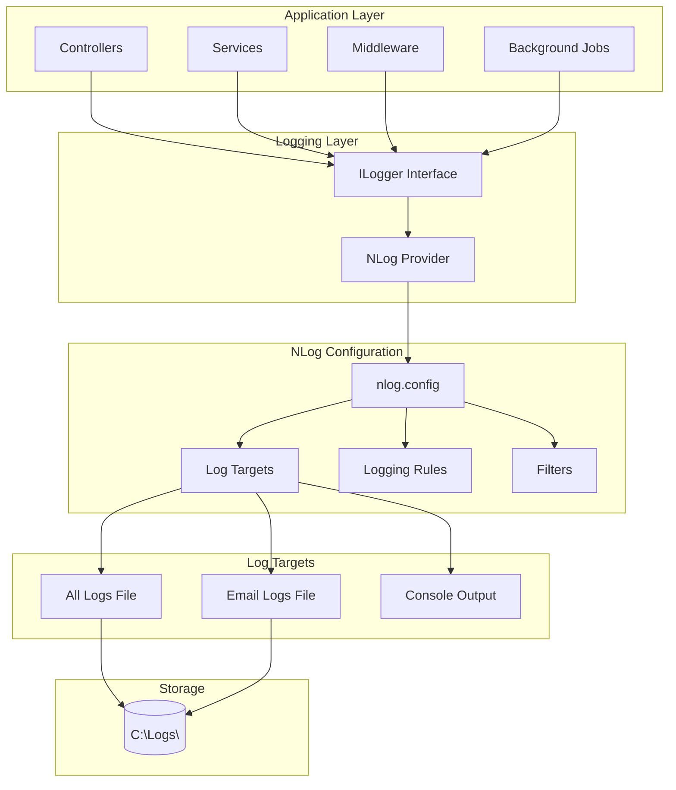

# Logging Infrastructure

## Overview

The EDR application uses NLog as its logging framework, providing structured logging with JSON format, multiple log targets, and comprehensive log management. The logging infrastructure captures application events, errors, and diagnostic information for monitoring, debugging, and compliance purposes.

## Business Value

- **Monitoring**: Real-time application health tracking
- **Debugging**: Detailed diagnostic information for troubleshooting
- **Compliance**: Audit trail of system activities
- **Performance**: Identify bottlenecks and optimization opportunities
- **Security**: Track security-related events and anomalies
- **Analytics**: Data for business intelligence and reporting

## Architecture



## NLog Configuration

### Configuration File

**Location**: `backend/src/NJSAPI/nlog.config`

```xml
<?xml version="1.0" encoding="utf-8"?>
<nlog xmlns="http://www.nlog-project.org/schemas/NLog.xsd" 
      xmlns:xsi="http://www.w3.org/2001/XMLSchema-instance">
  <targets>
    <!-- General log file target -->
    <target name="allfile" xsi:type="AsyncWrapper" 
            queueLimit="10000" 
            overflowAction="Discard" 
            batchSize="200"
            timeToSleepBetweenBatches="1">
      <target name="logfile" xsi:type="File"
              archiveAboveSize="1000000000"
              maxArchiveFiles="50"
              archiveNumbering="DateAndSequence"
              archiveDateFormat="yyyy-MM-dd"
              archiveEvery="Day"
              archiveFileName="C:\Logs\njs-${shortdate}.{#}.log"
              fileName="C:\Logs\njs.log">
        <layout xsi:type="JsonLayout" includeAllProperties="true">
          <attribute name="@timestamp" layout="${longdate}" />
          <attribute name="@level" layout="${level:upperCase=true}" />
          <attribute name="@logger" layout="${logger:shortName=true}" />
          <attribute name="@message" layout="${message}" />
          <attribute name="@exception" layout="${exception:format=tostring}" />
        </layout>
      </target>
    </target>

    <!-- Email-specific log file target -->
    <target name="emailfile" xsi:type="AsyncWrapper" 
            queueLimit="10000" 
            overflowAction="Discard" 
            batchSize="200"
            timeToSleepBetweenBatches="1">
      <target name="emaillogfile" xsi:type="File"
              archiveAboveSize="1000000000"
              maxArchiveFiles="50"
              archiveNumbering="DateAndSequence"
              archiveDateFormat="yyyy-MM-dd"
              archiveEvery="Day"
              archiveFileName="C:\Logs\email-${shortdate}.{#}.log"
              fileName="C:\Logs\email.log">
        <layout xsi:type="JsonLayout" includeAllProperties="true" suppressSpaces="true">
          <attribute name="@timestamp" layout="${longdate}" />
          <attribute name="@level" layout="${level:upperCase=true}" />
          <attribute name="@logger" layout="${logger:shortName=true}" />
          <attribute name="@correlationId" layout="${mdlc:item=CorrelationId}" />
          <attribute name="@exception" layout="${exception:format=tostring}" />
          <attribute name="@message" encode="false" layout="${event-properties:item=@message}" />
          <attribute name="@sentBodyMessage" encode="false" layout="${event-properties:item=@sentBodyMessage}" />
        </layout>
      </target>
    </target>
  </targets>

  <rules>
    <!-- Ignore non-critical logs -->
    <logger name="System.Net.Http.HttpClient.*" maxLevel="Warn" final="true" />
    
    <!-- Email service logs -->
    <logger name="NJS.Application.Services.EmailService" minlevel="Info" writeTo="emailfile">
      <filters defaultAction='Log'>
        <when condition="contains('${aspnet-request-url}','/health/')" action="Ignore" />
        <when condition="contains('${exceptionType}', 'System.Threading.Tasks.TaskCanceledException') and contains('${logger}', 'Kestrel')"
              action="Ignore" />
      </filters>
    </logger>

    <!-- All other logs -->
    <logger name="*" minLevel="Info" maxLevel="Error" writeTo="allfile">
      <filters defaultAction='Log'>
        <when condition="contains('${aspnet-request-url}','/health/')" action="Ignore" />
        <when condition="contains('${exceptionType}', 'System.Threading.Tasks.TaskCanceledException') and contains('${logger}', 'Kestrel')"
              action="Ignore" />
      </filters>
    </logger>
  </rules>
</nlog>
```

## Log Levels

### Level Hierarchy

| Level | Severity | Use Case | Example |
|-------|----------|----------|---------|
| **Trace** | Lowest | Very detailed diagnostic | Method entry/exit |
| **Debug** | Low | Debugging information | Variable values, flow control |
| **Info** | Normal | General information | Application start, configuration loaded |
| **Warn** | Elevated | Warning conditions | Deprecated API usage, recoverable errors |
| **Error** | High | Error conditions | Exceptions, failed operations |
| **Fatal** | Highest | Critical failures | Application crash, data corruption |

### Configuration

**File**: `appsettings.json`

```json
{
  "Logging": {
    "LogLevel": {
      "Default": "Information",
      "Microsoft": "Warning",
      "Microsoft.Hosting.Lifetime": "Information",
      "System.Net.Http.HttpClient": "Warning"
    }
  }
}
```

## Log Targets

### All Logs File

- **Path**: `C:\Logs\njs.log`
- **Format**: JSON
- **Rotation**: Daily
- **Archive**: 50 files max
- **Size Limit**: 1GB per file
- **Content**: All application logs (Info, Warning, Error)

### Email Logs File

- **Path**: `C:\Logs\email.log`
- **Format**: JSON
- **Rotation**: Daily
- **Archive**: 50 files max
- **Size Limit**: 1GB per file
- **Content**: Email service specific logs
- **Special Fields**: CorrelationId, sentBodyMessage

## Structured Logging

### JSON Log Format

```json
{
  "@timestamp": "2024-11-28 10:30:00.1234",
  "@level": "INFO",
  "@logger": "ProjectController",
  "@message": "Project created successfully",
  "@exception": null,
  "ProjectId": 123,
  "ProjectName": "Airport Terminal",
  "UserId": "user-guid-123",
  "TenantId": 5
}
```

### Error Log Example

```json
{
  "@timestamp": "2024-11-28 10:30:00.1234",
  "@level": "ERROR",
  "@logger": "ValidationExceptionMiddleware",
  "@message": "Exception handled by ValidationExceptionMiddleware: ValidationException",
  "@exception": "FluentValidation.ValidationException: Validation failed\n   at NJS.Application.Handlers.CreateProjectHandler.Handle(...)\n   at ...",
  "ExceptionType": "ValidationException",
  "RequestPath": "/api/projects",
  "UserId": "user-guid-123"
}
```

## Usage Examples

### Basic Logging

```csharp
public class ProjectController : ControllerBase
{
    private readonly ILogger<ProjectController> _logger;
    
    public ProjectController(ILogger<ProjectController> logger)
    {
        _logger = logger;
    }
    
    [HttpGet("{id}")]
    public async Task<IActionResult> GetProject(int id)
    {
        _logger.LogInformation("Fetching project with ID: {ProjectId}", id);
        
        try
        {
            var project = await _projectService.GetByIdAsync(id);
            
            if (project == null)
            {
                _logger.LogWarning("Project not found: {ProjectId}", id);
                return NotFound();
            }
            
            _logger.LogInformation("Project retrieved successfully: {ProjectId}", id);
            return Ok(project);
        }
        catch (Exception ex)
        {
            _logger.LogError(ex, "Error fetching project: {ProjectId}", id);
            throw;
        }
    }
}
```

### Structured Logging with Properties

```csharp
_logger.LogInformation(
    "Project {ProjectId} status changed from {OldStatus} to {NewStatus} by {UserId}",
    projectId,
    oldStatus,
    newStatus,
    userId
);
```

### Email Service Logging

```csharp
public static class LoggerExtensions
{
    public static void LogEmailOperation(
        this ILogger logger,
        LogLevel logLevel,
        string message,
        string emailBody,
        Exception exception = null)
    {
        using (logger.BeginScope(new Dictionary<string, object>
        {
            ["@message"] = message,
            ["@sentBodyMessage"] = emailBody
        }))
        {
            if (exception != null)
            {
                logger.Log(logLevel, exception, message);
            }
            else
            {
                logger.Log(logLevel, message);
            }
        }
    }
}

// Usage
_logger.LogEmailOperation(
    LogLevel.Information,
    $"Email sent to {recipient}",
    emailBody
);
```

### Scoped Logging

```csharp
using (_logger.BeginScope(new Dictionary<string, object>
{
    ["CorrelationId"] = correlationId,
    ["TenantId"] = tenantId,
    ["UserId"] = userId
}))
{
    _logger.LogInformation("Processing request");
    // All logs within this scope will include the scope properties
}
```

## Log Filtering

### Ignore Health Checks

```xml
<when condition="contains('${aspnet-request-url}','/health/')" action="Ignore" />
```

### Ignore Specific Exceptions

```xml
<when condition="contains('${exceptionType}', 'System.Threading.Tasks.TaskCanceledException') and contains('${logger}', 'Kestrel')"
      action="Ignore" />
```

### Logger-Specific Filtering

```xml
<logger name="System.Net.Http.HttpClient.*" maxLevel="Warn" final="true" />
```

## Log Rotation and Archiving

### Rotation Strategy

- **Trigger**: Daily at midnight OR when file exceeds 1GB
- **Archive Format**: `njs-2024-11-28.1.log`, `njs-2024-11-28.2.log`, etc.
- **Retention**: 50 archive files (approximately 50 days)
- **Cleanup**: Oldest files deleted automatically

### Archive Configuration

```xml
<target name="logfile" xsi:type="File"
        archiveAboveSize="1000000000"
        maxArchiveFiles="50"
        archiveNumbering="DateAndSequence"
        archiveDateFormat="yyyy-MM-dd"
        archiveEvery="Day"
        archiveFileName="C:\Logs\njs-${shortdate}.{#}.log"
        fileName="C:\Logs\njs.log">
```

## Performance Optimization

### Async Logging

```xml
<target name="allfile" xsi:type="AsyncWrapper" 
        queueLimit="10000" 
        overflowAction="Discard" 
        batchSize="200"
        timeToSleepBetweenBatches="1">
```

**Benefits**:
- Non-blocking I/O operations
- Batch writing for efficiency
- Queue management for high-volume scenarios
- Graceful degradation under load

### Configuration Parameters

| Parameter | Value | Purpose |
|-----------|-------|---------|
| queueLimit | 10000 | Maximum queued log messages |
| overflowAction | Discard | Drop oldest messages when queue full |
| batchSize | 200 | Messages per write operation |
| timeToSleepBetweenBatches | 1ms | Delay between batch writes |

## Monitoring and Analysis

### Log Analysis Tools

- **Manual**: Text editors, grep, PowerShell
- **Structured**: jq, LogParser, Splunk
- **Visualization**: ELK Stack, Grafana
- **Alerting**: Custom scripts, monitoring tools

### Common Queries

```powershell
# Find all errors in last 24 hours
Get-Content C:\Logs\njs.log | 
    ConvertFrom-Json | 
    Where-Object { $_.'@level' -eq 'ERROR' -and $_.'@timestamp' -gt (Get-Date).AddDays(-1) }

# Count errors by type
Get-Content C:\Logs\njs.log | 
    ConvertFrom-Json | 
    Where-Object { $_.'@level' -eq 'ERROR' } | 
    Group-Object ExceptionType | 
    Select-Object Name, Count
```

## Integration with Application

### Program.cs Configuration

```csharp
var builder = WebApplication.CreateBuilder(args);

// Add NLog
builder.Host.UseNLog();

// Configure services
builder.Services.AddLogging();

var app = builder.Build();
```

### Dependency Injection

```csharp
public class MyService
{
    private readonly ILogger<MyService> _logger;
    
    public MyService(ILogger<MyService> logger)
    {
        _logger = logger;
    }
}
```

## Best Practices

### Do's ✅

- Use structured logging with named parameters
- Log at appropriate levels
- Include context (user ID, tenant ID, correlation ID)
- Log exceptions with full stack traces
- Use async logging for performance
- Rotate and archive logs regularly
- Monitor log file sizes
- Include timestamps in UTC

### Don'ts ❌

- Don't log sensitive data (passwords, tokens, PII)
- Don't log in tight loops
- Don't use string concatenation for log messages
- Don't log at Trace/Debug in production
- Don't ignore log file growth
- Don't log redundant information
- Don't block on logging operations

## Security Considerations

### Sensitive Data

Never log:
- Passwords or password hashes
- JWT tokens or API keys
- Credit card numbers
- Social security numbers
- Personal health information

### Log Access Control

- Restrict file system permissions
- Implement log viewing authorization
- Audit log access
- Encrypt logs at rest (if required)

## Troubleshooting

### Common Issues

| Issue | Cause | Solution |
|-------|-------|----------|
| Logs not appearing | NLog not configured | Check nlog.config and Program.cs |
| Log files too large | No rotation configured | Configure archiving in nlog.config |
| Performance degradation | Synchronous logging | Use AsyncWrapper target |
| Disk space full | Too many archive files | Reduce maxArchiveFiles |
| Missing log entries | Queue overflow | Increase queueLimit or reduce logging |

### Debug NLog

Enable internal logging:

```xml
<nlog xmlns="http://www.nlog-project.org/schemas/NLog.xsd"
      internalLogLevel="Info"
      internalLogFile="c:\temp\nlog-internal.log">
```

## Testing

### Unit Tests

```csharp
[Fact]
public void LogInformation_ValidMessage_LogsSuccessfully()
{
    // Arrange
    var loggerFactory = LoggerFactory.Create(builder => 
        builder.AddNLog());
    var logger = loggerFactory.CreateLogger<MyService>();
    
    // Act
    logger.LogInformation("Test message with {Parameter}", "value");
    
    // Assert
    // Verify log file contains entry
}
```

### Integration Tests

```csharp
[Fact]
public async Task ApiCall_LogsRequestAndResponse()
{
    // Arrange
    var client = _factory.CreateClient();
    
    // Act
    var response = await client.GetAsync("/api/projects");
    
    // Assert
    // Verify logs contain request/response information
}
```

## Related Documentation

- [Error Handling](./ERROR_HANDLING.md)
- [Authentication](./AUTHENTICATION.md)
- [Email Service](./EMAIL_SERVICE.md)
- [Audit Logging](../ADMIN_MODULE/AUDIT_LOGGING.md)

---

**Last Updated**: November 28, 2024  
**Version**: 1.0  
**Maintained By**: EDR Development Team
