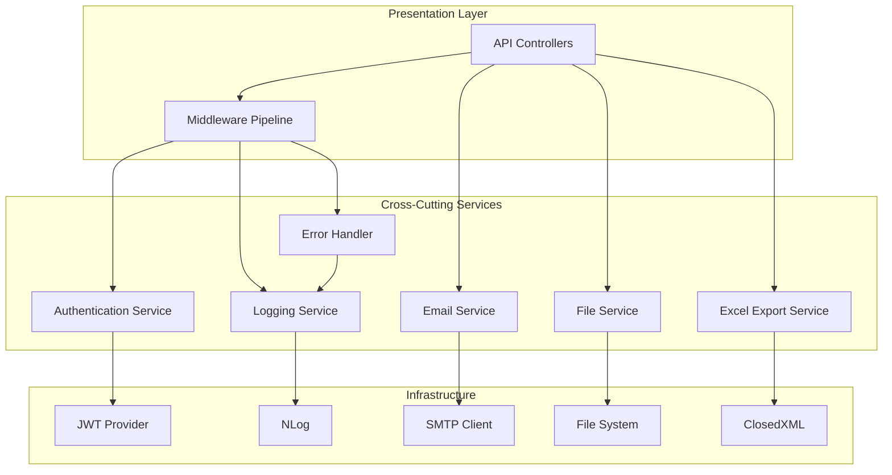

# Cross-Cutting Concerns Module

## Overview

The Cross-Cutting Concerns module encompasses shared infrastructure components and services that span across all functional modules of the EDR (Enterprise Digital Runner) application. These components provide essential functionality for authentication, error handling, logging, email notifications, file management, and data export capabilities.

## Purpose

Cross-cutting concerns are architectural elements that affect multiple parts of the application. By centralizing these concerns, we achieve:

- **Consistency**: Uniform behavior across all modules
- **Maintainability**: Single point of modification for shared functionality
- **Reusability**: Common services available to all features
- **Separation of Concerns**: Business logic separated from infrastructure concerns
- **Testability**: Isolated components that can be tested independently

## Module Components

### 1. Authentication and Authorization
- JWT-based authentication
- ASP.NET Core Identity integration
- Permission-based authorization
- Two-Factor Authentication (2FA)
- Role-Based Access Control (RBAC)

**Documentation**: [AUTHENTICATION.md](./AUTHENTICATION.md)

### 2. Error Handling
- Global exception middleware
- Standardized error response formats
- Validation exception handling
- Custom exception types
- Error logging integration

**Documentation**: [ERROR_HANDLING.md](./ERROR_HANDLING.md)

### 3. Logging Infrastructure
- NLog configuration and setup
- Structured logging with JSON format
- Log levels and categories
- Log storage and retention policies
- Email-specific logging

**Documentation**: [LOGGING.md](./LOGGING.md)

### 4. Email Service
- MailKit SMTP integration
- Email template system
- Failed email tracking and retry
- Bulk email sending
- Email notification configuration

**Documentation**: [EMAIL_SERVICE.md](./EMAIL_SERVICE.md)

### 5. File Management
- File upload/download endpoints
- Storage configuration
- File type validation
- Document management
- Attachment handling

**Documentation**: [FILE_MANAGEMENT.md](./FILE_MANAGEMENT.md)

### 6. Excel Export
- ClosedXML integration
- Data export service
- Report generation
- Custom formatting
- Multiple sheet support

**Documentation**: [EXCEL_EXPORT.md](./EXCEL_EXPORT.md)

## Architecture Overview



## Technology Stack

| Component | Technology | Version |
|-----------|-----------|---------|
| Authentication | ASP.NET Core Identity + JWT | .NET 8.0 |
| Logging | NLog | 5.5.0 |
| Email | MailKit | 4.11.0 |
| Excel Export | ClosedXML | 0.102.1 |
| Validation | FluentValidation | 11.x |
| Serialization | System.Text.Json | .NET 8.0 |

## Common Patterns

### Dependency Injection

All cross-cutting services are registered in the DI container:

```csharp
// Program.cs
builder.Services.AddScoped<IEmailService, EmailService>();
builder.Services.AddScoped<IAuthService, EnhancedAuthService>();
builder.Services.AddScoped<ITwoFactorService, TwoFactorService>();
builder.Services.AddSingleton<IHttpContextAccessor, HttpContextAccessor>();
```

### Middleware Pipeline

Cross-cutting middleware is configured in a specific order:

```csharp
app.UseCors("AllowSpecificOrigin");
app.UseResponseCompression();
app.UseHttpsRedirection();
app.UseMiddleware<TenantResolverMiddleware>();
app.UseAuthentication();
app.UseAuthorization();
app.UseMiddleware<TenantMiddleware>();
app.UseMiddleware<ValidationExceptionMiddleware>();
```

### Configuration

Cross-cutting services are configured via `appsettings.json`:

```json
{
  "Jwt": {
    "Key": "...",
    "Issuer": "your-app-name",
    "Audience": "your-app-name"
  },
  "EmailSettings": {
    "SmtpServer": "smtp.gmail.com",
    "Port": 587,
    "EnableEmailNotifications": true
  },
  "Logging": {
    "LogLevel": {
      "Default": "Information",
      "Microsoft": "Warning"
    }
  }
}
```

## Integration Points

### With Business Modules

All business modules (PM, BD, Admin) utilize cross-cutting services:

- **Authentication**: Protects all API endpoints
- **Logging**: Tracks all operations and errors
- **Email**: Sends notifications for workflow events
- **Error Handling**: Provides consistent error responses
- **File Management**: Handles document uploads
- **Excel Export**: Generates reports

### With Frontend

Frontend applications interact with cross-cutting concerns through:

- **JWT Tokens**: Included in Authorization headers
- **Error Responses**: Standardized error format
- **File Upload**: Multipart form data
- **Excel Download**: Binary file responses

## Security Considerations

### Authentication
- JWT tokens expire after 3 hours
- Secure token storage required
- HTTPS enforced for all endpoints

### Authorization
- Permission-based access control
- Role hierarchy support
- Tenant isolation

### Data Protection
- Sensitive data encrypted
- Secure password hashing
- SQL injection prevention
- XSS protection

## Performance Optimization

### Caching
- JWT token validation cached
- Configuration settings cached
- Static file caching

### Async Operations
- Email sending is asynchronous
- File operations use async I/O
- Logging is non-blocking

### Resource Management
- Connection pooling for SMTP
- Proper disposal of resources
- Memory-efficient file streaming

## Monitoring and Observability

### Logging Levels
- **Error**: Critical failures requiring attention
- **Warning**: Potential issues
- **Information**: Normal operations
- **Debug**: Detailed diagnostic information

### Metrics Tracked
- Authentication success/failure rates
- Email delivery success rates
- API response times
- Error occurrence frequency

## Testing Strategy

### Unit Tests
- Service logic testing
- Validation testing
- Helper function testing

### Integration Tests
- Middleware pipeline testing
- Email sending testing
- File upload/download testing
- Authentication flow testing

### Security Tests
- JWT validation testing
- Permission enforcement testing
- Input validation testing

## Related Documentation

- [Architecture Overview](../ARCHITECTURE.md)
- [API Documentation](../API_DOCUMENTATION.md)
- [Database Schema](../DATABASE_SCHEMA.md)
- [Coding Standards](../CODING_STANDARDS.md)

## Feature Status

| Feature | Status | Documentation | Tests |
|---------|--------|---------------|-------|
| Authentication | ✅ Complete | ✅ | ✅ |
| Error Handling | ✅ Complete | ✅ | ✅ |
| Logging | ✅ Complete | ✅ | ✅ |
| Email Service | ✅ Complete | ✅ | ✅ |
| File Management | 🚧 Partial | ⏳ | ⏳ |
| Excel Export | 🚧 Partial | ⏳ | ⏳ |

## Maintenance Notes

### Regular Tasks
- Review and rotate JWT signing keys
- Monitor log file sizes and archive old logs
- Review failed email logs and retry
- Update email templates as needed
- Review and update security policies

### Known Issues
- None currently documented

### Future Enhancements
- Implement distributed caching (Redis)
- Add rate limiting middleware
- Implement API versioning
- Add health check endpoints
- Implement circuit breaker pattern

## Support and Contact

For questions or issues related to cross-cutting concerns:
- Review the specific feature documentation
- Check the [Integration Guide](../INTEGRATION_GUIDE.md)
- Consult the development team

---

**Last Updated**: November 28, 2024  
**Version**: 1.0  
**Maintained By**: EDR Development Team
