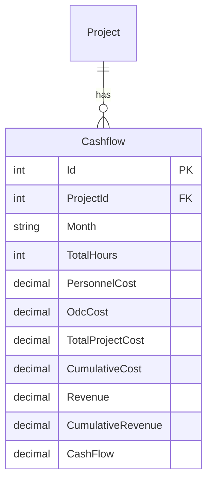

# Cashflow Feature

## Overview

The Cashflow feature provides monthly financial tracking for projects, capturing personnel costs, ODC (Other Direct Costs), revenue, and cumulative financial metrics. It enables project managers to monitor project financial health and visualize cashflow trends over time.

## Business Value

- Monthly financial tracking
- Cost vs. revenue analysis
- Cumulative financial metrics
- Cashflow visualization
- Budget monitoring
- Financial forecasting support

## Database Schema

### Entity Diagram



### Table Definition

```sql
CREATE TABLE Cashflow (
    Id INT PRIMARY KEY IDENTITY(1,1),
    ProjectId INT,
    Month NVARCHAR(50),
    TotalHours INT,
    PersonnelCost DECIMAL(18,2),
    OdcCost DECIMAL(18,2),
    TotalProjectCost DECIMAL(18,2),
    CumulativeCost DECIMAL(18,2),
    Revenue DECIMAL(18,2),
    CumulativeRevenue DECIMAL(18,2),
    CashFlow DECIMAL(18,2),
    
    CONSTRAINT FK_Cashflow_Project FOREIGN KEY (ProjectId) REFERENCES Project(Id)
);

CREATE INDEX IX_Cashflow_ProjectId ON Cashflow(ProjectId);
CREATE INDEX IX_Cashflow_Month ON Cashflow(Month);
```

### Field Descriptions

| Field | Type | Description |
|-------|------|-------------|
| Id | INT | Primary key |
| ProjectId | INT | Foreign key to Project |
| Month | NVARCHAR(50) | Month identifier (e.g., "2024-11") |
| TotalHours | INT | Total hours worked in month |
| PersonnelCost | DECIMAL(18,2) | Staff/personnel costs |
| OdcCost | DECIMAL(18,2) | Other Direct Costs |
| TotalProjectCost | DECIMAL(18,2) | PersonnelCost + OdcCost |
| CumulativeCost | DECIMAL(18,2) | Running total of costs |
| Revenue | DECIMAL(18,2) | Revenue for the month |
| CumulativeRevenue | DECIMAL(18,2) | Running total of revenue |
| CashFlow | DECIMAL(18,2) | Revenue - TotalProjectCost |

## API Endpoints

### GET /api/cashflow/project/{projectId}
Get all cashflow records for a project.

**Parameters:**
- `projectId` (path): Project ID

**Response:** `200 OK`
```json
[
  {
    "id": 1,
    "projectId": 5,
    "month": "2024-01",
    "totalHours": 160,
    "personnelCost": 24000.00,
    "odcCost": 5000.00,
    "totalProjectCost": 29000.00,
    "cumulativeCost": 29000.00,
    "revenue": 35000.00,
    "cumulativeRevenue": 35000.00,
    "cashFlow": 6000.00
  },
  {
    "id": 2,
    "projectId": 5,
    "month": "2024-02",
    "totalHours": 180,
    "personnelCost": 27000.00,
    "odcCost": 3000.00,
    "totalProjectCost": 30000.00,
    "cumulativeCost": 59000.00,
    "revenue": 40000.00,
    "cumulativeRevenue": 75000.00,
    "cashFlow": 10000.00
  }
]
```

### GET /api/cashflow/{id}
Get a specific cashflow record by ID.

**Parameters:**
- `id` (path): Cashflow record ID

**Response:** `200 OK` - Single cashflow object

### POST /api/cashflow
Create a new cashflow record.

**Request Body:**
```json
{
  "projectId": 5,
  "month": "2024-03",
  "totalHours": 200,
  "personnelCost": 30000.00,
  "odcCost": 8000.00,
  "totalProjectCost": 38000.00,
  "cumulativeCost": 97000.00,
  "revenue": 45000.00,
  "cumulativeRevenue": 120000.00,
  "cashFlow": 7000.00
}
```

**Response:** `201 Created`

### PUT /api/cashflow/{id}
Update an existing cashflow record.

**Parameters:**
- `id` (path): Cashflow record ID

**Request Body:** Same as POST

**Response:** `200 OK`

### DELETE /api/cashflow/{id}
Delete a cashflow record.

**Parameters:**
- `id` (path): Cashflow record ID

**Response:** `204 No Content`

## CQRS Operations

### Commands

| Command | Description | Handler |
|---------|-------------|---------|
| `CreateCashflowCommand` | Create new cashflow record | `CreateCashflowCommandHandler` |
| `UpdateCashflowCommand` | Update cashflow record | `UpdateCashflowCommandHandler` |
| `DeleteCashflowCommand` | Delete cashflow record | `DeleteCashflowCommandHandler` |

### Queries

| Query | Description | Handler |
|-------|-------------|---------|
| `GetCashflowQuery` | Get cashflow by ID | `GetCashflowQueryHandler` |
| `GetAllCashflowsQuery` | Get all cashflows for project | `GetAllCashflowsQueryHandler` |

## Frontend Components

### Charts

#### CashflowChart.tsx
Line/bar chart visualization of cashflow data.

**Features:**
- Monthly cost vs. revenue comparison
- Cumulative trends
- Cashflow trend line
- Interactive tooltips
- Export to image

**Props:**
```typescript
interface CashflowChartProps {
  projectId: string;
  data?: CashflowData[];
}
```

### Services

#### projectBudgetApi.ts
API service for cashflow operations (part of budget API).

```typescript
export const getCashflowByProject = async (projectId: string): Promise<Cashflow[]>;
export const createCashflow = async (cashflow: CashflowDto): Promise<Cashflow>;
export const updateCashflow = async (id: number, cashflow: CashflowDto): Promise<void>;
export const deleteCashflow = async (id: number): Promise<void>;
```

## Calculation Formulas

### Monthly Calculations

```
Total Project Cost = Personnel Cost + ODC Cost
Cash Flow = Revenue - Total Project Cost
```

### Cumulative Calculations

```
Cumulative Cost = Previous Cumulative Cost + Current Total Project Cost
Cumulative Revenue = Previous Cumulative Revenue + Current Revenue
```

### Derived Metrics

```
Profit Margin = (Revenue - Total Project Cost) / Revenue × 100
Cost Efficiency = Revenue / Total Project Cost
Hours Utilization = Actual Hours / Planned Hours × 100
```

## Business Logic

### Cashflow Record Creation
1. Validate project exists
2. Check for duplicate month entry
3. Calculate derived values
4. Update cumulative values
5. Create record

### Cumulative Recalculation
When a historical record is modified:
1. Identify affected records (same project, later months)
2. Recalculate cumulative values in sequence
3. Update all affected records

### Data Validation
- All monetary values must be >= 0
- Month format must be valid (YYYY-MM)
- ProjectId must reference existing project
- TotalProjectCost should equal PersonnelCost + OdcCost

## Visualization

### Chart Types

1. **Bar Chart**: Monthly cost vs. revenue comparison
2. **Line Chart**: Cumulative trends over time
3. **Area Chart**: Cashflow trend with positive/negative areas
4. **Combined Chart**: Bars for monthly, lines for cumulative

### Chart Data Structure

```typescript
interface ChartDataPoint {
  month: string;
  personnelCost: number;
  odcCost: number;
  totalCost: number;
  revenue: number;
  cashFlow: number;
  cumulativeCost: number;
  cumulativeRevenue: number;
}
```

## Validation Rules

| Field | Rule |
|-------|------|
| ProjectId | Required, must exist |
| Month | Required, format YYYY-MM |
| TotalHours | >= 0 |
| PersonnelCost | >= 0 |
| OdcCost | >= 0 |
| Revenue | >= 0 |

## Testing Coverage

- Cashflow CQRS handler tests
- API integration tests
- Calculation validation tests
- Chart rendering tests

## Related Features

- [Project Management](./PROJECT_MANAGEMENT.md) - Parent project
- [Monthly Progress](./MONTHLY_PROGRESS.md) - Financial details source
- [Work Breakdown Structure](./WORK_BREAKDOWN_STRUCTURE.md) - Cost allocation
