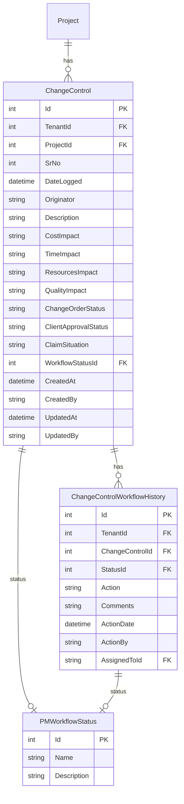
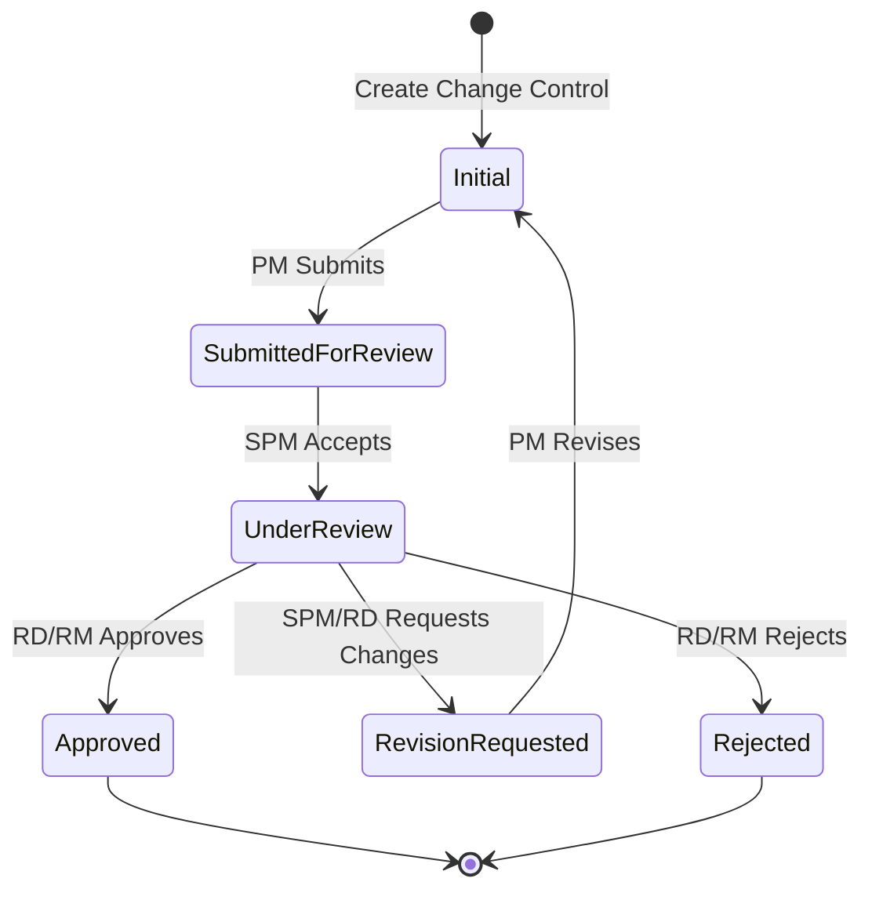

# Change Control Feature

## Overview

The Change Control feature provides comprehensive change request management for projects, tracking changes that impact cost, time, resources, or quality. It includes an approval workflow for change authorization and maintains a complete audit trail of all change control activities.

## Business Value

- Formal change request tracking
- Impact assessment (cost, time, resources, quality)
- Approval workflow with role-based authorization
- Client approval status tracking
- Claim situation documentation
- Complete audit trail
- Integration with project budget and schedule

## Database Schema

### Entity Relationships



### Key Tables

#### ChangeControl
```sql
CREATE TABLE ChangeControl (
    Id INT PRIMARY KEY IDENTITY(1,1),
    TenantId INT NOT NULL,
    ProjectId INT NOT NULL,
    SrNo INT NOT NULL,
    DateLogged DATETIME NOT NULL,
    Originator NVARCHAR(100) NOT NULL,
    Description NVARCHAR(500) NOT NULL,
    CostImpact NVARCHAR(255),
    TimeImpact NVARCHAR(255),
    ResourcesImpact NVARCHAR(255),
    QualityImpact NVARCHAR(255),
    ChangeOrderStatus NVARCHAR(100),
    ClientApprovalStatus NVARCHAR(100),
    ClaimSituation NVARCHAR(255),
    WorkflowStatusId INT NOT NULL DEFAULT 1,
    CreatedAt DATETIME NOT NULL DEFAULT GETUTCDATE(),
    UpdatedAt DATETIME,
    CreatedBy NVARCHAR(100),
    UpdatedBy NVARCHAR(100),
    
    CONSTRAINT FK_ChangeControl_Project FOREIGN KEY (ProjectId) REFERENCES Project(Id),
    CONSTRAINT FK_ChangeControl_WorkflowStatus FOREIGN KEY (WorkflowStatusId) REFERENCES PMWorkflowStatus(Id)
);

CREATE INDEX IX_ChangeControl_ProjectId ON ChangeControl(ProjectId);
CREATE INDEX IX_ChangeControl_WorkflowStatusId ON ChangeControl(WorkflowStatusId);
```

#### ChangeControlWorkflowHistory
```sql
CREATE TABLE ChangeControlWorkflowHistory (
    Id INT PRIMARY KEY IDENTITY(1,1),
    TenantId INT NOT NULL,
    ChangeControlId INT NOT NULL,
    StatusId INT NOT NULL,
    Action NVARCHAR(100) NOT NULL,
    Comments NVARCHAR(MAX),
    ActionDate DATETIME NOT NULL DEFAULT GETUTCDATE(),
    ActionBy NVARCHAR(450) NOT NULL,
    AssignedToId NVARCHAR(450),
    
    CONSTRAINT FK_ChangeControlWorkflowHistory_ChangeControl FOREIGN KEY (ChangeControlId) REFERENCES ChangeControl(Id) ON DELETE CASCADE,
    CONSTRAINT FK_ChangeControlWorkflowHistory_Status FOREIGN KEY (StatusId) REFERENCES PMWorkflowStatus(Id),
    CONSTRAINT FK_ChangeControlWorkflowHistory_ActionBy FOREIGN KEY (ActionBy) REFERENCES AspNetUsers(Id),
    CONSTRAINT FK_ChangeControlWorkflowHistory_AssignedTo FOREIGN KEY (AssignedToId) REFERENCES AspNetUsers(Id)
);
```

### Field Descriptions

| Field | Type | Description |
|-------|------|-------------|
| SrNo | INT | Serial number for the change control |
| DateLogged | DATETIME | Date the change was logged |
| Originator | NVARCHAR(100) | Person who originated the change |
| Description | NVARCHAR(500) | Description of the change |
| CostImpact | NVARCHAR(255) | Impact on project cost |
| TimeImpact | NVARCHAR(255) | Impact on project timeline |
| ResourcesImpact | NVARCHAR(255) | Impact on resources |
| QualityImpact | NVARCHAR(255) | Impact on quality |
| ChangeOrderStatus | NVARCHAR(100) | Status of the change order |
| ClientApprovalStatus | NVARCHAR(100) | Client approval status |
| ClaimSituation | NVARCHAR(255) | Claim situation details |

## API Endpoints

### GET /api/changecontrol/project/{projectId}
Get all change controls for a project.

**Parameters:**
- `projectId` (path): Project ID

**Response:** `200 OK`
```json
[
  {
    "id": 1,
    "projectId": 5,
    "srNo": 1,
    "dateLogged": "2024-11-01T00:00:00Z",
    "originator": "John Smith",
    "description": "Additional foundation work required due to soil conditions",
    "costImpact": "+$50,000",
    "timeImpact": "+2 weeks",
    "resourcesImpact": "Additional geotechnical team required",
    "qualityImpact": "None",
    "changeOrderStatus": "Approved",
    "clientApprovalStatus": "Approved",
    "claimSituation": "Variation claim submitted",
    "workflowStatusId": 4,
    "workflowStatus": {
      "id": 4,
      "name": "Approved"
    },
    "createdAt": "2024-11-01T10:00:00Z",
    "createdBy": "pm@example.com"
  }
]
```

### GET /api/changecontrol/{id}
Get a specific change control by ID.

### POST /api/changecontrol
Create a new change control.

**Request Body:**
```json
{
  "projectId": 5,
  "srNo": 2,
  "dateLogged": "2024-11-15T00:00:00Z",
  "originator": "Jane Doe",
  "description": "Design modification for improved accessibility",
  "costImpact": "+$25,000",
  "timeImpact": "+1 week",
  "resourcesImpact": "Accessibility consultant required",
  "qualityImpact": "Improved accessibility compliance",
  "changeOrderStatus": "Pending",
  "clientApprovalStatus": "Pending"
}
```

**Response:** `201 Created`

### PUT /api/changecontrol/{id}
Update an existing change control.

### DELETE /api/changecontrol/{id}
Delete a change control.

### Workflow Endpoints

#### POST /api/PMWorkflow/sendtoreview
Send change control for review.

**Request Body:**
```json
{
  "entityId": 1,
  "entityType": "ChangeControl",
  "assignedToId": "reviewer-guid",
  "comments": "Ready for SPM review"
}
```

#### POST /api/PMWorkflow/sendToApproval
Send for approval (by SPM).

#### POST /api/PMWorkflow/approve
Approve change control (by RD/RM).

#### POST /api/PMWorkflow/requestChanges
Request changes/reject.

## CQRS Operations

### Commands

| Command | Description | Handler |
|---------|-------------|---------|
| `CreateChangeControlCommand` | Create new change control | `CreateChangeControlCommandHandler` |
| `UpdateChangeControlCommand` | Update change control | `UpdateChangeControlCommandHandler` |
| `DeleteChangeControlCommand` | Delete change control | `DeleteChangeControlCommandHandler` |

### Queries

| Query | Description | Handler |
|-------|-------------|---------|
| `GetChangeControlByIdQuery` | Get by ID | `GetChangeControlByIdQueryHandler` |
| `GetChangeControlsByProjectIdQuery` | Get by project | `GetChangeControlsByProjectIdQueryHandler` |

## Frontend Components

### Forms

#### ChangeControlForm.tsx
Form for creating and editing change controls.

**Features:**
- Impact assessment fields
- Status tracking
- Client approval tracking
- Claim situation documentation
- Workflow integration

### Components

#### ChangeControlWorkflow.tsx
Workflow status display and action buttons.

**Features:**
- Current status display
- Available actions based on role
- Workflow history timeline
- Comments input

### Services

#### changeControlApi.tsx
```typescript
export const changeControlApi = {
  sendToReview: async (command: any) => Promise<any>,
  sendToApprovalBySPM: async (command: any) => Promise<any>,
  rejectBySPM: async (command: any) => Promise<any>,
  approvedByRDOrRM: async (command: any) => Promise<any>,
  rejectByRDOrRM: async (command: any) => Promise<any>
};
```

## Approval Workflow



### Workflow Roles

| Role | Actions |
|------|---------|
| Project Manager (PM) | Create, Edit, Submit for Review, Revise |
| Senior Project Manager (SPM) | Review, Send to Approval, Request Changes |
| Regional Director (RD) | Approve, Reject, Request Changes |
| Regional Manager (RM) | Approve, Reject, Request Changes |

### Workflow Actions

| Action | From Status | To Status | Performed By |
|--------|-------------|-----------|--------------|
| Submit | Initial | SubmittedForReview | PM |
| Accept Review | SubmittedForReview | UnderReview | SPM |
| Send to Approval | UnderReview | UnderReview | SPM |
| Approve | UnderReview | Approved | RD/RM |
| Reject | UnderReview | Rejected | RD/RM |
| Request Changes | UnderReview | RevisionRequested | SPM/RD/RM |
| Revise | RevisionRequested | Initial | PM |

## Business Logic

### Change Control Creation
1. Validate project exists
2. Auto-generate serial number
3. Set date logged to current date
4. Initialize workflow status to Initial
5. Create audit trail entry

### Impact Assessment
- Cost Impact: Document financial impact (+/- amount)
- Time Impact: Document schedule impact (+/- duration)
- Resources Impact: Document resource requirements
- Quality Impact: Document quality implications

### Client Approval Tracking
- Track client approval status separately from internal workflow
- Document client communication
- Link to claim situation if applicable

## Validation Rules

| Field | Rule |
|-------|------|
| ProjectId | Required, must exist |
| SrNo | Required, unique per project |
| DateLogged | Required, valid date |
| Originator | Required, max 100 characters |
| Description | Required, max 500 characters |
| CostImpact | Max 255 characters |
| TimeImpact | Max 255 characters |
| ResourcesImpact | Max 255 characters |
| QualityImpact | Max 255 characters |

## Testing Coverage

- Change Control CQRS handler tests
- API integration tests
- Workflow transition tests
- Validation tests

## Related Features

- [Project Management](./PROJECT_MANAGEMENT.md) - Parent project
- [Monthly Progress](./MONTHLY_PROGRESS.md) - Change order tracking
- [Project Closure](./PROJECT_CLOSURE.md) - Change order summary
