# Monthly Progress Feature

## Overview

The Monthly Progress feature provides comprehensive monthly reporting capabilities for projects, tracking financial details, schedule progress, deliverables, manpower planning, change orders, and early warnings. It enables project managers to capture and report on project health on a monthly basis.

## Business Value

- Structured monthly project reporting
- Financial tracking (budget vs. actual)
- Schedule monitoring with variance analysis
- Deliverable milestone tracking
- Manpower planning and utilization
- Change order management
- Early warning identification
- Integration with WBS for resource data

## Database Schema

### Entity Relationships

```mermaid
erDiagram
    MonthlyProgress {
        int Id PK
        int TenantId FK
        int ProjectId FK
        datetime CreatedDate
        int Month
        int Year
        decimal ManpowerTotal
    }

    FinancialDetails {
        int Id PK
        int TenantId FK
        int MonthlyProgressId FK
        decimal Net
        decimal ServiceTax
        decimal FeeTotal
        decimal BudgetOdcs
        decimal BudgetStaff
        decimal BudgetSubTotal
        string ContractType
    }

    ContractAndCost {
        int Id PK
        int TenantId FK
        int MonthlyProgressId FK
        decimal ContractValue
        decimal CostToDate
        decimal EstimatedCostAtCompletion
    }

    CTCEAC {
        int Id PK
        int TenantId FK
        int MonthlyProgressId FK
        decimal CTC
        decimal EAC
        decimal Variance
    }

    Schedule {
        int Id PK
        int TenantId FK
        int MonthlyProgressId FK
        datetime DateOfIssueWOLOI
        datetime CompletionDateAsPerContract
        datetime CompletionDateAsPerExtension
        datetime ExpectedCompletionDate
    }

    ManpowerPlanning {
        int Id PK
        int TenantId FK
        int MonthlyProgressId FK
        string ResourceName
        decimal PlannedHours
        decimal ActualHours
    }

    ProgressDeliverable {
        int Id PK
        int TenantId FK
        int MonthlyProgressId FK
        string Milestone
        datetime DueDateContract
        datetime DueDatePlanned
        datetime AchievedDate
        decimal PaymentDue
        datetime InvoiceDate
        datetime PaymentReceivedDate
        string DeliverableComments
    }

    ChangeOrder {
        int Id PK
        int TenantId FK
        int MonthlyProgressId FK
        string Description
        decimal Amount
        string Status
    }

    EarlyWarning {
        int Id PK
        int TenantId FK
        int MonthlyProgressId FK
        string Description
        string Severity
        string MitigationPlan
    }

    ProgrammeSchedule {
        int Id PK
        int TenantId FK
        int MonthlyProgressId FK
        string Activity
        datetime PlannedStart
        datetime PlannedEnd
        datetime ActualStart
        datetime ActualEnd
    }

    BudgetTable {
        int Id PK
        int TenantId FK
        int MonthlyProgressId FK
        decimal OriginalBudget
        decimal ApprovedChanges
        decimal CurrentBudget
    }

    Project ||--o{ MonthlyProgress : "has"
    MonthlyProgress ||--|| FinancialDetails : "has"
    MonthlyProgress ||--|| ContractAndCost : "has"
    MonthlyProgress ||--|| CTCEAC : "has"
    MonthlyProgress ||--|| Schedule : "has"
    MonthlyProgress ||--o{ ManpowerPlanning : "has"
    MonthlyProgress ||--o{ ProgressDeliverable : "has"
    MonthlyProgress ||--o{ ChangeOrder : "has"
    MonthlyProgress ||--o{ EarlyWarning : "has"
    MonthlyProgress ||--o{ ProgrammeSchedule : "has"
    MonthlyProgress ||--|| BudgetTable : "has"
```



### Key Tables

#### MonthlyProgress
```sql
CREATE TABLE MonthlyProgress (
    Id INT PRIMARY KEY IDENTITY(1,1),
    TenantId INT NOT NULL,
    ProjectId INT NOT NULL,
    CreatedDate DATETIME NOT NULL DEFAULT GETUTCDATE(),
    Month INT NOT NULL CHECK (Month BETWEEN 1 AND 12),
    Year INT NOT NULL,
    ManpowerTotal DECIMAL(18,2),
    
    CONSTRAINT FK_MonthlyProgress_Project FOREIGN KEY (ProjectId) REFERENCES Project(Id),
    CONSTRAINT UQ_MonthlyProgress_ProjectYearMonth UNIQUE (ProjectId, Year, Month)
);
```

#### FinancialDetails
```sql
CREATE TABLE FinancialDetails (
    Id INT PRIMARY KEY IDENTITY(1,1),
    TenantId INT NOT NULL,
    MonthlyProgressId INT NOT NULL,
    Net DECIMAL(18,2),
    ServiceTax DECIMAL(18,2),
    FeeTotal DECIMAL(18,2),
    BudgetOdcs DECIMAL(18,2),
    BudgetStaff DECIMAL(18,2),
    BudgetSubTotal DECIMAL(18,2),
    ContractType NVARCHAR(100),
    
    CONSTRAINT FK_FinancialDetails_MonthlyProgress FOREIGN KEY (MonthlyProgressId) REFERENCES MonthlyProgress(Id)
);
```

#### ProgressDeliverable
```sql
CREATE TABLE ProgressDeliverable (
    Id INT PRIMARY KEY IDENTITY(1,1),
    TenantId INT NOT NULL,
    MonthlyProgressId INT NOT NULL,
    Milestone NVARCHAR(255),
    DueDateContract DATETIME,
    DueDatePlanned DATETIME,
    AchievedDate DATETIME,
    PaymentDue DECIMAL(18,2),
    InvoiceDate DATETIME,
    PaymentReceivedDate DATETIME,
    DeliverableComments NVARCHAR(MAX),
    
    CONSTRAINT FK_ProgressDeliverable_MonthlyProgress FOREIGN KEY (MonthlyProgressId) REFERENCES MonthlyProgress(Id)
);
```

## API Endpoints

### GET /api/projects/{projectId}/monthlyprogress
Get all monthly progress reports for a project.

**Response:** `200 OK`
```json
[
  {
    "id": 1,
    "projectId": 5,
    "month": 11,
    "year": 2024,
    "manpowerTotal": 25,
    "financialDetails": {
      "net": 450000.00,
      "serviceTax": 81000.00,
      "feeTotal": 531000.00,
      "budgetOdcs": 100000.00,
      "budgetStaff": 350000.00,
      "budgetSubTotal": 450000.00,
      "contractType": "Fixed Price"
    },
    "schedule": {
      "dateOfIssueWOLOI": "2024-01-15T00:00:00Z",
      "completionDateAsPerContract": "2024-12-31T00:00:00Z",
      "completionDateAsPerExtension": null,
      "expectedCompletionDate": "2024-12-15T00:00:00Z"
    },
    "progressDeliverables": [
      {
        "milestone": "Foundation Complete",
        "dueDateContract": "2024-06-30T00:00:00Z",
        "dueDatePlanned": "2024-06-15T00:00:00Z",
        "achievedDate": "2024-06-20T00:00:00Z",
        "paymentDue": 100000.00,
        "invoiceDate": "2024-06-25T00:00:00Z",
        "paymentReceivedDate": "2024-07-15T00:00:00Z"
      }
    ],
    "createdDate": "2024-11-01T00:00:00Z"
  }
]
```

### GET /api/projects/{projectId}/monthlyprogress/year/{year}/month/{month}
Get monthly progress for a specific year and month.

**Parameters:**
- `projectId` (path): Project ID
- `year` (path): Year (e.g., 2024)
- `month` (path): Month (1-12)

**Response:** `200 OK` - Single monthly progress object

### POST /api/projects/{projectId}/monthlyprogress
Create a new monthly progress report.

**Request Body:**
```json
{
  "month": 12,
  "year": 2024,
  "manpowerTotal": 30,
  "financialDetails": {
    "net": 500000.00,
    "serviceTax": 90000.00,
    "feeTotal": 590000.00,
    "budgetOdcs": 120000.00,
    "budgetStaff": 380000.00
  },
  "schedule": {
    "dateOfIssueWOLOI": "2024-01-15T00:00:00Z",
    "completionDateAsPerContract": "2024-12-31T00:00:00Z",
    "expectedCompletionDate": "2024-12-20T00:00:00Z"
  },
  "progressDeliverables": [...],
  "changeOrders": [...],
  "earlyWarnings": [...]
}
```

**Response:** `201 Created`

### PUT /api/projects/{projectId}/monthlyprogress/year/{year}/month/{month}
Update an existing monthly progress report.

### DELETE /api/projects/{projectId}/monthlyprogress/year/{year}/month/{month}
Delete a monthly progress report.

### GET /api/projects/{projectId}/WBS/manpowerresources
Get manpower resources with planned hours from WBS.

**Response:** `200 OK`
```json
{
  "projectId": 5,
  "resources": [
    {
      "taskId": "1",
      "taskTitle": "Project Management",
      "employeeId": "user-guid",
      "employeeName": "John Smith",
      "roleId": "PM",
      "isConsultant": false,
      "costRate": 150.00,
      "totalHours": 200,
      "totalCost": 30000.00,
      "monthlyHours": [
        { "year": 2024, "month": "Nov", "plannedHours": 40 },
        { "year": 2024, "month": "Dec", "plannedHours": 40 }
      ]
    }
  ]
}
```

## CQRS Operations

### Commands

| Command | Description |
|---------|-------------|
| `CreateMonthlyProgressCommand` | Create new monthly progress |
| `UpdateMonthlyProgressCommand` | Update monthly progress |
| `UpdateManpowerPlanningCommand` | Update manpower planning |
| `DeleteMonthlyProgressCommand` | Delete monthly progress |

### Queries

| Query | Description |
|-------|-------------|
| `GetAllMonthlyProgressQuery` | Get all progress reports |
| `GetMonthlyProgressByProjectIdQuery` | Get by project ID |
| `GetMonthlyProgressByProjectYearMonthQuery` | Get by project, year, month |

## Frontend Components

### Forms

#### MonthlyReports.tsx
Main monthly progress reporting form with multiple sections.

**Features:**
- Financial details section
- Contract and cost tracking
- Schedule tracking
- Manpower planning grid
- Deliverables tracking
- Change orders management
- Early warnings section
- Programme schedule

### Components

#### MonthlyReportDialog.tsx
Dialog for creating/editing monthly reports.

#### MonthlyProgresscomponents/
- Financial details form components
- Schedule form components
- Deliverables table
- Manpower grid
- Change order list
- Early warning list

### Services

#### monthlyProgressApi.tsx
```typescript
export const MonthlyProgressAPI = {
  getMonthlyReports: async (projectId: string): Promise<MonthlyReport[]>,
  getMonthlyReportByYearMonth: async (projectId: string, year: number, month: number): Promise<MonthlyReport>,
  getManpowerResources: async (projectId: string): Promise<ManpowerResourcesResponse>,
  submitMonthlyProgress: async (projectId: string, formData: any),
  updateMonthlyProgress: async (projectId: string, year: number, month: number, formData: any),
  deleteMonthlyProgress: async (projectId: string, year: number, month: number)
};
```

## Calculation Formulas

### Financial Calculations

```
Fee Total = Net + Service Tax
Budget SubTotal = Budget ODCs + Budget Staff
Variance = Budget SubTotal - Actual Cost
```

### Schedule Calculations

```
Schedule Variance = Expected Completion Date - Contract Completion Date
Delay Days = Actual Completion - Planned Completion (for deliverables)
```

### Cost Performance

```
CTC (Cost to Complete) = Estimated Cost at Completion - Cost to Date
EAC (Estimate at Completion) = Cost to Date + CTC
Variance = Budget - EAC
```

### Manpower Utilization

```
Utilization % = (Actual Hours / Planned Hours) × 100
Total Manpower Cost = Σ(Hours × Cost Rate) for all resources
```

## Business Logic

### Monthly Report Creation
1. Check if report exists for project/year/month
2. If exists, update; otherwise create new
3. Validate all required sections
4. Calculate derived values
5. Save all related entities in transaction

### Deliverable Tracking
1. Track milestone against contract and planned dates
2. Calculate variance (early/late)
3. Track payment status
4. Link to invoicing

### Early Warning Management
1. Identify potential issues
2. Assign severity level
3. Document mitigation plan
4. Track resolution

## Validation Rules

| Field | Rule |
|-------|------|
| Month | Required, 1-12 |
| Year | Required, valid year |
| Financial amounts | >= 0 |
| Dates | Valid date format |
| Deliverable milestone | Required if deliverable added |

## Testing Coverage

- Monthly Progress CQRS handler tests
- API integration tests
- Financial calculation tests
- Date validation tests

## Related Features

- [Project Management](./PROJECT_MANAGEMENT.md) - Parent project
- [Work Breakdown Structure](./WORK_BREAKDOWN_STRUCTURE.md) - Resource data source
- [Cashflow](./CASHFLOW.md) - Financial integration
- [Change Control](./CHANGE_CONTROL.md) - Change order tracking
