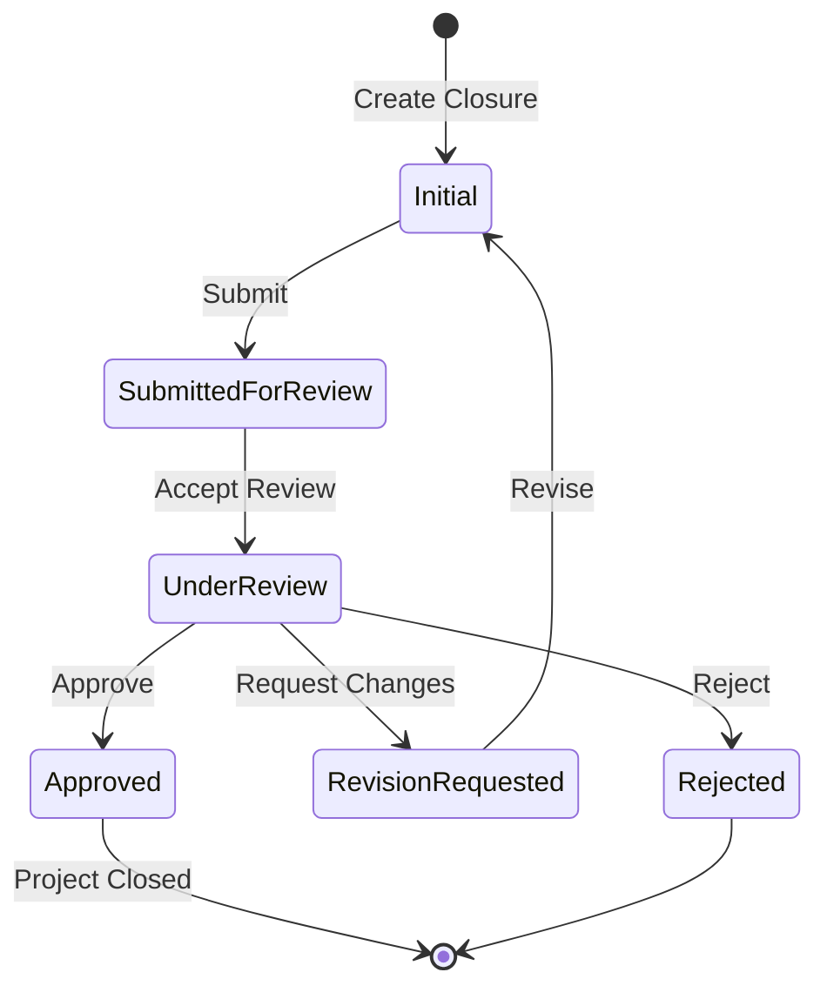

# Project Closure Feature

## Overview

The Project Closure feature provides comprehensive documentation for closing out projects, capturing lessons learned, client feedback, and ensuring all project aspects are properly documented before final closure. It includes a multi-section form covering overall delivery, project management, technical delivery, construction aspects, and overall assessment with an approval workflow.

## Business Value

- Structured project closure documentation
- Lessons learned capture for future projects
- Client feedback documentation
- Approval workflow for closure sign-off
- Comprehensive audit trail
- Knowledge management integration

## Database Schema

### Entity Relationships

```mermaid
erDiagram
    ProjectClosure {
        int Id PK
        int TenantId FK
        int ProjectId FK
        string ClientFeedback
        string SuccessCriteria
        string ClientExpectations
        string OtherStakeholders
        string EnvIssues
        string EnvManagement
        string ThirdPartyIssues
        string ThirdPartyManagement
        string RiskIssues
        string RiskManagement
        string KnowledgeGoals
        string BaselineComparison
        string DelayedDeliverables
        string UnforeseeableDelays
        string BudgetEstimate
        string ProfitTarget
        string ChangeOrders
        string CloseOutBudget
        string ResourceAvailability
        string VendorFeedback
        string ProjectTeamFeedback
        string DesignOutputs
        string ProjectReviewMeetings
        string ClientDesignReviews
        string InternalReporting
        string ClientReporting
        string InternalMeetings
        string ClientMeetings
        string ExternalMeetings
        string PlanUpToDate
        string PlanUseful
        string Hindrances
        string ClientPayment
        string PlanningIssues
        string PlanningLessons
        string BriefAims
        string DesignReviewOutputs
        string ConstructabilityReview
        string DesignReview
        string TechnicalRequirements
        string InnovativeIdeas
        string SuitableOptions
        string AdditionalInformation
        string DeliverableExpectations
        string StakeholderInvolvement
        string KnowledgeGoalsAchieved
        string TechnicalToolsDissemination
        string SpecialistKnowledgeValue
        string OtherComments
        bool TargetCostAccuracyValue
        string TargetCostAccuracy
        bool ChangeControlReviewValue
        string ChangeControlReview
        bool CompensationEventsValue
        string CompensationEvents
        bool ExpenditureProfileValue
        string ExpenditureProfile
        bool HealthSafetyConcernsValue
        string HealthSafetyConcerns
        bool ProgrammeRealisticValue
        string ProgrammeRealistic
        bool ProgrammeUpdatesValue
        string ProgrammeUpdates
        bool RequiredQualityValue
        string RequiredQuality
        bool OperationalRequirementsValue
        string OperationalRequirements
        bool ConstructionInvolvementValue
        string ConstructionInvolvement
        bool EfficienciesValue
        string Efficiencies
        bool MaintenanceAgreementsValue
        string MaintenanceAgreements
        bool AsBuiltManualsValue
        string AsBuiltManuals
        bool HsFileForwardedValue
        string HsFileForwarded
        string Variations
        string TechnoLegalIssues
        string ConstructionOther
        string Positives
        string LessonsLearned
        int WorkflowStatusId FK
        datetime CreatedAt
        string CreatedBy
        datetime UpdatedAt
        string UpdatedBy
    }

    ProjectClosureWorkflowHistory {
        int Id PK
        int TenantId FK
        int ProjectClosureId FK
        int StatusId FK
        string Action
        string Comments
        datetime ActionDate
        string ActionBy
        string AssignedToId FK
    }

    PMWorkflowStatus {
        int Id PK
        string Name
        string Description
    }

    Project ||--o| ProjectClosure : "has"
    ProjectClosure ||--o{ ProjectClosureWorkflowHistory : "has"
    ProjectClosure ||--o| PMWorkflowStatus : "status"
    ProjectClosureWorkflowHistory ||--o| PMWorkflowStatus : "status"
```



### Key Tables

#### ProjectClosure
```sql
CREATE TABLE ProjectClosures (
    Id INT PRIMARY KEY IDENTITY(1,1),
    TenantId INT NOT NULL,
    ProjectId INT NOT NULL,
    
    -- Section A: Overall Project Delivery
    ClientFeedback NVARCHAR(MAX),
    SuccessCriteria NVARCHAR(MAX),
    ClientExpectations NVARCHAR(MAX),
    OtherStakeholders NVARCHAR(MAX),
    
    -- Section B: Project Management
    EnvIssues NVARCHAR(MAX),
    EnvManagement NVARCHAR(MAX),
    ThirdPartyIssues NVARCHAR(MAX),
    ThirdPartyManagement NVARCHAR(MAX),
    RiskIssues NVARCHAR(MAX),
    RiskManagement NVARCHAR(MAX),
    KnowledgeGoals NVARCHAR(MAX),
    BaselineComparison NVARCHAR(MAX),
    DelayedDeliverables NVARCHAR(MAX),
    UnforeseeableDelays NVARCHAR(MAX),
    BudgetEstimate NVARCHAR(MAX),
    ProfitTarget NVARCHAR(MAX),
    ChangeOrders NVARCHAR(MAX),
    CloseOutBudget NVARCHAR(MAX),
    ResourceAvailability NVARCHAR(MAX),
    VendorFeedback NVARCHAR(MAX),
    ProjectTeamFeedback NVARCHAR(MAX),
    
    -- Section C: Technical Delivery
    DesignOutputs NVARCHAR(MAX),
    ProjectReviewMeetings NVARCHAR(MAX),
    ClientDesignReviews NVARCHAR(MAX),
    InternalReporting NVARCHAR(MAX),
    ClientReporting NVARCHAR(MAX),
    InternalMeetings NVARCHAR(MAX),
    ClientMeetings NVARCHAR(MAX),
    ExternalMeetings NVARCHAR(MAX),
    PlanUpToDate NVARCHAR(MAX),
    PlanUseful NVARCHAR(MAX),
    Hindrances NVARCHAR(MAX),
    ClientPayment NVARCHAR(MAX),
    PlanningIssues NVARCHAR(MAX),
    PlanningLessons NVARCHAR(MAX),
    BriefAims NVARCHAR(MAX),
    DesignReviewOutputs NVARCHAR(MAX),
    ConstructabilityReview NVARCHAR(MAX),
    DesignReview NVARCHAR(MAX),
    TechnicalRequirements NVARCHAR(MAX),
    InnovativeIdeas NVARCHAR(MAX),
    SuitableOptions NVARCHAR(MAX),
    AdditionalInformation NVARCHAR(MAX),
    DeliverableExpectations NVARCHAR(MAX),
    StakeholderInvolvement NVARCHAR(MAX),
    KnowledgeGoalsAchieved NVARCHAR(MAX),
    TechnicalToolsDissemination NVARCHAR(MAX),
    SpecialistKnowledgeValue NVARCHAR(MAX),
    OtherComments NVARCHAR(MAX),
    
    -- Section D: Construction (Boolean + Text pairs)
    TargetCostAccuracyValue BIT,
    TargetCostAccuracy NVARCHAR(MAX),
    ChangeControlReviewValue BIT,
    ChangeControlReview NVARCHAR(MAX),
    CompensationEventsValue BIT,
    CompensationEvents NVARCHAR(MAX),
    ExpenditureProfileValue BIT,
    ExpenditureProfile NVARCHAR(MAX),
    HealthSafetyConcernsValue BIT,
    HealthSafetyConcerns NVARCHAR(MAX),
    ProgrammeRealisticValue BIT,
    ProgrammeRealistic NVARCHAR(MAX),
    ProgrammeUpdatesValue BIT,
    ProgrammeUpdates NVARCHAR(MAX),
    RequiredQualityValue BIT,
    RequiredQuality NVARCHAR(MAX),
    OperationalRequirementsValue BIT,
    OperationalRequirements NVARCHAR(MAX),
    ConstructionInvolvementValue BIT,
    ConstructionInvolvement NVARCHAR(MAX),
    EfficienciesValue BIT,
    Efficiencies NVARCHAR(MAX),
    MaintenanceAgreementsValue BIT,
    MaintenanceAgreements NVARCHAR(MAX),
    AsBuiltManualsValue BIT,
    AsBuiltManuals NVARCHAR(MAX),
    HsFileForwardedValue BIT,
    HsFileForwarded NVARCHAR(MAX),
    Variations NVARCHAR(MAX),
    TechnoLegalIssues NVARCHAR(MAX),
    ConstructionOther NVARCHAR(MAX),
    
    -- Section E: Overall (JSON arrays)
    Positives NVARCHAR(MAX),
    LessonsLearned NVARCHAR(MAX),
    
    -- Workflow
    WorkflowStatusId INT NOT NULL DEFAULT 1,
    
    -- Audit
    CreatedAt DATETIME NOT NULL DEFAULT GETUTCDATE(),
    CreatedBy NVARCHAR(450),
    UpdatedAt DATETIME,
    UpdatedBy NVARCHAR(450),
    
    CONSTRAINT FK_ProjectClosure_Project FOREIGN KEY (ProjectId) REFERENCES Project(Id),
    CONSTRAINT FK_ProjectClosure_WorkflowStatus FOREIGN KEY (WorkflowStatusId) REFERENCES PMWorkflowStatus(Id)
);
```

## Form Sections

### Section A: Overall Project Delivery
- Client Feedback
- Success Criteria
- Client Expectations
- Other Stakeholders

### Section B: Project Management
- Environmental Management
- Third Party Management
- Risk Management
- Knowledge Management
- Programme (Baseline, Delays)
- Budget (Estimate, Profit, Change Orders)
- Resources (Availability, Vendor/Team Feedback)

### Section C: Technical Delivery
- Design (Outputs, Reviews)
- Reporting (Internal, Client)
- Meetings (Internal, Client, External)
- Planning (Status, Issues, Lessons)
- Technical Content (Brief, Requirements, Innovation)
- Quality (Deliverable Expectations)
- Involvement (Stakeholders)
- Knowledge Goals

### Section D: Construction
- Target Cost Accuracy
- Change Control Review
- Compensation Events
- Expenditure Profile
- Health & Safety Concerns
- Programme (Realistic, Updates)
- Quality
- Operational Requirements
- Construction Involvement
- Efficiencies
- Maintenance Agreements
- As-Built Manuals
- H&S File Forwarded
- Variations
- Techno-Legal Issues

### Section E: Overall
- Positives (JSON array)
- Lessons Learned (JSON array)

## API Endpoints

### GET /api/ProjectClosure
Get all project closures.

**Response:** `200 OK`
```json
[
  {
    "id": 1,
    "projectId": 5,
    "clientFeedback": "Excellent delivery",
    "successCriteria": "All milestones met",
    "workflowStatusId": 4,
    "createdAt": "2024-11-01T00:00:00Z",
    "createdBy": "user@example.com"
  }
]
```

### GET /api/ProjectClosure/{id}
Get project closure by ID.

### GET /api/ProjectClosure/project/{projectId}
Get project closure by project ID.

### GET /api/ProjectClosure/project/{projectId}/all
Get all project closures for a project.

### POST /api/ProjectClosure
Create a new project closure.

**Request Body:** Full project closure object with all sections

**Response:** `201 Created`

### PUT /api/ProjectClosure/{id}
Update an existing project closure.

### DELETE /api/ProjectClosure/{id}
Delete a project closure.

## CQRS Operations

### Commands

| Command | Description |
|---------|-------------|
| `CreateProjectClosureCommand` | Create new project closure |
| `UpdateProjectClosureCommand` | Update project closure |
| `DeleteProjectClosureCommand` | Delete project closure |

### Queries

| Query | Description |
|-------|-------------|
| `GetAllProjectClosuresQuery` | Get all closures |
| `GetProjectClosureByIdQuery` | Get by ID |
| `GetProjectClosureByProjectIdQuery` | Get by project ID |
| `GetProjectClosuresByProjectIdQuery` | Get all for project |

## Frontend Components

### Forms

#### ProjectClosureForm.tsx
Multi-section form for project closure documentation.

**Features:**
- Tabbed interface for sections
- Auto-save functionality
- Validation per section
- Workflow integration
- Comments support

### Components

#### ProjectClosureWorkflow.tsx
Workflow status display and actions.

#### projectClosure/ (dialog components)
- Section-specific dialog components
- Approval dialogs

### Services

#### projectClosureApi.ts
```typescript
export const createProjectClosure = async (projectClosure: ProjectClosureRow, comments?: ProjectClosureComment[]): Promise<any>;
export const getAllProjectClosures = async (): Promise<ProjectClosureWithMetadata[]>;
export const getProjectClosureById = async (id: number): Promise<ProjectClosureWithMetadata>;
export const getProjectClosureByProjectId = async (projectId: number): Promise<ProjectClosureWithMetadata>;
export const getAllProjectClosuresByProjectId = async (projectId: number): Promise<ProjectClosureWithMetadata[]>;
export const updateProjectClosure = async (id: number, projectClosure: ProjectClosureWithMetadata, comments?: ProjectClosureComment[]): Promise<void>;
export const deleteProjectClosure = async (id: number): Promise<void>;
```

## Approval Workflow



### Workflow Actions

| Action | From Status | To Status |
|--------|-------------|-----------|
| Submit | Initial | SubmittedForReview |
| AcceptReview | SubmittedForReview | UnderReview |
| Approve | UnderReview | Approved |
| Reject | UnderReview | Rejected |
| RequestRevision | UnderReview | RevisionRequested |
| Revise | RevisionRequested | Initial |

## Business Logic

### Closure Creation
1. Validate project exists and is in closable state
2. Check no existing closure in progress
3. Initialize all sections with empty values
4. Set workflow status to Initial
5. Create audit trail

### Closure Approval
1. Validate all required sections completed
2. Check reviewer has appropriate permissions
3. Update workflow status
4. Create workflow history entry
5. If approved, update project status to Completed

## Validation Rules

| Section | Rule |
|---------|------|
| Section A | At least one field required |
| Section B | Environmental and Risk sections recommended |
| Section C | Design outputs required |
| Section D | All boolean fields must have corresponding text if true |
| Section E | At least one positive and one lesson learned |

## Testing Coverage

- Project Closure CQRS handler tests
- API integration tests
- Workflow transition tests
- Validation tests

## Related Features

- [Project Management](./PROJECT_MANAGEMENT.md) - Parent project
- [Change Control](./CHANGE_CONTROL.md) - Change order references
- [Monthly Progress](./MONTHLY_PROGRESS.md) - Progress history
