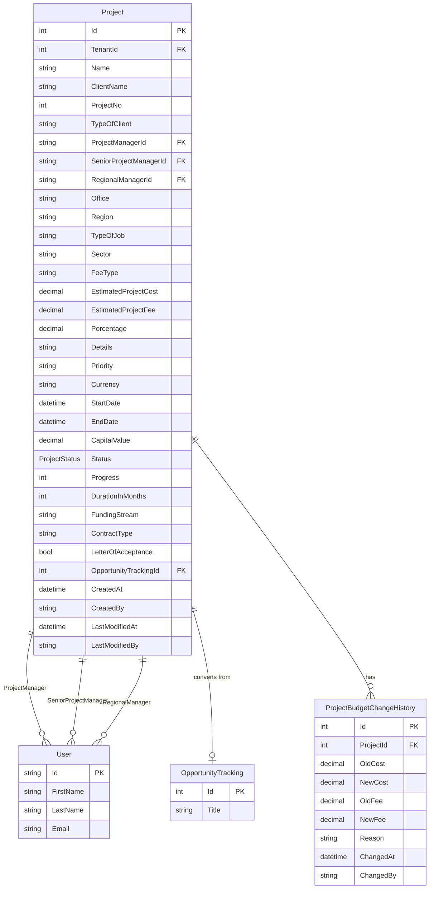
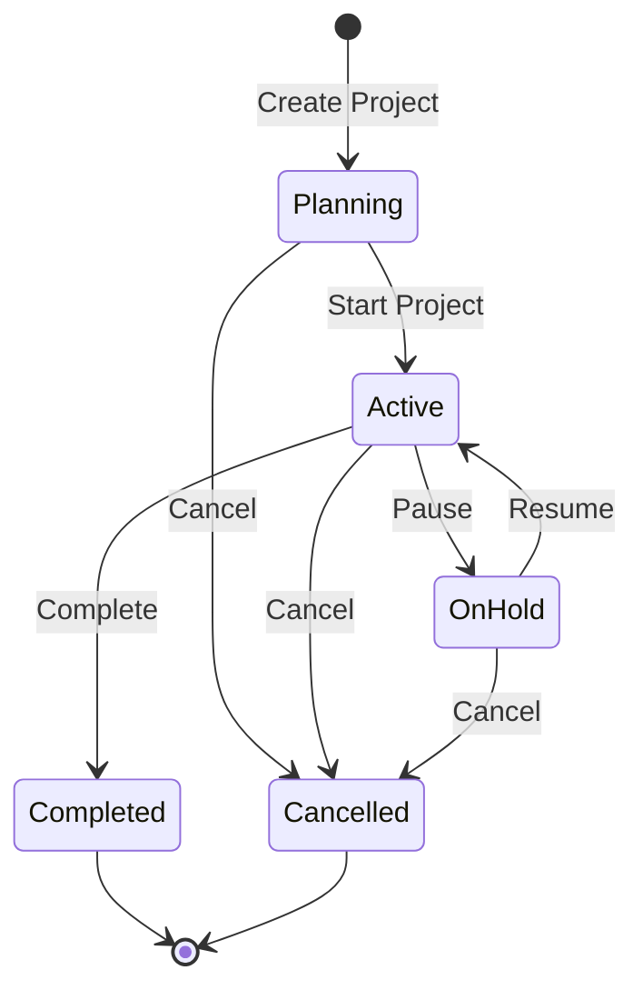

# Project Management Feature

## Overview

The Project Management feature is the core functionality of the PM Module, providing comprehensive project lifecycle management from initialization through completion. It enables project managers to create, track, and manage projects with detailed metadata, budget tracking, and status management.

## Business Value

- Centralized project information management
- Real-time project status tracking
- Budget management with change history
- Role-based access control for project visibility
- Integration with Business Development (opportunity conversion)

## Database Schema

### Project Entity



### Table Definition

```sql
CREATE TABLE Project (
    Id INT PRIMARY KEY IDENTITY(1,1),
    TenantId INT NOT NULL,
    Name NVARCHAR(255) NOT NULL,
    ClientName NVARCHAR(255),
    ProjectNo INT NOT NULL,
    TypeOfClient NVARCHAR(100),
    ProjectManagerId NVARCHAR(450) NOT NULL,
    SeniorProjectManagerId NVARCHAR(450),
    RegionalManagerId NVARCHAR(450) NOT NULL,
    Office NVARCHAR(100),
    Region NVARCHAR(100),
    TypeOfJob NVARCHAR(100),
    Sector NVARCHAR(100),
    FeeType NVARCHAR(50),
    EstimatedProjectCost DECIMAL(18,2) NOT NULL,
    EstimatedProjectFee DECIMAL(18,2) NOT NULL,
    Percentage DECIMAL(5,2),
    Details NVARCHAR(MAX),
    Priority NVARCHAR(50),
    Currency NVARCHAR(10),
    StartDate DATETIME,
    EndDate DATETIME,
    CapitalValue DECIMAL(18,2),
    Status INT NOT NULL,
    Progress INT DEFAULT 0,
    DurationInMonths INT,
    FundingStream NVARCHAR(100),
    ContractType NVARCHAR(100),
    LetterOfAcceptance BIT DEFAULT 0,
    OpportunityTrackingId INT,
    CreatedAt DATETIME NOT NULL DEFAULT GETUTCDATE(),
    CreatedBy NVARCHAR(450),
    LastModifiedAt DATETIME,
    LastModifiedBy NVARCHAR(450),
    
    CONSTRAINT FK_Project_ProjectManager FOREIGN KEY (ProjectManagerId) REFERENCES AspNetUsers(Id),
    CONSTRAINT FK_Project_SeniorProjectManager FOREIGN KEY (SeniorProjectManagerId) REFERENCES AspNetUsers(Id),
    CONSTRAINT FK_Project_RegionalManager FOREIGN KEY (RegionalManagerId) REFERENCES AspNetUsers(Id),
    CONSTRAINT FK_Project_OpportunityTracking FOREIGN KEY (OpportunityTrackingId) REFERENCES OpportunityTracking(Id)
);

CREATE INDEX IX_Project_TenantId ON Project(TenantId);
CREATE INDEX IX_Project_Status ON Project(Status);
CREATE INDEX IX_Project_ProjectManagerId ON Project(ProjectManagerId);
```

### Project Status Enum

```csharp
public enum ProjectStatus
{
    Planning = 0,
    Active = 1,
    OnHold = 2,
    Completed = 3,
    Cancelled = 4
}
```

## API Endpoints

### GET /api/Project
Get all projects for the current tenant.

**Response:** `200 OK`
```json
[
  {
    "id": 1,
    "name": "Airport Terminal Construction",
    "clientName": "City Airport Authority",
    "projectNo": 2024001,
    "typeOfClient": "Government",
    "projectManagerId": "user-guid-1",
    "projectManager": {
      "id": "user-guid-1",
      "firstName": "John",
      "lastName": "Smith"
    },
    "seniorProjectManagerId": "user-guid-2",
    "regionalManagerId": "user-guid-3",
    "office": "Main Office",
    "region": "North",
    "typeOfJob": "Construction",
    "sector": "Aviation",
    "feeType": "Fixed",
    "estimatedProjectCost": 5000000.00,
    "estimatedProjectFee": 500000.00,
    "percentage": 10.00,
    "priority": "High",
    "currency": "INR",
    "startDate": "2024-01-15T00:00:00Z",
    "endDate": "2024-12-31T00:00:00Z",
    "status": 1,
    "progress": 45,
    "letterOfAcceptance": true,
    "opportunityTrackingId": 5,
    "createdAt": "2024-01-01T10:00:00Z"
  }
]
```

### GET /api/Project/{id}
Get a specific project by ID.

**Parameters:**
- `id` (path): Project ID

**Response:** `200 OK` - Single project object

### GET /api/Project/getByUserId/{userId}
Get projects assigned to a specific user (as PM, SPM, or RM).

**Parameters:**
- `userId` (path): User ID

**Response:** `200 OK` - Array of projects

### POST /api/Project
Create a new project.

**Request Body:**
```json
{
  "name": "New Highway Project",
  "clientName": "Department of Transportation",
  "projectNo": 2024002,
  "typeOfClient": "Government",
  "projectManagerId": "user-guid-1",
  "seniorProjectManagerId": "user-guid-2",
  "regionalManagerId": "user-guid-3",
  "office": "Regional Office",
  "region": "South",
  "typeOfJob": "Infrastructure",
  "sector": "Transportation",
  "feeType": "Time & Materials",
  "estimatedProjectCost": 10000000.00,
  "estimatedProjectFee": 1000000.00,
  "percentage": 10.00,
  "priority": "Medium",
  "currency": "INR",
  "startDate": "2024-03-01T00:00:00Z",
  "endDate": "2025-06-30T00:00:00Z",
  "letterOfAcceptance": false,
  "opportunityTrackingId": 10
}
```

**Response:** `201 Created` - Returns project ID

### PUT /api/Project/{id}
Update an existing project.

**Parameters:**
- `id` (path): Project ID

**Request Body:** Same as POST with additional `budgetReason` field for budget changes

**Response:** `200 OK`

### DELETE /api/Project/{id}
Delete a project.

**Parameters:**
- `id` (path): Project ID

**Response:** `204 No Content`

## CQRS Operations

### Commands

| Command | Description | Handler |
|---------|-------------|---------|
| `CreateProjectCommand` | Creates a new project | `CreateProjectCommandHandler` |
| `UpdateProjectCommand` | Updates project details | `UpdateProjectCommandHandler` |
| `UpdateProjectBudgetCommand` | Updates project budget with history | `UpdateProjectBudgetCommandHandler` |
| `DeleteProjectCommand` | Deletes a project | `DeleteProjectCommandHandler` |

### Queries

| Query | Description | Handler |
|-------|-------------|---------|
| `GetAllProjectsQuery` | Gets all projects for tenant | `GetAllProjectsQueryHandler` |
| `GetProjectByIdQuery` | Gets project by ID | `GetProjectByIdQueryHandler` |
| `GetProjectByUserIdQuery` | Gets projects by user | `GetProjectByUserIdQueryHandler` |
| `GetProjectBudgetHistoryQuery` | Gets budget change history | `GetProjectBudgetHistoryQueryHandler` |

## Frontend Components

### Pages

#### ProjectManagement.tsx
Main project list page with search, filtering, and pagination.

**Features:**
- Project list with status indicators
- Search by name/description
- Role-based filtering (PM sees own projects, Admin sees all)
- Project status pie chart visualization
- Create new project dialog
- Pagination

**Props:** None (uses context for user)

**State:**
- `projects: Project[]` - List of projects
- `searchTerm: string` - Search filter
- `currentPage: number` - Pagination state
- `isCreatingProject: boolean` - Dialog state

#### ProjectDetails.tsx
Project detail view with tabbed interface.

**Features:**
- Project overview
- WBS management
- Monthly progress
- Documents
- Timeline
- Budget history

### Components

#### ProjectManagementProjectList.tsx
Renders the list of projects with actions.

**Props:**
```typescript
interface Props {
  projects: Project[];
  emptyMessage: string;
  onProjectDeleted: (projectId: string) => void;
  onProjectUpdated: () => void;
}
```

#### ProjectInitializationDialog.tsx
Modal dialog for creating new projects.

**Props:**
```typescript
interface Props {
  open: boolean;
  onClose: () => void;
  onProjectCreated: (data: ProjectFormData) => void;
}
```

#### ProjectStatusPieChart.tsx
Pie chart showing project status distribution.

#### BudgetUpdateDialog.tsx
Dialog for updating project budget with reason.

#### BudgetChangeTimeline.tsx
Timeline visualization of budget changes.

### Services

#### projectApi.tsx
API service for project operations.

```typescript
export const projectApi = {
  createProject: async (projectData: ProjectFormData) => Promise<number>,
  getAll: async () => Promise<Project[]>,
  getByUserId: async (userId: string) => Promise<Project[]>,
  getById: async (projectId: string) => Promise<Project>,
  update: async (projectId: string, projectData: Project, budgetReason?: string) => Promise<void>,
  delete: async (projectId: string) => Promise<void>,
  sendToReview: async (command: any) => Promise<void>
};
```

## Workflow States and Transitions



## Business Logic

### Project Creation
1. Validate required fields (name, project number, managers)
2. Check for duplicate project numbers
3. Set initial status to Planning
4. Create audit trail entry
5. If from opportunity, link OpportunityTrackingId

### Budget Updates
1. Capture old budget values
2. Validate new budget values
3. Require reason for change
4. Create ProjectBudgetChangeHistory record
5. Update project with new values
6. Create audit trail entry

### Role-Based Access
| Role | Access Level |
|------|--------------|
| System Admin | All projects |
| Tenant Admin | All tenant projects |
| Regional Director | All regional projects |
| Senior Project Manager | Assigned projects (as SPM) |
| Project Manager | Assigned projects (as PM) |

## Validation Rules

| Field | Rule |
|-------|------|
| Name | Required, max 255 characters |
| ProjectNo | Required, unique within tenant |
| ProjectManagerId | Required, valid user |
| RegionalManagerId | Required, valid user |
| EstimatedProjectCost | Required, >= 0 |
| EstimatedProjectFee | Required, >= 0 |
| StartDate | Must be before EndDate |
| EndDate | Must be after StartDate |

## Testing Coverage

### Unit Tests
- `ProjectsControllerTests.cs` - Controller endpoint tests
- `ProjectValidationTests.cs` - Validation rule tests

### Integration Tests
- `ProjectBudgetControllerIntegrationTests.cs` - Budget update flow
- `ProjectBudgetE2EWorkflowTests.cs` - End-to-end workflow

## Related Features

- [Work Breakdown Structure](./WORK_BREAKDOWN_STRUCTURE.md) - WBS for project tasks
- [Monthly Progress](./MONTHLY_PROGRESS.md) - Progress tracking
- [Project Closure](./PROJECT_CLOSURE.md) - Closure documentation
- [Cashflow](./CASHFLOW.md) - Financial tracking
