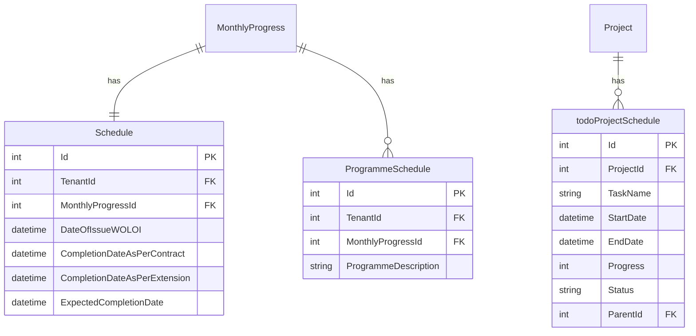

# Project Schedule Feature

## Overview

The Project Schedule feature provides schedule management and visualization capabilities for projects, including Gantt chart visualization, milestone tracking, and schedule variance analysis. It integrates with Monthly Progress for schedule tracking and provides visual timeline representation of project activities.

## Business Value

- Visual project timeline (Gantt chart)
- Milestone tracking
- Schedule variance analysis
- Contract vs. actual completion tracking
- Integration with Monthly Progress
- Programme schedule documentation

## Database Schema

### Entity Relationships



### Key Tables

#### Schedule
```sql
CREATE TABLE Schedule (
    Id INT PRIMARY KEY IDENTITY(1,1),
    TenantId INT NOT NULL,
    MonthlyProgressId INT NOT NULL,
    DateOfIssueWOLOI DATETIME,
    CompletionDateAsPerContract DATETIME,
    CompletionDateAsPerExtension DATETIME,
    ExpectedCompletionDate DATETIME,
    
    CONSTRAINT FK_Schedule_MonthlyProgress FOREIGN KEY (MonthlyProgressId) REFERENCES MonthlyProgress(Id)
);
```

#### ProgrammeSchedule
```sql
CREATE TABLE ProgrammeSchedule (
    Id INT PRIMARY KEY IDENTITY(1,1),
    TenantId INT NOT NULL,
    MonthlyProgressId INT NOT NULL,
    ProgrammeDescription NVARCHAR(MAX),
    
    CONSTRAINT FK_ProgrammeSchedule_MonthlyProgress FOREIGN KEY (MonthlyProgressId) REFERENCES MonthlyProgress(Id)
);
```

#### todoProjectSchedule (Gantt Chart Data)
```sql
CREATE TABLE todoProjectSchedule (
    Id INT PRIMARY KEY IDENTITY(1,1),
    ProjectId INT NOT NULL,
    TaskName NVARCHAR(255) NOT NULL,
    StartDate DATETIME,
    EndDate DATETIME,
    Progress INT DEFAULT 0,
    Status NVARCHAR(50),
    ParentId INT,
    DisplayOrder INT,
    
    CONSTRAINT FK_todoProjectSchedule_Project FOREIGN KEY (ProjectId) REFERENCES Project(Id),
    CONSTRAINT FK_todoProjectSchedule_Parent FOREIGN KEY (ParentId) REFERENCES todoProjectSchedule(Id)
);
```

### Field Descriptions

#### Schedule Fields
| Field | Type | Description |
|-------|------|-------------|
| DateOfIssueWOLOI | DATETIME | Date of issue of Work Order/Letter of Intent |
| CompletionDateAsPerContract | DATETIME | Original contract completion date |
| CompletionDateAsPerExtension | DATETIME | Extended completion date (if applicable) |
| ExpectedCompletionDate | DATETIME | Current expected completion date |

#### todoProjectSchedule Fields
| Field | Type | Description |
|-------|------|-------------|
| TaskName | NVARCHAR(255) | Name of the schedule task |
| StartDate | DATETIME | Task start date |
| EndDate | DATETIME | Task end date |
| Progress | INT | Completion percentage (0-100) |
| Status | NVARCHAR(50) | Task status |
| ParentId | INT | Parent task for hierarchy |

## API Endpoints

### GET /api/projectschedules/{projectId}
Get project schedule data for Gantt chart.

**Parameters:**
- `projectId` (path): Project ID

**Response:** `200 OK`
```json
{
  "projectId": 5,
  "tasks": [
    {
      "id": 1,
      "taskName": "Project Initiation",
      "startDate": "2024-01-15T00:00:00Z",
      "endDate": "2024-02-15T00:00:00Z",
      "progress": 100,
      "status": "Completed",
      "parentId": null,
      "children": [
        {
          "id": 2,
          "taskName": "Requirements Gathering",
          "startDate": "2024-01-15T00:00:00Z",
          "endDate": "2024-01-31T00:00:00Z",
          "progress": 100,
          "status": "Completed",
          "parentId": 1
        }
      ]
    },
    {
      "id": 3,
      "taskName": "Design Phase",
      "startDate": "2024-02-01T00:00:00Z",
      "endDate": "2024-04-30T00:00:00Z",
      "progress": 75,
      "status": "In Progress",
      "parentId": null
    }
  ],
  "schedule": {
    "dateOfIssueWOLOI": "2024-01-01T00:00:00Z",
    "completionDateAsPerContract": "2024-12-31T00:00:00Z",
    "completionDateAsPerExtension": null,
    "expectedCompletionDate": "2024-12-15T00:00:00Z"
  }
}
```

### POST /api/projectschedules
Create project schedule tasks.

**Request Body:**
```json
{
  "projectId": 5,
  "tasks": [
    {
      "taskName": "New Phase",
      "startDate": "2024-05-01T00:00:00Z",
      "endDate": "2024-07-31T00:00:00Z",
      "progress": 0,
      "status": "Not Started",
      "parentId": null
    }
  ]
}
```

**Response:** `201 Created`

## CQRS Operations

### Commands

| Command | Description | Handler |
|---------|-------------|---------|
| `CreateProjectScheduleCommand` | Create schedule tasks | `CreateProjectScheduleCommandHandler` |

### Queries

| Query | Description | Handler |
|-------|-------------|---------|
| `GetProjectScheduleQuery` | Get schedule by project | `GetProjectScheduleQueryHandler` |

## Frontend Components

### Charts

#### GanttChart.tsx
Interactive Gantt chart visualization for project schedules.

**Features:**
- Hierarchical task display
- Progress bars
- Date range visualization
- Milestone markers
- Zoom controls (day/week/month view)
- Task dependencies (visual lines)
- Interactive tooltips
- Export functionality

**Props:**
```typescript
interface GanttChartProps {
  projectId: string;
  tasks?: ScheduleTask[];
  onTaskClick?: (task: ScheduleTask) => void;
  viewMode?: 'day' | 'week' | 'month';
}
```

### Data Types

```typescript
interface ScheduleTask {
  id: number;
  taskName: string;
  startDate: string;
  endDate: string;
  progress: number;
  status: string;
  parentId: number | null;
  children?: ScheduleTask[];
}

interface ProjectSchedule {
  dateOfIssueWOLOI: string;
  completionDateAsPerContract: string;
  completionDateAsPerExtension: string | null;
  expectedCompletionDate: string;
}
```

## Schedule Calculations

### Duration Calculation
```
Duration (days) = EndDate - StartDate
Duration (weeks) = Duration (days) / 7
Duration (months) = Duration (days) / 30
```

### Variance Calculation
```
Schedule Variance = Expected Completion - Contract Completion
Delay Days = Actual End - Planned End (for completed tasks)
```

### Progress Calculation
```
Task Progress = (Completed Work / Total Work) × 100
Parent Progress = Average of Children Progress (weighted by duration)
Overall Progress = Sum of (Task Progress × Task Weight) / Total Weight
```

## Business Logic

### Schedule Creation
1. Validate project exists
2. Validate date ranges (start < end)
3. Validate parent-child relationships
4. Calculate initial progress
5. Create schedule records

### Progress Update
1. Update task progress
2. Recalculate parent task progress
3. Update overall project progress
4. Check for milestone completion

### Schedule Variance Analysis
1. Compare planned vs. actual dates
2. Calculate variance in days
3. Identify critical path delays
4. Generate variance report

## Validation Rules

| Field | Rule |
|-------|------|
| TaskName | Required, max 255 characters |
| StartDate | Required, valid date |
| EndDate | Required, must be >= StartDate |
| Progress | 0-100 |
| Status | Valid status value |
| ParentId | Must reference existing task or null |

## Gantt Chart Features

### View Modes
- **Day View**: Detailed daily breakdown
- **Week View**: Weekly summary
- **Month View**: Monthly overview
- **Quarter View**: Quarterly summary

### Visual Elements
- Task bars with progress fill
- Milestone diamonds
- Dependency arrows
- Today marker
- Critical path highlighting
- Baseline comparison

### Interactions
- Click to view task details
- Drag to reschedule (if enabled)
- Expand/collapse hierarchies
- Zoom in/out
- Pan timeline

## Testing Coverage

- Schedule CQRS handler tests
- API integration tests
- Date validation tests
- Gantt chart rendering tests

## Related Features

- [Project Management](./PROJECT_MANAGEMENT.md) - Parent project
- [Monthly Progress](./MONTHLY_PROGRESS.md) - Schedule tracking
- [Work Breakdown Structure](./WORK_BREAKDOWN_STRUCTURE.md) - Task source
