# Project Management (PM) Module

## Overview

The Project Management Module is the core operational component of the EDR (KarmaTech AI) application. It provides comprehensive project lifecycle management capabilities from project initialization through closure, including work breakdown structures, monthly progress tracking, cashflow management, scheduling, and change control.

## Module Purpose and Scope

The PM Module enables project managers and teams to:
- Create and manage projects with detailed metadata
- Define and track Work Breakdown Structures (WBS) with versioning
- Monitor monthly progress with financial and schedule tracking
- Manage project cashflow and budgets
- Track project schedules with Gantt chart visualization
- Handle change control with approval workflows
- Complete project closure with comprehensive documentation

## Module Architecture

```mermaid
flowchart TB
    subgraph Frontend["Frontend (React + TypeScript)"]
        PM[ProjectManagement.tsx]
        PD[ProjectDetails.tsx]
        PO[ProjectOverview.tsx]
        PF[ProjectForms.tsx]
        WBS[WorkBreakdownStructureForm.tsx]
        MR[MonthlyReports.tsx]
        CC[ChangeControlForm.tsx]
        PC[ProjectClosureForm.tsx]
        GC[GanttChart.tsx]
        CF[CashflowChart.tsx]
    end

    subgraph Services["API Services"]
        PA[projectApi.tsx]
        WA[wbsApi.tsx]
        MA[monthlyProgressApi.tsx]
        CA[changeControlApi.tsx]
        PCA[projectClosureApi.ts]
        PBA[projectBudgetApi.ts]
    end

    subgraph Backend["Backend (ASP.NET Core)"]
        subgraph CQRS["CQRS Layer"]
            PC_CMD[Projects Commands]
            PC_QRY[Projects Queries]
            WBS_CMD[WBS Commands]
            WBS_QRY[WBS Queries]
            MP_CMD[MonthlyProgress Commands]
            MP_QRY[MonthlyProgress Queries]
            CC_CMD[ChangeControl Commands]
            CC_QRY[ChangeControl Queries]
            PCL_CMD[ProjectClosure Commands]
            PCL_QRY[ProjectClosure Queries]
            CF_CMD[Cashflow Commands]
            CF_QRY[Cashflow Queries]
            PS_CMD[ProjectSchedules Commands]
            PS_QRY[ProjectSchedules Queries]
        end

        subgraph Repositories["Repository Layer"]
            PR[IProjectRepository]
            WR[IWorkBreakdownStructureRepository]
            MPR[IMonthlyProgressRepository]
            CCR[IChangeControlRepository]
            PCR[IProjectClosureRepository]
            CFR[ICashflowRepository]
            PSR[IProjectScheduleRepository]
        end
    end

    subgraph Database["Database (SQL Server)"]
        P_TBL[(Project)]
        WBS_TBL[(WorkBreakdownStructure)]
        WBST_TBL[(WBSTask)]
        MP_TBL[(MonthlyProgress)]
        CC_TBL[(ChangeControl)]
        PC_TBL[(ProjectClosure)]
        CF_TBL[(Cashflow)]
        SCH_TBL[(Schedule)]
    end

    PM --> PA
    PD --> PA
    PD --> WA
    PD --> MA
    WBS --> WA
    MR --> MA
    CC --> CA
    PC --> PCA
    GC --> PA
    CF --> PBA

    PA --> PC_CMD
    PA --> PC_QRY
    WA --> WBS_CMD
    WA --> WBS_QRY
    MA --> MP_CMD
    MA --> MP_QRY
    CA --> CC_CMD
    CA --> CC_QRY
    PCA --> PCL_CMD
    PCA --> PCL_QRY

    PC_CMD --> PR
    PC_QRY --> PR
    WBS_CMD --> WR
    WBS_QRY --> WR
    MP_CMD --> MPR
    MP_QRY --> MPR
    CC_CMD --> CCR
    CC_QRY --> CCR
    PCL_CMD --> PCR
    PCL_QRY --> PCR
    CF_CMD --> CFR
    CF_QRY --> CFR
    PS_CMD --> PSR
    PS_QRY --> PSR

    PR --> P_TBL
    WR --> WBS_TBL
    WR --> WBST_TBL
    MPR --> MP_TBL
    CCR --> CC_TBL
    PCR --> PC_TBL
    CFR --> CF_TBL
    PSR --> SCH_TBL
```

## Features in Module

| Feature | Description | Documentation |
|---------|-------------|---------------|
| Project Management | Core project CRUD operations, status tracking, budget management | [PROJECT_MANAGEMENT.md](./PROJECT_MANAGEMENT.md) |
| Work Breakdown Structure | Hierarchical task management with versioning and approval workflow | [WORK_BREAKDOWN_STRUCTURE.md](./WORK_BREAKDOWN_STRUCTURE.md) |
| Monthly Progress | Monthly reporting with financial details, schedule tracking, deliverables | [MONTHLY_PROGRESS.md](./MONTHLY_PROGRESS.md) |
| Project Closure | Comprehensive project closure documentation with approval workflow | [PROJECT_CLOSURE.md](./PROJECT_CLOSURE.md) |
| Cashflow | Project cashflow tracking and visualization | [CASHFLOW.md](./CASHFLOW.md) |
| Project Schedule | Schedule management with Gantt chart visualization | [PROJECT_SCHEDULE.md](./PROJECT_SCHEDULE.md) |
| Change Control | Change request management with impact assessment and approval workflow | [CHANGE_CONTROL.md](./CHANGE_CONTROL.md) |

## Entity Summary

| Entity | Description | Key Relationships |
|--------|-------------|-------------------|
| Project | Core project entity with metadata | User (PM, SPM, RM), OpportunityTracking |
| WorkBreakdownStructure | WBS container with versioning | Project, WBSTask, WBSVersionHistory |
| WBSTask | Hierarchical task structure | WorkBreakdownStructure, WBSOption, Parent/Children |
| MonthlyProgress | Monthly progress report | Project, FinancialDetails, Schedule, Deliverables |
| ProjectClosure | Project closure documentation | Project, PMWorkflowStatus, WorkflowHistory |
| Cashflow | Monthly cashflow data | Project |
| ChangeControl | Change request tracking | Project, PMWorkflowStatus, WorkflowHistory |
| Schedule | Schedule tracking | MonthlyProgress |

## API Endpoints Summary

### Projects
- `GET /api/projects` - Get all projects
- `GET /api/projects/{id}` - Get project by ID
- `GET /api/projects/user/{userId}` - Get projects by user
- `POST /api/projects` - Create project
- `PUT /api/projects/{id}` - Update project
- `PUT /api/projects/{id}/budget` - Update project budget
- `DELETE /api/projects/{id}` - Delete project

### Work Breakdown Structure
- `GET /api/wbs/project/{projectId}` - Get WBS by project
- `GET /api/wbs/approved/{projectId}` - Get approved WBS
- `GET /api/wbs/versions/{wbsId}` - Get WBS versions
- `POST /api/wbs` - Create/Set WBS
- `POST /api/wbs/task` - Add WBS task
- `PUT /api/wbs/task/{id}` - Update WBS task
- `DELETE /api/wbs/task/{id}` - Delete WBS task

### Monthly Progress
- `GET /api/monthlyprogress/project/{projectId}` - Get monthly progress
- `POST /api/monthlyprogress` - Create monthly progress
- `PUT /api/monthlyprogress/{id}` - Update monthly progress
- `DELETE /api/monthlyprogress/{id}` - Delete monthly progress

### Project Closure
- `GET /api/projectclosure/project/{projectId}` - Get project closure
- `POST /api/projectclosure` - Create project closure
- `PUT /api/projectclosure/{id}` - Update project closure
- `DELETE /api/projectclosure/{id}` - Delete project closure

### Cashflow
- `GET /api/cashflow/project/{projectId}` - Get cashflows
- `POST /api/cashflow` - Create cashflow
- `PUT /api/cashflow/{id}` - Update cashflow
- `DELETE /api/cashflow/{id}` - Delete cashflow

### Change Control
- `GET /api/changecontrol/project/{projectId}` - Get change controls
- `POST /api/changecontrol` - Create change control
- `PUT /api/changecontrol/{id}` - Update change control
- `DELETE /api/changecontrol/{id}` - Delete change control

## Frontend Components Summary

### Pages
- `ProjectManagement.tsx` - Main project list and management page
- `ProjectDetails.tsx` - Project detail view with tabs
- `ProjectOverview.tsx` - Project overview dashboard
- `ProjectForms.tsx` - Project forms container
- `ProjectTimeline.tsx` - Project timeline view
- `ProjectDocuments.tsx` - Project documents management
- `ProjectBudgetHistory.tsx` - Budget change history

### Forms
- `ProjectInitForm.tsx` - Project initialization form
- `WorkBreakdownStructureForm.tsx` - WBS management form
- `MonthlyReports.tsx` - Monthly progress reporting
- `ProjectClosureForm.tsx` - Project closure form
- `ChangeControlForm.tsx` - Change control form

### Charts & Visualizations
- `GanttChart.tsx` - Project schedule Gantt chart
- `CashflowChart.tsx` - Cashflow visualization
- `WBSChart.tsx` - WBS visualization

### Workflow Components
- `ProjectClosureWorkflow.tsx` - Closure approval workflow
- `ChangeControlWorkflow.tsx` - Change control workflow
- `ProjectTrackingWorkflow.tsx` - Project tracking workflow

## Workflow States

The PM Module uses a standardized workflow system (`PMWorkflowStatus`) for approval processes:

| Status ID | Status Name | Description |
|-----------|-------------|-------------|
| 1 | Initial | Draft state, not yet submitted |
| 2 | Submitted for Review | Awaiting review |
| 3 | Under Review | Being reviewed |
| 4 | Approved | Approved and active |
| 5 | Rejected | Rejected, needs revision |
| 6 | Revision Requested | Changes requested |

## Integration Points

- **Business Development Module**: Projects are created from approved opportunities
- **Admin Module**: User management for project managers and team members
- **Audit System**: All changes are tracked in audit logs
- **Email Service**: Notifications for workflow transitions

## Technology Stack

- **Backend**: ASP.NET Core 8.0, Entity Framework Core, MediatR (CQRS)
- **Frontend**: React 18.3, TypeScript, Material-UI
- **Database**: Microsoft SQL Server
- **State Management**: React Context API
- **Charts**: Recharts
