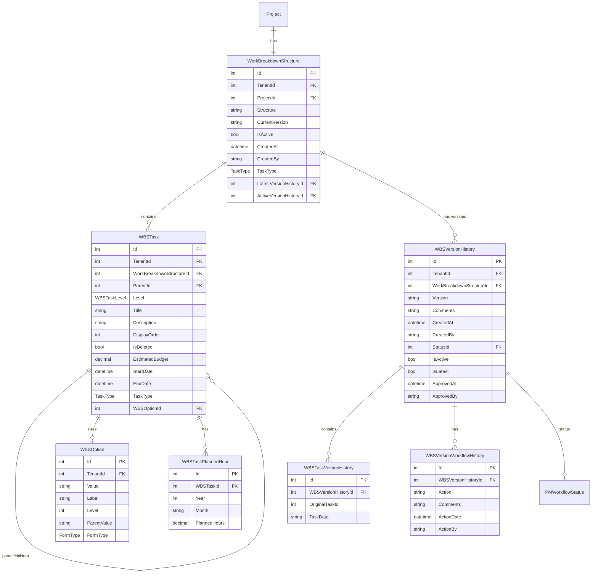
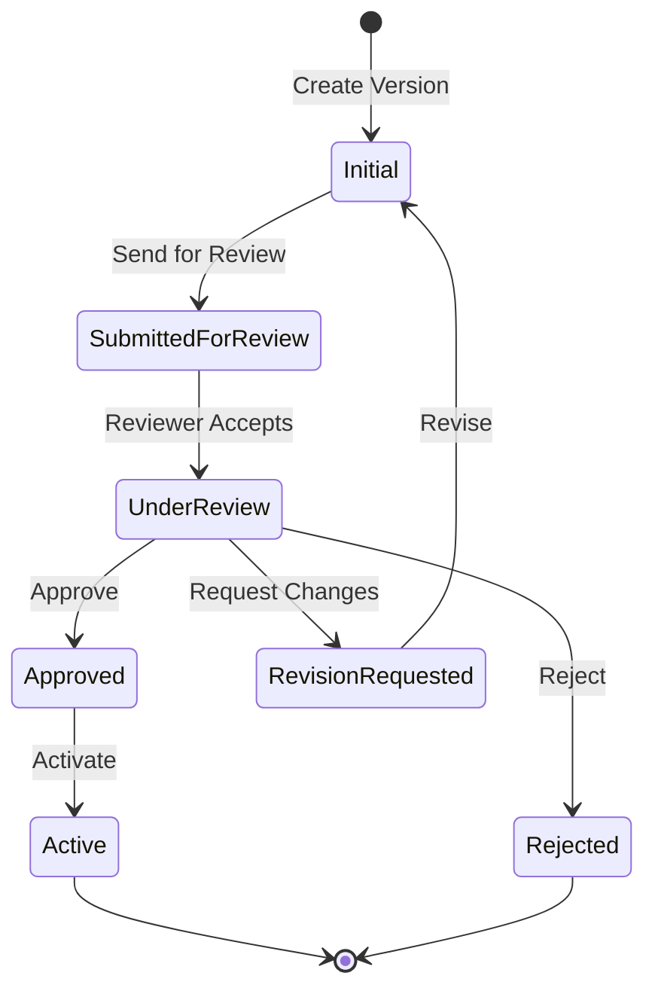

# Work Breakdown Structure (WBS) Feature

## Overview

The Work Breakdown Structure (WBS) feature provides hierarchical task management for projects with support for versioning, approval workflows, and resource planning. It enables project managers to define project scope through a structured breakdown of work packages, track planned hours, and manage budget allocation.

## Business Value

- Structured project scope definition
- Resource allocation and planning
- Version control with approval workflow
- Budget tracking at task level
- Integration with Monthly Progress reporting
- Support for both Manpower and ODC (Other Direct Costs) tasks

## Database Schema

### Entity Relationships



### Key Tables

#### WorkBreakdownStructure
```sql
CREATE TABLE WorkBreakdownStructure (
    Id INT PRIMARY KEY IDENTITY(1,1),
    TenantId INT NOT NULL,
    ProjectId INT NOT NULL,
    Structure NVARCHAR(MAX),
    CurrentVersion NVARCHAR(20),
    IsActive BIT DEFAULT 1,
    CreatedAt DATETIME NOT NULL DEFAULT GETUTCDATE(),
    CreatedBy NVARCHAR(450),
    TaskType INT DEFAULT 0,
    LatestVersionHistoryId INT,
    ActiveVersionHistoryId INT,
    
    CONSTRAINT FK_WBS_Project FOREIGN KEY (ProjectId) REFERENCES Project(Id),
    CONSTRAINT FK_WBS_LatestVersion FOREIGN KEY (LatestVersionHistoryId) REFERENCES WBSVersionHistory(Id),
    CONSTRAINT FK_WBS_ActiveVersion FOREIGN KEY (ActiveVersionHistoryId) REFERENCES WBSVersionHistory(Id)
);
```

#### WBSTask
```sql
CREATE TABLE WBSTask (
    Id INT PRIMARY KEY IDENTITY(1,1),
    TenantId INT NOT NULL,
    WorkBreakdownStructureId INT NOT NULL,
    ParentId INT,
    Level INT NOT NULL,
    Title NVARCHAR(255),
    Description NVARCHAR(1000),
    DisplayOrder INT,
    IsDeleted BIT DEFAULT 0,
    EstimatedBudget DECIMAL(18,2),
    StartDate DATETIME,
    EndDate DATETIME,
    TaskType INT DEFAULT 0,
    WBSOptionId INT,
    CreatedAt DATETIME NOT NULL DEFAULT GETUTCDATE(),
    CreatedBy NVARCHAR(100),
    UpdatedAt DATETIME,
    UpdatedBy NVARCHAR(100),
    
    CONSTRAINT FK_WBSTask_WBS FOREIGN KEY (WorkBreakdownStructureId) REFERENCES WorkBreakdownStructure(Id),
    CONSTRAINT FK_WBSTask_Parent FOREIGN KEY (ParentId) REFERENCES WBSTask(Id),
    CONSTRAINT FK_WBSTask_Option FOREIGN KEY (WBSOptionId) REFERENCES WBSOption(Id)
);
```

#### WBSOption
```sql
CREATE TABLE WBSOption (
    Id INT PRIMARY KEY IDENTITY(1,1),
    TenantId INT NOT NULL,
    Value NVARCHAR(100) NOT NULL,
    Label NVARCHAR(255) NOT NULL,
    Level INT NOT NULL,
    ParentValue NVARCHAR(500),
    FormType INT DEFAULT 0
);
```

### Enums

```csharp
public enum TaskType
{
    Manpower = 0,
    ODC = 1
}

public enum WBSTaskLevel
{
    Level1 = 1,
    Level2 = 2,
    Level3 = 3,
    Level4 = 4
}

public enum FormType
{
    Manpower = 0,
    ODC = 1
}
```

## API Endpoints

### WBS Structure

#### GET /api/projects/{projectId}/wbs
Get WBS structure for a project.

**Response:** `200 OK`
```json
{
  "id": 1,
  "projectId": 5,
  "currentVersion": "1.0",
  "isActive": true,
  "tasks": [
    {
      "id": 1,
      "parentId": null,
      "level": 1,
      "title": "Project Management",
      "description": "",
      "displayOrder": 1,
      "estimatedBudget": 100000.00,
      "taskType": 0,
      "wbsOptionId": 1,
      "plannedHours": {
        "2024": {
          "Jan": 40,
          "Feb": 40,
          "Mar": 40
        }
      },
      "children": [
        {
          "id": 2,
          "parentId": 1,
          "level": 2,
          "title": "Planning",
          "taskType": 0
        }
      ]
    }
  ]
}
```

#### PUT /api/projects/{projectId}/wbs
Save/Update WBS structure.

**Request Body:**
```json
[
  {
    "id": 0,
    "frontendTempId": "temp-123",
    "parentId": null,
    "level": 1,
    "title": "Engineering",
    "assignedUserId": "user-guid",
    "costRate": 150.00,
    "totalHours": 200,
    "totalCost": 30000.00,
    "taskType": 0,
    "wbsOptionId": 1,
    "plannedHours": [
      { "year": 2024, "month": "Jan", "plannedHours": 40 }
    ]
  }
]
```

#### DELETE /api/projects/{projectId}/wbs/tasks/{taskId}
Delete a WBS task.

### WBS Options

#### GET /api/wbsoptions
Get all WBS options.

#### GET /api/wbsoptions/level1?formType={formType}
Get level 1 options (optionally filtered by form type).

#### GET /api/wbsoptions/level2?formType={formType}
Get level 2 options.

#### GET /api/wbsoptions/level3/{level2Value}?formType={formType}
Get level 3 options for a specific level 2 value.

#### POST /api/WBSOptions
Create new WBS option(s).

#### PUT /api/WBSOptions/{id}
Update a WBS option.

#### DELETE /api/WBSOptions/{id}
Delete a WBS option.

### WBS Versioning

#### GET /api/wbs/versions/{wbsId}
Get all versions for a WBS.

#### GET /api/wbs/approved/{projectId}
Get the approved/active WBS version.

#### POST /api/wbs/version
Create a new WBS version.

**Request Body:**
```json
{
  "projectId": 5,
  "tasks": [...],
  "comments": "Initial version"
}
```

#### PUT /api/wbs/version/{versionId}/workflow
Update version workflow status.

**Request Body:**
```json
{
  "action": "SendForReview",
  "comments": "Ready for review",
  "assignedToId": "reviewer-guid"
}
```

#### POST /api/wbs/version/{versionId}/activate
Activate a specific version.

#### POST /api/wbs/version/{versionId}/restore
Restore to a specific version.

## CQRS Operations

### Commands

| Command | Description |
|---------|-------------|
| `SetWBSCommand` | Create/Update WBS structure |
| `AddWBSTaskCommand` | Add a new task |
| `CreateWBSTaskCommand` | Create task with details |
| `UpdateWBSTaskCommand` | Update existing task |
| `DeleteWBSTaskCommand` | Delete a task |
| `CreateWBSOptionCommand` | Create WBS option |
| `UpdateWBSOptionCommand` | Update WBS option |
| `DeleteWBSOptionCommand` | Delete WBS option |
| `CreateWBSVersionCommand` | Create new version |
| `UpdateWBSVersionWorkflowCommand` | Update version workflow |
| `ActivateWBSVersionCommand` | Activate a version |
| `RestoreWBSVersionCommand` | Restore to version |
| `DeleteWBSVersionCommand` | Delete a version |
| `ApproveWBSVersionCommand` | Approve a version |
| `RejectWBSVersionCommand` | Reject a version |

### Queries

| Query | Description |
|-------|-------------|
| `GetWBSByProjectIdQuery` | Get WBS by project |
| `GetApprovedWBSQuery` | Get approved WBS |
| `GetWBSVersionsQuery` | Get all versions |
| `GetWBSTasksQuery` | Get all tasks |
| `GetWBSTaskByIdQuery` | Get task by ID |
| `GetWBSOptionsQuery` | Get all options |
| `GetWBSLevel1OptionsQuery` | Get level 1 options |
| `GetWBSLevel2OptionsQuery` | Get level 2 options |
| `GetWBSLevel3OptionsQuery` | Get level 3 options |
| `GetWBSResourceDataQuery` | Get resource data |
| `GetManpowerResourcesWithPlannedHoursQuery` | Get manpower with hours |

## Frontend Components

### Forms

#### WorkBreakdownStructureForm.tsx
Main WBS management form with hierarchical task editor.

**Features:**
- Hierarchical task tree view
- Drag-and-drop reordering
- Inline editing
- Planned hours grid
- Version management
- Approval workflow integration

### Components

#### WBSLevelTable.tsx
Table component for displaying WBS levels.

#### WBSItemRow.tsx
Individual row component for WBS items.

#### WBSFormDialog.tsx
Dialog for adding/editing WBS items.

#### WBSChart.tsx
Visual chart representation of WBS.

#### DeleteWBSDialog.tsx
Confirmation dialog for WBS deletion.

### Services

#### wbsApi.tsx
```typescript
export const WBSStructureAPI = {
  getProjectWBS: async (projectId: string): Promise<WBSRowData[]>,
  setProjectWBS: async (projectId: string, wbsData: WBSRowData[]): Promise<void>,
  deleteWBSTask: async (projectId: string, taskId: string): Promise<void>
};

export const WBSOptionsAPI = {
  getWBSOptions: async (): Promise<WBSOption[]>,
  createOption: async (newOption: WBSOption): Promise<WBSOption>,
  updateOption: async (id: string, updatedOption: WBSOption): Promise<WBSOption>,
  deleteOption: async (id: string): Promise<void>,
  getLevel1Options: async (formType?: number): Promise<WBSOption[]>,
  getLevel2Options: async (formType?: number): Promise<WBSOption[]>,
  getLevel3Options: async (level2Value: string, formType?: number): Promise<WBSOption[]>
};

export const PlannedHoursAPI = {
  getPlannedHoursByProjectId: async (projectId: string),
  updatePlannedHours: async (projectId: string, taskId: string, data)
};
```

#### wbsWorkflowApi.tsx
API for WBS version workflow operations.

## Versioning and Approval Workflow



### Workflow Actions

| Action | From Status | To Status | Description |
|--------|-------------|-----------|-------------|
| SendForReview | Initial | SubmittedForReview | Submit for review |
| AcceptReview | SubmittedForReview | UnderReview | Reviewer accepts |
| Approve | UnderReview | Approved | Approve version |
| Reject | UnderReview | Rejected | Reject version |
| RequestRevision | UnderReview | RevisionRequested | Request changes |
| Revise | RevisionRequested | Initial | Make revisions |
| Activate | Approved | Active | Make version active |

## Business Logic

### Task Hierarchy
- Level 1: Major work packages (e.g., Project Management, Engineering)
- Level 2: Sub-packages (e.g., Planning, Design)
- Level 3: Work items (e.g., Requirements Analysis)
- Level 4: Detailed tasks (optional)

### Planned Hours Calculation
- Hours are tracked per month per task
- Total hours = Sum of all monthly hours
- Total cost = Hours × Cost Rate
- Roll-up to parent tasks

### Version Management
- Only one version can be active at a time
- Creating new version copies current tasks
- Approved versions can be activated
- Historical versions are preserved

## Validation Rules

| Field | Rule |
|-------|------|
| Level | Required, 1-4 |
| Title | Max 255 characters |
| Description | Max 1000 characters |
| EstimatedBudget | >= 0 |
| PlannedHours | >= 0 per month |
| WBSOption | Must match level |

## Testing Coverage

- WBS CQRS handler tests
- WBS API integration tests
- Version workflow tests
- Option management tests

## Related Features

- [Project Management](./PROJECT_MANAGEMENT.md) - Parent project
- [Monthly Progress](./MONTHLY_PROGRESS.md) - Uses WBS for tracking
- [Job Start Form](../BD_MODULE/JOB_START_FORM.md) - Resource allocation from WBS
