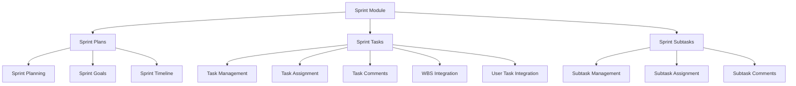

# Sprint Module

## Overview

The Sprint Module provides comprehensive sprint planning and task management capabilities for agile project management within the EDR system. It enables teams to organize work into time-boxed sprints, create and manage tasks with subtasks, track progress, and collaborate through comments.

## Purpose

The Sprint Module supports agile development methodologies by:
- Creating and managing sprint plans with defined goals and timelines
- Organizing work into hierarchical tasks and subtasks
- Tracking task status, priority, and assignments
- Facilitating team collaboration through task comments
- Linking sprint work to project WBS and user assignments

## Module Architecture

## Features

### 1. Sprint Plans
- Create sprint plans with sprint numbers, goals, and date ranges
- Associate sprints with specific projects
- Define required employee count for sprint capacity planning
- Track multiple sprints per project

### 2. Sprint Tasks
- Create tasks with unique identifiers (e.g., "T-101")
- Assign task keys following project conventions (e.g., "PROJ-101")
- Set task types, priorities, and status
- Assign tasks to team members with avatar support
- Track reporters and assignees
- Add story points for estimation
- Attach files and documents
- Add comments for collaboration
- Link tasks to WBS plans and user tasks

### 3. Sprint Subtasks
- Break down tasks into manageable subtasks
- Maintain hierarchical task structure
- Independent status and priority tracking
- Separate assignee and reporter tracking
- Subtask-specific comments
- Expandable/collapsible UI support

## Key Entities

### SprintPlan
- **SprintId**: Unique identifier
- **SprintNumber**: Sequential sprint number
- **StartDate/EndDate**: Sprint timeline
- **SprintGoal**: Sprint objective description
- **ProjectId**: Associated project
- **RequiredSprintEmployees**: Team capacity requirement

### SprintTask
- **Taskid**: Unique task identifier (e.g., "T-101")
- **Taskkey**: Project-specific key (e.g., "PROJ-101")
- **TaskTitle**: Task name
- **Taskdescription**: Detailed description
- **TaskType**: Type classification
- **Taskpriority**: Priority level
- **Taskstatus**: Current status
- **StoryPoints**: Estimation points
- **TaskAssineid/TaskAssigneeName/TaskAssigneeAvatar**: Assignee details
- **TaskReporterId/TaskReporterName/TaskReporterAvatar**: Reporter details
- **SprintPlanId**: Associated sprint
- **WbsPlanId**: Linked WBS plan
- **UserTaskId**: Linked user task

### SprintSubtask
- **SubtaskId**: Unique identifier
- **Subtaskkey**: Subtask key (e.g., "PROJ-101-1")
- **Subtasktitle**: Subtask name
- **Subtaskdescription**: Detailed description
- **Subtaskpriority**: Priority level
- **Subtaskstatus**: Current status
- **SubtaskAssineid/SubtaskAssigneeName/SubtaskAssigneeAvatar**: Assignee details
- **SubtaskReporterId/SubtaskReporterName/SubtaskReporterAvatar**: Reporter details
- **Taskid**: Parent task reference

### SprintTaskComment
- **CommentId**: Unique identifier
- **CommentText**: Comment content
- **Taskid**: Associated task
- **CreatedBy/CreatedDate**: Audit fields
- **UpdatedBy/UpdatedDate**: Modification tracking

### SprintSubtaskComment
- **SubtaskCommentId**: Unique identifier
- **CommentText**: Comment content
- **Taskid**: Associated task
- **SubtaskId**: Associated subtask
- **CreatedBy/CreatedDate**: Audit fields
- **UpdatedBy/UpdatedDate**: Modification tracking

## API Endpoints

### Sprint Plans
- `POST /api/sprint-tasks/single-sprint-plan` - Create sprint plan
- `GET /api/sprint-tasks/single-sprint-plan/{sprintId}` - Get sprint plan
- `PUT /api/sprint-tasks/single-sprint-plan` - Update sprint plan

### Sprint Tasks
- `POST /api/sprint-tasks/single-sprint-task` - Create task
- `GET /api/sprint-tasks/{taskId}` - Get task details
- `PUT /api/sprint-tasks/single-sprint-task` - Update task
- `DELETE /api/sprint-tasks/{taskId}` - Delete task
- `GET /api/sprint-tasks/project/{projectId}/tasks` - Get all tasks for project

### Sprint Subtasks
- `POST /api/sprint-tasks/{taskId}/subtasks` - Create subtask
- `GET /api/sprint-tasks/subtasks/{subtaskId}` - Get subtask details
- `PUT /api/sprint-tasks/subtasks/{subtaskId}` - Update subtask
- `DELETE /api/sprint-tasks/subtasks/{subtaskId}` - Delete subtask
- `GET /api/sprint-tasks/{taskId}/subtasks` - Get all subtasks for task

### Task Comments
- `POST /api/sprint-tasks/{taskId}/comments` - Add task comment
- `GET /api/sprint-tasks/{taskId}/comments` - Get task comments
- `GET /api/sprint-tasks/comments/{commentId}` - Get comment by ID
- `PUT /api/sprint-tasks/{taskId}/comments/{commentId}` - Update comment
- `DELETE /api/sprint-tasks/comments/{commentId}` - Delete comment

### Subtask Comments
- `POST /api/sprint-tasks/{taskId}/subtasks/{subtaskId}/comments` - Add subtask comment
- `GET /api/sprint-tasks/{taskId}/subtasks/{subtaskId}/comments` - Get subtask comments
- `GET /api/sprint-tasks/subtask-comments/{subtaskCommentId}` - Get comment by ID
- `PUT /api/sprint-tasks/{taskId}/subtasks/{subtaskId}/comments/{subtaskCommentId}` - Update comment
- `DELETE /api/sprint-tasks/subtask-comments/{subtaskCommentId}` - Delete comment

## CQRS Operations

### Commands
- **CreateSingleSprintPlanCommand**: Create new sprint plan
- **UpdateSingleSprintPlanCommand**: Update existing sprint plan
- **CreateSprintTaskCommand**: Create new task with optional subtasks
- **UpdateSprintTaskCommand**: Update task and subtasks
- **DeleteSprintTaskCommand**: Delete task and all subtasks
- **CreateSprintSubtaskCommand**: Create new subtask
- **UpdateSprintSubtaskCommand**: Update existing subtask
- **DeleteSprintSubtaskCommand**: Delete subtask
- **AddSprintTaskCommentCommand**: Add comment to task
- **UpdateSprintTaskCommentCommand**: Update task comment
- **DeleteSprintTaskCommentCommand**: Delete task comment
- **AddSprintSubtaskCommentCommand**: Add comment to subtask
- **UpdateSprintSubtaskCommentCommand**: Update subtask comment
- **DeleteSprintSubtaskCommentCommand**: Delete subtask comment

### Queries
- **GetSingleSprintPlanQuery**: Retrieve sprint plan by ID
- **GetSingleSprintTaskQuery**: Retrieve task by ID
- **GetSprintTasksByProjectIdQuery**: Get all tasks for a project
- **GetAllSprintSubtasksByTaskIdQuery**: Get all subtasks for a task
- **GetSprintSubtaskByIdQuery**: Retrieve subtask by ID
- **GetSprintTaskCommentsByTaskIdQuery**: Get all comments for a task
- **GetSprintTaskCommentByIdQuery**: Retrieve task comment by ID
- **GetSprintSubtaskCommentsBySubtaskIdQuery**: Get all comments for a subtask
- **GetSprintSubtaskCommentByIdQuery**: Retrieve subtask comment by ID

## Integration Points

### Project Management
- Sprint plans are associated with projects via `ProjectId`
- Enables project-specific sprint planning and tracking

### Work Breakdown Structure (WBS)
- Tasks can be linked to WBS plans via `WbsPlanId`
- Connects sprint work to project WBS structure

### User Task Management
- Tasks can be linked to user tasks via `UserTaskId`
- Integrates with user-specific task assignments

### Multi-Tenancy
- All entities implement `ITenantEntity` interface
- Ensures data isolation across tenants

## User Roles and Permissions

The Sprint Module respects the EDR permission system:
- **Project Managers**: Full access to sprint planning and task management
- **Team Members**: Can view and update assigned tasks
- **Stakeholders**: Read-only access to sprint progress

## Workflow

### Sprint Planning Workflow
1. Create sprint plan with goals and timeline
2. Define required team capacity
3. Create tasks and assign to sprint
4. Break down tasks into subtasks
5. Assign tasks to team members
6. Track progress through status updates
7. Collaborate via comments

### Task Management Workflow
1. Create task with title, description, and type
2. Set priority and story points
3. Assign to team member
4. Create subtasks for detailed work breakdown
5. Update status as work progresses
6. Add comments for collaboration
7. Complete task and subtasks

## Frontend Components

The Sprint Module frontend components include:
- Sprint planning interface
- Task board/kanban view
- Task detail views
- Subtask management
- Comment threads
- Assignment management
- Status tracking

## Database Schema

### Tables
- **SprintPlan**: Sprint planning data
- **SprintTask**: Task information
- **SprintSubtask**: Subtask details
- **SprintTaskComment**: Task comments
- **SprintSubtaskComment**: Subtask comments

### Relationships
- SprintPlan → Project (many-to-one)
- SprintTask → SprintPlan (many-to-one)
- SprintTask → WBSTaskPlannedHour (many-to-one)
- SprintTask → UserWBSTask (many-to-one)
- SprintSubtask → SprintTask (many-to-one)
- SprintTaskComment → SprintTask (many-to-one)
- SprintSubtaskComment → SprintTask (many-to-one)
- SprintSubtaskComment → SprintSubtask (many-to-one)

## Testing

The Sprint Module includes:
- Unit tests for CQRS handlers
- Integration tests for API endpoints
- Validation tests for business rules
- Multi-tenancy isolation tests

## Future Enhancements

Potential improvements for the Sprint Module:
- Sprint velocity tracking
- Burndown charts
- Sprint retrospectives
- Task dependencies
- Time tracking integration
- Sprint templates
- Automated sprint rollover
- Advanced reporting and analytics

## Related Documentation

- [Project Management Module](../PM_MODULE/README.md)
- [Work Breakdown Structure](../PM_MODULE/WORK_BREAKDOWN_STRUCTURE.md)
- [API Documentation](../API_DOCUMENTATION.md)
- [Database Schema](../DATABASE_SCHEMA.md)
