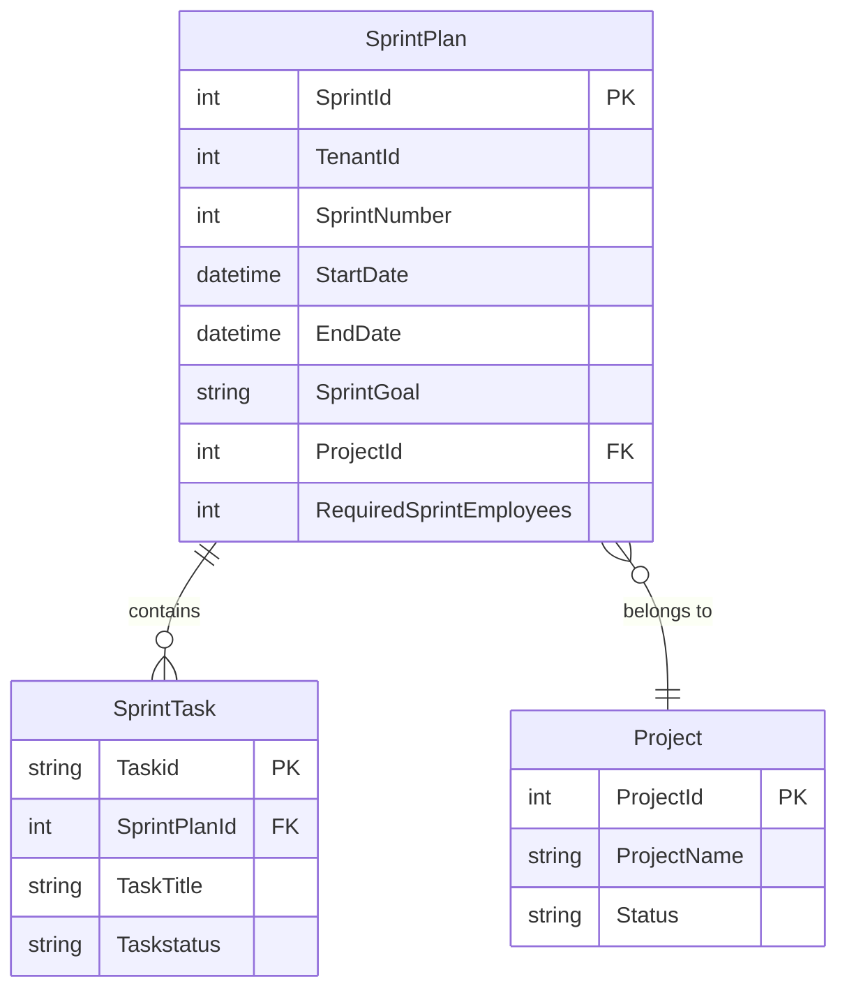
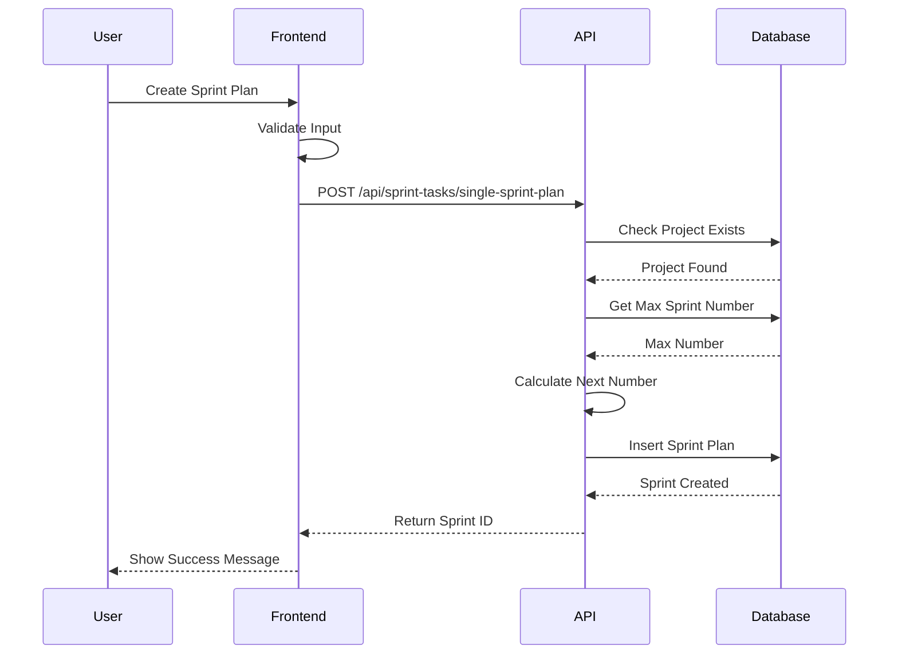
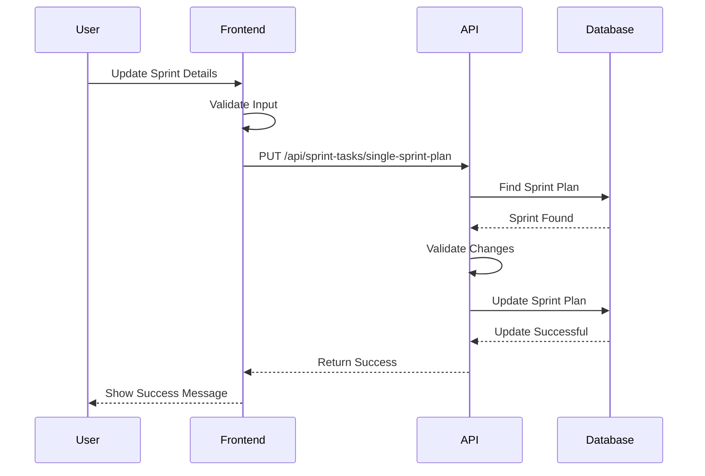

# Sprint Plans

## Overview

Sprint Plans are the foundation of agile sprint management in the EDR system. They define time-boxed iterations with specific goals, timelines, and team capacity requirements. Each sprint plan is associated with a project and contains multiple sprint tasks.

## Purpose

Sprint Plans enable teams to:
- Organize work into manageable time-boxed iterations
- Set clear sprint goals and objectives
- Define sprint timelines with start and end dates
- Plan team capacity and resource allocation
- Track sprint progress and completion
- Maintain sprint history for retrospectives and planning

## Business Value

- **Improved Planning**: Structured approach to breaking down project work
- **Better Estimation**: Historical sprint data improves future planning
- **Team Alignment**: Clear sprint goals keep team focused
- **Progress Tracking**: Visible sprint timelines and milestones
- **Resource Management**: Capacity planning ensures adequate staffing

## Database Schema

### SprintPlan Entity

```csharp
public class SprintPlan : ITenantEntity
{
    [Key]
    public int SprintId { get; set; }
    
    public int TenantId { get; set; }
    
    public int? SprintNumber { get; set; }
    
    public DateTime? StartDate { get; set; }
    
    public DateTime? EndDate { get; set; }
    
    [StringLength(500)]
    public string? SprintGoal { get; set; }
    
    [ForeignKey("Project")]
    public int? ProjectId { get; set; }
    public Project Project { get; set; }
    
    public int RequiredSprintEmployees { get; set; }
    
    public ICollection<SprintTask> SprintTasks { get; set; } = new List<SprintTask>();
}
```

### Entity Relationship Diagram



### Table Structure

| Column | Type | Nullable | Description |
|--------|------|----------|-------------|
| SprintId | int | No | Primary key, auto-generated |
| TenantId | int | No | Multi-tenancy identifier |
| SprintNumber | int | Yes | Sequential sprint number per project |
| StartDate | datetime | Yes | Sprint start date |
| EndDate | datetime | Yes | Sprint end date |
| SprintGoal | nvarchar(500) | Yes | Sprint objective description |
| ProjectId | int | Yes | Foreign key to Project |
| RequiredSprintEmployees | int | No | Number of employees needed |

### Indexes

- **Primary Key**: SprintId (clustered)
- **Foreign Key**: ProjectId → Project(ProjectId)
- **Tenant Isolation**: TenantId for multi-tenancy queries

### Constraints

- **Primary Key**: PK_SprintPlan on SprintId
- **Foreign Key**: FK_SprintPlan_Project on ProjectId
- **Check Constraint**: EndDate should be after StartDate (application-level validation)

## API Endpoints

### Create Sprint Plan

Creates a new sprint plan for a project with automatic sprint number generation.

**Endpoint**: `POST /api/sprint-tasks/single-sprint-plan`

**Request Body**:
```json
{
  "projectId": 5,
  "startDate": "2024-12-01T00:00:00Z",
  "endDate": "2024-12-14T23:59:59Z",
  "sprintGoal": "Implement user authentication and authorization features",
  "requiredSprintEmployees": 5
}
```

**Response**: `201 Created`
```json
{
  "sprintId": 15,
  "message": "Sprint plan created successfully"
}
```

**Validation Rules**:
- ProjectId is required and must exist
- StartDate and EndDate are optional but recommended
- SprintGoal is optional (max 500 characters)
- RequiredSprintEmployees defaults to 0 if not provided
- SprintNumber is auto-generated (max existing + 1 for project)

**Error Responses**:
- `400 Bad Request`: Invalid input data or validation failure
- `404 Not Found`: Project not found
- `500 Internal Server Error`: Unexpected error

### Get Sprint Plan

Retrieves a single sprint plan by its ID.

**Endpoint**: `GET /api/sprint-tasks/single-sprint-plan/{sprintId}`

**Path Parameters**:
- `sprintId` (int): The sprint plan ID

**Response**: `200 OK`
```json
{
  "sprintId": 15,
  "sprintNumber": 3,
  "projectId": 5,
  "startDate": "2024-12-01T00:00:00Z",
  "endDate": "2024-12-14T23:59:59Z",
  "sprintGoal": "Implement user authentication and authorization features",
  "requiredSprintEmployees": 5,
  "sprintTasks": [
    {
      "taskid": "T-101",
      "taskTitle": "Implement JWT authentication",
      "taskstatus": "In Progress"
    },
    {
      "taskid": "T-102",
      "taskTitle": "Create role-based authorization",
      "taskstatus": "To Do"
    }
  ]
}
```

**Error Responses**:
- `404 Not Found`: Sprint plan not found
- `500 Internal Server Error`: Unexpected error

### Update Sprint Plan

Updates an existing sprint plan.

**Endpoint**: `PUT /api/sprint-tasks/single-sprint-plan`

**Request Body**:
```json
{
  "sprintId": 15,
  "projectId": 5,
  "startDate": "2024-12-01T00:00:00Z",
  "endDate": "2024-12-15T23:59:59Z",
  "sprintGoal": "Implement user authentication, authorization, and 2FA features",
  "requiredSprintEmployees": 6
}
```

**Response**: `200 OK`
```json
{
  "message": "SprintPlan with ID 15 updated successfully."
}
```

**Validation Rules**:
- SprintId is required and must exist
- ProjectId cannot be changed (must match existing)
- SprintNumber cannot be changed (auto-managed)
- Other fields can be updated

**Error Responses**:
- `400 Bad Request`: Invalid input or validation failure
- `404 Not Found`: Sprint plan not found
- `500 Internal Server Error`: Unexpected error

## CQRS Operations

### Commands

#### CreateSingleSprintPlanCommand

Creates a new sprint plan with automatic sprint number generation.

**Handler**: `CreateSingleSprintPlanCommandHandler`

**Business Logic**:
1. Validate ProjectId exists
2. Calculate next SprintNumber for the project (max + 1)
3. Create SprintPlan entity with provided data
4. Set TenantId from context
5. Save to database
6. Return generated SprintId

**Validation**:
- ProjectId must exist in Projects table
- SprintGoal max length: 500 characters
- RequiredSprintEmployees must be non-negative

#### UpdateSingleSprintPlanCommand

Updates an existing sprint plan.

**Handler**: `UpdateSingleSprintPlanCommandHandler`

**Business Logic**:
1. Validate SprintId exists
2. Validate ProjectId matches existing (cannot change project)
3. Update modifiable fields (dates, goal, employees)
4. Preserve SprintNumber (auto-managed)
5. Save changes
6. Return success status

**Validation**:
- SprintId must exist
- ProjectId cannot be changed
- SprintNumber cannot be changed

### Queries

#### GetSingleSprintPlanQuery

Retrieves a sprint plan by ID with related tasks.

**Handler**: `GetSingleSprintPlanQueryHandler`

**Business Logic**:
1. Query SprintPlan by SprintId
2. Include related Project entity
3. Include related SprintTasks collection
4. Map to SprintPlanDto
5. Return result or null if not found

**Includes**:
- Project details
- Sprint tasks summary

## Business Logic

### Sprint Number Generation

Sprint numbers are automatically generated per project:
- Query existing sprints for the project
- Find maximum SprintNumber
- Increment by 1 for new sprint
- Ensures sequential numbering per project

```csharp
var maxSprintNumber = await _context.SprintPlans
    .Where(sp => sp.ProjectId == projectId)
    .Select(sp => sp.SprintNumber)
    .MaxAsync();

var nextSprintNumber = (maxSprintNumber ?? 0) + 1;
```

### Sprint Timeline Validation

Application-level validation ensures:
- EndDate is after StartDate
- Sprint duration is reasonable (typically 1-4 weeks)
- No overlapping sprints for same project (optional)

### Capacity Planning

RequiredSprintEmployees field enables:
- Team capacity planning
- Resource allocation
- Sprint feasibility assessment
- Historical capacity tracking

## Frontend Integration

### Sprint Planning Interface

The frontend provides:
- Sprint creation form with date pickers
- Sprint goal text area
- Team capacity input
- Project selection dropdown
- Sprint calendar view
- Sprint list/grid view

### Sprint Dashboard

Displays:
- Active sprints
- Sprint progress
- Task completion status
- Team capacity utilization
- Sprint timeline visualization

## Workflow

### Sprint Creation Workflow



### Sprint Update Workflow



## Integration Points

### Project Management Module

- Sprint plans are linked to projects via ProjectId
- Enables project-specific sprint planning
- Supports multiple concurrent sprints per project

### Sprint Tasks

- Sprint plans contain collections of sprint tasks
- Tasks reference sprint via SprintPlanId
- Enables sprint backlog management

### Multi-Tenancy

- All sprint plans are tenant-isolated via TenantId
- Ensures data security across tenants
- Automatic tenant context from database context

## Testing

### Unit Tests

Test coverage includes:
- Sprint plan creation with valid data
- Sprint number auto-generation
- Project validation
- Sprint plan updates
- Null/invalid input handling

### Integration Tests

Test scenarios:
- End-to-end sprint creation
- Sprint retrieval with related data
- Sprint updates with validation
- Multi-tenant isolation
- Concurrent sprint creation

## Performance Considerations

### Database Queries

- Indexed ProjectId for fast project-based queries
- Indexed TenantId for multi-tenant filtering
- Efficient sprint number calculation using MAX aggregate

### Caching Strategy

Consider caching:
- Active sprints per project
- Sprint number sequences
- Project-sprint mappings

## Security

### Authorization

- Requires authentication (JWT token)
- Project-level permissions enforced
- Tenant isolation at database level

### Data Validation

- Input sanitization
- SQL injection prevention via parameterized queries
- XSS protection on sprint goals

## Best Practices

### Sprint Planning

- Define clear, measurable sprint goals
- Set realistic timelines (1-4 weeks typical)
- Plan team capacity accurately
- Review and adjust based on velocity

### Sprint Management

- Keep sprint goals focused and achievable
- Monitor progress regularly
- Adjust capacity as needed
- Document lessons learned

## Common Use Cases

### Creating a Two-Week Sprint

```json
POST /api/sprint-tasks/single-sprint-plan
{
  "projectId": 10,
  "startDate": "2024-12-02T00:00:00Z",
  "endDate": "2024-12-13T23:59:59Z",
  "sprintGoal": "Complete user profile management features",
  "requiredSprintEmployees": 4
}
```

### Extending Sprint Duration

```json
PUT /api/sprint-tasks/single-sprint-plan
{
  "sprintId": 20,
  "projectId": 10,
  "endDate": "2024-12-16T23:59:59Z",
  "sprintGoal": "Complete user profile management features (extended)",
  "requiredSprintEmployees": 5
}
```

### Querying Sprint Details

```
GET /api/sprint-tasks/single-sprint-plan/20
```

## Troubleshooting

### Common Issues

**Issue**: Sprint number not incrementing
- **Cause**: Database query error or null handling
- **Solution**: Check database connection and MAX query

**Issue**: Cannot create sprint for project
- **Cause**: Project doesn't exist or tenant mismatch
- **Solution**: Verify ProjectId and tenant context

**Issue**: Sprint update fails
- **Cause**: Attempting to change ProjectId or SprintNumber
- **Solution**: These fields are immutable after creation

## Future Enhancements

Potential improvements:
- Sprint templates for common patterns
- Sprint velocity tracking
- Automated sprint rollover
- Sprint dependencies
- Sprint retrospective integration
- Burndown chart data
- Sprint metrics and analytics

## Related Documentation

- [Sprint Tasks](./SPRINT_TASKS.md)
- [Project Management](../PM_MODULE/PROJECT_MANAGEMENT.md)
- [API Documentation](../API_DOCUMENTATION.md)
- [Database Schema](../DATABASE_SCHEMA.md)
