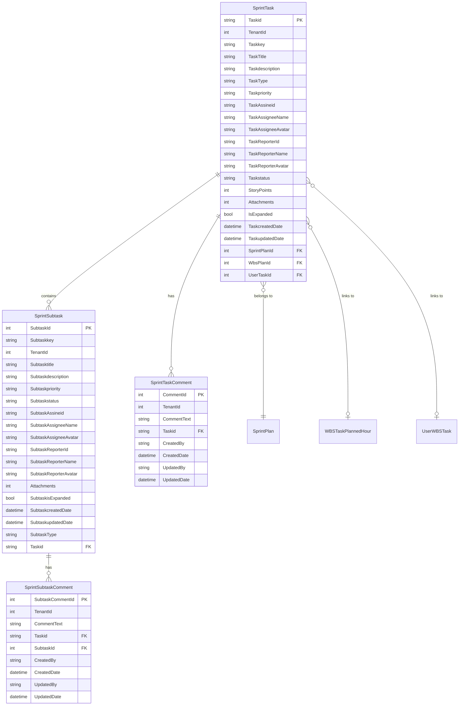
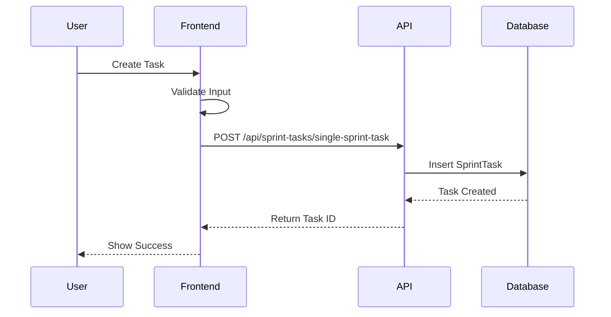
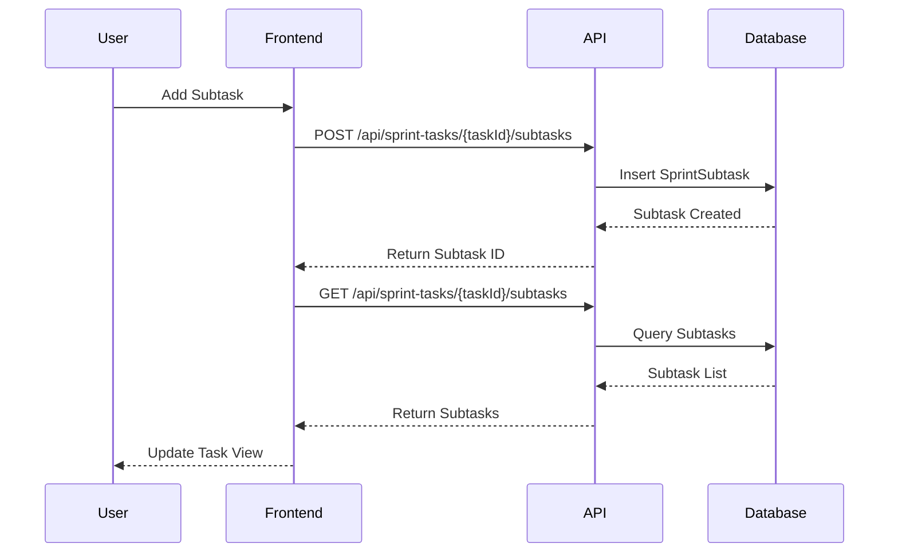

# Sprint Tasks and Subtasks

## Overview

Sprint Tasks provide comprehensive task management capabilities within sprint plans, enabling teams to break down work into manageable units with hierarchical subtasks. The system supports full task lifecycle management including creation, assignment, status tracking, and collaboration through comments.

## Purpose

Sprint Tasks enable teams to:
- Break down sprint work into actionable tasks
- Create hierarchical task structures with subtasks
- Assign work to team members with clear ownership
- Track task status and progress
- Estimate effort using story points
- Collaborate through task and subtask comments
- Link tasks to WBS plans and user assignments
- Manage task priorities and types

## Business Value

- **Work Organization**: Hierarchical task structure for complex work
- **Clear Ownership**: Explicit assignee and reporter tracking
- **Progress Visibility**: Real-time status tracking
- **Team Collaboration**: Comment threads for discussion
- **Effort Estimation**: Story points for sprint planning
- **Integration**: Links to WBS and user task systems

## Database Schema

### SprintTask Entity

```csharp
public class SprintTask : ITenantEntity
{
    [Key]
    public string? Taskid { get; set; }  // e.g. "T-101"
    
    public int TenantId { get; set; }
    
    public string? Taskkey { get; set; } // e.g. "PROJ-101"
    
    public string? TaskTitle { get; set; }
    
    public string? Taskdescription { get; set; }
    
    public string? TaskType { get; set; }
    
    public string? Taskpriority { get; set; }
    
    // Assignee fields
    public string? TaskAssineid { get; set; }
    public string? TaskAssigneeName { get; set; }
    public string? TaskAssigneeAvatar { get; set; }
    
    // Reporter fields
    public string? TaskReporterId { get; set; }
    public string? TaskReporterName { get; set; }
    public string? TaskReporterAvatar { get; set; }
    
    public string? Taskstatus { get; set; }
    
    public int? StoryPoints { get; set; }
    
    public int? Attachments { get; set; }
    
    public bool? IsExpanded { get; set; }
    
    public DateTime? TaskcreatedDate { get; set; }
    
    public DateTime? TaskupdatedDate { get; set; }
    
    // Navigation properties
    public ICollection<SprintSubtask>? Subtasks { get; set; }
    
    public int? SprintPlanId { get; set; }
    [ForeignKey("SprintPlanId")]
    public SprintPlan? SprintPlan { get; set; }
    
    public int? WbsPlanId { get; set; }
    [ForeignKey("WbsPlanId")]
    public WBSTaskPlannedHour? WbsPlan { get; set; }
    
    public int? UserTaskId { get; set; }
    [ForeignKey("UserTaskId")]
    public UserWBSTask? UserTask { get; set; }
}
```

### SprintSubtask Entity

```csharp
public class SprintSubtask : ITenantEntity
{
    [Key]
    public int SubtaskId { get; set; }
    
    public string? Subtaskkey { get; set; }  // e.g. "PROJ-101-1"
    
    public int TenantId { get; set; }
    
    public string? Subtasktitle { get; set; }
    
    public string? Subtaskdescription { get; set; }
    
    public string? Subtaskpriority { get; set; }
    
    public string? Subtaskstatus { get; set; }
    
    // Assignee fields
    public string? SubtaskAssineid { get; set; }
    public string? SubtaskAssigneeName { get; set; }
    public string? SubtaskAssigneeAvatar { get; set; }
    
    // Reporter fields
    public string? SubtaskReporterId { get; set; }
    public string? SubtaskReporterName { get; set; }
    public string? SubtaskReporterAvatar { get; set; }
    
    public int? Attachments { get; set; }
    
    public bool? SubtaskisExpanded { get; set; }
    
    public DateTime? SubtaskcreatedDate { get; set; }
    
    public DateTime? SubtaskupdatedDate { get; set; }
    
    public string? SubtaskType { get; set; } = "Sub-task";
    
    // Foreign key to SprintTask
    public string? Taskid { get; set; }
    [ForeignKey("Taskid")]
    public SprintTask? ParentTask { get; set; }
}
```

### SprintTaskComment Entity

```csharp
public class SprintTaskComment : ITenantEntity
{
    [Key]
    public int CommentId { get; set; }
    
    public int TenantId { get; set; }
    
    public string? CommentText { get; set; }
    
    public string? Taskid { get; set; }
    [ForeignKey("Taskid")]
    public SprintTask? SprintTask { get; set; }
    
    public string? CreatedBy { get; set; }
    public DateTime? CreatedDate { get; set; }
    public string? UpdatedBy { get; set; }
    public DateTime? UpdatedDate { get; set; }
}
```

### SprintSubtaskComment Entity

```csharp
public class SprintSubtaskComment : ITenantEntity
{
    [Key]
    public int SubtaskCommentId { get; set; }
    
    public int TenantId { get; set; }
    
    public string? CommentText { get; set; }
    
    public string? Taskid { get; set; }
    [ForeignKey("Taskid")]
    public SprintTask? SprintTask { get; set; }
    
    public int? SubtaskId { get; set; }
    [ForeignKey("SubtaskId")]
    public SprintSubtask? SprintSubtask { get; set; }
    
    public string? CreatedBy { get; set; }
    public DateTime? CreatedDate { get; set; }
    public string? UpdatedBy { get; set; }
    public DateTime? UpdatedDate { get; set; }
}
```

### Entity Relationship Diagram



## API Endpoints

### Sprint Task Management

#### Create Sprint Task

Creates a new sprint task with optional subtasks.

**Endpoint**: `POST /api/sprint-tasks/single-sprint-task`

**Request Body**:
```json
{
  "taskid": "T-101",
  "taskkey": "PROJ-101",
  "taskTitle": "Implement user authentication",
  "taskdescription": "Create JWT-based authentication system with refresh tokens",
  "taskType": "Feature",
  "taskpriority": "High",
  "taskAssineid": "user-123",
  "taskAssigneeName": "John Doe",
  "taskAssigneeAvatar": "/avatars/john.jpg",
  "taskReporterId": "user-456",
  "taskReporterName": "Jane Smith",
  "taskReporterAvatar": "/avatars/jane.jpg",
  "taskstatus": "To Do",
  "storyPoints": 8,
  "sprintPlanId": 5,
  "wbsPlanId": 10,
  "userTaskId": 15
}
```

**Response**: `201 Created`
```json
{
  "taskId": "T-101",
  "message": "SprintTask with ID T-101 created successfully."
}
```

#### Get Sprint Task

Retrieves a single sprint task with all details.

**Endpoint**: `GET /api/sprint-tasks/{taskId}`

**Response**: `200 OK`
```json
{
  "taskid": "T-101",
  "taskkey": "PROJ-101",
  "taskTitle": "Implement user authentication",
  "taskdescription": "Create JWT-based authentication system with refresh tokens",
  "taskType": "Feature",
  "taskpriority": "High",
  "taskAssineid": "user-123",
  "taskAssigneeName": "John Doe",
  "taskAssigneeAvatar": "/avatars/john.jpg",
  "taskReporterId": "user-456",
  "taskReporterName": "Jane Smith",
  "taskReporterAvatar": "/avatars/jane.jpg",
  "taskstatus": "In Progress",
  "storyPoints": 8,
  "attachments": 2,
  "isExpanded": true,
  "taskcreatedDate": "2024-12-01T10:00:00Z",
  "taskupdatedDate": "2024-12-02T14:30:00Z",
  "sprintPlanId": 5,
  "wbsPlanId": 10,
  "userTaskId": 15,
  "subtasks": [
    {
      "subtaskId": 1,
      "subtaskkey": "PROJ-101-1",
      "subtasktitle": "Design authentication flow",
      "subtaskstatus": "Done"
    }
  ]
}
```

#### Update Sprint Task

Updates an existing sprint task.

**Endpoint**: `PUT /api/sprint-tasks/single-sprint-task`

**Request Body**: Same as create, with taskid required

**Response**: `200 OK`
```json
{
  "message": "SprintTask with ID T-101 updated successfully."
}
```

#### Delete Sprint Task

Deletes a sprint task and all its subtasks.

**Endpoint**: `DELETE /api/sprint-tasks/{taskId}`

**Response**: `200 OK`
```json
{
  "message": "SprintTask with ID T-101 and its subtasks deleted successfully."
}
```

#### Get Tasks by Project

Retrieves all sprint tasks for a specific project.

**Endpoint**: `GET /api/sprint-tasks/project/{projectId}/tasks`

**Response**: `200 OK`
```json
[
  {
    "taskid": "T-101",
    "taskTitle": "Implement user authentication",
    "taskstatus": "In Progress",
    "taskpriority": "High",
    "storyPoints": 8,
    "subtaskCount": 3
  },
  {
    "taskid": "T-102",
    "taskTitle": "Create user profile page",
    "taskstatus": "To Do",
    "taskpriority": "Medium",
    "storyPoints": 5,
    "subtaskCount": 2
  }
]
```

### Sprint Subtask Management

#### Create Subtask

Creates a new subtask under a parent task.

**Endpoint**: `POST /api/sprint-tasks/{taskId}/subtasks`

**Request Body**:
```json
{
  "taskid": "T-101",
  "subtaskkey": "PROJ-101-2",
  "subtasktitle": "Implement JWT token generation",
  "subtaskdescription": "Create service for generating and validating JWT tokens",
  "subtaskpriority": "High",
  "subtaskstatus": "To Do",
  "subtaskAssineid": "user-789",
  "subtaskAssigneeName": "Bob Wilson",
  "subtaskAssigneeAvatar": "/avatars/bob.jpg"
}
```

**Response**: `201 Created`
```json
{
  "subtaskId": 2,
  "message": "Subtask created successfully"
}
```

#### Get Subtask

Retrieves a single subtask by ID.

**Endpoint**: `GET /api/sprint-tasks/subtasks/{subtaskId}`

**Response**: `200 OK`
```json
{
  "subtaskId": 2,
  "subtaskkey": "PROJ-101-2",
  "subtasktitle": "Implement JWT token generation",
  "subtaskdescription": "Create service for generating and validating JWT tokens",
  "subtaskpriority": "High",
  "subtaskstatus": "In Progress",
  "subtaskAssineid": "user-789",
  "subtaskAssigneeName": "Bob Wilson",
  "subtaskAssigneeAvatar": "/avatars/bob.jpg",
  "subtaskcreatedDate": "2024-12-01T11:00:00Z",
  "subtaskupdatedDate": "2024-12-02T09:15:00Z",
  "taskid": "T-101"
}
```

#### Update Subtask

Updates an existing subtask.

**Endpoint**: `PUT /api/sprint-tasks/subtasks/{subtaskId}`

**Request Body**: Same as create, with subtaskId required

**Response**: `200 OK`
```json
{
  "message": "Subtask updated successfully"
}
```

#### Delete Subtask

Deletes a specific subtask.

**Endpoint**: `DELETE /api/sprint-tasks/subtasks/{subtaskId}`

**Response**: `200 OK`
```json
{
  "message": "SprintSubtask with ID 2 deleted successfully."
}
```

#### Get All Subtasks for Task

Retrieves all subtasks for a parent task.

**Endpoint**: `GET /api/sprint-tasks/{taskId}/subtasks`

**Response**: `200 OK`
```json
[
  {
    "subtaskId": 1,
    "subtaskkey": "PROJ-101-1",
    "subtasktitle": "Design authentication flow",
    "subtaskstatus": "Done",
    "subtaskpriority": "High"
  },
  {
    "subtaskId": 2,
    "subtaskkey": "PROJ-101-2",
    "subtasktitle": "Implement JWT token generation",
    "subtaskstatus": "In Progress",
    "subtaskpriority": "High"
  }
]
```

### Task Comment Management

#### Add Task Comment

Adds a comment to a sprint task.

**Endpoint**: `POST /api/sprint-tasks/{taskId}/comments`

**Request Body**:
```json
{
  "commentText": "Updated the authentication flow based on security review feedback",
  "createdBy": "user-123"
}
```

**Response**: `201 Created`
```json
{
  "message": "Comment added successfully to SprintTask with ID T-101."
}
```

#### Get Task Comments

Retrieves all comments for a task.

**Endpoint**: `GET /api/sprint-tasks/{taskId}/comments`

**Response**: `200 OK`
```json
[
  {
    "commentId": 1,
    "commentText": "Updated the authentication flow based on security review feedback",
    "taskid": "T-101",
    "createdBy": "user-123",
    "createdDate": "2024-12-02T10:30:00Z"
  },
  {
    "commentId": 2,
    "commentText": "Added unit tests for token validation",
    "taskid": "T-101",
    "createdBy": "user-789",
    "createdDate": "2024-12-02T14:15:00Z"
  }
]
```

#### Get Comment by ID

Retrieves a specific task comment.

**Endpoint**: `GET /api/sprint-tasks/comments/{commentId}`

**Response**: `200 OK`
```json
{
  "commentId": 1,
  "commentText": "Updated the authentication flow based on security review feedback",
  "taskid": "T-101",
  "createdBy": "user-123",
  "createdDate": "2024-12-02T10:30:00Z",
  "updatedBy": "user-123",
  "updatedDate": "2024-12-02T11:00:00Z"
}
```

#### Update Task Comment

Updates an existing task comment.

**Endpoint**: `PUT /api/sprint-tasks/{taskId}/comments/{commentId}`

**Request Body**:
```json
{
  "commentText": "Updated the authentication flow based on security review feedback (revised)",
  "updatedBy": "user-123"
}
```

**Response**: `200 OK`
```json
{
  "message": "Comment with ID 1 for Task ID T-101 updated successfully."
}
```

#### Delete Task Comment

Deletes a task comment.

**Endpoint**: `DELETE /api/sprint-tasks/comments/{commentId}`

**Response**: `200 OK`
```json
{
  "message": "SprintTask comment with ID 1 deleted successfully."
}
```

### Subtask Comment Management

#### Add Subtask Comment

Adds a comment to a subtask.

**Endpoint**: `POST /api/sprint-tasks/{taskId}/subtasks/{subtaskId}/comments`

**Request Body**:
```json
{
  "commentText": "Implemented token expiration handling",
  "createdBy": "user-789"
}
```

**Response**: `201 Created`
```json
{
  "message": "Comment added successfully to SprintSubtask with ID 2 under Task ID T-101."
}
```

#### Get Subtask Comments

Retrieves all comments for a subtask.

**Endpoint**: `GET /api/sprint-tasks/{taskId}/subtasks/{subtaskId}/comments`

**Response**: `200 OK`
```json
[
  {
    "subtaskCommentId": 1,
    "commentText": "Implemented token expiration handling",
    "taskid": "T-101",
    "subtaskId": 2,
    "createdBy": "user-789",
    "createdDate": "2024-12-02T15:00:00Z"
  }
]
```

#### Get Subtask Comment by ID

Retrieves a specific subtask comment.

**Endpoint**: `GET /api/sprint-tasks/subtask-comments/{subtaskCommentId}`

**Response**: `200 OK`
```json
{
  "subtaskCommentId": 1,
  "commentText": "Implemented token expiration handling",
  "taskid": "T-101",
  "subtaskId": 2,
  "createdBy": "user-789",
  "createdDate": "2024-12-02T15:00:00Z"
}
```

#### Update Subtask Comment

Updates an existing subtask comment.

**Endpoint**: `PUT /api/sprint-tasks/{taskId}/subtasks/{subtaskId}/comments/{subtaskCommentId}`

**Request Body**:
```json
{
  "commentText": "Implemented token expiration handling with refresh token support",
  "updatedBy": "user-789"
}
```

**Response**: `200 OK`
```json
{
  "message": "Comment with ID 1 for Subtask ID 2 under Task ID T-101 updated successfully."
}
```

#### Delete Subtask Comment

Deletes a subtask comment.

**Endpoint**: `DELETE /api/sprint-tasks/subtask-comments/{subtaskCommentId}`

**Response**: `200 OK`
```json
{
  "message": "SprintSubtask comment with ID 1 deleted successfully."
}
```

## CQRS Operations

### Task Commands

- **CreateSprintTaskCommand**: Create new task with optional subtasks
- **UpdateSprintTaskCommand**: Update task and optionally subtasks
- **DeleteSprintTaskCommand**: Delete task and all subtasks

### Task Queries

- **GetSingleSprintTaskQuery**: Retrieve task by ID with subtasks
- **GetSprintTasksByProjectIdQuery**: Get all tasks for a project

### Subtask Commands

- **CreateSprintSubtaskCommand**: Create new subtask
- **UpdateSprintSubtaskCommand**: Update existing subtask
- **DeleteSprintSubtaskCommand**: Delete subtask

### Subtask Queries

- **GetAllSprintSubtasksByTaskIdQuery**: Get all subtasks for a task
- **GetSprintSubtaskByIdQuery**: Retrieve subtask by ID

### Comment Commands

- **AddSprintTaskCommentCommand**: Add comment to task
- **UpdateSprintTaskCommentCommand**: Update task comment
- **DeleteSprintTaskCommentCommand**: Delete task comment
- **AddSprintSubtaskCommentCommand**: Add comment to subtask
- **UpdateSprintSubtaskCommentCommand**: Update subtask comment
- **DeleteSprintSubtaskCommentCommand**: Delete subtask comment

### Comment Queries

- **GetSprintTaskCommentsByTaskIdQuery**: Get all comments for task
- **GetSprintTaskCommentByIdQuery**: Retrieve task comment by ID
- **GetSprintSubtaskCommentsBySubtaskIdQuery**: Get all comments for subtask
- **GetSprintSubtaskCommentByIdQuery**: Retrieve subtask comment by ID

## Business Logic

### Task ID Generation

Task IDs follow a specific pattern:
- Format: "T-{number}" (e.g., "T-101", "T-102")
- Must be unique across the system
- Application generates or validates format

### Task Key Convention

Task keys follow project conventions:
- Format: "{PROJECT}-{number}" (e.g., "PROJ-101")
- Links task to project context
- Used for external references

### Subtask Key Convention

Subtask keys extend parent task keys:
- Format: "{TASK_KEY}-{number}" (e.g., "PROJ-101-1")
- Maintains hierarchical relationship
- Enables easy identification of parent task

### Status Workflow

Common status values:
- **To Do**: Task not started
- **In Progress**: Task being worked on
- **In Review**: Task completed, awaiting review
- **Done**: Task completed and reviewed
- **Blocked**: Task cannot proceed

### Priority Levels

Standard priority values:
- **Critical**: Must be done immediately
- **High**: Important, should be done soon
- **Medium**: Normal priority
- **Low**: Can be deferred

### Story Points

- Used for effort estimation
- Typically Fibonacci sequence (1, 2, 3, 5, 8, 13, 21)
- Helps with sprint planning and velocity tracking

## Frontend Components

### Task Board

Displays tasks in kanban-style board:
- Columns for each status
- Drag-and-drop status changes
- Task cards with key information
- Subtask indicators

### Task Detail View

Shows complete task information:
- Task metadata (title, description, type, priority)
- Assignee and reporter details with avatars
- Story points and status
- Subtask list with status
- Comment thread
- Attachment list
- Audit trail (created/updated dates)

### Subtask Management

- Expandable/collapsible subtask lists
- Inline subtask creation
- Quick status updates
- Independent assignee tracking

### Comment Threads

- Chronological comment display
- Rich text comment editor
- Edit/delete capabilities
- User attribution with timestamps

## Workflow

### Task Creation Workflow



### Subtask Management Workflow



## Integration Points

### Sprint Plans

- Tasks belong to sprint plans via SprintPlanId
- Enables sprint backlog management
- Supports sprint progress tracking

### WBS Integration

- Tasks can link to WBS plans via WbsPlanId
- Connects sprint work to project WBS
- Enables cross-module tracking

### User Task Integration

- Tasks can link to user tasks via UserTaskId
- Integrates with user assignment system
- Supports resource management

### Multi-Tenancy

- All entities are tenant-isolated
- Ensures data security
- Automatic tenant context

## Testing

### Unit Tests

- Task CRUD operations
- Subtask management
- Comment operations
- Validation logic
- Business rule enforcement

### Integration Tests

- End-to-end task workflows
- Subtask cascading operations
- Comment thread management
- Multi-tenant isolation
- API endpoint validation

## Performance Considerations

### Database Optimization

- Indexed Taskid for fast lookups
- Indexed SprintPlanId for sprint queries
- Indexed ProjectId for project queries
- Indexed TenantId for multi-tenant filtering

### Caching Strategy

Consider caching:
- Active tasks per sprint
- Task status counts
- User-assigned tasks
- Project task summaries

## Security

### Authorization

- JWT authentication required
- Task-level permissions
- Comment ownership validation
- Tenant isolation enforced

### Data Validation

- Input sanitization
- SQL injection prevention
- XSS protection on comments
- File upload validation

## Best Practices

### Task Management

- Keep task titles concise and descriptive
- Use detailed descriptions for context
- Assign appropriate story points
- Update status regularly
- Break down large tasks into subtasks

### Subtask Usage

- Create subtasks for complex tasks
- Keep subtasks focused and atomic
- Assign subtasks independently
- Track subtask progress separately

### Comment Guidelines

- Use comments for collaboration
- Document decisions and changes
- Tag relevant team members
- Keep comments professional

## Troubleshooting

### Common Issues

**Issue**: Cannot create task
- **Cause**: Invalid task ID format or duplicate
- **Solution**: Ensure unique task ID following pattern

**Issue**: Subtasks not appearing
- **Cause**: Parent task ID mismatch
- **Solution**: Verify Taskid matches parent

**Issue**: Comments not saving
- **Cause**: Missing required fields
- **Solution**: Ensure CommentText and CreatedBy are provided

## Future Enhancements

- Task dependencies
- Time tracking
- Task templates
- Bulk operations
- Advanced filtering
- Task history/audit log
- Automated status transitions
- Task notifications
- File attachment management
- Task labels/tags

## Related Documentation

- [Sprint Plans](./SPRINT_PLANS.md)
- [Sprint Module Overview](./README.md)
- [Work Breakdown Structure](../PM_MODULE/WORK_BREAKDOWN_STRUCTURE.md)
- [API Documentation](../API_DOCUMENTATION.md)
